Summary of Analysis of LCWMD ‘Chloride’ Data
================
Curtis C. Bohlen, Casco Bay Estuary Partnership.
01/06/2021

-   [Introduction](#introduction)
-   [Import Libraries](#import-libraries)
-   [Data Preparation](#data-preparation)
    -   [Initial Folder References](#initial-folder-references)
    -   [Load Weather Data](#load-weather-data)
    -   [Update Folder References](#update-folder-references)
    -   [Load Data on Sites and Impervious
        Cover](#load-data-on-sites-and-impervious-cover)
    -   [Load Main Data](#load-main-data)
        -   [Cleanup](#cleanup)
    -   [Data Correction](#data-correction)
        -   [Anomolous Depth Values](#anomolous-depth-values)
        -   [Single S06B Chloride Observation from
            2017](#single-s06b-chloride-observation-from-2017)
        -   [Site S03, end of 2016](#site-s03-end-of-2016)
    -   [Remove Partial Data from Winter
        Months](#remove-partial-data-from-winter-months)
    -   [Add Stream Flow Index](#add-stream-flow-index)
    -   [Remove Site S06B, Trim Data](#remove-site-s06b-trim-data)
    -   [Cleanup](#cleanup-1)
-   [GAMM Analysis](#gamm-analysis)
    -   [Initial Model](#initial-model)
    -   [ANOVA](#anova)
    -   [Summary](#summary)
    -   [Structure of the GAM](#structure-of-the-gam)
    -   [Diagnostic Plots](#diagnostic-plots)
    -   [Checking Estimated Marginal
        Means](#checking-estimated-marginal-means)
    -   [Visualizing Trends](#visualizing-trends)
-   [Model without the interactions.](#model-without-the-interactions.)
    -   [ANOVA](#anova-1)
    -   [Summary](#summary-1)
    -   [Structure of the GAM](#structure-of-the-gam-1)
    -   [Diagnostic Plots](#diagnostic-plots-1)
-   [Model with Separate Years](#model-with-separate-years)
    -   [ANOVA](#anova-2)
    -   [Diagnostic Plots](#diagnostic-plots-2)


# Introduction

Chlorides are frequently elevated in Maine urban streams because of use
of salt for deicing of roads, parking areas, sidewalks, and paths in
winter. While water quality standards are often written in terms of
chlorides, it may be better to think about chlorides as a measure of the
salinity. Physiologically, it is probably salinity or osmolarity that
principally affects organisms in the stream, not chlorides *per se*. The
data we examine here is based on measurement of conductivity, which is
converted to an estimate of in-stream chlorides based on a robust
regression relationship developed over several years.

This R Notebook reviews the model we end up using to analyze chloride
levels in Long Creek. We examined numerous models before settling on
this one. Details of some of those models is available in the
“Chloride\_Analysis.Rmd” notebook.

Several more complex models are “better” using conventional measures of
statistical significance or information criteria. We selected a slightly
simpler model, largely as it makes explaining the model more direct.

Our interest focuses on answering three questions:  
1. What is the effect of time of year (Month, or Day of Year) on
chlorides?  
2. Do chloride levels differ from site to site?  
3. Is there a long-term trend in chlorides? 3. Are there differences in
the magnitude of the trend from site to site?

We use a Generalized Additive Model, with autocorrelated errors to
explore these questions. The model has the following form:

$$ 
\\begin{align}
log(Chlorides) &= f(Covariates) + \\\\
&\\qquad \\beta\_{1,i} Site\_i + 
\\beta\_{2,j} Month\_j + \\beta\_3 Year + \\beta\_{4,i} Site\_i \* Year + \\epsilon
\\end{align}
$$

Where: \* covariates include three terms:  
– Daily precipitation  
– Weighted precipitation from the prior nine days  
– Stream flow in the middle of the watershed  
\* The core predictors enter the model as standard linear terms  
\* The error i an AR(1) correlated error.

We abuse the autocorrelation models slightly, since we use sequential
autocorrelations (not time-based) and we don’t fit separate
autocorrelations for each site and season. That should have little
impact on results, as transitions are relatively rare in a dense data
set, and missing values at the beginning of each season at each site
prevent estimation near season and site transitions in the sequential
data anyway.

On the whole, this models is OK, but not great. It has heavy tailed,
skewed residuals. We should not trust the asymptotic p values. But since
sample sizes are large and results tend to have high statistical
significance, p values are not much use anyway.

# Import Libraries

``` r
library(tidyverse)
#> -- Attaching packages --------------------------------------- tidyverse 1.3.0 --
#> v ggplot2 3.3.3     v purrr   0.3.4
#> v tibble  3.0.5     v dplyr   1.0.3
#> v tidyr   1.1.2     v stringr 1.4.0
#> v readr   1.4.0     v forcats 0.5.0
#> -- Conflicts ------------------------------------------ tidyverse_conflicts() --
#> x dplyr::filter() masks stats::filter()
#> x dplyr::lag()    masks stats::lag()
library(readr)

library(emmeans) # Provides tools for calculating marginal means
library(nlme)
#> 
#> Attaching package: 'nlme'
#> The following object is masked from 'package:dplyr':
#> 
#>     collapse

#library(zoo)     # here, for the `rollapply()` function

library(mgcv)    # generalized additive models. Function gamm() allows
#> This is mgcv 1.8-33. For overview type 'help("mgcv-package")'.
                 # autocorrelation.

library(CBEPgraphics)
load_cbep_fonts()
theme_set(theme_cbep())
```

# Data Preparation

## Initial Folder References

``` r
sibfldnm    <- 'Original_Data'
parent      <- dirname(getwd())
sibling     <- file.path(parent,sibfldnm)

dir.create(file.path(getwd(), 'figures'), showWarnings = FALSE)
dir.create(file.path(getwd(), 'models'), showWarnings = FALSE)
```

## Load Weather Data

``` r
fn <- "Portland_Jetport_2009-2019.csv"
fpath <- file.path(sibling, fn)

weather_data <- read_csv(fpath, 
 col_types = cols(.default = col_skip(),
        date = col_date(),
        PRCP = col_number(), PRCPattr = col_character() #,
        #SNOW = col_number(), SNOWattr = col_character(), 
        #TMIN = col_number(), TMINattr = col_character(), 
        #TAVG = col_number(), TAVGattr = col_character(), 
        #TMAX = col_number(), TMAXattr = col_character(), 
        )) %>%
  rename(sdate = date) %>%
  mutate(pPRCP = dplyr::lag(PRCP))
```

## Update Folder References

``` r
sibfldnm    <- 'Derived_Data'
parent      <- dirname(getwd())
sibling     <- file.path(parent,sibfldnm)
```

## Load Data on Sites and Impervious Cover

These data were derived from Table 2 from a GZA report to the Long Creek
Watershed Management District, titled “Re: Long Creek Watershed Data
Analysis; Task 2: Preparation of Explanatory and Other Variables.” The
Memo is dated November 13, 2019 File No. 09.0025977.02.

Cumulative Area and IC calculations are our own, based on the GZA data
and the geometry of the stream channel.

``` r
# Read in data and drop the East Branch, where we have no data
fn <- "Site_IC_Data.csv"
fpath <- file.path(sibling, fn)

Site_IC_Data <- read_csv(fpath) %>%
  filter(Site != "--") 
#> 
#> -- Column specification --------------------------------------------------------
#> cols(
#>   Site = col_character(),
#>   Subwatershed = col_character(),
#>   Area_ac = col_double(),
#>   IC_ac = col_double(),
#>   CumArea_ac = col_double(),
#>   CumIC_ac = col_double(),
#>   PctIC = col_character(),
#>   CumPctIC = col_character()
#> )

# Now, create a factor that preserves the order of rows (roughly upstream to downstream). 
Site_IC_Data <- Site_IC_Data %>%
  mutate(Site = factor(Site, levels = Site_IC_Data$Site))

# Finally, convert percent covers to numeric values
Site_IC_Data <- Site_IC_Data %>%
  mutate(CumPctIC = as.numeric(substr(CumPctIC, 1, nchar(CumPctIC)-1))) %>%
  mutate(PctIC = as.numeric(substr(PctIC, 1, nchar(PctIC)-1)))
Site_IC_Data
#> # A tibble: 6 x 8
#>   Site  Subwatershed      Area_ac IC_ac CumArea_ac CumIC_ac PctIC CumPctIC
#>   <fct> <chr>               <dbl> <dbl>      <dbl>    <dbl> <dbl>    <dbl>
#> 1 S07   Blanchette Brook     434.  87.7       434.     87.7  20.2     20.2
#> 2 S06B  Upper Main Stem      623.  80.2       623.     80.2  12.9     12.9
#> 3 S05   Middle Main Stem     279.  53.6      1336     222.   19.2     16.6
#> 4 S17   Lower Main Stem      105   65.1      1441     287.   62       19.9
#> 5 S03   North Branch Trib    298. 123         298.    123    41.2     41.2
#> 6 S01   South Branch Trib    427. 240.        427.    240.   56.1     56.1
```

## Load Main Data

Read in the data from the Derived Data folder.

Note that I filter out data from 2019 because that is only a partial
year, which might affect estimation of things like seasonal trends. We
could add it back in, but with care….

*Full\_Data.csv* does not include a field for precipitation from the
previous day. In earlier work, we learned that a weighted sum of recent
precipitation provided better explanatory power. But we also want to
check a simpler model, so we construct a “PPrecip” data field. This is
based on a modification of code in the “Make\_Daily\_Summaries.Rmd”
notebook.

``` r
fn <- "Full_Data.csv"
fpath <- file.path(sibling, fn)

full_data <- read_csv(fpath, 
    col_types = cols(DOY = col_integer(), 
        D_Median = col_double(), Precip = col_number(), 
        X1 = col_skip(), Year = col_integer(), 
        FlowIndex = col_double())) %>%

  mutate(Site = factor(Site, levels=levels(Site_IC_Data$Site))) %>%
  mutate(Month = factor(Month, levels = month.abb)) %>%
  mutate(IC=as.numeric(Site_IC_Data$CumPctIC[match(Site, Site_IC_Data$Site)])) %>%
  mutate(Yearf = factor(Year)) %>%

# We combine data using "match" because we have data for multiple sites and 
# therefore dates are not unique.  `match()` correctly assigns weather
# data by date.
mutate(PPrecip = weather_data$pPRCP[match(sdate, weather_data$sdate)])
#> Warning: Missing column names filled in: 'X1' [1]
#> Warning: The following named parsers don't match the column names: FlowIndex
```

### Cleanup

``` r
rm(Site_IC_Data, weather_data)
rm(fn, fpath, parent, sibling, sibfldnm)
```

## Data Correction

### Anomolous Depth Values

Several depth observations in the record appear highly unlikely. In
particular, several observations show daily median water depths over 15
meters. And those observations were recorded in May or June, at site
S05, with no associated record of significant precipitation, and no
elevated depths at other sites on the stream.

We can trace these observations back to the raw QA/QC’d pressure and
sonde data submitted to LCWMD by GZA, so they are not an artifact of our
data preparation.

A few more observations show daily median depths over 4 meters, which
also looks unlikely in a stream of this size. All these events also
occurred in May or June of 2015 at site S05. Some sort of malfunction of
the pressure transducer appears likely.

We remove these extreme values. The other daily medians in May and June
of 2015 appear reasonable, and we leave them in place, although given
possible instability of the pressure sensors, it might make sense to
remove them all.

``` r
full_data <- full_data %>%
  mutate(D_Median = if_else(D_Median > 4, NA_real_, D_Median),
         lD_Median = if_else(D_Median > 4, NA_real_, lD_Median))
```

### Single S06B Chloride Observation from 2017

The data includes just a single chloride observation from site S06B from
any year other than 2013. While we do not know if the data point is
legitimate or not, it has very high leverage in several models, and we
suspect a transcription error of some sort.

``` r
full_data %>%
  filter(Site == 'S06B') %>%
  select(sdate, Chl_Median) %>%
  ggplot(aes(x = sdate, y = Chl_Median)) + geom_point()
#> Warning: Removed 1214 rows containing missing values (geom_point).
```


We remove the Chloride value from the data.

``` r
full_data <- full_data %>%
  mutate(Chl_Median = if_else(Site == 'S06B' & Year > 2014,
                              NA_real_, Chl_Median))
```

### Site S03, end of 2016

We noted some extreme dissolved oxygen data at the end of 2016. Values
were both extreme and highly variable.

We decided we should remove chloride and oxygen observations after
October 15th.

``` r
full_data <- full_data %>% 
  mutate(Chl_Median = if_else(Year == 2016 & Site == 'S03' & DOY > 288,
                              NA_real_, Chl_Median),
         DO_Median = if_else(Year == 2016 & Site == 'S03' & DOY > 288,
                              NA_real_, DO_Median),
         PctSat_Median = if_else(Year == 2016 & Site == 'S03' & DOY > 288,
                              NA_real_, PctSat_Median))
```

## Remove Partial Data from Winter Months

We have very limited data from several months. We have January data from
only one year, and February data from only three, and December data from
four, all older. Both March and November sample sizes vary.

The limited winter data generates severely unbalanced samples, which may
lead to estimation problems, especially in models with crossed or
potentially crossed factors and predictors. More fundamentally, the
potential bias introduced by showing data from those months from just a
handful of years could give a misleading impression of seasonal
patterns. We trim December, January and February data, but leave the
other months.

It is important to remember, even after trimming the data, that:  
1. 2010 is a partial year,  
2. The period of sampling in March may be biased due to spring melt
timing.

``` r
xtabs(~ Yearf + Month, data = full_data)
#>       Month
#> Yearf  Jan Feb Mar Apr May Jun Jul Aug Sep Oct Nov Dec
#>   2010   0   0   0   0   0  78 103 106 120 124 120  35
#>   2011   0  24 104 120 124 120 124 124 120 124 120 112
#>   2012   0  45  93  90  93 116 124 114 120  39 108 124
#>   2013   9   0  58 131 155 140 124 127 120 141 150  15
#>   2014   0   0  62 108 155 150 155 155 150 155 120   0
#>   2015   0   0  23 147 186 180 186 186 180 160  30   0
#>   2016   0   0  25 173 186 180 186 186 180 186 168   0
#>   2017   0  18 186 180 186 180 186 186 180 186 102   0
#>   2018   0   0  34 180 186 180 186 186 180 186 126   0
```

``` r
full_data <- full_data %>%
  filter(Month %in% month.abb[3:11]  )
```

## Add Stream Flow Index

We worked through many models on a site by site basis in which we
included data on water depth, but since the depth coordinate is
site-specific, a 10 cm depth at one site may be exceptional, while at
another it is commonplace. We generally want not a local measure of
stream depth, but a watershed-wide metric of high, medium, or low stream
flow.

Middle and Lower Maine Stem sites would be suitable for a general flow
indicator across the watershed. The monitoring sites in that stretch of
Long Creek include include S05 and S17, however only site S05 has been
in continuous operation throughout the period of record, so we use depth
data from S05 to construct our general stream flow indicator.

Stream flow at S05 is correlated with flow at other sites, although not
all that closely correlated to flow in the downstream tributaries.

``` r
full_data %>%
  select(sdate, Site, lD_Median) %>%
  pivot_wider(names_from = Site, values_from = lD_Median) %>%
  select( -sdate) %>%
  cor(use = 'pairwise', method = 'pearson')
#>            S07      S06B       S05       S17       S03       S01
#> S07  1.0000000 0.5882527 0.7042711 0.7327432 0.4578906 0.5594067
#> S06B 0.5882527 1.0000000 0.8043943 0.8778188 0.7152403 0.6310361
#> S05  0.7042711 0.8043943 1.0000000 0.7906571 0.4526392 0.6506630
#> S17  0.7327432 0.8778188 0.7906571 1.0000000 0.6666414 0.7290077
#> S03  0.4578906 0.7152403 0.4526392 0.6666414 1.0000000 0.4499047
#> S01  0.5594067 0.6310361 0.6506630 0.7290077 0.4499047 1.0000000
```

We use the log of the daily median flow at S05 as a general
watershed-wide stream flow indicator, which we call `FlowIndex`. We use
the log of the raw median, to lessen the effect of the highly skewed
distribution of stream depths on the metric.

``` r
depth_data <- full_data %>%
  filter (Site == 'S05') %>%
  select(sdate, lD_Median)

full_data <- full_data %>%
  mutate(FlowIndex = depth_data$lD_Median[match(sdate, depth_data$sdate)])
  rm(depth_data)
```

Note that because the flow record at S05 has some gaps, any model using
this predictor is likely to have a smaller sample size.

## Remove Site S06B, Trim Data

Including Site = S06B in the GLS models causes an error, because models
that includes a Site:Year interaction are rank deficient. We only have
one year’s worth of data from that site. (`lm()` handles that case
gracefully, `gls()` does not.)

``` r
xtabs(~ Site + Year, data = full_data)
#>       Year
#> Site   2010 2011 2012 2013 2014 2015 2016 2017 2018
#>   S07   167  275  242  225  262  191  246  262  240
#>   S06B    0    0    0  220  217  193  247  262  240
#>   S05   118  255  151  184  217  231  248  262  241
#>   S17     0    0    0    0    0  223  235  262  241
#>   S03   183  275  252  251  262  223  246  262  241
#>   S01   183  275  252  266  252  217  248  262  241
```

We proceed with analyses that omits Site S06B.

``` r
reduced_data <- full_data %>%
  select (Site, Year, Month, DOY,
          Precip, lPrecip, PPrecip, wlPrecip,
          D_Median, lD_Median,
          Chl_Median, 
          IC, FlowIndex) %>%
  filter (Site != 'S06B' ) %>%
  mutate(Site = droplevels(Site)) %>%
  mutate(Year_f = factor(Year))
```

## Cleanup

``` r
rm(full_data)
```

# GAMM Analysis

Here we use more sophisticated “General Additive Models” that allow
non-linear (smoother) fits for some parameters. Our emphasis is on using
smoothers to better account for non-linearities in relationships between
weather or flow-related predictors and chlorides.

We use the function `gamm()` because it has a relatively simple
interface for incorporating autocorrelated errors.

We abuse the autocorrelation model slightly, since we don’t fit separate
autocorrelations for each site and season. That should have little
impact on results, as missing values at beginning and end of most time
series prevent estimation anyway.

## Initial Model

Our first GAMM simply fits smoothers for each of the major
weather-related covariates. Arguably, we should fit separate smoothers
by `FlowIndex` for each site, but we did not include interaction terms
in our earlier base models, so we leave that out here as well.

This model takes several minutes to run (more than 5, less than 15)

``` r
if (! file.exists("models/chl_gamm.rds")) {
  chl_gamm <- gamm(log(Chl_Median) ~ Site + 
                     s(lPrecip) + 
                     s(wlPrecip) +
                     s(FlowIndex) +
                     Month +
                     Year +
                     Site : Year,
                   correlation = corAR1(0.8),
                   na.action = na.omit, 
                   method = 'REML',
                   data = reduced_data)
  saveRDS(chl_gamm, file="models/chl_gamm.rds")
} else {
  chl_gamm <- readRDS("models/chl_gamm.rds")
}
```

## ANOVA

``` r
anova(chl_gamm$gam)
#> 
#> Family: gaussian 
#> Link function: identity 
#> 
#> Formula:
#> log(Chl_Median) ~ Site + s(lPrecip) + s(wlPrecip) + s(FlowIndex) + 
#>     Month + Year + Site:Year
#> 
#> Parametric Terms:
#>           df      F  p-value
#> Site       4  1.203    0.307
#> Month      8 26.207  < 2e-16
#> Year       1 43.270 5.16e-11
#> Site:Year  4  1.195    0.311
#> 
#> Approximate significance of smooth terms:
#>                edf Ref.df      F p-value
#> s(lPrecip)   6.603  6.603  27.39  <2e-16
#> s(wlPrecip)  3.910  3.910  63.02  <2e-16
#> s(FlowIndex) 8.454  8.454 220.99  <2e-16
```

## Summary

``` r
summary(chl_gamm$gam)
#> 
#> Family: gaussian 
#> Link function: identity 
#> 
#> Formula:
#> log(Chl_Median) ~ Site + s(lPrecip) + s(wlPrecip) + s(FlowIndex) + 
#>     Month + Year + Site:Year
#> 
#> Parametric coefficients:
#>                Estimate Std. Error t value Pr(>|t|)    
#> (Intercept)  -264.60333   41.12472  -6.434 1.34e-10 ***
#> SiteS05        63.84279   64.88443   0.984   0.3252    
#> SiteS17       157.00064  122.68716   1.280   0.2007    
#> SiteS03       107.62435   54.61903   1.970   0.0488 *  
#> SiteS01        71.75144   55.26272   1.298   0.1942    
#> MonthApr       -0.11318    0.05011  -2.259   0.0239 *  
#> MonthMay       -0.27409    0.05728  -4.785 1.75e-06 ***
#> MonthJun       -0.45876    0.06001  -7.644 2.42e-14 ***
#> MonthJul       -0.54769    0.06322  -8.664  < 2e-16 ***
#> MonthAug       -0.66755    0.06301 -10.594  < 2e-16 ***
#> MonthSep       -0.71907    0.06056 -11.874  < 2e-16 ***
#> MonthOct       -0.67787    0.05647 -12.005  < 2e-16 ***
#> MonthNov       -0.43644    0.05193  -8.404  < 2e-16 ***
#> Year            0.13424    0.02041   6.578 5.16e-11 ***
#> SiteS05:Year   -0.03184    0.03220  -0.989   0.3228    
#> SiteS17:Year   -0.07792    0.06084  -1.281   0.2003    
#> SiteS03:Year   -0.05324    0.02711  -1.964   0.0496 *  
#> SiteS01:Year   -0.03533    0.02743  -1.288   0.1978    
#> ---
#> Signif. codes:  0 '***' 0.001 '**' 0.01 '*' 0.05 '.' 0.1 ' ' 1
#> 
#> Approximate significance of smooth terms:
#>                edf Ref.df      F p-value    
#> s(lPrecip)   6.603  6.603  27.39  <2e-16 ***
#> s(wlPrecip)  3.910  3.910  63.02  <2e-16 ***
#> s(FlowIndex) 8.454  8.454 220.99  <2e-16 ***
#> ---
#> Signif. codes:  0 '***' 0.001 '**' 0.01 '*' 0.05 '.' 0.1 ' ' 1
#> 
#> R-sq.(adj) =  0.452   
#>   Scale est. = 0.25206   n = 6160
```

## Structure of the GAM

``` r
plot(chl_gamm$gam)
```

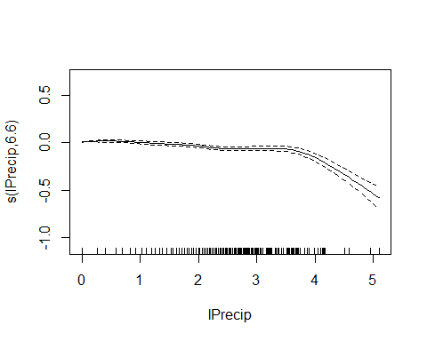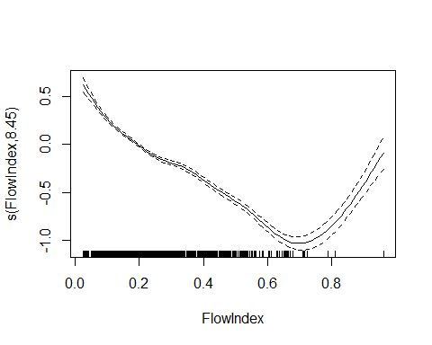
Note that the function for recent weighted precipitation is nearly
linear, while the effect of present-day precipitation is near zero for
low to moderate rainfall, but drops quickly for rainfall over about 4 cm
or 1.5 inches (rare events). Chlorides drop with increasing water depth,
up to a point, but then climb again at the highest (very rare) flow
levels.

What these smoothers show is that sticking with linear terms for many of
our covariates should work fairly well, except at the highest flow
conditions. We might also consider adding a “high rainfall” term, rather
than fitting a a linear or smoothed predictor term for today’s rain. The
cost of such model simplification would be a drop in ability to
accurately predict chloride levels under the highest flow, highest
rainfall conditions.

## Diagnostic Plots

The help files for `gam.check()` suggest using care when interpreting
results for GAMM models, since the function does not correctly
incorporate the error correlations structure. However, for our purposes,
this is probably sufficient, since our focus is not on statistical
significance, but on estimation.

``` r
gam.check(chl_gamm$gam)
```

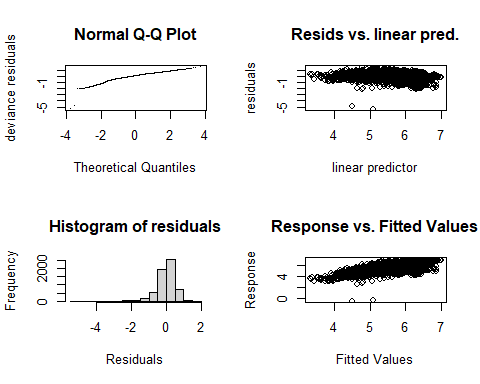

    #> 
    #> 'gamm' based fit - care required with interpretation.
    #> Checks based on working residuals may be misleading.
    #> Basis dimension (k) checking results. Low p-value (k-index<1) may
    #> indicate that k is too low, especially if edf is close to k'.
    #> 
    #>                k'  edf k-index p-value    
    #> s(lPrecip)   9.00 6.60    0.97   0.015 *  
    #> s(wlPrecip)  9.00 3.91    0.90  <2e-16 ***
    #> s(FlowIndex) 9.00 8.45    0.88  <2e-16 ***
    #> ---
    #> Signif. codes:  0 '***' 0.001 '**' 0.01 '*' 0.05 '.' 0.1 ' ' 1

As with the linear model, we have a skewed, slightly heavy tailed
distribution of residuals, with a couple of very large outliers. There
is perhaps slight evidence for lack of complete independence between
residuals and predictors. T his model is adequate, but not great. For
careful work, we should probably use bootstrapped confidence intervals
or something similar, but for our purposes, that is probably overkill.

## Checking Estimated Marginal Means

Reliably calling `emmeans()` for these large `gamm()` models appears to
require creating a call object and associating it with the model (e.g.,
as `chl_gamm$gam$call`). (See the `emmeans` models vignette for more
info, although not all strategies recommended there worked for us).

We first create the call object, then associate it with the model, and
finally manually construct a reference grid before calling `emmeans()`
to extract marginal means. This workflow has the advantage that it
requires us to think carefully about the structure of the reference
grid.

Note also that we explicitly specify that we want the marginal means
estimated at Year = 2014. This is largely to be explicit, and avoid
possible confusion from here on out. The default method creates a
reference grid where marginal means are keyed to mean values of all
predictors, which would be some value slightly larger than 2014.
However, we specified `cov.reduce = median`, and the median Year
predictor is precisely 2014. Although this setting is probably
unnecessary, we chose to be explicit from here on out.

``` r
the_call <-  quote(gamm(log(Chl_Median) ~ Site + 
                          s(lPrecip) + 
                          s(wlPrecip) +
                          s(FlowIndex) +
                          Month +
                          Year +
                          Site : Year,
                        correlation = corAR1(0.8),
                        na.action = na.omit, 
                        method = 'REML',
                        data = reduced_data))
chl_gamm$gam$call <- the_call

my_ref_grid <- ref_grid(chl_gamm, at = list(Year = 2014), cov.reduce = median) 
(a <- emmeans(my_ref_grid, ~ Month, type = 'response'))
#>  Month response    SE   df lower.CL upper.CL
#>  Mar        399 26.60 6123      350      455
#>  Apr        356 20.24 6123      319      398
#>  May        303 15.87 6123      274      336
#>  Jun        252 12.95 6123      228      279
#>  Jul        231 11.95 6123      209      255
#>  Aug        205 10.36 6123      185      226
#>  Sep        194  9.66 6123      176      214
#>  Oct        203 10.43 6123      183      224
#>  Nov        258 14.01 6123      232      287
#> 
#> Results are averaged over the levels of: Site 
#> Confidence level used: 0.95 
#> Intervals are back-transformed from the log scale
```

``` r
labl <- 'Values Adjusted to Median Flow and\nMedian 10 Day Precipitation\nAll Sites Combined'

plot(a) + 
  xlab('Chloride (mg/l)\n(Flow and Precipitation Adjusted)') +
  ylab ('') +
  annotate('text', 400, 6, label = labl, size = 3) +
  xlim(0,500) +
  geom_vline(xintercept =  230, color = 'orange') +
  geom_vline(xintercept =  860, color = 'red') +
  coord_flip() +
  theme_cbep(base_size = 12)
#> Warning: Removed 1 rows containing missing values (geom_vline).
```

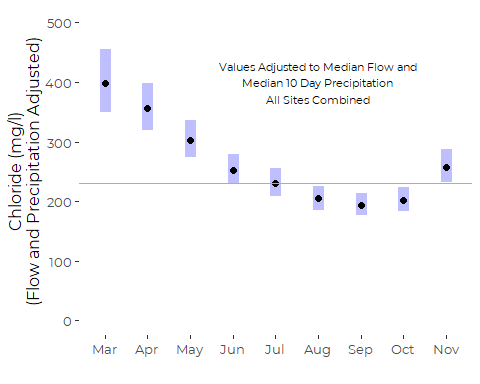

``` r
labl <- 'Values Adjusted to Median Flow and\nMedian 10 Day Precipitation\nAll Dates Combined'

(a <- emmeans(my_ref_grid, ~ Site, type = 'response'))
#> NOTE: Results may be misleading due to involvement in interactions
#>  Site response   SE   df lower.CL upper.CL
#>  S07       221 12.8 6123      197      248
#>  S05       168 11.4 6123      147      192
#>  S17       237 40.6 6123      169      332
#>  S03       327 17.3 6123      295      363
#>  S01       403 21.8 6123      363      448
#> 
#> Results are averaged over the levels of: Month 
#> Confidence level used: 0.95 
#> Intervals are back-transformed from the log scale
```

``` r
plot(a) + 
  xlab('Chloride (mg/l)\n(Flow and Precipitation Adjusted)') +
  ylab("Upstream                  Main Stem                                 Lower Tribs                   ") +
  annotate('text', 400, 2.5, label = labl, size = 3) +
  xlim(0,500) +
  geom_vline(xintercept =  230, color = 'orange') +
  geom_vline(xintercept =  860, color = 'red') +
  coord_flip() +
  theme_cbep(base_size = 12)
#> Warning: Removed 1 rows containing missing values (geom_vline).
```

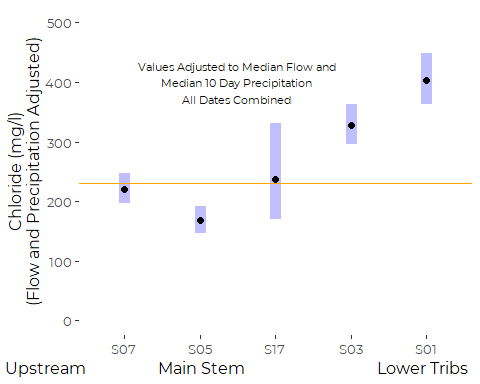

## Visualizing Trends

We extract results on the log scale, so we can calculate the linear
predictor by hand, then back transform.

``` r
my_ref_grid <- ref_grid(chl_gamm, at = list(Year = 2014, Month = 'Jul'),
                        cov.reduce = median)

(a <- summary(emmeans(my_ref_grid, 'Site')))
#> NOTE: Results may be misleading due to involvement in interactions
#>  Site emmean     SE   df lower.CL upper.CL
#>  S07    5.28 0.0648 6123     5.16     5.41
#>  S05    5.01 0.0736 6123     4.86     5.15
#>  S17    5.35 0.1735 6123     5.01     5.69
#>  S03    5.68 0.0602 6123     5.56     5.79
#>  S01    5.89 0.0617 6123     5.76     6.01
#> 
#> Results are given on the log (not the response) scale. 
#> Confidence level used: 0.95
(b <- summary(emtrends(chl_gamm, 'Site', 'Year')))
#>  Site Year.trend     SE   df lower.CL upper.CL
#>  S07      0.1342 0.0204 6123   0.0942    0.174
#>  S05      0.1024 0.0229 6123   0.0576    0.147
#>  S17      0.0563 0.0575 6123  -0.0564    0.169
#>  S03      0.0810 0.0181 6123   0.0456    0.116
#>  S01      0.0989 0.0185 6123   0.0626    0.135
#> 
#> Results are averaged over the levels of: Month 
#> Confidence level used: 0.95
```

The key insight here is that the trends are significant for all sites
EXCEPT S17, where we have fewer years of data.

``` r
plot(b)
```

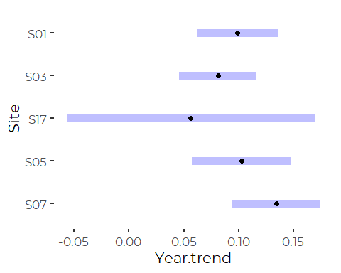
And those trends are NOT statistically different.

``` r
lookup <- tibble(Site = a[[1]], Intercept = a[[2]], Slope = b[[2]])
rm(a,b)

df <- tibble(Site = rep(levels(reduced_data$Site), each = 9), 
              Year = rep(2010:2018, 5)) %>%
  mutate(sslope =     lookup$Slope[match(Site, lookup$Site)],
         iintercept = lookup$Intercept[match(Site, lookup$Site)],
         pred = exp((Year - 2014) * sslope + iintercept)) %>%
  select(-sslope, -iintercept)

ggplot(df, aes(x = Year, y = pred, color = Site)) +
         geom_step(direction = 'mid') +
  ylab('Chloride (mg/l)\n(Flow and Precipitation Adjusted)') +
  xlab('') +
  ylim(0,600) +
  geom_hline(yintercept =  230, color = 'black') +
  #geom_hline(yintercept =  860, color = 'red') +

  theme_cbep(base_size = 12)
```

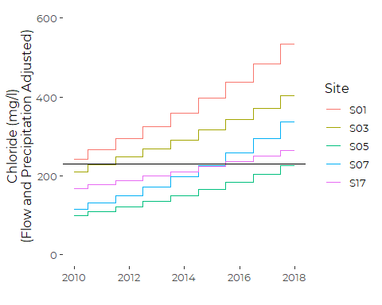

# Model without the interactions.

This model takes several minutes to run (more than 5, less than 15)

``` r
if (! file.exists("models/revised_gamm.rds")) {
  revised_gamm <- gamm(log(Chl_Median) ~ Site + 
                     s(lPrecip) + 
                     s(wlPrecip) +
                     s(FlowIndex) +
                     Month +
                     Year,
                   correlation = corAR1(0.8),
                   na.action = na.omit, 
                   method = 'REML',
                   data = reduced_data)
  saveRDS(revised_gamm, file="models/revised_gamm.rds")
} else {
  revised_gamm <- readRDS("models/revised_gamm.rds")
}
```

## ANOVA

``` r
anova(revised_gamm$gam)
#> 
#> Family: gaussian 
#> Link function: identity 
#> 
#> Formula:
#> log(Chl_Median) ~ Site + s(lPrecip) + s(wlPrecip) + s(FlowIndex) + 
#>     Month + Year
#> 
#> Parametric Terms:
#>       df      F p-value
#> Site   4  35.21  <2e-16
#> Month  8  25.02  <2e-16
#> Year   1 117.72  <2e-16
#> 
#> Approximate significance of smooth terms:
#>                edf Ref.df      F p-value
#> s(lPrecip)   6.610  6.610  27.49  <2e-16
#> s(wlPrecip)  3.924  3.924  62.78  <2e-16
#> s(FlowIndex) 8.460  8.460 222.24  <2e-16
```

## Summary

``` r
summary(revised_gamm$gam)
#> 
#> Family: gaussian 
#> Link function: identity 
#> 
#> Formula:
#> log(Chl_Median) ~ Site + s(lPrecip) + s(wlPrecip) + s(FlowIndex) + 
#>     Month + Year
#> 
#> Parametric coefficients:
#>               Estimate Std. Error t value Pr(>|t|)    
#> (Intercept) -2.046e+02  1.941e+01 -10.541  < 2e-16 ***
#> SiteS05     -3.206e-01  7.965e-02  -4.025 5.77e-05 ***
#> SiteS17     -1.030e-01  9.226e-02  -1.117   0.2642    
#> SiteS03      3.509e-01  7.711e-02   4.550 5.46e-06 ***
#> SiteS01      5.619e-01  7.846e-02   7.162 8.88e-13 ***
#> MonthApr    -1.124e-01  5.019e-02  -2.240   0.0252 *  
#> MonthMay    -2.713e-01  5.746e-02  -4.721 2.40e-06 ***
#> MonthJun    -4.550e-01  6.034e-02  -7.540 5.39e-14 ***
#> MonthJul    -5.405e-01  6.364e-02  -8.493  < 2e-16 ***
#> MonthAug    -6.572e-01  6.343e-02 -10.361  < 2e-16 ***
#> MonthSep    -7.082e-01  6.093e-02 -11.623  < 2e-16 ***
#> MonthOct    -6.720e-01  5.671e-02 -11.849  < 2e-16 ***
#> MonthNov    -4.347e-01  5.204e-02  -8.353  < 2e-16 ***
#> Year         1.045e-01  9.629e-03  10.850  < 2e-16 ***
#> ---
#> Signif. codes:  0 '***' 0.001 '**' 0.01 '*' 0.05 '.' 0.1 ' ' 1
#> 
#> Approximate significance of smooth terms:
#>                edf Ref.df      F p-value    
#> s(lPrecip)   6.610  6.610  27.49  <2e-16 ***
#> s(wlPrecip)  3.924  3.924  62.78  <2e-16 ***
#> s(FlowIndex) 8.460  8.460 222.24  <2e-16 ***
#> ---
#> Signif. codes:  0 '***' 0.001 '**' 0.01 '*' 0.05 '.' 0.1 ' ' 1
#> 
#> R-sq.(adj) =  0.422   
#>   Scale est. = 0.26397   n = 6160
```

## Structure of the GAM

Interestingly, differences between sites and differences in slopes are
marginally not significant in this simplified model.

``` r
plot(revised_gamm$gam)
```

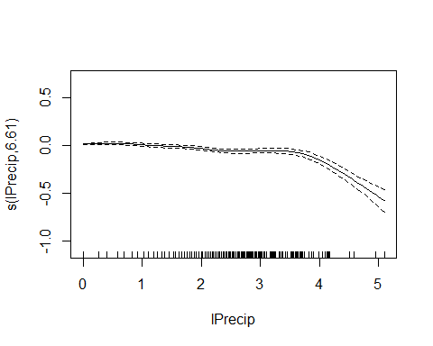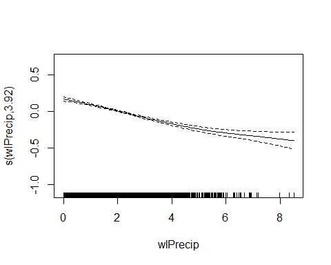

## Diagnostic Plots

The help files for `gam.check()` suggest using care when interpreting
results for GAMM models, since the function does not correctly
incorporate the error correlations structure. However, for our purposes,
this is probably sufficient, since our focus is not on statistical
significance, but on estimation.

``` r
gam.check(revised_gamm$gam)
```

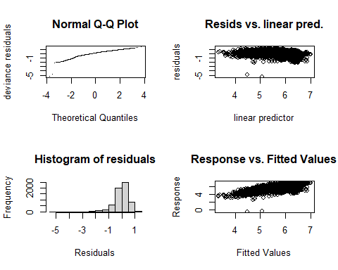

    #> 
    #> 'gamm' based fit - care required with interpretation.
    #> Checks based on working residuals may be misleading.
    #> Basis dimension (k) checking results. Low p-value (k-index<1) may
    #> indicate that k is too low, especially if edf is close to k'.
    #> 
    #>                k'  edf k-index p-value    
    #> s(lPrecip)   9.00 6.61    0.99    0.32    
    #> s(wlPrecip)  9.00 3.92    0.90  <2e-16 ***
    #> s(FlowIndex) 9.00 8.46    0.88  <2e-16 ***
    #> ---
    #> Signif. codes:  0 '***' 0.001 '**' 0.01 '*' 0.05 '.' 0.1 ' ' 1

No appreciable changes in model adequacy.

# Model with Separate Years

``` r
if (! file.exists("models/years_gamm.rds")) {
  years_gamm <- gamm(log(Chl_Median) ~ Site + 
                     s(lPrecip) + 
                     s(wlPrecip) +
                     s(FlowIndex) +
                     Month +
                     Year_f,
                   correlation = corAR1(0.8),
                   na.action = na.omit, 
                   method = 'REML',
                   data = reduced_data)
  saveRDS(years_gamm, file="models/years_gamm.rds")
} else {
  years_gamm <- readRDS("models/years_gamm.rds")
}
```

## ANOVA

``` r
anova(years_gamm$gam)
#> 
#> Family: gaussian 
#> Link function: identity 
#> 
#> Formula:
#> log(Chl_Median) ~ Site + s(lPrecip) + s(wlPrecip) + s(FlowIndex) + 
#>     Month + Year_f
#> 
#> Parametric Terms:
#>        df     F p-value
#> Site    4 38.35  <2e-16
#> Month   8 17.77  <2e-16
#> Year_f  8 25.58  <2e-16
#> 
#> Approximate significance of smooth terms:
#>                edf Ref.df      F p-value
#> s(lPrecip)   6.614  6.614  27.75  <2e-16
#> s(wlPrecip)  3.865  3.865  63.65  <2e-16
#> s(FlowIndex) 8.493  8.493 221.60  <2e-16
```

## Diagnostic Plots

The help files for `gam.check()` suggest using care when interpreting
results for GAMM models, since the function does not correctly
incorporate the error correlations structure. However, for our purposes,
this is probably sufficient, since our focus is not on statistical
significance, but on estimation.

``` r
gam.check(years_gamm$gam)
```

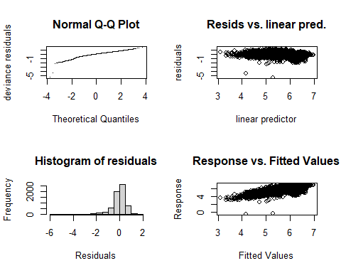

    #> 
    #> 'gamm' based fit - care required with interpretation.
    #> Checks based on working residuals may be misleading.
    #> Basis dimension (k) checking results. Low p-value (k-index<1) may
    #> indicate that k is too low, especially if edf is close to k'.
    #> 
    #>                k'  edf k-index p-value    
    #> s(lPrecip)   9.00 6.61    1.01    0.86    
    #> s(wlPrecip)  9.00 3.87    0.95  <2e-16 ***
    #> s(FlowIndex) 9.00 8.49    0.89  <2e-16 ***
    #> ---
    #> Signif. codes:  0 '***' 0.001 '**' 0.01 '*' 0.05 '.' 0.1 ' ' 1
