Analysis of LCWMD “Diurnal Exceedences” of Chronic (“CCC”) Chloride
Standards
================
Curtis C. Bohlen, Casco Bay Estuary Partnership
01/12/2021

-   [Introduction](#introduction)
    -   [Are Water Quality Criteria
        Met?](#are-water-quality-criteria-met)
    -   [Sources of Threshold Values](#sources-of-threshold-values)
        -   [Chloride](#chloride)
-   [Import Libraries](#import-libraries)
-   [Data Preparation](#data-preparation)
    -   [Folder References](#folder-references)
    -   [Data on Sites and Impervious
        Cover](#data-on-sites-and-impervious-cover)
    -   [Main Data](#main-data)
    -   [Data Corrections](#data-corrections)
        -   [Anomolous Depth Values](#anomolous-depth-values)
        -   [Single S06B Chloride Observation from
            2017](#single-s06b-chloride-observation-from-2017)
        -   [Anomolous Dissolved Oxygen and Chloride
            Values](#anomolous-dissolved-oxygen-and-chloride-values)
    -   [Remove Partial Data from Winter
        Months](#remove-partial-data-from-winter-months)
    -   [Add Stream Flow Index](#add-stream-flow-index)
    -   [Remove Site S06B, Trim Data](#remove-site-s06b-trim-data)
-   [Exploratory Cross Tabs](#exploratory-cross-tabs)
    -   [Utility Function](#utility-function)
    -   [Chloride Chronic](#chloride-chronic)
    -   [Chloride Acute](#chloride-acute)
-   [CCC](#ccc)
    -   [Exploratory Graphics](#exploratory-graphics)
    -   [Generalized Linear Models](#generalized-linear-models)
        -   [Model Alternatives](#model-alternatives)
        -   [Extract Marginal Means](#extract-marginal-means)
    -   [Models with Autocorrelated
        Error](#models-with-autocorrelated-error)
        -   [Fitting with glmmTMB](#fitting-with-glmmtmb)
        -   [Fit a GAM](#fit-a-gam)
    -   [Fitting a GAMM model](#fitting-a-gamm-model)
        -   [Model Sequence](#model-sequence)
        -   [Extract Marginal Means](#extract-marginal-means-1)


# Introduction

The Long Creek Watershed, almost three and a half square miles in area,
is dominated by commercial land use. The Maine Mall is one of the
largest land owners in the watershed, and it is surrounded by a range of
commercial businesses, from medical offices, to car washes. About a
third of the watershed in impervious surfaces like roads, parking lots,
and rooftops.

Landowners with an acre or more of impervious area are required to get a
Clean Water Act permit for stormwater discharges from their property.
The LCWMD provides an alternative for landowners to working to receive
an individual permit. Landowners who elect to participate in the The
Long Creek Watershed Management District receive a General Permit, in
return for providing funding to the District, and facilitating the work
of the district by permitting access to their property for certain
activities.

For more information on LCWMD, see [their web
site](restorelongcreek.org).

Over the past decade, LCWMD has contracted with several consulting firms
to provide water quality monitoring services along Long Creek. This has
produced one of the most extensive and best documented data set from the
Northeastern US looking at water quality conditions in an urban stream.

GZA Geoenvironmental Incorporated (GZA) has been the primary monitoring
contractor for LCWMD for several years, and in 2019, they conducted a
thorough review of LCWMD data. These analyses are based on their summary
data sets, and recapitulate and extend their analyses.

## Are Water Quality Criteria Met?

The primary question we ask in this Notebook, is whether water quality
criteria pertaining to levels of chloride are met. In particular, we
explore various ways of modeling those probabilities

We ask whether the probability of failing to meet criteria each day is
changing. Secondarily, we examine differences among sites in the
probability of failing criteria.

In this data set a “TRUE” value consistently implies that water quality
criteria were met or exceeded, whether that is achieved by a value
higher than or lower than some numeric criteria. “TRUE” implies good
conditions. “FALSE” implies bad conditions.

## Sources of Threshold Values

### Chloride

Maine uses established thresholds for both chronic and acute exposure to
chloride. These are the “CCC and CMC” standards for chloride in
freshwater. (06-096 CMR 584). These terms are defined in a footnote as
follows:

> The Criteria Maximum Concentration (CMC) is an estimate of the highest
> concentration of a material in surface water to which an aquatic
> community can be exposed briefly without resulting in an unacceptable
> effect. The Criterion Continuous Concentration (CCC) is an estimate of
> the highest concentration of a material in surface water to which an
> aquatic community can be exposed indefinitely without resulting in an
> unacceptable effect.

The relevant thresholds are:

-   Chloride CCC = 230 mg/l
-   Chloride CMC = 860 mg/l

In practice, chloride in Long Creek are indirectly estimated based on
measurement of conductivity. The chloride-conductivity correlations is
fairly close and robust, but estimation is an additional source of
error, although generally on the level of 10% or less.

Further, exceedences of the acute chloride threshold, the “CMC” are
relatively rare, which limits ability to construct robust models.

# Import Libraries

``` r
library(glmmTMB)  # Generalized Linear Mixed models.
library(mgcv)     # For mixed effects GAMMs
#> Loading required package: nlme
#> This is mgcv 1.8-33. For overview type 'help("mgcv-package")'.

library(tidyverse)# Has to load after MASS, so `select()` is not masked
#> -- Attaching packages --------------------------------------- tidyverse 1.3.0 --
#> v ggplot2 3.3.3     v purrr   0.3.4
#> v tibble  3.0.5     v dplyr   1.0.3
#> v tidyr   1.1.2     v stringr 1.4.0
#> v readr   1.4.0     v forcats 0.5.0
#> -- Conflicts ------------------------------------------ tidyverse_conflicts() --
#> x dplyr::collapse() masks nlme::collapse()
#> x dplyr::filter()   masks stats::filter()
#> x dplyr::lag()      masks stats::lag()
library(readr)

library(emmeans)  # Provides tools for calculating marginal means

library(CBEPgraphics)
load_cbep_fonts()
theme_set(theme_cbep())

library(LCensMeans)
```

# Data Preparation

## Folder References

``` r
sibfldnm    <- 'Derived_Data'
parent      <- dirname(getwd())
sibling     <- file.path(parent,sibfldnm)

dir.create(file.path(getwd(), 'figures'), showWarnings = FALSE)
dir.create(file.path(getwd(), 'models'), showWarnings = FALSE)
```

## Data on Sites and Impervious Cover

These data were derived from Table 2 from a GZA report to the Long Creek
Watershed Management District, titled “Re: Long Creek Watershed Data
Analysis; Task 2: Preparation of Explanatory and Other Variables.” The
Memo is dated November 13, 2019 File No. 09.0025977.02.

Cumulative Area and IC calculations are our own, based on the GZA data
and the geometry of the stream channel.

``` r
# Read in data and drop the East Branch, where we have no data
fn <- "Site_IC_Data.csv"
fpath <- file.path(sibling, fn)

Site_IC_Data <- read_csv(fpath) %>%
  filter(Site != "--") 
#> 
#> -- Column specification --------------------------------------------------------
#> cols(
#>   Site = col_character(),
#>   Subwatershed = col_character(),
#>   Area_ac = col_double(),
#>   IC_ac = col_double(),
#>   CumArea_ac = col_double(),
#>   CumIC_ac = col_double(),
#>   PctIC = col_character(),
#>   CumPctIC = col_character()
#> )

# Now, create a factor that preserves the order of rows (roughly upstream to downstream). 
Site_IC_Data <- Site_IC_Data %>%
  mutate(Site = factor(Site, levels = Site_IC_Data$Site))

# Finally, convert percent covers to numeric values
Site_IC_Data <- Site_IC_Data %>%
  mutate(CumPctIC = as.numeric(substr(CumPctIC, 1, nchar(CumPctIC)-1))) %>%
  mutate(PctIC = as.numeric(substr(PctIC, 1, nchar(PctIC)-1)))
Site_IC_Data
#> # A tibble: 6 x 8
#>   Site  Subwatershed      Area_ac IC_ac CumArea_ac CumIC_ac PctIC CumPctIC
#>   <fct> <chr>               <dbl> <dbl>      <dbl>    <dbl> <dbl>    <dbl>
#> 1 S07   Blanchette Brook     434.  87.7       434.     87.7  20.2     20.2
#> 2 S06B  Upper Main Stem      623.  80.2       623.     80.2  12.9     12.9
#> 3 S05   Middle Main Stem     279.  53.6      1336     222.   19.2     16.6
#> 4 S17   Lower Main Stem      105   65.1      1441     287.   62       19.9
#> 5 S03   North Branch Trib    298. 123         298.    123    41.2     41.2
#> 6 S01   South Branch Trib    427. 240.        427.    240.   56.1     56.1
```

## Main Data

We remove 2019 data, as we don’t have a complete year’s worth of data,
which may bias annual summaries.

Note that this data does NOT include all of the predictors used in some
models looking at chlorides. In particular, it does not include stream
flow estimates

``` r
fn <- "Exceeds_Data.csv"
exceeds = read_csv(file.path(sibling, fn), progress=FALSE) %>%
  mutate(IC=Site_IC_Data$CumPctIC[match(Site, Site_IC_Data$Site)]) %>%
  select(-X1) %>%
  filter(Year < 2019) %>%
  mutate(Site = factor(Site, levels=levels(Site_IC_Data$Site)),
         year_f = factor(Year),
         month_f = factor(Month, levels = 1:12, labels = month.abb),
         DOY = as.numeric(format(sdate, format = '%j')),
         season = cut(Month, breaks = c(0,2,5,8,11,13),
                      labels = c('Winter', 'Spring',
                                 'Summer', 'Fall', 'Winter')),
         season = factor(season, levels = c('Winter', 'Spring', 
                                           'Summer', 'Fall'))) %>%
  mutate(lPrecip = log1p(Precip))
#> Warning: Missing column names filled in: 'X1' [1]
#> 
#> -- Column specification --------------------------------------------------------
#> cols(
#>   X1 = col_double(),
#>   sdate = col_date(format = ""),
#>   Site = col_character(),
#>   Year = col_double(),
#>   Month = col_double(),
#>   Precip = col_double(),
#>   PPrecip = col_double(),
#>   MaxT = col_double(),
#>   D_Median = col_double(),
#>   ClassCDO = col_logical(),
#>   ClassBDO = col_logical(),
#>   ClassC_PctSat = col_logical(),
#>   ClassB_PctSat = col_logical(),
#>   ClassCBoth = col_logical(),
#>   ClassBBoth = col_logical(),
#>   ChlCCC = col_logical(),
#>   ChlCMC = col_logical(),
#>   MaxT_ex = col_logical(),
#>   AvgT_ex = col_logical()
#> )
```

## Data Corrections

### Anomolous Depth Values

Several depth observations in the record appear highly unlikely. In
particular, several observations show daily median water depths over 15
meters. A few other observations show daily median depths over 4 meters,
which also looks unlikely in a stream of this size. All these events
also occurred in May or June of 2015 at site S05. Some sort of
malfunction of the pressure transducer appears likely.

We can trace these observations back to the raw QA/QC’d pressure and
sonde data submitted to LCWMD by GZA, so they are not an artifact of our
data preparation.

We remove these extreme values. The other daily medians in May and June
of 2015 appear reasonable, and we leave them in place, although given
possible instability of the pressure sensors, it might make sense to
remove them all.

Note that removing depth observations from Site S05 will remove those
DATES from any model that uses the `FlowIndex` variable (see below) as a
predictor.

``` r
exceeds <- exceeds %>%
  mutate(D_Median = if_else(D_Median > 4, NA_real_, D_Median),
         lD_Median = log1p(D_Median))
```

### Single S06B Chloride Observation from 2017

The data includes just a single chloride observation from site S06B from
any year other than 2013. While we do not know if the data point is
legitimate or not, it has high leverage in several models, and we
suspect a transcription error of some sort.

We remove the Chloride value from the data.

``` r
exceeds <- exceeds %>%
  mutate(ChlCCC = if_else(Site == 'S06B' & Year > 2014,
                              NA, ChlCCC),
         ChlCMC = if_else(Site == 'S06B' & Year > 2014,
                              NA, ChlCMC))
```

### Anomolous Dissolved Oxygen and Chloride Values

We noted extreme dissolved oxygen data at Site S03, during the end of
2016. Values were both extreme and highly variable. (See discussion in
the DO Analysis workbooks). We decided we should remove both the
chloride and oxygen observations after October 15th.

``` r
exceeds <- exceeds %>% 
  mutate(ChlCCC = if_else(Year == 2016 & Site == 'S03' & DOY > 288,
                              NA, ChlCCC),
         ChlCMC = if_else(Year == 2016 & Site == 'S03' & DOY > 288,
                              NA, ChlCMC))
```

## Remove Partial Data from Winter Months

We have very limited data from several months. We have January data from
only one year, and February data from only two, and December data from
only four years, all older. Both March and November sample sizes vary.

The limited winter data generates severely unbalanced samples, which may
lead to estimation problems, especially in models with crossed or
potentially crossed factors and predictors. More fundamentally, the
potential bias introduced by showing data from those months from just a
handful of years could give a misleading impression of seasonal
patterns. We trim December, January and February data, but leave the
other months.

It is important to remember, even after trimming the data, that:  
1. 2010 is a partial year,  
2. The period of sampling in March may be biased due to spring melt
timing.

``` r
xtabs(~ year_f + month_f, data = exceeds)
#>       month_f
#> year_f Jan Feb Mar Apr May Jun Jul Aug Sep Oct Nov Dec
#>   2010   0   0   0   0   0  69  97 103 120 124 120  35
#>   2011   0  15 101 120 124 120 124 124 120 124 120 112
#>   2012   0  39  93  90  93 113 124 124 120  39  96 124
#>   2013   9   0  46 128 155 140 124 124 120 138 150  15
#>   2014   0   0  53 102 155 150 155 155 150 155 120   0
#>   2015   0   0   8 141 186 180 186 186 180 160  30   0
#>   2016   0   0  10 170 186 180 186 186 180 186 168   0
#>   2017   0   0 186 180 186 180 186 186 180 186 102   0
#>   2018   0   0  16 180 186 180 186 186 180 186 126   0
```

``` r
exceeds <- exceeds %>%
  filter(Month >= 3 & Month <= 11)
```

## Add Stream Flow Index

We worked through many models on a site by site basis in which we
included data on water depth, but since the depth coordinate is
site-specific, a 10 cm depth at one site may be exceptional, while at
another it is commonplace. We generally want not a local measure of
stream depth, but a watershed-wide metric of high, medium, or low stream
flow.

Middle and Lower Maine Stem sites would be suitable for a general flow
indicator across the watershed. The monitoring sites in that stretch of
Long Creek include include S05 and S17, however only site S05 has been
in continuous operation throughout the period of record, so we use depth
data from S05 to construct our general stream flow indicator.

Stream flow at S05 is correlated with flow at other sites, although not
all that closely correlated to flow in the downstream tributaries (S01
and S03).

``` r
exceeds %>%
  select(sdate, Site, lD_Median) %>%
  pivot_wider(names_from = Site, values_from = lD_Median) %>%
  select( -sdate) %>%
  cor(use = 'pairwise', method = 'pearson')
#>            S01       S03       S05      S06B       S07       S17
#> S01  1.0000000 0.4499047 0.6506630 0.6310361 0.5594067 0.7290077
#> S03  0.4499047 1.0000000 0.4526392 0.7152403 0.4578906 0.6666414
#> S05  0.6506630 0.4526392 1.0000000 0.8043943 0.7042711 0.7906571
#> S06B 0.6310361 0.7152403 0.8043943 1.0000000 0.5882527 0.8778188
#> S07  0.5594067 0.4578906 0.7042711 0.5882527 1.0000000 0.7327432
#> S17  0.7290077 0.6666414 0.7906571 0.8778188 0.7327432 1.0000000
```

We use the log of the daily median flow at S05 as a general
watershed-wide stream flow indicator, which we call `FlowIndex`. We use
the log of the raw median, to lessen the effect of the highly skewed
distribution of stream depths on the metric.

``` r
depth_data <- exceeds %>%
  filter (Site == 'S05') %>%
  select(sdate, lD_Median)

exceeds <- exceeds %>%
  mutate(FlowIndex = depth_data$lD_Median[match(sdate, depth_data$sdate)])

rm(depth_data)
```

## Remove Site S06B, Trim Data

Site S06B only has chloride data from a single year, so including it in
temporal models causes problems. We removing the Site from further
analysis. We also drop variables we will not analyze further in this
Notebook.

``` r
exceeds <- exceeds %>%
  filter(Site != 'S06B') %>%
  select(-starts_with('Class')) %>%
  select(-contains('T_ex')) %>%
  mutate(Site = droplevels(Site))
```

# Exploratory Cross Tabs

## Utility Function

This function just adds a percent summary column to a cross-tab.

``` r
xt_pct <- function(.form, .dat) {
  xt <- xtabs(.form, data = .dat)
  xt <- cbind(xt, round(apply(xt, 1, function(X) X[1]/sum(X)), 3)*100)
  names(xt[3]) <- 'Percent Fail'
  return(xt)
}
```

## Chloride Chronic

``` r
xt_pct(~Year + ChlCCC, exceeds)
#>      FALSE TRUE     
#> 2010   334  247 57.5
#> 2011   533  197 73.0
#> 2012   444  158 73.8
#> 2013   529  324 62.0
#> 2014   396  543 42.2
#> 2015   563  485 53.7
#> 2016   988  160 86.1
#> 2017   714  399 64.2
#> 2018   813  374 68.5
```

But the Strong pattern is by sites.

``` r
xt_pct(~Site + ChlCCC, exceeds)
#>     FALSE TRUE     
#> S07   935  945 49.7
#> S05   394 1016 27.9
#> S17   598  260 69.7
#> S03  1544  501 75.5
#> S01  1843  165 91.8
```

## Chloride Acute

``` r
xt_pct(~Year + ChlCMC, exceeds)
#>      FALSE TRUE    
#> 2010     1  580 0.2
#> 2011    17  713 2.3
#> 2012     6  596 1.0
#> 2013     4  849 0.5
#> 2014     5  934 0.5
#> 2015    10 1038 1.0
#> 2016    77 1071 6.7
#> 2017    51 1062 4.6
#> 2018    61 1126 5.1
```

``` r
xt_pct(~Site + ChlCMC, exceeds)
#>     FALSE TRUE    
#> S07    27 1853 1.4
#> S05     2 1408 0.1
#> S17     1  857 0.1
#> S03    37 2008 1.8
#> S01   165 1843 8.2
```

Note that those probabilities are very low – under 1% – which is likely
to limit ability to fit models to these data.

# CCC

## Exploratory Graphics

These are estimated as empirical relative frequencies, with error
estimated as two times the standard error of the estimate.

``` r
exceeds %>%
  group_by(Site, Year) %>%
  summarize(CCC_true = sum(ChlCCC, na.rm = TRUE),
            CCC_count = sum(! is.na(ChlCCC)),
            CCC_p = CCC_true/CCC_count,
            CCC_err = CCC_p*(1-CCC_p)/sqrt(CCC_count),
            .groups = 'drop') %>%
  ggplot(aes(Year, CCC_p, color = Site)) +
  geom_line() +
  geom_pointrange(aes(ymin = CCC_p-2 * CCC_err, ymax = CCC_p + 2 * CCC_err)) +
  ylab('Probability of Passing\nChloride CCC Standard')
#> Warning: Removed 1 rows containing missing values (geom_pointrange).
```

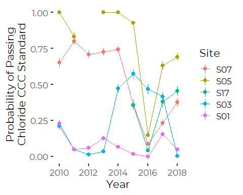
2016 was a rough year at most sites. Sites S01 and S03 fail this
standard frequently.

Note that for some year at site S05, we never had a failure to meet this
chloride standard. This will probably limit the models we can fit.

``` r
exceeds  %>%
  group_by(month_f, Year) %>%
  summarize(CCC_true = sum(ChlCCC, na.rm = TRUE),
            CCC_count = sum(! is.na(ChlCCC)),
            CCC_p = CCC_true/CCC_count,
            CCC_err = CCC_p*(1-CCC_p)/sqrt(CCC_count)) %>%
  ggplot(aes(Year, CCC_p, color = month_f)) +
  geom_line() +
  geom_pointrange(aes(ymin = CCC_p-2 * CCC_err, ymax = CCC_p + 2 * CCC_err))
#> `summarise()` has grouped output by 'month_f'. You can override using the `.groups` argument.
```

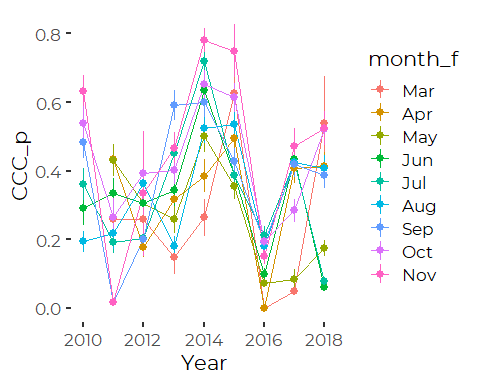
That shows that 2011 and 2016 were fairly bad years. But the month to
month patterns are less obvious than the year to year patterns This
highlights the role of relativity slow-dynamic processes (drought?
groundwater flow?) in shaping chloride conditions in Long Creek.

## Generalized Linear Models

We start with binomial GLM models. Although daily status is almost
certainly NOT independent in time, we start without addressing
autocorrelation, to help us get a grip on patterns in the data with
models that are less time consuming to fit.

``` r
month_glm <- glm(ChlCCC ~ year_f + Site + 
                   month_f  + MaxT + lPrecip +  FlowIndex,
              family = 'binomial',
                   data = exceeds, maxit = 100)
```

``` r
step_month <- step(month_glm)
#> Start:  AIC=5648.87
#> ChlCCC ~ year_f + Site + month_f + MaxT + lPrecip + FlowIndex
#> 
#>             Df Deviance    AIC
#> - MaxT       1   5600.9 5646.9
#> <none>           5600.9 5648.9
#> - lPrecip    1   5634.6 5680.6
#> - month_f    8   5802.4 5834.4
#> - FlowIndex  1   5947.4 5993.4
#> - year_f     8   6173.9 6205.9
#> - Site       4   6971.4 7011.4
#> 
#> Step:  AIC=5646.87
#> ChlCCC ~ year_f + Site + month_f + lPrecip + FlowIndex
#> 
#>             Df Deviance    AIC
#> <none>           5600.9 5646.9
#> - lPrecip    1   5635.9 5679.9
#> - month_f    8   5864.2 5894.2
#> - FlowIndex  1   5949.9 5993.9
#> - year_f     8   6175.1 6205.1
#> - Site       4   6971.4 7009.4
```

``` r
anova(step_month, test = 'LRT')
#> Analysis of Deviance Table
#> 
#> Model: binomial, link: logit
#> 
#> Response: ChlCCC
#> 
#> Terms added sequentially (first to last)
#> 
#> 
#>           Df Deviance Resid. Df Resid. Dev Pr(>Chi)    
#> NULL                       6159     7933.6             
#> year_f     8   612.82      6151     7320.8   <2e-16 ***
#> Site       4  1223.72      6147     6097.1   <2e-16 ***
#> month_f    8   146.84      6139     5950.2   <2e-16 ***
#> lPrecip    1     0.31      6138     5949.9   0.5766    
#> FlowIndex  1   349.06      6137     5600.9   <2e-16 ***
#> ---
#> Signif. codes:  0 '***' 0.001 '**' 0.01 '*' 0.05 '.' 0.1 ' ' 1
```

Air temperature drops out as an important variable. Although the step
procedure retains a precipitation term, it is not statistically
significant by LRT, so we drop it as well.

### Model Alternatives

``` r
month_alt <- glm(ChlCCC ~ year_f + Site + 
                   month_f + FlowIndex,
              family = 'binomial',
                   data = exceeds, maxit = 100)

season_alt <- glm(ChlCCC ~ year_f + Site + 
                   season + FlowIndex,
              family = 'binomial',
                   data = exceeds, maxit = 100)

year_alt <- glm(ChlCCC ~ Site + year_f + FlowIndex,
              family = 'binomial',
                   data = exceeds, maxit = 1000)

anova(year_alt, season_alt, month_alt, test = 'LRT')
#> Analysis of Deviance Table
#> 
#> Model 1: ChlCCC ~ Site + year_f + FlowIndex
#> Model 2: ChlCCC ~ year_f + Site + season + FlowIndex
#> Model 3: ChlCCC ~ year_f + Site + month_f + FlowIndex
#>   Resid. Df Resid. Dev Df Deviance  Pr(>Chi)    
#> 1      6146     5882.7                          
#> 2      6144     5756.6  2   126.03 < 2.2e-16 ***
#> 3      6138     5635.9  6   120.78 < 2.2e-16 ***
#> ---
#> Signif. codes:  0 '***' 0.001 '**' 0.01 '*' 0.05 '.' 0.1 ' ' 1
```

The change in deviance for these reduced models is huge, so it would be
nice to be able to model conditions month to month, but model
instabilities make that problematic, as we will see. The likely problem
is that some combinations of Site + Year + Month had no observed
violations of standards, while other combinations always or almost
always violated standards. That poses significant challenges for
logistic regression models.

### Extract Marginal Means

Marginal Means from these linear models are reasonable, but because we
have not addressed autocorrelation yet, we don’t really believe the
standard errors.

``` r
emmeans(month_alt, ~ year_f, cov.reduce = median,
        type = 'response')
#>  year_f   prob      SE  df asymp.LCL asymp.UCL
#>  2010   0.5510 0.03862 Inf     0.475    0.6249
#>  2011   0.2455 0.02070 Inf     0.207    0.2883
#>  2012   0.1813 0.02352 Inf     0.140    0.2320
#>  2013   0.3132 0.04404 Inf     0.234    0.4052
#>  2014   0.4153 0.02588 Inf     0.366    0.4667
#>  2015   0.2649 0.02429 Inf     0.220    0.3152
#>  2016   0.0571 0.00565 Inf     0.047    0.0692
#>  2017   0.2789 0.01554 Inf     0.249    0.3103
#>  2018   0.1675 0.01194 Inf     0.145    0.1922
#> 
#> Results are averaged over the levels of: Site, month_f 
#> Confidence level used: 0.95 
#> Intervals are back-transformed from the logit scale
emmeans(month_alt, ~ Site, cov.reduce = median,
        type = 'response')
#>  Site   prob     SE  df asymp.LCL asymp.UCL
#>  S07  0.3802 0.0171 Inf    0.3473     0.414
#>  S05  0.6545 0.0195 Inf    0.6155     0.692
#>  S17  0.3072 0.0229 Inf    0.2642     0.354
#>  S03  0.1691 0.0111 Inf    0.1484     0.192
#>  S01  0.0369 0.0042 Inf    0.0295     0.046
#> 
#> Results are averaged over the levels of: year_f, month_f 
#> Confidence level used: 0.95 
#> Intervals are back-transformed from the logit scale
```

## Models with Autocorrelated Error

We fit a generalized linear mixed model, with autocorrelated error. Our
primary interest, is in a GLM with an `covAR1()` correlation structure.

### Fitting with glmmTMB

According to the ‘covstruct’ vignette for `glmTMB`, we can fit models
with autocorrelation structure, but we need to replace the nominal time
variable with a factor, to ensure missing values are properly addressed
during fitting. (this may actually NOT be essential for dates, since
they are integers under the hood, but it’s best to follow the
instructions….).

Creating a factorized version of the dates is surprisingly tricky.

``` r
first_date <- min(exceeds$sdate)
last_date <- max(exceeds$sdate)

exceeds <- exceeds %>%
  mutate(sdate_f = factor(as.numeric(sdate), 
                          levels = as.numeric(first_date):as.numeric(last_date),
         labels = as.character(seq(from = first_date,
                                       to = last_date,
                                       by = 1))))
```

The model takes a couple of minutes to run.

``` r
system.time(ccc_glmm<- glmmTMB(ChlCCC ~ Site + year_f + month_f +
                                 FlowIndex +
                                     ar1(sdate_f + 0 | Site),
              family = 'binomial',
              data = exceeds))
#>    user  system elapsed 
#>   52.64    0.44   53.13

summary(ccc_glmm)
#>  Family: binomial  ( logit )
#> Formula:          ChlCCC ~ Site + year_f + month_f + FlowIndex + ar1(sdate_f +  
#>     0 | Site)
#> Data: exceeds
#> 
#>      AIC      BIC   logLik deviance df.resid 
#>   2862.9   3024.3  -1407.4   2814.9     6136 
#> 
#> Random effects:
#> 
#> Conditional model:
#>  Groups Name              Variance Std.Dev. Corr      
#>  Site   sdate_f2010-09-07 1802     42.45    0.90 (ar1)
#> Number of obs: 6160, groups:  Site, 5
#> 
#> Conditional model:
#>             Estimate Std. Error z value Pr(>|z|)    
#> (Intercept)  -2.9118     6.1471  -0.474  0.63572    
#> SiteS05      22.1174     4.9301   4.486 7.25e-06 ***
#> SiteS17      -5.3482     5.5436  -0.965  0.33467    
#> SiteS03     -23.9068     5.0344  -4.749 2.05e-06 ***
#> SiteS01     -49.7201     8.3684  -5.941 2.83e-09 ***
#> year_f2011  -19.9253     7.4903  -2.660  0.00781 ** 
#> year_f2012   -9.1033     8.2610  -1.102  0.27047    
#> year_f2013   -5.5144    17.9672  -0.307  0.75891    
#> year_f2014    2.4668     5.9075   0.418  0.67626    
#> year_f2015   11.2187     6.7821   1.654  0.09809 .  
#> year_f2016  -58.6663     9.6082  -6.106 1.02e-09 ***
#> year_f2017  -27.6160     6.2506  -4.418 9.96e-06 ***
#> year_f2018  -29.8758     6.7378  -4.434 9.25e-06 ***
#> month_fApr    0.6077     4.3044   0.141  0.88773    
#> month_fMay   -1.2419     4.7327  -0.262  0.79300    
#> month_fJun    3.8468     5.0683   0.759  0.44786    
#> month_fJul   13.2189     5.7694   2.291  0.02195 *  
#> month_fAug   15.9991     5.6013   2.856  0.00429 ** 
#> month_fSep   12.7362     5.8978   2.159  0.03081 *  
#> month_fOct   11.2542     4.4239   2.544  0.01096 *  
#> month_fNov    8.0441     4.2138   1.909  0.05626 .  
#> FlowIndex    70.9762    11.7789   6.026 1.68e-09 ***
#> ---
#> Signif. codes:  0 '***' 0.001 '**' 0.01 '*' 0.05 '.' 0.1 ' ' 1
```

Including autocorrelated errors reduces apparent significance of some
model parameters, as anticipated. For the most part, the changes make
some sort of scientific sense as well.

#### Extract Marginal Means – Failure

``` r
emmeans(ccc_glmm, ~ year_f, cov.reduce = median,
        type = 'response')
#>  year_f      prob       SE   df lower.CL upper.CL
#>  2010   0.9970411 0.013663 6136  0.03701 1.00e+00
#>  2011   0.0000007 0.000005 6136  0.00000 1.34e-01
#>  2012   0.0361464 0.260625 6136  0.00000 1.00e+00
#>  2013   0.5757968 4.371332 6136  0.00000 1.00e+00
#>  2014   0.9997482 0.000997 6136  0.62822 1.00e+00
#>  2015   1.0000000 0.000000 6136  0.99804 1.00e+00
#>  2016   0.0000000 0.000000 6136  0.00000 0.00e+00
#>  2017   0.0000000 0.000000 6136  0.00000 6.00e-07
#>  2018   0.0000000 0.000000 6136  0.00000 2.00e-07
#> 
#> Results are averaged over the levels of: Site, month_f 
#> Confidence level used: 0.95 
#> Intervals are back-transformed from the logit scale
emmeans(ccc_glmm, ~ Site, cov.reduce = median,
        type = 'response')
#>  Site   prob    SE   df lower.CL upper.CL
#>  S07  0.8773 0.454 6136 1.83e-03    1e+00
#>  S05  1.0000 0.000 6136 1.00e+00    1e+00
#>  S17  0.0329 0.197 6136 2.00e-07    1e+00
#>  S03  0.0000 0.000 6136 0.00e+00    3e-06
#>  S01  0.0000 0.000 6136 0.00e+00    0e+00
#> 
#> Results are averaged over the levels of: year_f, month_f 
#> Confidence level used: 0.95 
#> Intervals are back-transformed from the logit scale
```

So despite what look like reasonable model parameters, the marginal
means are wonky. We should be seeing intermediate values for most
marginal means, but that is not what we see. Predicted marginal means
are basically *p* = 0 or *P* = 1, except for `Site == S17`.

#### Try Predictions

``` r
df <- tibble(Site = 'S05',
             MaxT = 250,     # Temp in tenths of a degree C
             month_f =  'Jul',
             FlowIndex = median(exceeds$FlowIndex, na.rm = TRUE),
             Year = c(2011, 2015),
             year_f = c('2011', '2015'),
             sdate_f = c('2011-07-15', '2015-07-15')
             )

predict(ccc_glmm, newdata = df, se.fit= TRUE)
#> Warning in checkTerms(data.tmb1$terms, data.tmb0$terms): Predicting new random effect levels for terms: sdate_f + 0 | Site
#> Disable this warning with 'allow.new.levels=TRUE'
#> $fit
#> mu_predict mu_predict 
#>    9.05067   33.47870 
#> 
#> $se.fit
#> mu_predict mu_predict 
#>   32.67433  353.15598
```

A logit of 9.5, is getting close to where probabilities are over 99%,
and the related standard errors are extreme, suggesting we learn very
little from this model.

#### Many Models Fail

We examined multiple nested models, and all have similar problems.
Marginal means and predictions are “locked” at or close to *p* = 0 or
*p* = 1. Only the simplest models do well.

We first fit a model that includes a term for the month of the year, but
the model has moderately elevated standard errors, and fails to generate
meaningful predictions, almost certainly because of the “Hauck-Donner
effect.”

``` r
system.time(ccc_glmm_3<- glmmTMB(ChlCCC ~ Site + month_f + year_f + 
                                     ar1(sdate_f + 0| Site),
              family = 'binomial',
              data = exceeds))
#>    user  system elapsed 
#>   19.61    0.81   20.42

summary(ccc_glmm_3)
#>  Family: binomial  ( logit )
#> Formula:          ChlCCC ~ Site + month_f + year_f + ar1(sdate_f + 0 | Site)
#> Data: exceeds
#> 
#>      AIC      BIC   logLik deviance df.resid 
#>   4096.2   4257.5  -2025.1   4050.2     8178 
#> 
#> Random effects:
#> 
#> Conditional model:
#>  Groups Name              Variance Std.Dev. Corr      
#>  Site   sdate_f2010-06-04 220.9    14.86    0.89 (ar1)
#> Number of obs: 8201, groups:  Site, 5
#> 
#> Conditional model:
#>             Estimate Std. Error z value Pr(>|z|)    
#> (Intercept)  -1.0306     3.1554  -0.327 0.743965    
#> SiteS05       9.4181     2.0916   4.503 6.71e-06 ***
#> SiteS17      -6.4861     2.7322  -2.374 0.017601 *  
#> SiteS03     -13.1926     2.0221  -6.524 6.83e-11 ***
#> SiteS01     -18.9678     2.4785  -7.653 1.97e-14 ***
#> month_fApr    2.9088     2.1606   1.346 0.178211    
#> month_fMay    0.2493     2.4188   0.103 0.917900    
#> month_fJun    3.3961     2.4574   1.382 0.166978    
#> month_fJul    2.5496     2.4817   1.027 0.304258    
#> month_fAug    4.9807     2.4741   2.013 0.044101 *  
#> month_fSep    4.3247     2.4384   1.774 0.076133 .  
#> month_fOct    8.9171     2.5147   3.546 0.000391 ***
#> month_fNov    8.7017     2.4060   3.617 0.000298 ***
#> year_f2011   -1.3711     2.3980  -0.572 0.567469    
#> year_f2012   -1.2939     2.7420  -0.472 0.637005    
#> year_f2013   -0.1514     2.3612  -0.064 0.948864    
#> year_f2014    5.5359     2.7125   2.041 0.041260 *  
#> year_f2015    1.1567     2.5412   0.455 0.648969    
#> year_f2016  -19.0646     3.1811  -5.993 2.06e-09 ***
#> year_f2017   -4.4930     2.6995  -1.664 0.096032 .  
#> year_f2018   -5.4432     2.6143  -2.082 0.037333 *  
#> ---
#> Signif. codes:  0 '***' 0.001 '**' 0.01 '*' 0.05 '.' 0.1 ' ' 1
```

``` r
emmeans(ccc_glmm_3, ~ year_f, cov.reduce = median,
        type = 'response')
#>  year_f     prob       SE   df lower.CL upper.CL
#>  2010   0.053498 0.101927 8178 1.09e-03 7.45e-01
#>  2011   0.014143 0.022729 8178 5.87e-04 2.59e-01
#>  2012   0.015261 0.031304 8178 2.61e-04 4.79e-01
#>  2013   0.046329 0.068231 8178 2.35e-03 5.01e-01
#>  2014   0.934794 0.110114 8178 2.94e-01 9.98e-01
#>  2015   0.152335 0.214585 8178 6.87e-03 8.24e-01
#>  2016   0.000000 0.000000 8178 0.00e+00 1.00e-07
#>  2017   0.000632 0.001260 8178 1.26e-05 3.07e-02
#>  2018   0.000244 0.000444 8178 6.93e-06 8.55e-03
#> 
#> Results are averaged over the levels of: Site, month_f 
#> Confidence level used: 0.95 
#> Intervals are back-transformed from the logit scale
emmeans(ccc_glmm_3, ~ Site, cov.reduce = median,
        type = 'response')
#>  Site      prob        SE   df  lower.CL  upper.CL
#>  S07  0.5451081 0.3593975 8178 0.0653606 0.9535622
#>  S05  0.9999322 0.0000999 8178 0.9987843 0.9999962
#>  S17  0.0018235 0.0041264 8178 0.0000215 0.1345575
#>  S03  0.0000022 0.0000031 8178 0.0000001 0.0000342
#>  S01  0.0000000 0.0000000 8178 0.0000000 0.0000004
#> 
#> Results are averaged over the levels of: month_f, year_f 
#> Confidence level used: 0.95 
#> Intervals are back-transformed from the logit scale
```

``` r
system.time(ccc_glmm_4<- glmmTMB(ChlCCC ~ Site + year_f + 
                                     ar1(sdate_f + 0| Site),
              family = 'binomial',
              data = exceeds))
#>    user  system elapsed 
#>   29.23    0.56   29.80

summary(ccc_glmm_4)
#>  Family: binomial  ( logit )
#> Formula:          ChlCCC ~ Site + year_f + ar1(sdate_f + 0 | Site)
#> Data: exceeds
#> 
#>      AIC      BIC   logLik deviance df.resid 
#>   4116.6   4221.8  -2043.3   4086.6     8186 
#> 
#> Random effects:
#> 
#> Conditional model:
#>  Groups Name              Variance Std.Dev. Corr      
#>  Site   sdate_f2010-06-04 218.9    14.79    0.89 (ar1)
#> Number of obs: 8201, groups:  Site, 5
#> 
#> Conditional model:
#>             Estimate Std. Error z value Pr(>|z|)    
#> (Intercept)    4.863      2.551   1.907   0.0566 .  
#> SiteS05        8.438      1.983   4.256 2.08e-05 ***
#> SiteS17       -7.773      2.958  -2.628   0.0086 ** 
#> SiteS03      -13.607      2.144  -6.347 2.19e-10 ***
#> SiteS01      -19.023      2.498  -7.617 2.60e-14 ***
#> year_f2011    -3.669      2.591  -1.416   0.1568    
#> year_f2012    -2.674      2.713  -0.986   0.3244    
#> year_f2013    -1.303      2.473  -0.527   0.5984    
#> year_f2014     3.467      2.626   1.320   0.1867    
#> year_f2015    -1.287      2.609  -0.493   0.6218    
#> year_f2016   -19.730      3.526  -5.595 2.20e-08 ***
#> year_f2017    -4.525      2.785  -1.625   0.1042    
#> year_f2018    -5.645      2.837  -1.990   0.0466 *  
#> ---
#> Signif. codes:  0 '***' 0.001 '**' 0.01 '*' 0.05 '.' 0.1 ' ' 1
```

``` r
(a <- emmeans(ccc_glmm_4, ~ year_f, cov.reduce = median,
        type = 'response'))
#>  year_f     prob      SE   df lower.CL upper.CL
#>  2010   0.178022 0.32350 8186 2.83e-03 9.43e-01
#>  2011   0.005493 0.00898 8186 2.20e-04 1.22e-01
#>  2012   0.014716 0.02660 8186 4.10e-04 3.52e-01
#>  2013   0.055599 0.07591 8186 3.45e-03 5.00e-01
#>  2014   0.874072 0.17376 8186 2.39e-01 9.94e-01
#>  2015   0.056425 0.08100 8186 3.02e-03 5.41e-01
#>  2016   0.000000 0.00000 8186 0.00e+00 2.00e-07
#>  2017   0.002340 0.00426 8186 6.56e-05 7.74e-02
#>  2018   0.000765 0.00133 8186 2.53e-05 2.27e-02
#> 
#> Results are averaged over the levels of: Site 
#> Confidence level used: 0.95 
#> Intervals are back-transformed from the logit scale
(b <- emmeans(ccc_glmm_4, ~ Site, cov.reduce = median,
        type = 'response'))
#>  Site      prob         SE   df  lower.CL  upper.CL
#>  S07  0.7177975 0.30546722 8186 0.1168604 0.9799570
#>  S05  0.9999149 0.00011009 8186 0.9989255 0.9999933
#>  S17  0.0010699 0.00256147 8186 0.0000098 0.1051630
#>  S03  0.0000031 0.00000417 8186 0.0000002 0.0000425
#>  S01  0.0000000 0.00000003 8186 0.0000000 0.0000006
#> 
#> Results are averaged over the levels of: year_f 
#> Confidence level used: 0.95 
#> Intervals are back-transformed from the logit scale
```

``` r
plot(a)
```

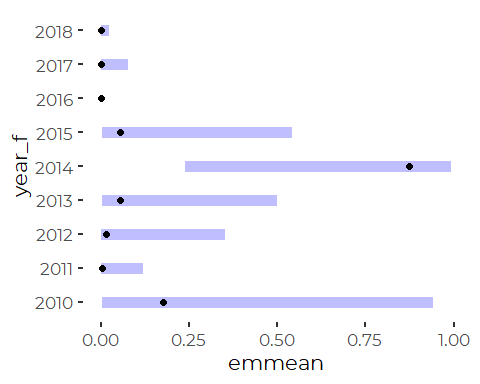

``` r
plot(b)
```

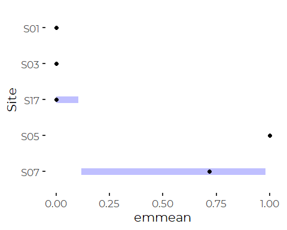

So marginal means (and presumably predictions) are still unreasonable.

### Fit a GAM

The target GAMM model, with autocorrelation structure and multiple took
forever to run (overnight was not enough). So, we start by fitting a
version without autocorrelation in hopes of identifying appropriate
model scope and structure. We need to include at least one smoothing
term to use GAM models.

#### Initial Model

Interestingly, models fit with GAM appear to generate much more
reasonable predictions and marginal means.

First, we select a limited data set to enable model comparisons.

``` r
tmp <- exceeds %>%
  filter(! is.na(FlowIndex) & ! is.na(lD_Median))
```

``` r
system.time(ccc_gam<- gam(ChlCCC ~ Site + year_f + month_f +
                            s(FlowIndex, k = 4),
                    family = 'binomial',
                    niterPQL = 20,
                    data = tmp))
#>    user  system elapsed 
#>    0.35    0.00    0.34
```

``` r
anova(ccc_gam)
#> 
#> Family: binomial 
#> Link function: logit 
#> 
#> Formula:
#> ChlCCC ~ Site + year_f + month_f + s(FlowIndex, k = 4)
#> 
#> Parametric Terms:
#>         df Chi.sq p-value
#> Site     4  886.2  <2e-16
#> year_f   8  433.5  <2e-16
#> month_f  8  286.9  <2e-16
#> 
#> Approximate significance of smooth terms:
#>                edf Ref.df Chi.sq p-value
#> s(FlowIndex) 2.891  2.992  364.9  <2e-16
```

Note that the Year term has an estimated chi square value of zero. That
is because we have serious estimation problems.

``` r
summary(ccc_gam)
#> 
#> Family: binomial 
#> Link function: logit 
#> 
#> Formula:
#> ChlCCC ~ Site + year_f + month_f + s(FlowIndex, k = 4)
#> 
#> Parametric coefficients:
#>             Estimate Std. Error z value Pr(>|z|)    
#> (Intercept) -1.88876    0.34408  -5.489 4.03e-08 ***
#> SiteS05      1.24337    0.10189  12.203  < 2e-16 ***
#> SiteS17     -0.25822    0.11707  -2.206 0.027412 *  
#> SiteS03     -1.10971    0.09882 -11.230  < 2e-16 ***
#> SiteS01     -3.11629    0.14821 -21.026  < 2e-16 ***
#> year_f2011  -1.38747    0.20628  -6.726 1.74e-11 ***
#> year_f2012  -2.54441    0.28619  -8.891  < 2e-16 ***
#> year_f2013  -1.08763    0.28876  -3.767 0.000166 ***
#> year_f2014  -0.87337    0.21054  -4.148 3.35e-05 ***
#> year_f2015  -1.44492    0.22482  -6.427 1.30e-10 ***
#> year_f2016  -3.19319    0.20952 -15.240  < 2e-16 ***
#> year_f2017  -1.18198    0.19308  -6.122 9.26e-10 ***
#> year_f2018  -1.78832    0.19483  -9.179  < 2e-16 ***
#> month_fApr   1.84350    0.30646   6.016 1.79e-09 ***
#> month_fMay   2.66096    0.32001   8.315  < 2e-16 ***
#> month_fJun   3.09230    0.31832   9.714  < 2e-16 ***
#> month_fJul   3.69559    0.33205  11.129  < 2e-16 ***
#> month_fAug   4.30493    0.32731  13.153  < 2e-16 ***
#> month_fSep   3.97020    0.32836  12.091  < 2e-16 ***
#> month_fOct   3.38718    0.31094  10.893  < 2e-16 ***
#> month_fNov   2.72203    0.31058   8.764  < 2e-16 ***
#> ---
#> Signif. codes:  0 '***' 0.001 '**' 0.01 '*' 0.05 '.' 0.1 ' ' 1
#> 
#> Approximate significance of smooth terms:
#>                edf Ref.df Chi.sq p-value    
#> s(FlowIndex) 2.891  2.992  364.9  <2e-16 ***
#> ---
#> Signif. codes:  0 '***' 0.001 '**' 0.01 '*' 0.05 '.' 0.1 ' ' 1
#> 
#> R-sq.(adj) =  0.375   Deviance explained = 32.2%
#> UBRE = -0.12663  Scale est. = 1         n = 5777
```

``` r
(a <- emmeans(ccc_gam, ~ year_f, cov.reduce = median,
        type = 'response'))
#>  year_f   prob      SE   df lower.CL upper.CL
#>  2010   0.5360 0.04518 5753   0.4472   0.6225
#>  2011   0.2239 0.02104 5753   0.1853   0.2678
#>  2012   0.0832 0.01711 5753   0.0552   0.1234
#>  2013   0.2802 0.04596 5753   0.1994   0.3783
#>  2014   0.3254 0.02653 5753   0.2757   0.3794
#>  2015   0.2140 0.02220 5753   0.1737   0.2608
#>  2016   0.0453 0.00482 5753   0.0367   0.0557
#>  2017   0.2616 0.01909 5753   0.2259   0.3007
#>  2018   0.1619 0.01326 5753   0.1376   0.1896
#> 
#> Results are averaged over the levels of: Site, month_f 
#> Confidence level used: 0.95 
#> Intervals are back-transformed from the logit scale
(b <- emmeans(ccc_gam, ~ Site, cov.reduce = median,
        type = 'response'))
#>  Site   prob      SE   df lower.CL upper.CL
#>  S07  0.3301 0.01869 5753   0.2945   0.3677
#>  S05  0.6308 0.02184 5753   0.5870   0.6725
#>  S17  0.2757 0.02303 5753   0.2329   0.3230
#>  S03  0.1397 0.01070 5753   0.1200   0.1620
#>  S01  0.0214 0.00304 5753   0.0162   0.0282
#> 
#> Results are averaged over the levels of: year_f, month_f 
#> Confidence level used: 0.95 
#> Intervals are back-transformed from the logit scale
```

``` r
plot(a)
```

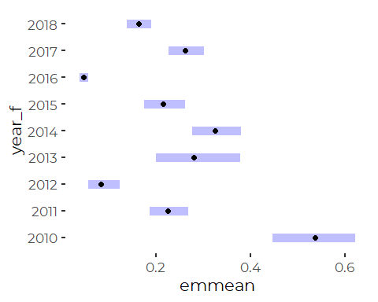

``` r
plot(b)
```

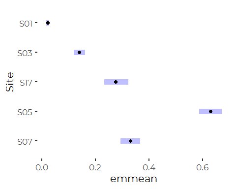
So, GAMS appear to generate meaningful marginal means. We

``` r
plot(ccc_gam)
```

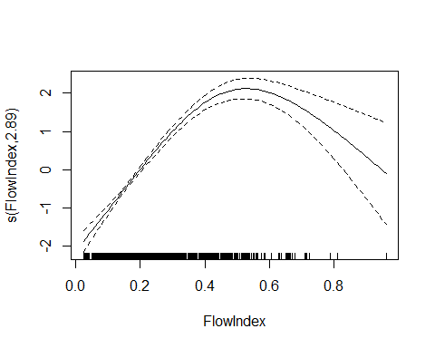

So, probability of passing the chloride standard is higher at higher
flows, as one might expect based on first principals. Lets see if that
holds true if we split the fit by site.

#### Alternate Structures, with Flow Corrections by Site

``` r
system.time(ccc_gam_1<- gam(ChlCCC ~ Site + year_f + month_f +
                            s(FlowIndex, by = Site, k = 4),
                    family = 'binomial',
                    niterPQL = 20,
                    data = tmp))
#>    user  system elapsed 
#>    2.36    0.00    2.36
```

Or if we fit local stream depth instead of watershed flow.

``` r
ccc_gam_2<- gam(ChlCCC ~ Site + year_f + month_f + s(lD_Median, by = Site, k = 4),
                    family = 'binomial',
                    niterPQL = 50, verbosePQL = TRUE,
                    data = tmp)
```

``` r
anova(ccc_gam_2, ccc_gam_1, ccc_gam)
#> Analysis of Deviance Table
#> 
#> Model 1: ChlCCC ~ Site + year_f + month_f + s(lD_Median, by = Site, k = 4)
#> Model 2: ChlCCC ~ Site + year_f + month_f + s(FlowIndex, by = Site, k = 4)
#> Model 3: ChlCCC ~ Site + year_f + month_f + s(FlowIndex, k = 4)
#>   Resid. Df Resid. Dev        Df Deviance
#> 1    5742.1     4508.1                   
#> 2    5742.2     4603.0  -0.06025   -94.87
#> 3    5753.0     4997.7 -10.85676  -394.68
AIC(ccc_gam_2, ccc_gam_1, ccc_gam)
#>                 df      AIC
#> ccc_gam_2 33.77446 4575.670
#> ccc_gam_1 33.90113 4670.796
#> ccc_gam   23.89130 5045.460
```

So we can do a better job fitting the effect of flow differently by
site, and better yet if we use local depth data.

``` r
plot(ccc_gam_1)
```

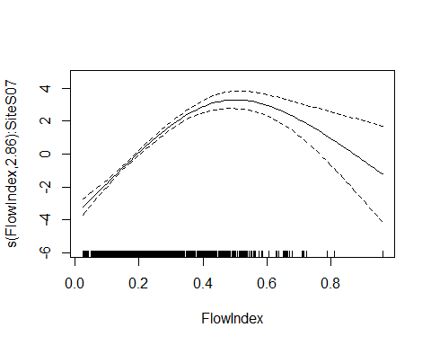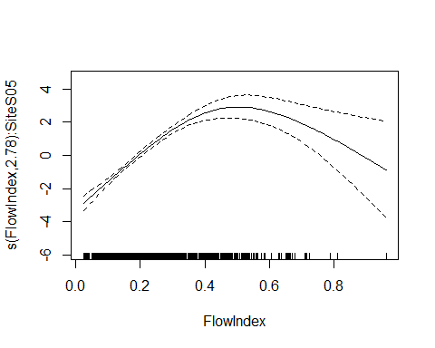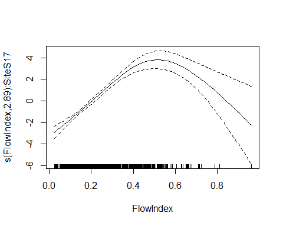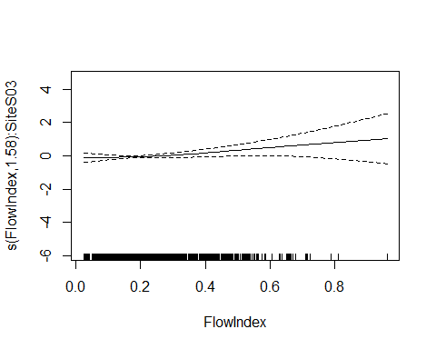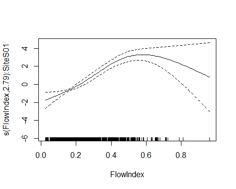

This effect is meaningfully different at Site S03, but is otherwise
fairly consistent across sites.

The effect of water depth matters everywhere, but it totally dominates
at site S03. Notice that the vertical axes on the following plots are
not equal.

``` r
plot(ccc_gam_2, scale = 0)
```


So each site responds idiosyncratically to water depth. Generally,
conditions are worst at low local water depth, but they level out – and
errors get much wider – at higher water depths. The main exception is at
site S03 (The North Branch) where conditions are exceptionally bad for
some high flow conditions perhaps snow melt events?

#### Fit Just Summer Months

When we fit similar models that left out the snow and ice months, the
general results were similar. Site S03 does weird things under high
water depth conditions, and does not respond to watershed flow
conditions the way the other sites do.

(Not shown)

#### Extract Marginal Means – Not Meaningful

We could compare marginal means, but marginal means at all Sites are
estimated at the same depth (median of all depths) at each site, which
is not especially meaningful. Normal flow depth at each site are
naturally different. We use predictions instead.

#### Predictions

We compare predictions (probabilities) for a July day in 2013 at median
annual stream flow.

``` r
medians <- tmp %>%
  select(Site, lD_Median) %>%
  group_by(Site) %>%
  summarize(medians = median(lD_Median, na.rm = TRUE),
            .groups = 'drop') %>%
  pull(medians)

df <- tibble(Site = levels(tmp$Site),
             lD_Median = medians,
             month_f =  'Jul',
             FlowIndex = median(tmp$FlowIndex, na.rm = TRUE),
             Year = c(2013),
             year_f = c('2013'),
             sdate_f = c('2013-07-15')
             )
```

``` r
inv_logit <- function(x) {
   exp(x)/(1+exp(x))
}
```

``` r
p <- predict(ccc_gam, newdata = df, se.fit= TRUE)
pred_site_model_0 <- tibble(Site = df$Site,
       prob = inv_logit(p$fit), 
       lower_cl = inv_logit(p$fit - 2 * p$se.fit),
       upper_cl = inv_logit(p$fit + 2 * p$se.fit))


p2 <- predict(ccc_gam_2, newdata = df, se.fit= TRUE)
pred_site_model_2 <- tibble(Site = df$Site,
       prob = inv_logit(p2$fit), 
       lower_cl = inv_logit(p2$fit - 2 * p2$se.fit),
       upper_cl = inv_logit(p2$fit + 2 * p2$se.fit))
```

``` r
plt <- ggplot(data = NULL) +
  geom_text(mapping = aes(x = pred_site_model_0$prob + 0.05,
                           y = pred_site_model_2$prob + 0.05,
                          label = pred_site_model_0$Site),
             color = 'red', size = 3) +
  geom_segment(mapping = aes(x = pred_site_model_0$lower_cl,
                             y = pred_site_model_2$prob,
                             yend = pred_site_model_2$prob,
                             xend = pred_site_model_0$upper_cl)) +
  geom_pointrange(mapping = aes(x = pred_site_model_0$prob, y = pred_site_model_2$prob,
                      ymin = pred_site_model_2$lower_cl,
                      ymax = pred_site_model_2$upper_cl)) +
  geom_abline(intercept = 0, slope = 1) +
  xlab ('Watershed Flow Model') +
  ylab('Local Depth Model')
plt
```

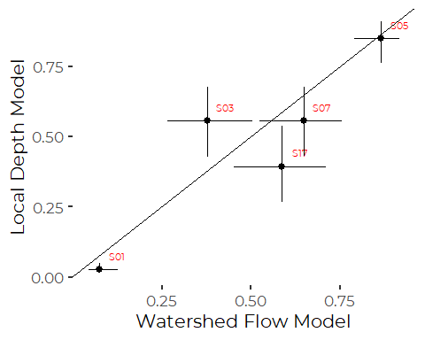

So the two models make rather different predictions. Including flow data
in the models makes for better models, but it points out differences in
Site response to flow.

## Fitting a GAMM model

Fitting full GAMM models prove to be problematic, as models take a long
time to fit. The big slow down is the correlation structure. It may
speed things slightly to subdivide the sections in which we expect the
`corAR1()` to apply.

We need to include either a smoothed term or a random factor in the
model to use GAMM, even with a correlation term. That is problematic, as
none of our predictors are good candidates for random factors. Sites
could be considered a random selection from all possible sites, or Year
could be considered a random selection from all possible years, but we
are interested in estimates of year by year and site by site
differences.

### Model Sequence

We start with a fairly large model, and wait for it to complete. This
took slightly more than an hour and a half (5500 seconds) of
computational time to complete, as shown by `system.time()`, but the
code took well over two hours to run.

``` r
if (! file.exists("models/ccc_gamm_1.rds")) {
  print(system.time(
    ccc_gamm_1<- gamm(ChlCCC ~ Site + year_f + month_f + s(FlowIndex),
                      correlation = corAR1(form = ~ as.numeric(sdate_f) | Site),
                      family = 'binomial',
                      niterPQL = 20,
                      data = exceeds)
  ))
  saveRDS(ccc_gamm_1, file="models/ccc_gamm_1.rds")
} else {
  ccc_gamm_1 <- readRDS("models/ccc_gamm_1.rds")
}
#> 
#>  Maximum number of PQL iterations:  20
#> iteration 1
#> iteration 2
#> iteration 3
#> iteration 4
#> iteration 5
#> iteration 6
#> iteration 7
#>    user  system elapsed 
#> 4858.04   11.68 4872.27
```

A model that omits the Month term also takes some time to fit. Marginal
means from this model are potentially informative, if fit at median
watershed flow. We are almost certainly misrepresenting the behavior of
Site S03 in this model, so we should consider omitting `Site == S03`
from similar models using a smoothed term based on watershed flow, but
we do not do so here.

``` r
if (! file.exists("models/ccc_gamm_2.rds")) {
  print(system.time(
    ccc_gamm_2<- gamm(ChlCCC ~ Site + year_f + s(FlowIndex),
                      correlation = corAR1(form = ~ as.numeric(sdate_f) | Site),
                      family = 'binomial',
                      niterPQL = 20,
                      data = exceeds)
  ))
  saveRDS(ccc_gamm_2, file="models/ccc_gamm_2.rds")
} else {
  ccc_gamm_2 <- readRDS("models/ccc_gamm_2.rds")
}
#> 
#>  Maximum number of PQL iterations:  20
#> iteration 1
#> iteration 2
#> iteration 3
#> iteration 4
#> iteration 5
#> iteration 6
#>    user  system elapsed 
#> 3903.11    9.58 3914.31
```

In order to fit a model without the flow terms, we need to select one of
our other predictors to treat as a random factor. We see substantial
differences in probability of failing these standards by Site, so we try
some models that treat `year_f` as a random factor. You could fit a
random factor two ways, using the `random = ....` function parameter, or
by including a random effects smooth term via `s(..., type = 're')`

``` r
if (! file.exists("models/ccc_gamm_3.rds")) {
  print(system.time(
    ccc_gamm_3<- gamm(ChlCCC ~ Year + Site, random = list(year_f = ~ 1),
                      correlation = corAR1(form = ~ as.numeric(sdate_f) | Site),
                      family = 'binomial',
                      niterPQL = 20, verbosePQL = TRUE,
                      data = exceeds)
  ))
  saveRDS(ccc_gamm_3, file="models/ccc_gamm_3.rds")
} else {
  ccc_gamm_3 <- readRDS("models/ccc_gamm_3.rds")
}
#> 
#>  Maximum number of PQL iterations:  20
#> iteration 1
#> iteration 2
#> iteration 3
#> iteration 4
#> iteration 5
#>    user  system elapsed 
#>  108.64    1.24  109.89
```

``` r
if (! file.exists("models/ccc_gamm_4.rds")) {
  print(system.time(
    ccc_gamm_4<- gamm(ChlCCC ~ Site, random = list(year_f = ~ 1),
                      correlation = corAR1(form = ~ as.numeric(sdate_f) | Site),
                      family = 'binomial',
                      niterPQL = 20,
                      data = exceeds)
  ))
  saveRDS(ccc_gamm_4, file="models/ccc_gamm_4.rds")
} else {
  ccc_gamm_4 <- readRDS("models/ccc_gamm_4.rds")
}
#> 
#>  Maximum number of PQL iterations:  20
#> iteration 1
#> iteration 2
#> iteration 3
#> iteration 4
#> iteration 5
#>    user  system elapsed 
#>  113.20    1.34  114.57
```

``` r
if (! file.exists("models/ccc_gamm_5.rds")) {
  print(system.time(
    ccc_gamm_5<- gamm(ChlCCC ~ Site + month_f, random = list(year_f = ~ 1),
                      correlation = corAR1(form = ~ as.numeric(sdate_f) | Site),
                      family = 'binomial',
                      niterPQL = 20,
                      data = exceeds)
  ))
  saveRDS(ccc_gamm_5, file="models/ccc_gamm_5.rds")
} else {
  ccc_gamm_5 <- readRDS("models/ccc_gamm_5.rds")
}
#> 
#>  Maximum number of PQL iterations:  20
#> iteration 1
#> iteration 2
#> iteration 3
#> iteration 4
#> iteration 5
#>    user  system elapsed 
#>  111.69    1.11  112.84
```

#### Examine Two Models

``` r
summary(ccc_gamm_1$gam)
#> 
#> Family: binomial 
#> Link function: logit 
#> 
#> Formula:
#> ChlCCC ~ Site + year_f + month_f + s(FlowIndex)
#> 
#> Parametric coefficients:
#>             Estimate Std. Error t value Pr(>|t|)    
#> (Intercept)  0.04083    0.53793   0.076 0.939497    
#> SiteS05      1.27590    0.25685   4.967 6.97e-07 ***
#> SiteS17     -0.31232    0.39785  -0.785 0.432472    
#> SiteS03     -1.29374    0.25089  -5.157 2.59e-07 ***
#> SiteS01     -2.20461    0.24714  -8.921  < 2e-16 ***
#> year_f2011  -1.40966    0.45357  -3.108 0.001893 ** 
#> year_f2012  -1.09927    0.51175  -2.148 0.031748 *  
#> year_f2013  -0.63869    0.56586  -1.129 0.259070    
#> year_f2014  -0.57285    0.43913  -1.304 0.192113    
#> year_f2015  -0.84586    0.49539  -1.707 0.087789 .  
#> year_f2016  -2.87552    0.43701  -6.580 5.10e-11 ***
#> year_f2017  -1.35453    0.43049  -3.146 0.001660 ** 
#> year_f2018  -1.53858    0.42966  -3.581 0.000345 ***
#> month_fApr   0.30509    0.32980   0.925 0.354968    
#> month_fMay   0.64513    0.35828   1.801 0.071812 .  
#> month_fJun   1.19600    0.36085   3.314 0.000924 ***
#> month_fJul   1.52115    0.37028   4.108 4.04e-05 ***
#> month_fAug   1.72782    0.37057   4.663 3.19e-06 ***
#> month_fSep   1.70716    0.36830   4.635 3.64e-06 ***
#> month_fOct   1.83442    0.35645   5.146 2.74e-07 ***
#> month_fNov   1.18372    0.34878   3.394 0.000693 ***
#> ---
#> Signif. codes:  0 '***' 0.001 '**' 0.01 '*' 0.05 '.' 0.1 ' ' 1
#> 
#> Approximate significance of smooth terms:
#>                edf Ref.df     F p-value    
#> s(FlowIndex) 6.781  6.781 38.45  <2e-16 ***
#> ---
#> Signif. codes:  0 '***' 0.001 '**' 0.01 '*' 0.05 '.' 0.1 ' ' 1
#> 
#> R-sq.(adj) =  0.342   
#>   Scale est. = 1         n = 6160
```

Note that the model fits a fairly complex smoothed term – with over six
effective degrees of freedom. One could argue that’s too complex for
this purpose, but as we’ll see, the term makes little difference to the
functional predictions from the model.

``` r
summary(ccc_gamm_4$gam)
#> 
#> Family: binomial 
#> Link function: logit 
#> 
#> Formula:
#> ChlCCC ~ Site
#> 
#> Parametric coefficients:
#>              Estimate Std. Error t value Pr(>|t|)    
#> (Intercept) -0.000559   0.292839  -0.002    0.998    
#> SiteS05      1.185704   0.225198   5.265 1.44e-07 ***
#> SiteS17     -0.433674   0.397180  -1.092    0.275    
#> SiteS03     -1.266250   0.215415  -5.878 4.31e-09 ***
#> SiteS01     -2.482878   0.207460 -11.968  < 2e-16 ***
#> ---
#> Signif. codes:  0 '***' 0.001 '**' 0.01 '*' 0.05 '.' 0.1 ' ' 1
#> 
#> 
#> R-sq.(adj) =  0.211   
#>   Scale est. = 1         n = 8201
anova(ccc_gamm_4$gam)
#> 
#> Family: binomial 
#> Link function: logit 
#> 
#> Formula:
#> ChlCCC ~ Site
#> 
#> Parametric Terms:
#>      df     F p-value
#> Site  4 96.47  <2e-16
```

So, when you consider the years as random variables, there is no
long-term trend in probability to fail chlorides standards.

``` r
plot(ccc_gamm_1$gam)
```

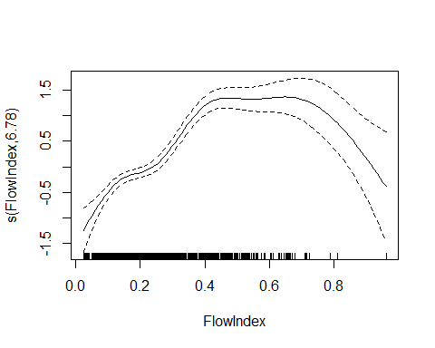

### Extract Marginal Means

#### Add Calls to GAM objects

``` r
the_call <-  quote(gamm(ChlCCC ~ Site + year_f + month_f + s(FlowIndex),
                       correlation = corAR1(form = ~ as.numeric(sdate_f) | Site),
                       family = 'binomial',
                       niterPQL = 20,
                       data = exceeds))
ccc_gamm_1$gam$call <- the_call


the_call <-  quote(gamm(ChlCCC ~ Site + year_f + s(FlowIndex),
                       correlation = corAR1(form = ~ as.numeric(sdate_f) | Site),
                       family = 'binomial',
                       niterPQL = 20,
                       data = exceeds))
ccc_gamm_2$gam$call <- the_call


the_call <-  quote(gamm(ChlCCC ~ Year + Site, random = list(year_f = ~ 1),
                       correlation = corAR1(form = ~ as.numeric(sdate_f) | Site),
                       family = 'binomial',
                       niterPQL = 20, verbosePQL = TRUE,
                       data = exceeds))
ccc_gamm_3$gam$call <- the_call


the_call <-  quote(gamm(ChlCCC ~ Site, random = list(year_f = ~ 1),
                       correlation = corAR1(form = ~ as.numeric(sdate_f) | Site),
                       family = 'binomial',
                       niterPQL = 20, verbosePQL = TRUE,
                       data = exceeds))
ccc_gamm_4$gam$call <- the_call

the_call <-  quote(gamm(ChlCCC ~ Site + month_f, random = list(year_f = ~ 1),
                       correlation = corAR1(form = ~ as.numeric(sdate_f) | Site),
                       family = 'binomial',
                       niterPQL = 20,
                       data = exceeds))
ccc_gamm_5$gam$call <- the_call
```

#### By Site

``` r
my_ref_grid <- ref_grid(ccc_gamm_1,  cov.reduce = median) 
a <- summary(emmeans(my_ref_grid, ~ Site, 
                      type = 'response'))

my_ref_grid <- ref_grid(ccc_gamm_2,  cov.reduce = median) 
b <-  summary(emmeans(my_ref_grid, ~ Site, 
                       type = 'response'))

my_ref_grid <- ref_grid(ccc_gamm_3,  cov.reduce = median) 
c <-  summary(emmeans(my_ref_grid, ~ Site, 
                       type = 'response'))

my_ref_grid <- ref_grid(ccc_gamm_4,  cov.reduce = median) 
d <-  summary(emmeans(my_ref_grid, ~ Site, 
                       type = 'response'))
```

``` r
observed <- exceeds %>%
  select(Site, ChlCCC) %>%
  group_by(Site) %>%
  summarize(Site = first(Site),
              n = sum(! is.na(ChlCCC)), 
              prob = mean(ChlCCC, na.rm = TRUE),
              SE = sqrt((prob * (1-prob))/n),
              lower.CL = prob - 1.96 * SE,
              upper.CL = prob + 1.96 * SE,
              .groups = 'drop')
observed
#> # A tibble: 5 x 6
#>   Site      n   prob      SE lower.CL upper.CL
#> * <fct> <int>  <dbl>   <dbl>    <dbl>    <dbl>
#> 1 S07    1880 0.503  0.0115    0.480    0.525 
#> 2 S05    1410 0.721  0.0119    0.697    0.744 
#> 3 S17     858 0.303  0.0157    0.272    0.334 
#> 4 S03    2045 0.245  0.00951   0.226    0.264 
#> 5 S01    2008 0.0822 0.00613   0.0702   0.0942
```

``` r
z <- tibble(Site = factor(levels(exceeds$Site), levels = levels(exceeds$Site)),
            observed = observed$prob, 
            mod_1 = a$prob, mod_2 = b$prob,
            mod_3 = c$prob, mod_4 = d$prob)

z %>%
  pivot_longer(-Site, names_to = 'Model', 
               values_to = 'Probability') %>%
  ggplot(aes(Site, Probability, color = Model)) +
  geom_point() +
  geom_line(aes(group = Model)) +
  ylab("Probability of Passing\nChronic Chloride Standard")
```

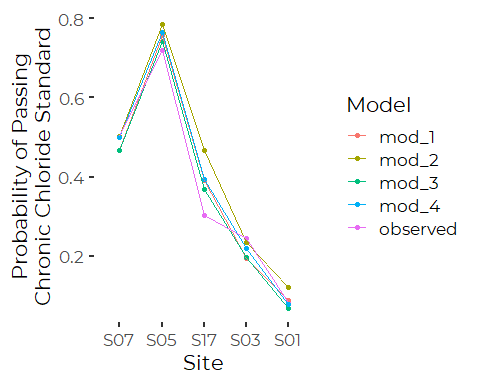

``` r
z %>%
  pivot_longer(-c(Site, observed), names_to = 'Model', 
               values_to = 'Probability') %>%

  ggplot(aes(observed, Probability, color = Model)) +
  geom_point() +
  geom_line(aes(group = Model)) +
  annotate(geom = 'text', x = observed$prob,
           y = a$prob + .15, label = z$Site) +
  
  geom_abline(slope = 1, intercept = 0, lty = 3) +
  xlab("Observed Value") +
  ylab('Model Predictions (Adjusted)') +
  xlim(0,1) +
  ylim(0,1)
```

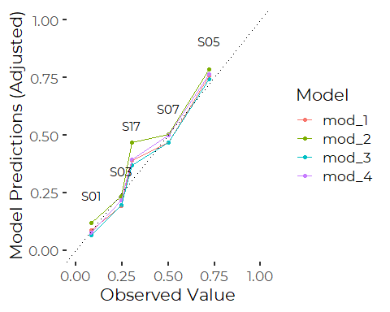
So all the models do pretty good job predicting the observed values,
except at site S17, where predictions are consistently higher than what
we observed, presumably because the record for S17 is short, including
only data from more recent years.

``` r
rm(z)
```

So, models 1 and 3 generally provide nearly identical predictions, but
for all practical purposes, the four models are all saying the same
thing. And Model 3 includes a not significant linear term by year.

We prefer models 1, for access to data on year by year and month by
month patterns, and model 4, for its simplicity.

##### Graphics

###### Model 1

``` r
s <- a %>% 
  mutate(fprob = 1-prob,
         fUCL = 1 - lower.CL,
         fLCL = 1 - upper.CL)

plt1 <- ggplot(s, aes(Site, fprob)) +
 
  geom_pointrange(aes(ymin = fLCL, ymax = fUCL),
                color = cbep_colors()[1], size = .75) +
  
  ylab('Probability of Exceeding\nChronic Chloride Standard') +
  xlab('Upstream      Maine Stem                Downstream      ') +

  theme_cbep(base_size = 12) +
  theme(axis.title.x = element_text(size = 9)) +
  ylim(0,1)
```

``` r
plt1 + 
  stat_summary(geom = 'point',
               mapping = aes(x = Site, y = as.numeric(ChlCCC)),
               data = exceeds, fun = function(x) 1 - mean(x, na.rm = TRUE),
               size = 2, shape = 23, fill = cbep_colors()[4]) +
    annotate(geom = 'point', x = 3.5, y = .3,
           size = 2, shape = 23, fill = cbep_colors()[4]) +
    annotate(geom = 'text', x = 3.75, y = .3, label = 'Observed', hjust = 0,
             size =3.5) +

    annotate(geom = 'point', x = 3.5, y = .25,
           size = 2, color = cbep_colors()[1]) +
    annotate(geom = 'text', x = 3.75, y = .25, label = 'Adjusted', hjust = 0,
             size = 3.5)
#> Warning: Removed 1067 rows containing non-finite values (stat_summary).
```

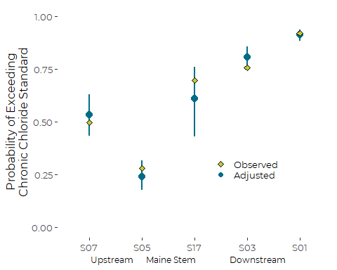

###### We Don’t Show Models 2 and 3

###### Model 4

``` r
s <- d %>% 
  mutate(fprob = 1-prob,
         fUCL = 1 - lower.CL,
         fLCL = 1 - upper.CL)

plt2 <- ggplot(s, aes(Site, fprob)) +
 
  geom_pointrange(aes(ymin = fLCL, ymax = fUCL),
                color = cbep_colors()[1], size = .75) +
  
  ylab('Probability of Exceeding\nChronic Chloride Standard') +
  xlab('Upstream   Maine Stem       Downstream') +

  theme_cbep(base_size = 12) +
  theme(axis.title.x = element_text(size = 10)) +
  ylim(0,1)
```

``` r
plt2 + 
  stat_summary(geom = 'point',
               mapping = aes(x = Site, y = as.numeric(ChlCCC)),
               data = exceeds, fun = function(x) 1 - mean(x, na.rm = TRUE),
               size = 2, shape = 23, fill = cbep_colors()[4]) +
    annotate(geom = 'point', x = 3.5, y = .3,
           size = 2, shape = 23, fill = cbep_colors()[4]) +
    annotate(geom = 'text', x = 3.75, y = .3, label = 'Observed', hjust = 0,
             size = 3.5) +

    annotate(geom = 'point', x = 3.5, y = .25,
           size = 2, color = cbep_colors()[1]) +
    annotate(geom = 'text', x = 3.75, y = .25, label = 'Adjusted', hjust = 0,
             size = 3.5)
#> Warning: Removed 1067 rows containing non-finite values (stat_summary).
```

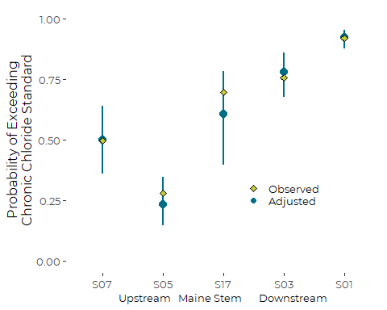

#### By Year

Only Model 1 and Model 2 tracked Year as a Fixed Factor, so we only have
two models to compare here.

``` r
my_ref_grid <- ref_grid(ccc_gamm_1,  cov.reduce = median) 
a <- summary(emmeans(my_ref_grid, ~ year_f, type = 'response'))

my_ref_grid <- ref_grid(ccc_gamm_2,  cov.reduce = median) 
b <- summary(emmeans(my_ref_grid, ~ year_f, type = 'response'))
```

``` r
observed <- exceeds %>%
  select(year_f, ChlCCC) %>%
  group_by(year_f) %>%
  summarize(year_f = first(year_f),
              n = sum(! is.na(ChlCCC)), 
              prob = mean(ChlCCC, na.rm = TRUE),
              SE = sqrt((prob * (1-prob))/n),
              lower.CL = prob - 1.96 * SE,
              upper.CL = prob + 1.96 * SE,
              .groups = 'drop')
observed
#> # A tibble: 9 x 6
#>   year_f     n  prob     SE lower.CL upper.CL
#> * <fct>  <int> <dbl>  <dbl>    <dbl>    <dbl>
#> 1 2010     581 0.425 0.0205    0.385    0.465
#> 2 2011     730 0.270 0.0164    0.238    0.302
#> 3 2012     602 0.262 0.0179    0.227    0.298
#> 4 2013     853 0.380 0.0166    0.347    0.412
#> 5 2014     939 0.578 0.0161    0.547    0.610
#> 6 2015    1048 0.463 0.0154    0.433    0.493
#> 7 2016    1148 0.139 0.0102    0.119    0.159
#> 8 2017    1113 0.358 0.0144    0.330    0.387
#> 9 2018    1187 0.315 0.0135    0.289    0.342
```

``` r
z <- tibble(Year = factor(levels(exceeds$year_f), 
                          levels = levels(exceeds$year_f)),
            observed = observed$prob, 
            mod_1 = a$prob, mod_2 = b$prob )
```

``` r
z %>%
  pivot_longer(-Year, names_to = 'Model', 
               values_to = 'Probability') %>%
  ggplot(aes(Year, Probability, color = Model)) +
  geom_point() +
  geom_line(aes(group = Model)) +
  ylab("Probability of Passing\nChronic Chloride Standard")
```

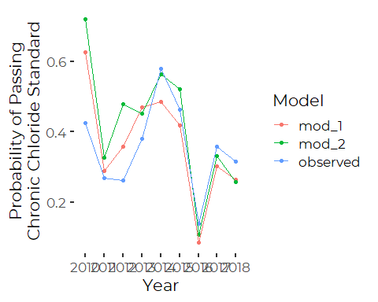

``` r
z %>%
  pivot_longer(-c(Year, observed), names_to = 'Model', 
               values_to = 'Probability') %>%

  ggplot(aes(observed, Probability, color = Model)) +
  geom_point() +
  geom_line(aes(group = Model)) +
  annotate(geom = 'text', x = observed$prob,
           y = a$prob + .15, label = z$Year) +
  
  geom_abline(slope = 1, intercept = 0, lty = 3) +
  xlab("Observed Value") +
  ylab('Model Predictions (Adjusted)') +
  xlim(0,1) +
  ylim(0,1)
```

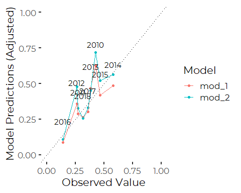
Here our marginal means show up not so well. The model predictions are
highly correlated, but neither model does very well reproducing observed
frequencies, at least for 2010 and 2012. 2010 is a year with no data
from the early part of the year, so marginal means from model are
biased. It’s not clear why estimates from 2012 are also on the high
side, or why both sets of marginal means are biased similarly.

``` r
rm(z)
```

We prefer models 1, for access to data on year by year and month by
month patterns, and model 4, for its simplicity.

##### Graphics

###### Model 1

``` r
s <- a %>% 
  mutate(fprob = 1-prob,
         fUCL = 1 - lower.CL,
         fLCL = 1 - upper.CL)

plt1 <- ggplot(s, aes(year_f, fprob)) +
 
  geom_pointrange(aes(ymin = fLCL, ymax = fUCL),
                color = cbep_colors()[1], size = .75) +
  
  ylab('Probability of Exceeding\nChronic Chloride Standard') +
  xlab('Upstream      Maine Stem                Downstream      ') +

  theme_cbep(base_size = 12) +
  theme(axis.title.x = element_text(size = 9)) +
  ylim(0,1)
```

``` r
xanchor = 7
space = 0.3

plt1 + 
  stat_summary(geom = 'point',
               mapping = aes(x = year_f, y = as.numeric(ChlCCC)),
               data = exceeds, fun = function(x) 1 - mean(x, na.rm = TRUE),
               size = 2, shape = 23, fill = cbep_colors()[4]) +
    annotate(geom = 'point', x = xanchor, y = .3,
           size = 2, shape = 23, fill = cbep_colors()[4]) +
    annotate(geom = 'text', x = xanchor + space, y = .3, label = 'Observed', hjust = 0,
             size = 3.5) +

    annotate(geom = 'point', x = xanchor, y = .25,
           size = 2, color = cbep_colors()[1]) +
    annotate(geom = 'text', x = xanchor + space, y = .25, label = 'Adjusted', hjust = 0,
             size = 3.5)
#> Warning: Removed 1067 rows containing non-finite values (stat_summary).
```

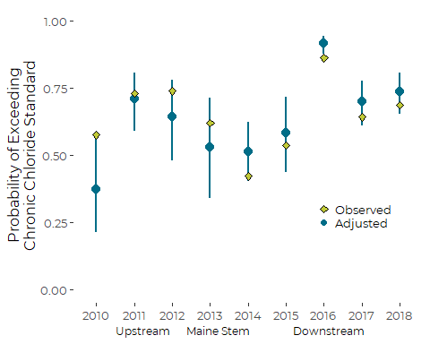

###### Model 2

``` r
s <- b %>% 
  mutate(fprob = 1-prob,
         fUCL = 1 - lower.CL,
         fLCL = 1 - upper.CL)
  
plt2 <- ggplot(s, aes(year_f, fprob)) +
 
  geom_pointrange(aes(ymin = fLCL, ymax = fUCL),
                color = cbep_colors()[1], size = .75) +
  
  ylab('Probability of Exceeding\nChronic Chloride Standard') +
  xlab('Upstream      Maine Stem                Downstream      ') +

  theme_cbep(base_size = 12) +
  theme(axis.title.x = element_text(size = 9)) +
  ylim(0,1)
```

``` r
plt2 + 
  stat_summary(geom = 'point',
               mapping = aes(x = year_f, y = as.numeric(ChlCCC)),
               data = exceeds, fun = function(x) 1 - mean(x, na.rm = TRUE),
               size = 2, shape = 23, fill = cbep_colors()[4]) +
    annotate(geom = 'point', x = xanchor, y = .3,
           size = 2, shape = 23, fill = cbep_colors()[4]) +
    annotate(geom = 'text', x = 3.75, y = .3, label = 'Observed', hjust = 0,
             size =3.5) +

    annotate(geom = 'point', x = xanchor, y = .25,
           size = 2, color = cbep_colors()[1]) +
    annotate(geom = 'text', x = 3.75, y = .25, label = 'Adjusted', hjust = 0,
             size = 3.5)
#> Warning: Removed 1067 rows containing non-finite values (stat_summary).
```

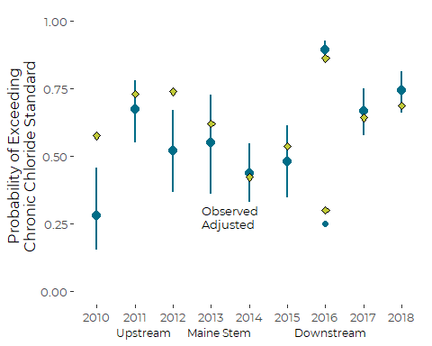

#### By Month

``` r
my_ref_grid <- ref_grid(ccc_gamm_1,  cov.reduce = median) 
(a <- summary(emmeans(my_ref_grid, ~ month_f, type = 'response')))
#>  month_f  prob     SE   df lower.CL upper.CL
#>  Mar     0.147 0.0426 6132   0.0813    0.251
#>  Apr     0.189 0.0372 6132   0.1269    0.273
#>  May     0.247 0.0384 6132   0.1797    0.330
#>  Jun     0.363 0.0447 6132   0.2806    0.454
#>  Jul     0.441 0.0502 6132   0.3459    0.540
#>  Aug     0.492 0.0500 6132   0.3957    0.589
#>  Sep     0.487 0.0484 6132   0.3939    0.581
#>  Oct     0.519 0.0504 6132   0.4207    0.616
#>  Nov     0.360 0.0526 6132   0.2645    0.468
#> 
#> Results are averaged over the levels of: Site, year_f 
#> Confidence level used: 0.95 
#> Intervals are back-transformed from the logit scale

my_ref_grid <- ref_grid(ccc_gamm_5,  cov.reduce = median) 
(b <- summary(emmeans(my_ref_grid, ~ month_f, type = 'response')))
#>  month_f  prob     SE   df lower.CL upper.CL
#>  Mar     0.235 0.0615 8188    0.136    0.376
#>  Apr     0.289 0.0618 8188    0.184    0.423
#>  May     0.232 0.0547 8188    0.142    0.356
#>  Jun     0.331 0.0664 8188    0.216    0.471
#>  Jul     0.326 0.0648 8188    0.213    0.463
#>  Aug     0.368 0.0683 8188    0.247    0.509
#>  Sep     0.389 0.0698 8188    0.264    0.531
#>  Oct     0.490 0.0741 8188    0.349    0.632
#>  Nov     0.474 0.0798 8188    0.325    0.628
#> 
#> Results are averaged over the levels of: Site 
#> Confidence level used: 0.95 
#> Intervals are back-transformed from the logit scale

observed <- exceeds %>%
  select(month_f, ChlCCC) %>%
  group_by(month_f) %>%
  summarize(month_f = first(month_f),
              n = sum(! is.na(ChlCCC)), 
              prob = mean(ChlCCC, na.rm = TRUE),
              SE = sqrt((prob * (1-prob))/n),
              lower.CL = prob - 1.96 * SE,
              upper.CL = prob + 1.96 * SE,
              .groups = 'drop')
observed
#> # A tibble: 9 x 6
#>   month_f     n  prob     SE lower.CL upper.CL
#> * <fct>   <int> <dbl>  <dbl>    <dbl>    <dbl>
#> 1 Mar       414 0.203 0.0198    0.164    0.242
#> 2 Apr       929 0.335 0.0155    0.304    0.365
#> 3 May       882 0.281 0.0151    0.252    0.311
#> 4 Jun      1021 0.307 0.0144    0.278    0.335
#> 5 Jul      1095 0.327 0.0142    0.299    0.355
#> 6 Aug      1060 0.356 0.0147    0.327    0.384
#> 7 Sep      1089 0.393 0.0148    0.364    0.422
#> 8 Oct       994 0.438 0.0157    0.407    0.468
#> 9 Nov       717 0.464 0.0186    0.428    0.501
```

``` r
 z <- tibble(Month = factor(month.abb[3:11], levels = month.abb),
             observed = observed$prob, 
             mod_1 = a$prob, 
             mod_5 = b$prob )
```

``` r
z %>%
  pivot_longer(-c(Month, observed), names_to = 'Model',
               values_to = 'Probability') %>%
  arrange(Model, Month) %>%

  ggplot(aes(observed, Probability, color = Model)) +

  geom_segment(aes(xend=c(tail(observed, n= -1), NA),
                   yend=c(Probability[2:9], NA, Probability[11:18], NA)),
                   arrow=arrow(length=unit(0.075,"inches"), type = 'closed')) +
  geom_text(aes(x = observed,
                y = Probability,
                label = Month)) +

  geom_abline(slope = 1, intercept = 0, lty = 3) +
  xlab("Observed Value") +
  ylab('Model Predictions (Adjusted)') +
  xlim(0,.6) +
  ylim(0,.6)
#> Warning: Removed 2 rows containing missing values (geom_segment).
```


There is a lot of scatter here. The pattern is revealing. Our “flow
adjusted” monthly values are lower in winter and higher in summer than
the observed values, while the simpler model without a flow term fits
the observed values more closely.

This reflects the influence of flow on our adjusted estimates. Low flow
in summer means “observed” levels co-occur with low flow, so conditions
would be better if flow were not so low. Thus the “adjusted” means are
slightly better than what we observed.

``` r
rm(z)
```

##### Graphics

``` r
s <- a %>% 
  mutate(fprob = 1-prob,
         fUCL = 1 - lower.CL,
         fLCL = 1 - upper.CL)

plt1 <- ggplot(s, aes(month_f, fprob)) +
 
  geom_pointrange(aes(ymin = fLCL, ymax = fUCL),
                color = cbep_colors()[1], size = .75) +
  
  ylab('Probability of Exceeding\nChronic Chloride Standard') +

  theme_cbep(base_size = 12) +
  theme(axis.title.x = element_text(size = 9)) +
  ylim(0,1)
```

``` r
xanchor = 1
space = 0.3

plt1 + 
   stat_summary(geom = 'point',
                mapping = aes(x = as.numeric(month_f)-2, y = as.numeric(ChlCCC)),
                data = exceeds, fun = function(x) 1 - mean(x, na.rm = TRUE),
                size = 2, shape = 23, fill = cbep_colors()[4]) +
    annotate(geom = 'point', x = xanchor, y = .3,
           size = 2, shape = 23, fill = cbep_colors()[4]) +
    annotate(geom = 'text', x = xanchor + space, y = .3, 
             label = 'Observed', hjust = 0,
             size = 3.5) +

    annotate(geom = 'point', x = xanchor, y = .25,
           size = 2, color = cbep_colors()[1]) +
    annotate(geom = 'text', x = xanchor + space, y = .25, 
             label = 'Adjusted', hjust = 0,
             size = 3.5)
#> Warning: Removed 1067 rows containing non-finite values (stat_summary).
```

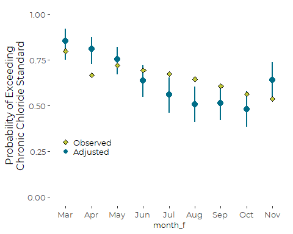
