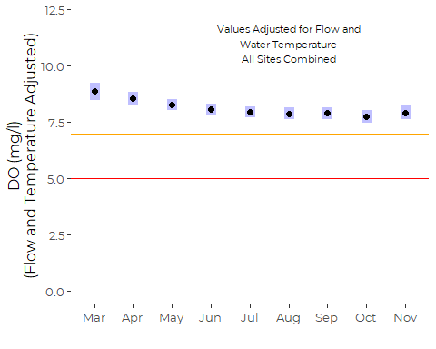
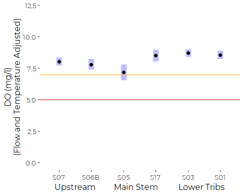
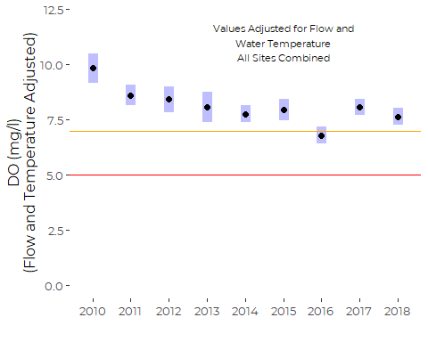
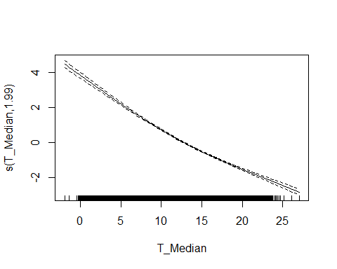
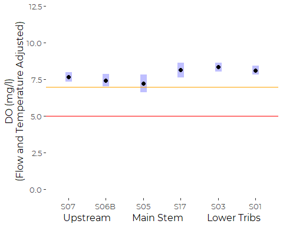
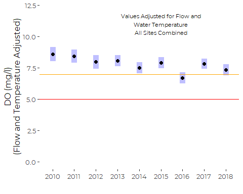
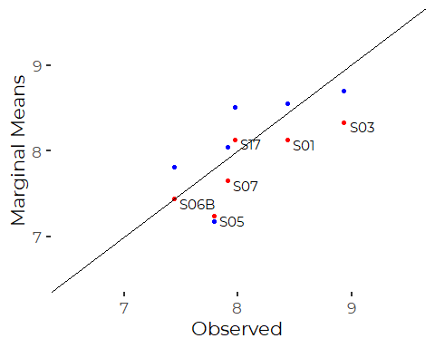

Summary of Analysis of LCWMD Dissolved Oxygen Data
================
Curtis C. Bohlen, Casco Bay Estuary Partnership.
Revised 11/02/2021

-   [Import Libraries](#import-libraries)
-   [Data Preparation](#data-preparation)
    -   [Initial Folder References](#initial-folder-references)
    -   [Load Weather Data](#load-weather-data)
    -   [Load Data on Sites and Impervious
        Cover](#load-data-on-sites-and-impervious-cover)
    -   [Load Main Data](#load-main-data)
        -   [Cleanup](#cleanup)
    -   [Data Corrections](#data-corrections)
        -   [Anomolous Depth Values](#anomolous-depth-values)
        -   [Single S06B Chloride Observation from
            2017](#single-s06b-chloride-observation-from-2017)
        -   [Anomolous Dissolved Oxygen and Chloride
            Values](#anomolous-dissolved-oxygen-and-chloride-values)
    -   [Remove Partial Data from Winter
        Months](#remove-partial-data-from-winter-months)
    -   [Add Stream Flow Index](#add-stream-flow-index)
    -   [Select Final Data Set](#select-final-data-set)
-   [GAMM Analysis](#gamm-analysis)
    -   [Initial GAMM model](#initial-gamm-model)
        -   [ANOVA](#anova)
        -   [Summary](#summary)
        -   [Estimated Daily
            Autocorrelation](#estimated-daily-autocorrelation)
        -   [Structure of the Smoother](#structure-of-the-smoother)
        -   [Diagnostic Plots](#diagnostic-plots)
        -   [Estimated Marginal Means](#estimated-marginal-means)
    -   [Simplified Model](#simplified-model)
        -   [ANOVA](#anova-1)
        -   [Summary](#summary-1)
        -   [Estimated Daily
            Autocorrelation](#estimated-daily-autocorrelation-1)
        -   [Structure of the Smoother](#structure-of-the-smoother-1)
        -   [Diagnostic Plots](#diagnostic-plots-1)
        -   [Estimated Marginal Means](#estimated-marginal-means-1)
-   [Compare Marginal Means From Two
    Models](#compare-marginal-means-from-two-models)
    -   [Calculate Observed Averages](#calculate-observed-averages)
    -   [By Site](#by-site-2)
    -   [By Year](#by-year-2)
-   [Hierarchical Analysis of Trends](#hierarchical-analysis-of-trends)
    -   [Model 1 : Site by Year
        interaction](#model-1--site-by-year-interaction)
        -   [ANOVA](#anova-2)
        -   [Summary](#summary-2)
        -   [Estimated Daily
            Autocorrelation](#estimated-daily-autocorrelation-2)
        -   [Structure of the Smoother](#structure-of-the-smoother-2)
        -   [Examine Marginal Means](#examine-marginal-means)
    -   [Model 2: No Interaction](#model-2-no-interaction)
        -   [ANOVA](#anova-3)
        -   [Summary](#summary-3)
        -   [Estimated Daily
            Autocorrelation](#estimated-daily-autocorrelation-3)
        -   [Structure of the Smoother](#structure-of-the-smoother-3)
        -   [Examine Marginal Means](#examine-marginal-means-1)


# Import Libraries

``` r
library(tidyverse)
#> Warning: package 'tidyverse' was built under R version 4.0.5
#> -- Attaching packages --------------------------------------- tidyverse 1.3.1 --
#> v ggplot2 3.3.5     v purrr   0.3.4
#> v tibble  3.1.4     v dplyr   1.0.7
#> v tidyr   1.1.3     v stringr 1.4.0
#> v readr   2.0.1     v forcats 0.5.1
#> Warning: package 'ggplot2' was built under R version 4.0.5
#> Warning: package 'tibble' was built under R version 4.0.5
#> Warning: package 'tidyr' was built under R version 4.0.5
#> Warning: package 'readr' was built under R version 4.0.5
#> Warning: package 'dplyr' was built under R version 4.0.5
#> Warning: package 'forcats' was built under R version 4.0.5
#> -- Conflicts ------------------------------------------ tidyverse_conflicts() --
#> x dplyr::filter() masks stats::filter()
#> x dplyr::lag()    masks stats::lag()
library(readr)

library(emmeans) # Provides tools for calculating marginal means
#> Warning: package 'emmeans' was built under R version 4.0.5
#library(nlme)

library(mgcv)    # generalized additive models. Function gamm() allows
#> Loading required package: nlme
#> 
#> Attaching package: 'nlme'
#> The following object is masked from 'package:dplyr':
#> 
#>     collapse
#> This is mgcv 1.8-36. For overview type 'help("mgcv-package")'.
                 # autocorrelation.

library(CBEPgraphics)
load_cbep_fonts()
theme_set(theme_cbep())
```

# Data Preparation

## Initial Folder References

``` r
sibfldnm    <- 'Data'
parent      <- dirname(getwd())
sibling     <- file.path(parent,sibfldnm)

dir.create(file.path(getwd(), 'models'), showWarnings = FALSE)
```

## Load Weather Data

``` r
fn <- "Portland_Jetport_2009-2019.csv"
fpath <- file.path(sibling, fn)

weather_data <- read_csv(fpath, 
 col_types = cols(.default = col_skip(),
        date = col_date(),
        PRCP = col_number(), PRCPattr = col_character() #,
        #SNOW = col_number(), SNOWattr = col_character(), 
        #TMIN = col_number(), TMINattr = col_character(), 
        #TAVG = col_number(), TAVGattr = col_character(), 
        #TMAX = col_number(), TMAXattr = col_character(), 
        )) %>%
  rename(sdate = date) %>%
  mutate(pPRCP = dplyr::lag(PRCP))
```

## Load Data on Sites and Impervious Cover

These data were derived from Table 2 from a GZA report to the Long Creek
Watershed Management District, titled “Re: Long Creek Watershed Data
Analysis; Task 2: Preparation of Explanatory and Other Variables.” The
Memo is dated November 13, 2019 File No. 09.0025977.02.

Cumulative Area and IC calculations are our own, based on the GZA data
and the geometry of the stream channel.

``` r
# Read in data and drop the East Branch, where we have no data
fn <- "Site_IC_Data.csv"
fpath <- file.path(sibling, fn)

Site_IC_Data <- read_csv(fpath) %>%
  filter(Site != "--") 
#> Rows: 7 Columns: 8
#> -- Column specification --------------------------------------------------------
#> Delimiter: ","
#> chr (4): Site, Subwatershed, PctIC, CumPctIC
#> dbl (4): Area_ac, IC_ac, CumArea_ac, CumIC_ac
#> 
#> i Use `spec()` to retrieve the full column specification for this data.
#> i Specify the column types or set `show_col_types = FALSE` to quiet this message.
# Now, create a factor that preserves the order of rows (roughly upstream to downstream). 
Site_IC_Data <- Site_IC_Data %>%
  mutate(Site = factor(Site, levels = Site_IC_Data$Site))

# Finally, convert percent covers to numeric values
Site_IC_Data <- Site_IC_Data %>%
  mutate(CumPctIC = as.numeric(substr(CumPctIC, 1, nchar(CumPctIC)-1))) %>%
  mutate(PctIC = as.numeric(substr(PctIC, 1, nchar(PctIC)-1)))
Site_IC_Data
#> # A tibble: 6 x 8
#>   Site  Subwatershed      Area_ac IC_ac CumArea_ac CumIC_ac PctIC CumPctIC
#>   <fct> <chr>               <dbl> <dbl>      <dbl>    <dbl> <dbl>    <dbl>
#> 1 S07   Blanchette Brook     434.  87.7       434.     87.7  20.2     20.2
#> 2 S06B  Upper Main Stem      623.  80.2       623.     80.2  12.9     12.9
#> 3 S05   Middle Main Stem     279.  53.6      1336     222.   19.2     16.6
#> 4 S17   Lower Main Stem      105   65.1      1441     287.   62       19.9
#> 5 S03   North Branch Trib    298. 123         298.    123    41.2     41.2
#> 6 S01   South Branch Trib    427. 240.        427.    240.   56.1     56.1
```

## Load Main Data

Read in the data from the Derived Data folder.

Note that we filter out data from 2019 because that is only a partial
year, which might affect estimation of things like seasonal trends. We
could add it back in, but with care….

``` r
fn <- "Full_Data.csv"
fpath <- file.path(sibling, fn)

full_data <- read_csv(fpath, 
    col_types = cols(DOY = col_integer(), 
        D_Median = col_double(), Precip = col_number(), 
        X1 = col_skip(), Year = col_integer())) %>%
  mutate(Site = factor(Site, levels=levels(Site_IC_Data$Site)),
         Month = factor(Month, levels = month.abb),
         Year_f = factor(Year),
         IC=as.numeric(Site_IC_Data$CumPctIC[match(Site, Site_IC_Data$Site)]))
#> New names:
#> * `` -> ...1
#> Warning: The following named parsers don't match the column names: X1
```

### Cleanup

``` r
rm(Site_IC_Data, weather_data)
rm(fn, fpath, parent, sibling, sibfldnm)
```

## Data Corrections

### Anomolous Depth Values

Several depth observations in the record appear highly unlikely. In
particular, several observations show daily median water depths over 15
meters. And those observations were recorded in May or June, at site
S05, with no associated record of significant precipitation, and no
elevated depths at other sites on the stream.

We can trace these observations back to the raw QA/QC’d pressure and
sonde data submitted to LCWMD by GZA, so they are not an artifact of our
data preparation.

A few more observations show daily median depths over 4 meters, which
also looks unlikely in a stream of this size. All these events also
occurred in May or June of 2015 at site S05. Some sort of malfunction of
the pressure transducer appears likely.

We remove these extreme values. The other daily medians in May and June
of 2015 appear reasonable, and we leave them in place, although given
possible instability of the pressure sensors, it might make sense to
remove them all.

``` r
full_data <- full_data %>%
  mutate(D_Median = if_else(D_Median > 4, NA_real_, D_Median),
         lD_Median = if_else(D_Median > 4, NA_real_, lD_Median))
```

### Single S06B Chloride Observation from 2017

The data includes just a single chloride observation from site S06B from
any year other than 2013. While we do not know if the data point is
legitimate or not, it has very high leverage in several models, and we
suspect a transcription error of some sort.

``` rshow_bad_obs
full_data %>%
  filter(Site == 'S06B') %>%
  select(sdate, DO_Median) %>%
  ggplot(aes(x = sdate, y = DO_Median)) + geom_point()
```

We remove the Chloride value from the data.

``` r
full_data <- full_data %>%
  mutate(Chl_Median = if_else(Site == 'S06B' & Year > 2014,
                              NA_real_, Chl_Median))
```

### Anomolous Dissolved Oxygen and Chloride Values

#### Site S03, end of 2016

We noted some extreme dissolved oxygen data at the end of 2016. Values
were both extreme and highly variable.

``` r
full_data %>% 
  filter (Year == 2016, Site == 'S03', Month %in% c("Oct", "Nov", "Dec")) %>%
ggplot(aes(x = sdate)) + 
  geom_point(aes(y = DO_Median)) +
  geom_line(aes(y = DO_Median)) +
  geom_line(aes(y = D_Median * 20), color = 'blue', lty = 2) +
  geom_line(aes(y = Chl_Median / 20), color = 'green', lty = 2) +
  geom_line(aes(y = MaxT), color = 'red', lty = 2) +
  theme_cbep(base_size = 10) +
  theme(legend.position="bottom", legend.box = "vertical") +
  
  annotate(geom ='text', x = as.Date('2016-10-10'), y = 4, 
           label = 'Max Air Temp', color = 'red') +
  annotate(geom ='text', x = as.Date('2016-10-10'), y = 2, 
           label = 'Depth x 20', color = 'blue') +
  annotate(geom ='text', x = as.Date('2016-10-10'), y = 0, 
           label = 'Chlorides / 20', color = 'green')
```


The unstable behavior after October 23rd is questionable. DO does not
normally fluctuate so widely. Percent saturation associated with these
observations extend as high as 200%. There is clearly a problem.

We looked at the raw data, and examined the time course of all
sonde-related data.

-   There was a sudden decline in observed DO at about 1:00 am on
    October 23rd,
    1.  That corresponds to a simultaneous rise in conductivity /
        chlorides, and follows a brief rise and rapid fall in water
        temperature.  
-   Recovery in DO several days later (1/28/2016) corresponds to a drop
    in chlorides, and a BREIF increase on water depth, but there is no
    related change in temperature.  
-   Ongoing brief spikes in DO appear to correspond to drops in
    chlorides or conductivity, and very brief small blips in water
    depth.  
-   The data record includes stable data at lower water depths, so it is
    unlikely that the sensors were exposed. On the other hand, they
    could have been buried by sediment. Air temperatures were not low
    enough to suggest that the sensors may have frozen, or battery power
    may have been failing.

The raw data makes it clear that whatever was going on affected both
conductivity and dissolved oxygen measurements, but did not obviously
affect temperature or pressure (water depth). There are two possible
interpretations. Either the data are real, and those exceptionally high
DO and percent saturation values are real, or there was some sort of
malfunction that affected both chloride and dissolved oxygen.

We decide we should remove chloride and oxygen observations after
October 15th. Site S03 shows some low dissolved oxygen, high chloride
observations from November of 2015 as well, but the raw data is
smoother, without the extreme high values, and without zero DO
observations. We leave those data in place as likely correct.

``` r
full_data <- full_data %>% 
  mutate(Chl_Median = if_else(Year == 2016 & Site == 'S03' & DOY > 288,
                              NA_real_, Chl_Median),
         DO_Median = if_else(Year == 2016 & Site == 'S03' & DOY > 288,
                              NA_real_, DO_Median),
         PctSat_Median = if_else(Year == 2016 & Site == 'S03' & DOY > 288,
                              NA_real_, PctSat_Median))
```

## Remove Partial Data from Winter Months

We have very limited data from several months. We have January data from
only one year, and February data from only three, and December data from
four, all older. Both March and November sample sizes vary.

The limited winter data generates severely unbalanced samples, which may
lead to estimation problems, especially in models with crossed or
potentially crossed factors and predictors. More fundamentally, the
potential bias introduced by showing data from those months from just a
handful of years could give a misleading impression of seasonal
patterns. We trim December, January and February data, but leave the
other months.

It is important to remember, even after trimming the data, that:  
1. 2010 is a partial year,  
2. The period of sampling in March may be biased due to spring melt
timing.

``` r
xtabs(~ Year_f + Month, data = full_data)
#>       Month
#> Year_f Jan Feb Mar Apr May Jun Jul Aug Sep Oct Nov Dec
#>   2010   0   0   0   0   0  78 103 106 120 124 120  35
#>   2011   0  24 104 120 124 120 124 124 120 124 120 112
#>   2012   0  45  93  90  93 116 124 114 120  39 108 124
#>   2013   9   0  58 131 155 140 124 127 120 141 150  15
#>   2014   0   0  62 108 155 150 155 155 150 155 120   0
#>   2015   0   0  23 147 186 180 186 186 180 160  30   0
#>   2016   0   0  25 173 186 180 186 186 180 186 168   0
#>   2017   0  18 186 180 186 180 186 186 180 186 102   0
#>   2018   0   0  34 180 186 180 186 186 180 186 126   0
```

``` r
full_data <- full_data %>%
  filter(Month %in% month.abb[3:11]  )
```

## Add Stream Flow Index

We worked through many models on a site by site basis in which we
included data on water depth, but since the depth coordinate is
site-specific, a 10 cm depth at one site may be exceptional, while at
another it is commonplace. We generally want not a local measure of
stream depth, but a watershed-wide metric of high, medium, or low stream
flow.

Middle and Lower Maine Stem sites would be suitable for a general flow
indicator across the watershed. The monitoring sites in that stretch of
Long Creek include include S05 and S17, however only site S05 has been
in continuous operation throughout the period of record, so we use depth
data from S05 to construct our general stream flow indicator.

Stream flow at S05 is correlated with flow at other sites, although not
all that closely correlated to flow in the downstream tributaries.

``` r
full_data %>%
  select(sdate, Site, lD_Median) %>%
  pivot_wider(names_from = Site, values_from = lD_Median) %>%
  select(-sdate) %>%
  cor(use = 'pairwise', method = 'pearson')
#>            S07      S06B       S05       S17       S03       S01
#> S07  1.0000000 0.5882527 0.7042711 0.7327432 0.4578906 0.5594067
#> S06B 0.5882527 1.0000000 0.8043943 0.8778188 0.7152403 0.6310361
#> S05  0.7042711 0.8043943 1.0000000 0.7906571 0.4526392 0.6506630
#> S17  0.7327432 0.8778188 0.7906571 1.0000000 0.6666414 0.7290077
#> S03  0.4578906 0.7152403 0.4526392 0.6666414 1.0000000 0.4499047
#> S01  0.5594067 0.6310361 0.6506630 0.7290077 0.4499047 1.0000000
```

We use the log of the daily median flow at S05 as a general
watershed-wide stream flow indicator, which we call `FlowIndex`. We use
the log of the raw median, to lessen the effect of the highly skewed
distribution of stream depths on the metric.

``` r
depth_data <- full_data %>%
  filter (Site == 'S05') %>%
  select(sdate, lD_Median)

full_data <- full_data %>%
  mutate(FlowIndex = depth_data$lD_Median[match(sdate, depth_data$sdate)])
  rm(depth_data)
```

Note that because the flow record at S05 has some gaps, any model using
this predictor is likely to have a smaller sample size.

## Select Final Data Set

``` r
full_data <- full_data %>%
  mutate(Year_f = factor(Year)) %>%
  select (Site, sdate, Year, Year_f, Month, DOY, 
          Precip, lPrecip, wlPrecip, MaxT,
          D_Median, lD_Median,
          DO_Median, PctSat_Median, T_Median, Chl_Median,
          IC, FlowIndex) %>%
  filter(! is.na(DO_Median))
```

# GAMM Analysis

Here we use “General Additive Models” that allow non-linear (smoother)
fits for some parameters. Our emphasis is on using smoothers to account
for non-linearities in relationships between weather or flow-related
predictors and dissolved oxygen.

We use the function `gamm()` because it has a relatively simple
interface for incorporating autocorrelated errors.

We abuse the autocorrelation model slightly, since we don’t fit separate
autocorrelations for each site and season. That should have little
impact on results, as missing values at beginning and end of most time
series prevent estimation anyway.

## Initial GAMM model

This model is takes approximately 15 minutes to run. Model selection was
based on preliminary exploration of several other GLS, GAM and GAMM
models (not shown).

``` r
if (! file.exists("models/do_gamm.rds")) {
  print(
    system.time(
      do_gamm <- gamm(DO_Median ~ Site + 
                        T_Median +
                        s(FlowIndex) +
                        Month +
                        Year_f,
                       correlation = corAR1(form = ~ as.numeric(sdate) | Site),
                       na.action = na.omit, 
                       method = 'REML',
                       data = full_data)
    )
  )
  saveRDS(do_gamm, file="models/do_gamm.rds")
} else {
  do_gamm <- readRDS("models/do_gamm.rds")
}
#>    user  system elapsed 
#>  663.38    2.83  666.94
```

### ANOVA

``` r
anova(do_gamm$gam)
#> 
#> Family: gaussian 
#> Link function: identity 
#> 
#> Formula:
#> DO_Median ~ Site + T_Median + s(FlowIndex) + Month + Year_f
#> 
#> Parametric Terms:
#>          df        F  p-value
#> Site      5    6.463 5.33e-06
#> T_Median  1 2008.680  < 2e-16
#> Month     8    3.791 0.000189
#> Year_f    8   10.076 4.63e-14
#> 
#> Approximate significance of smooth terms:
#>                edf Ref.df    F p-value
#> s(FlowIndex) 7.382  7.382 31.2  <2e-16
```

### Summary

``` r
summary(do_gamm$gam)
#> 
#> Family: gaussian 
#> Link function: identity 
#> 
#> Formula:
#> DO_Median ~ Site + T_Median + s(FlowIndex) + Month + Year_f
#> 
#> Parametric coefficients:
#>              Estimate Std. Error t value Pr(>|t|)    
#> (Intercept) 13.986479   0.413475  33.827  < 2e-16 ***
#> SiteS06B    -0.232340   0.253874  -0.915 0.360134    
#> SiteS05     -0.867173   0.356062  -2.435 0.014902 *  
#> SiteS17      0.465846   0.274199   1.699 0.089383 .  
#> SiteS03      0.659430   0.219540   3.004 0.002678 ** 
#> SiteS01      0.514912   0.219762   2.343 0.019159 *  
#> T_Median    -0.245297   0.005473 -44.818  < 2e-16 ***
#> MonthApr    -0.329092   0.144412  -2.279 0.022711 *  
#> MonthMay    -0.603721   0.174526  -3.459 0.000546 ***
#> MonthJun    -0.810080   0.190232  -4.258 2.09e-05 ***
#> MonthJul    -0.938094   0.204951  -4.577 4.81e-06 ***
#> MonthAug    -0.986544   0.211049  -4.674 3.01e-06 ***
#> MonthSep    -0.978619   0.215614  -4.539 5.77e-06 ***
#> MonthOct    -1.125149   0.221380  -5.082 3.84e-07 ***
#> MonthNov    -0.945366   0.237896  -3.974 7.15e-05 ***
#> Year_f2011  -1.219370   0.403846  -3.019 0.002543 ** 
#> Year_f2012  -1.418316   0.443870  -3.195 0.001404 ** 
#> Year_f2013  -1.758293   0.498622  -3.526 0.000425 ***
#> Year_f2014  -2.066583   0.383023  -5.395 7.09e-08 ***
#> Year_f2015  -1.884273   0.421273  -4.473 7.86e-06 ***
#> Year_f2016  -3.040848   0.391904  -7.759 9.96e-15 ***
#> Year_f2017  -1.766924   0.387973  -4.554 5.36e-06 ***
#> Year_f2018  -2.188208   0.391924  -5.583 2.46e-08 ***
#> ---
#> Signif. codes:  0 '***' 0.001 '**' 0.01 '*' 0.05 '.' 0.1 ' ' 1
#> 
#> Approximate significance of smooth terms:
#>                edf Ref.df    F p-value    
#> s(FlowIndex) 7.382  7.382 31.2  <2e-16 ***
#> ---
#> Signif. codes:  0 '***' 0.001 '**' 0.01 '*' 0.05 '.' 0.1 ' ' 1
#> 
#> R-sq.(adj) =  0.727   
#>   Scale est. = 1.9144    n = 6113
```

### Estimated Daily Autocorrelation

``` r
summary(do_gamm$lme)$modelStruct$corStruct
#> Correlation structure of class corARMA representing
#>      Phi1 
#> 0.9093786
```

### Structure of the Smoother

``` r
plot(do_gamm$gam)
```


### Diagnostic Plots

The help files for `gam.check()` suggest using care when interpreting
results for GAMM models, since the function does not correctly
incorporate the error correlation structure. However, for our purposes,
this is probably sufficient, since our focus is not on statistical
significance, but on estimation.

``` r
gam.check(do_gamm$gam)
```


    #> 
    #> 'gamm' based fit - care required with interpretation.
    #> Checks based on working residuals may be misleading.
    #> Basis dimension (k) checking results. Low p-value (k-index<1) may
    #> indicate that k is too low, especially if edf is close to k'.
    #> 
    #>                k'  edf k-index p-value    
    #> s(FlowIndex) 9.00 7.38    0.89  <2e-16 ***
    #> ---
    #> Signif. codes:  0 '***' 0.001 '**' 0.01 '*' 0.05 '.' 0.1 ' ' 1

What that shows, unfortunately, is that the extreme low DO events –
which are our highest priority in many ways – are rather poorly modeled.
And it is clear the assumptions of normality are not met, especially for
those low values.

For careful work, we should probably use bootstrapped confidence
intervals or something similar, but given how long these models take to
fit, that is not practical. Besides, it is probably overkill for our
needs, as relationships are generally highly significant and sample
sizes large.

### Estimated Marginal Means

Reliably calling `emmeans()` for `gamm()` models requires creating a
call object and associating it with the model (e.g., as
`do_gamm$gam$call`). (See the `emmeans` “models” vignette for more info,
although not all strategies recommended there worked for us).

We first create the call object, then associate it with the model, and
finally manually construct a reference grid before calling `emmeans()`
to extract marginal means. This workflow has the advantage that it
requires us to think carefully about the structure of the reference
grid.

The default `emmeans()` behavior creates a reference grid where marginal
means are keyed to mean values of all quantitative predictors, but
averaged across all factors. Since we fit Year only as a factor, we do
not specify year here.

#### By Month

``` r
the_call <-  quote(gamm(DO_Median ~ Site + 
                        T_Median +
                        s(FlowIndex) +
                        Month +
                        Year_f,
                       correlation = corAR1(form = ~ as.numeric(sdate) | Site),
                       na.action = na.omit, 
                       method = 'REML',
                       data = full_data))
do_gamm$gam$call <- the_call

my_ref_grid <- ref_grid(do_gamm, cov.reduce = median) 
(by_month <- summary(emmeans(my_ref_grid, ~ Month)))
#>  Month emmean    SE   df lower.CL upper.CL
#>  Mar     8.87 0.195 6083     8.49     9.26
#>  Apr     8.55 0.150 6083     8.25     8.84
#>  May     8.27 0.130 6083     8.01     8.53
#>  Jun     8.06 0.124 6083     7.82     8.31
#>  Jul     7.94 0.125 6083     7.69     8.18
#>  Aug     7.89 0.125 6083     7.64     8.13
#>  Sep     7.90 0.127 6083     7.65     8.14
#>  Oct     7.75 0.136 6083     7.48     8.02
#>  Nov     7.93 0.161 6083     7.61     8.24
#> 
#> Results are averaged over the levels of: Site, Year_f 
#> Confidence level used: 0.95
```

``` r
labl <- 'Values Adjusted for Flow and\nWater Temperature\nAll Sites Combined'

plot(by_month) + 
  xlab('DO (mg/l)\n(Flow and Temperature Adjusted)') +
  ylab ('') +
  annotate('text', 11, 6, label = labl, size = 3) +
  xlim(0,12) +
  geom_vline(xintercept =  7, color = 'orange') +
  geom_vline(xintercept =  5, color = 'red') +
  coord_flip() +
  theme_cbep(base_size = 12)
```



#### By Site

``` r
(by_site <- summary(emmeans(my_ref_grid, ~ Site)))
#>  Site emmean    SE   df lower.CL upper.CL
#>  S07    8.04 0.162 6083     7.72     8.35
#>  S06B   7.81 0.207 6083     7.40     8.21
#>  S05    7.17 0.318 6083     6.55     7.79
#>  S17    8.50 0.235 6083     8.04     8.96
#>  S03    8.70 0.158 6083     8.39     9.01
#>  S01    8.55 0.159 6083     8.24     8.86
#> 
#> Results are averaged over the levels of: Month, Year_f 
#> Confidence level used: 0.95
```

``` r
plot(by_site) + 
  xlab('DO (mg/l)\n(Flow and Temperature Adjusted)') +
  ylab("Upstream         Main Stem          Lower Tribs") +
  #annotate('text', 11, 2.5, label = labl, size = 3) +
  xlim(0,12) +
  geom_vline(xintercept =  7, color = 'orange') +
  geom_vline(xintercept =  5, color = 'red') +
  coord_flip() +
  theme_cbep(base_size = 12)
```



#### By Year

``` r
my_ref_grid <- ref_grid(do_gamm, cov.reduce = median) 
by_year <- summary(emmeans(my_ref_grid, 'Year_f'))
by_year
#>  Year_f emmean    SE   df lower.CL upper.CL
#>  2010     9.83 0.339 6083     9.17    10.50
#>  2011     8.61 0.234 6083     8.15     9.07
#>  2012     8.41 0.304 6083     7.82     9.01
#>  2013     8.07 0.357 6083     7.38     8.77
#>  2014     7.77 0.204 6083     7.37     8.17
#>  2015     7.95 0.245 6083     7.47     8.43
#>  2016     6.79 0.194 6083     6.41     7.17
#>  2017     8.07 0.183 6083     7.71     8.43
#>  2018     7.64 0.197 6083     7.26     8.03
#> 
#> Results are averaged over the levels of: Site, Month 
#> Confidence level used: 0.95
```

``` r
plot(by_year) + 
  annotate('text', 11, 6, label = labl, size = 3) +
  xlim(0,12) +
  xlab('DO (mg/l)\n(Flow and Temperature Adjusted)') +
  ylab('') +
  geom_vline(xintercept =  7, color = 'orange') +
  geom_vline(xintercept =  5, color = 'red') +
  coord_flip() +
  theme_cbep(base_size = 12)
```


2010 was a partial year, so despite (or perhaps because of) adjusting
for months, the 2010 estimate may be misleading. Since then, basically,
2016 is way worse than the other years.

## Simplified Model

We drop the MONTH term and the FLOW term. We refit the water temperature
term as a low dimensional smooth, because we need to include at least
one smoother in the GAMM model.

``` r
if (! file.exists("models/do_gamm_2.rds")) {
  print(
    system.time(
      do_gamm_2<- gamm(DO_Median ~ Site + 
                        s(T_Median, k = 1) +
                        Year_f,
                       correlation = corAR1(form = ~ as.numeric(sdate) | Site),
                       na.action = na.omit, 
                       method = 'REML',
                       data = full_data)
    )
  )
  saveRDS(do_gamm_2, file="models/do_gamm_2.rds")
} else {
  do_gamm_2 <- readRDS("models/do_gamm_2.rds")
}
#> Warning in smooth.construct.tp.smooth.spec(object, dk$data, dk$knots): basis dimension, k, increased to minimum possible
#>    user  system elapsed 
#> 2464.52    5.08 2471.01
```

### ANOVA

``` r
anova(do_gamm_2$gam)
#> 
#> Family: gaussian 
#> Link function: identity 
#> 
#> Formula:
#> DO_Median ~ Site + s(T_Median, k = 1) + Year_f
#> 
#> Parametric Terms:
#>        df     F  p-value
#> Site    5 4.433 0.000492
#> Year_f  8 5.505 5.84e-07
#> 
#> Approximate significance of smooth terms:
#>               edf Ref.df    F p-value
#> s(T_Median) 1.988  1.988 1387  <2e-16
```

### Summary

``` r
summary(do_gamm_2$gam)
#> 
#> Family: gaussian 
#> Link function: identity 
#> 
#> Formula:
#> DO_Median ~ Site + s(T_Median, k = 1) + Year_f
#> 
#> Parametric coefficients:
#>             Estimate Std. Error t value Pr(>|t|)    
#> (Intercept)   8.8219     0.3146  28.046  < 2e-16 ***
#> SiteS06B     -0.2129     0.2688  -0.792 0.428214    
#> SiteS05      -0.4118     0.3500  -1.176 0.239483    
#> SiteS17       0.4803     0.3028   1.586 0.112719    
#> SiteS03       0.6811     0.2263   3.010 0.002620 ** 
#> SiteS01       0.4747     0.2262   2.098 0.035895 *  
#> Year_f2011   -0.1376     0.3773  -0.365 0.715255    
#> Year_f2012   -0.5977     0.3892  -1.536 0.124673    
#> Year_f2013   -0.4944     0.3562  -1.388 0.165158    
#> Year_f2014   -1.0697     0.3553  -3.010 0.002618 ** 
#> Year_f2015   -0.6599     0.3693  -1.787 0.074024 .  
#> Year_f2016   -1.8716     0.3660  -5.114 3.22e-07 ***
#> Year_f2017   -0.7504     0.3574  -2.100 0.035799 *  
#> Year_f2018   -1.2232     0.3663  -3.340 0.000842 ***
#> ---
#> Signif. codes:  0 '***' 0.001 '**' 0.01 '*' 0.05 '.' 0.1 ' ' 1
#> 
#> Approximate significance of smooth terms:
#>               edf Ref.df    F p-value    
#> s(T_Median) 1.988  1.988 1387  <2e-16 ***
#> ---
#> Signif. codes:  0 '***' 0.001 '**' 0.01 '*' 0.05 '.' 0.1 ' ' 1
#> 
#> R-sq.(adj) =  0.662   
#>   Scale est. = 2.3788    n = 8263
```

### Estimated Daily Autocorrelation

``` r
summary(do_gamm_2$lme)$modelStruct$corStruct
#> Correlation structure of class corARMA representing
#>      Phi1 
#> 0.9196764
```

### Structure of the Smoother

``` r
plot(do_gamm_2$gam)
```



### Diagnostic Plots

``` r
gam.check(do_gamm_2$gam)
```


    #> 
    #> 'gamm' based fit - care required with interpretation.
    #> Checks based on working residuals may be misleading.
    #> Basis dimension (k) checking results. Low p-value (k-index<1) may
    #> indicate that k is too low, especially if edf is close to k'.
    #> 
    #>               k'  edf k-index p-value    
    #> s(T_Median) 2.00 1.99    0.85  <2e-16 ***
    #> ---
    #> Signif. codes:  0 '***' 0.001 '**' 0.01 '*' 0.05 '.' 0.1 ' ' 1

The model has essentially the same inadequacies as the prior model.

### Estimated Marginal Means

We again create the call object, and associate it with the model, and
finally manually construct a reference grid before calling `emmeans()`
to extract marginal means. We explicitly specify that we want the
marginal means estimated at Year = 2014.

``` r
the_call <-  quote(gamm(DO_Median ~ Site + 
                        s(T_Median, k = 1) +
                        Year_f,
                       correlation = corAR1(form = ~ as.numeric(sdate) | Site),
                       na.action = na.omit, 
                       method = 'REML',
                       data = full_data))
do_gamm_2$gam$call <- the_call
my_ref_grid <- ref_grid(do_gamm_2, cov.reduce = median) 
```

#### By Site

``` r
(by_site_2 <- summary(emmeans(my_ref_grid, ~ Site)))
#>  Site emmean    SE   df lower.CL upper.CL
#>  S07    7.65 0.164 8247     7.33     7.97
#>  S06B   7.44 0.217 8247     7.01     7.86
#>  S05    7.24 0.309 8247     6.63     7.85
#>  S17    8.13 0.258 8247     7.62     8.64
#>  S03    8.33 0.158 8247     8.02     8.64
#>  S01    8.13 0.158 8247     7.81     8.44
#> 
#> Results are averaged over the levels of: Year_f 
#> Confidence level used: 0.95
```

``` r
plot(by_site_2) + 
  xlab('DO (mg/l)\n(Flow and Temperature Adjusted)') +
  ylab("Upstream         Main Stem          Lower Tribs") +
  #annotate('text', 11, 2.5, label = labl, size = 3) +
  xlim(0,12) +
  geom_vline(xintercept =  7, color = 'orange') +
  geom_vline(xintercept =  5, color = 'red') +
  coord_flip() +
  theme_cbep(base_size = 12)
```



#### By Year

``` r
my_ref_grid <- ref_grid(do_gamm_2, cov.reduce = median) 
(by_year_2 <- summary(emmeans(my_ref_grid, 'Year_f')))
#>  Year_f emmean    SE   df lower.CL upper.CL
#>  2010     8.58 0.288 8247     8.01     9.14
#>  2011     8.44 0.263 8247     7.92     8.95
#>  2012     7.98 0.280 8247     7.43     8.53
#>  2013     8.08 0.221 8247     7.65     8.52
#>  2014     7.51 0.224 8247     7.07     7.94
#>  2015     7.92 0.230 8247     7.47     8.37
#>  2016     6.70 0.224 8247     6.26     7.14
#>  2017     7.82 0.211 8247     7.41     8.24
#>  2018     7.35 0.226 8247     6.91     7.80
#> 
#> Results are averaged over the levels of: Site 
#> Confidence level used: 0.95
```

``` r
plot(by_year_2) + 
  annotate('text', 11, 6, label = labl, size = 3) +
  xlim(0,12) +
  xlab('DO (mg/l)\n(Flow and Temperature Adjusted)') +
  ylab('') +
  geom_vline(xintercept =  7, color = 'orange') +
  geom_vline(xintercept =  5, color = 'red') +
  coord_flip() +
  theme_cbep(base_size = 12)
```



# Compare Marginal Means From Two Models

## Calculate Observed Averages

``` r
avg_by_site <- full_data %>%
  select(Site, DO_Median) %>%
  group_by(Site) %>%
  summarize(observed = mean(DO_Median, na.rm = TRUE),
            .groups = 'drop')  %>%
  pull(observed)

avg_by_year <- full_data %>%
  select(Year_f, DO_Median) %>%
  group_by(Year_f) %>%
  summarize(observed = mean(DO_Median, na.rm = TRUE),
            .groups = 'drop')  %>%
  pull(observed)
```

## By Site

``` r
tibble(Site = by_site$Site,
       observed = avg_by_site,
       large = by_site$emmean,
       small = by_site_2$emmean ) %>%

ggplot(aes(x = observed)) +
  geom_point(aes(y = small), color = 'red') +
  geom_point(aes(y = large), color = 'blue') +
  geom_text(aes(y = small, label = Site),
            hjust = 0, nudge_x = 0.05, nudge_y = -0.05) +
  geom_abline(slope = 1, intercept = 0) +
  xlab('Observed') +
  ylab('Marginal Means')  +
  xlim(6.5, 9.5) +
  ylim(6.5,9.5)
```



Correspondence with observed means is only so-so, as is expected with
uneven sampling histories. The main difference is in the positions of
S05 and S17. These sites have inconsistent sampling histories, so
marginal means are adjusted by year. S17 was observed principally during
“bad” years, so the marginal mean (which is averaged across for ALL
years) as adjusted upwards, since the model concludes the observed
values would probably have been better. Meanwhile, site S05 is shifted
down, for similar reasons.

The smaller model consistently predicts a smaller marginal mean. The
relationship appears to be nearly perfectly linear, which is not too
surprising, since the smaller model differs by dropping two linear model
terms that were averaged across by `emmeans()`.

## By Year

``` r
tibble(Year = by_year$Year,
       observed = avg_by_year,
       large = by_year$emmean,
       small = by_year_2$emmean ) %>%

ggplot(aes(x = observed)) +
  geom_point(aes(y = small), color = 'red') +
  geom_point(aes(y = large), color = 'blue') +
  geom_text(aes(y = small, label = Year),
            hjust = 0, nudge_x = 0.05, nudge_y = -0.05) +
  geom_abline(slope = 1, intercept = 0) +
  xlab('Observed') +
  ylab('Marginal Means') # +
```


``` r
 # xlim(6.5, 9.5) +
 # ylim(6.5,9.5)
```

Here, correlations between observed averages and estimated marginal
means are a bit more consistent, with the exception of the truly wild
value forecast for Year 2010 from the “full” model.

Year 2010 is an outlier regarding seasonal availability of data. Data
collection began in June, so there is no data from the cooler months of
March, April, and May. Apparently, the larger model makes a very large
correction for the lack of data from those cool months.

Again, the smaller model consistently predicts the smaller marginal
means. This probably reflects the impact of estimating marginal means by
month, which is not a term in the smaller model.

# Hierarchical Analysis of Trends

We develop hierarchical GAMs that includes both autocorrelated errors
and a random term by year. The concept is that year to year variation
can be thought of as random based on annual weather, or perhaps
watershed flow conditions. We test for a long term trend against that
random term, to minimize the risk that we overinterpret year to year
variability as a trend. But note that this model also includes terms for
stream water temperature and flow.

## Model 1 : Site by Year interaction

We should be careful, as data is only available for selected years for
three of our sites, including SO5, S06B and S17. This means we may be
overfitting the trends fror some of those sites based on a limited
number of years.

We thought this would be a slow model to fit, so we save a version, but
the model converges relatively rapidly.

``` r
if (! file.exists("models/do_gamm_trend_1.rds")) {
  print(
    system.time(
      do_gamm_trend_1 <- gamm(DO_Median ~ Site * Year +
                        T_Median +
                        s(FlowIndex, k = 5) +
                        Month, 
                       random = list(Year_f = ~ 1),
                       correlation = corAR1(form = ~ as.numeric(sdate) | Site),
                       na.action = na.omit, 
                       method = 'REML',
                       data = full_data)
    )
  )
  saveRDS(do_gamm_trend_1, file="models/do_gamm_trend_1.rds")
} else {
  do_gamm_trend_1 <- readRDS("models/do_gamm_trend_1.rds")
}
#>    user  system elapsed 
#>   26.85    0.55   27.35
```

### ANOVA

``` r
anova(do_gamm_trend_1$gam)
#> 
#> Family: gaussian 
#> Link function: identity 
#> 
#> Formula:
#> DO_Median ~ Site * Year + T_Median + s(FlowIndex, k = 5) + Month
#> 
#> Parametric Terms:
#>           df        F  p-value
#> Site       5    1.937 0.084800
#> Year       1    7.994 0.004707
#> T_Median   1 2028.141  < 2e-16
#> Month      8    3.756 0.000212
#> Site:Year  5    1.942 0.084010
#> 
#> Approximate significance of smooth terms:
#>                edf Ref.df     F p-value
#> s(FlowIndex) 3.943  3.943 59.28  <2e-16
```

Here the Site by Year term is marginally statistically significant, with
both the marginally significant Site and Site:Year interaction tied to
S05.

### Summary

``` r
summary(do_gamm_trend_1$gam)
#> 
#> Family: gaussian 
#> Link function: identity 
#> 
#> Formula:
#> DO_Median ~ Site * Year + T_Median + s(FlowIndex, k = 5) + Month
#> 
#> Parametric coefficients:
#>                 Estimate Std. Error t value Pr(>|t|)    
#> (Intercept)    5.021e+02  1.733e+02   2.898 0.003771 ** 
#> SiteS06B       9.916e-01  2.949e+02   0.003 0.997317    
#> SiteS05        8.748e+02  3.980e+02   2.198 0.028002 *  
#> SiteS17       -3.945e+02  4.587e+02  -0.860 0.389770    
#> SiteS03       -3.440e+01  1.695e+02  -0.203 0.839182    
#> SiteS01       -2.415e+02  1.706e+02  -1.415 0.157058    
#> Year          -2.432e-01  8.601e-02  -2.827 0.004707 ** 
#> T_Median      -2.461e-01  5.464e-03 -45.035  < 2e-16 ***
#> MonthApr      -3.428e-01  1.442e-01  -2.378 0.017457 *  
#> MonthMay      -6.156e-01  1.740e-01  -3.538 0.000406 ***
#> MonthJun      -8.250e-01  1.894e-01  -4.356 1.35e-05 ***
#> MonthJul      -9.452e-01  2.036e-01  -4.642 3.52e-06 ***
#> MonthAug      -9.825e-01  2.092e-01  -4.696 2.71e-06 ***
#> MonthSep      -9.690e-01  2.131e-01  -4.547 5.54e-06 ***
#> MonthOct      -1.098e+00  2.186e-01  -5.022 5.25e-07 ***
#> MonthNov      -9.139e-01  2.347e-01  -3.893 0.000100 ***
#> SiteS06B:Year -5.960e-04  1.463e-01  -0.004 0.996749    
#> SiteS05:Year  -4.352e-01  1.978e-01  -2.200 0.027817 *  
#> SiteS17:Year   1.959e-01  2.275e-01   0.861 0.389140    
#> SiteS03:Year   1.740e-02  8.413e-02   0.207 0.836167    
#> SiteS01:Year   1.201e-01  8.470e-02   1.418 0.156152    
#> ---
#> Signif. codes:  0 '***' 0.001 '**' 0.01 '*' 0.05 '.' 0.1 ' ' 1
#> 
#> Approximate significance of smooth terms:
#>                edf Ref.df     F p-value    
#> s(FlowIndex) 3.943  3.943 59.28  <2e-16 ***
#> ---
#> Signif. codes:  0 '***' 0.001 '**' 0.01 '*' 0.05 '.' 0.1 ' ' 1
#> 
#> R-sq.(adj) =  0.703   
#>   Scale est. = 1.8831    n = 6113
```

### Estimated Daily Autocorrelation

``` r
summary(do_gamm_trend_1$lme)$modelStruct$corStruct
#> Correlation structure of class corARMA representing
#>      Phi1 
#> 0.9077314
```

### Structure of the Smoother

``` r
plot(do_gamm_trend_1$gam)
```


### Examine Marginal Means

We need to look at the marginally significant interaction, but we should
be careful here, as data is only available for selected years for three
of our sites, including SO5, S06B and S17.

``` r
the_call <-  quote(gamm(DO_Median ~ Site * Year +
                        T_Median +
                        s(FlowIndex, k = 5) +
                        Month, 
                       random = list(Year_f = ~ 1),
                       correlation = corAR1(form = ~ as.numeric(sdate) | Site),
                       na.action = na.omit, 
                       method = 'REML',
                       data = full_data))
do_gamm_trend_1$gam$call <- the_call

#my_ref_grid <- ref_grid(do_gamm_trend_1, cov.keep = 'Year', cov.reduce = median) 
#(by_year <- summary(emmeans(my_ref_grid, ~ Site + Year )))
```

``` r
emmip(do_gamm_trend_1, Site ~ Year,
      cov.keep = 'Year', cov.reduce = median,
      type = 'response') +
  ylab('Predicted DO Concentration')
```


That suggests that Site S05 has a low average dissolved oxygen, and a
steep decline in DO over time. In fact, that is mostly an artifact of
overfitting linear terms to a short record. S05 data is only available
from early in the period of record, and had a moderate DO record.

``` r
full_data %>%
  filter(Site == 'S05', ! is.na(DO_Median)) %>%
  group_by(Year) %>%
  summarize(n = n(),
            do_mean = mean(DO_Median),
            do_median = median(DO_Median))
#> # A tibble: 4 x 4
#>    Year     n do_mean do_median
#>   <int> <int>   <dbl>     <dbl>
#> 1  2010    66    8.95      7.82
#> 2  2011    72    8.42      8.14
#> 3  2013   122    9.64      9.28
#> 4  2014   214    6.16      6.95
```

So we fit a slope to a four year record, where a linear model makes
effectively no sense.

We conclude that the full interaction model is problematic.

## Model 2: No Interaction

This model does slight violence to the prior analysis, but is arguably a
better description of what we know from the available data. It avoids
overfitting the short records at two sites.

``` r
if (! file.exists("models/do_gamm_trend_2.rds")) {
  print(
    system.time(
      do_gamm_trend_2 <- gamm(DO_Median ~ Site + Year +
                        T_Median +
                        s(FlowIndex, k = 5) +
                        Month, 
                       random = list(Year_f = ~ 1),
                       correlation = corAR1(form = ~ as.numeric(sdate) | Site),
                       na.action = na.omit, 
                       method = 'REML',
                       data = full_data)
    )
  )
  saveRDS(do_gamm_trend_2, file="models/do_gamm_trend_2.rds")
} else {
  do_gamm_trend_2 <- readRDS("models/do_gamm_trend_2.rds")
}
#>    user  system elapsed 
#>   26.06    0.51   26.38
```

### ANOVA

``` r
anova(do_gamm_trend_2$gam)
#> 
#> Family: gaussian 
#> Link function: identity 
#> 
#> Formula:
#> DO_Median ~ Site + Year + T_Median + s(FlowIndex, k = 5) + Month
#> 
#> Parametric Terms:
#>          df        F  p-value
#> Site      5    6.580 4.09e-06
#> Year      1    8.663 0.003259
#> T_Median  1 2018.918  < 2e-16
#> Month     8    3.712 0.000244
#> 
#> Approximate significance of smooth terms:
#>                edf Ref.df     F p-value
#> s(FlowIndex) 3.943  3.943 58.84  <2e-16
```

Here the Year term AND the Site terms are statistically significant.

### Summary

``` r
summary(do_gamm_trend_2$gam)
#> 
#> Family: gaussian 
#> Link function: identity 
#> 
#> Formula:
#> DO_Median ~ Site + Year + T_Median + s(FlowIndex, k = 5) + Month
#> 
#> Parametric coefficients:
#>               Estimate Std. Error t value Pr(>|t|)    
#> (Intercept) 452.238075 149.494358   3.025 0.002496 ** 
#> SiteS06B     -0.240666   0.252630  -0.953 0.340811    
#> SiteS05      -0.865079   0.352752  -2.452 0.014220 *  
#> SiteS17       0.468813   0.272847   1.718 0.085807 .  
#> SiteS03       0.658916   0.218745   3.012 0.002604 ** 
#> SiteS01       0.512154   0.218970   2.339 0.019372 *  
#> Year         -0.218453   0.074218  -2.943 0.003259 ** 
#> T_Median     -0.245685   0.005468 -44.932  < 2e-16 ***
#> MonthApr     -0.339425   0.144353  -2.351 0.018737 *  
#> MonthMay     -0.608842   0.174337  -3.492 0.000482 ***
#> MonthJun     -0.814891   0.189891  -4.291 1.80e-05 ***
#> MonthJul     -0.935305   0.204250  -4.579 4.76e-06 ***
#> MonthAug     -0.975410   0.209988  -4.645 3.47e-06 ***
#> MonthSep     -0.966209   0.214081  -4.513 6.50e-06 ***
#> MonthOct     -1.101842   0.219694  -5.015 5.44e-07 ***
#> MonthNov     -0.915815   0.235955  -3.881 0.000105 ***
#> ---
#> Signif. codes:  0 '***' 0.001 '**' 0.01 '*' 0.05 '.' 0.1 ' ' 1
#> 
#> Approximate significance of smooth terms:
#>                edf Ref.df     F p-value    
#> s(FlowIndex) 3.943  3.943 58.84  <2e-16 ***
#> ---
#> Signif. codes:  0 '***' 0.001 '**' 0.01 '*' 0.05 '.' 0.1 ' ' 1
#> 
#> R-sq.(adj) =   0.69   
#>   Scale est. = 1.9092    n = 6113
```

### Estimated Daily Autocorrelation

``` r
summary(do_gamm_trend_2$lme)$modelStruct$corStruct
#> Correlation structure of class corARMA representing
#>      Phi1 
#> 0.9090106
```

### Structure of the Smoother

``` r
plot(do_gamm_trend_2$gam)
```


### Examine Marginal Means

We need to look at the marginally significant interaction, but we should
be careful here, as data is only available for selected years for three
of our sites, including SO5, S06B and S17.

``` r
the_call <-  quote(gamm(DO_Median ~ Site + Year +
                        T_Median +
                        s(FlowIndex, k = 5) +
                        Month, 
                       random = list(Year_f = ~ 1),
                       correlation = corAR1(form = ~ as.numeric(sdate) | Site),
                       na.action = na.omit, 
                       method = 'REML',
                       data = full_data))
do_gamm_trend_2$gam$call <- the_call

my_ref_grid <- ref_grid(do_gamm_trend_2, cov.reduce = median, 
                        at = list(Year = 2014)) 
(by_site <- summary(emmeans(my_ref_grid, ~ Site  )))
#>  Site emmean    SE   df lower.CL upper.CL
#>  S07    8.02 0.234 6093     7.56     8.48
#>  S06B   7.78 0.267 6093     7.25     8.30
#>  S05    7.15 0.357 6093     6.45     7.85
#>  S17    8.49 0.289 6093     7.92     9.05
#>  S03    8.68 0.232 6093     8.22     9.13
#>  S01    8.53 0.232 6093     8.08     8.98
#> 
#> Results are averaged over the levels of: Month 
#> Confidence level used: 0.95
```

``` r
plot(by_site) +
  xlab('Predicted DO (mg/l)') +
  coord_flip() 
```


Note that we STILL predict low DO for S05 in 2014, but the prediction is
actually not far of the observed averages.
