Summary of Analysis of LCWMD Dissolved Oxygen Data
================
Curtis C. Bohlen, Casco Bay Estuary Partnership.
01/06/2021

-   [Introduction](#introduction)
    -   [Are Water Quality Criteria
        Met?](#are-water-quality-criteria-met)
    -   [Sources of Threshold Values](#sources-of-threshold-values)
        -   [Dissolved oxygen](#dissolved-oxygen)
        -   [Chloride](#chloride)
        -   [Temperature](#temperature)
-   [Import Libraries](#import-libraries)
-   [Data Preparation](#data-preparation)
    -   [Initial Folder References](#initial-folder-references)
    -   [Load Weather Data](#load-weather-data)
    -   [Update Folder References](#update-folder-references)
    -   [Load Data on Sites and Impervious
        Cover](#load-data-on-sites-and-impervious-cover)
    -   [Load Main Data](#load-main-data)
        -   [Cleanup](#cleanup)
    -   [Data Corrections](#data-corrections)
        -   [Anomolous Depth Values](#anomolous-depth-values)
        -   [Single S06B Chloride Observation from
            2017](#single-s06b-chloride-observation-from-2017)
        -   [Anomolous Dissolved Oxygen and Chloride
            Values](#anomolous-dissolved-oxygen-and-chloride-values)
    -   [Remove Partial Data from Winter
        Months](#remove-partial-data-from-winter-months)
    -   [Add Stream Flow Index](#add-stream-flow-index)
    -   [Select Final Data Set](#select-final-data-set)
-   [Crosstabs](#crosstabs)
-   [Exploratory Graphics](#exploratory-graphics)
    -   [We Explore a Larger Model](#we-explore-a-larger-model)
-   [GAMM Analysis](#gamm-analysis)
    -   [Initial GAM Model](#initial-gam-model)
    -   [Initial GAMM model](#initial-gamm-model)
        -   [ANOVA](#anova)
        -   [Summary](#summary)
        -   [Estimated Daily
            Autocorrelation](#estimated-daily-autocorrelation)
        -   [Structure of the Smoother](#structure-of-the-smoother)
        -   [Diagnostic Plots](#diagnostic-plots)
        -   [Estimated Marginal Means](#estimated-marginal-means)
    -   [Simplified Model](#simplified-model)
        -   [ANOVA](#anova-1)
        -   [Summary](#summary-1)
        -   [Estimated Daily
            Autocorrelation](#estimated-daily-autocorrelation-1)
        -   [Structure of the Smoother](#structure-of-the-smoother-1)
        -   [Diagnostic Plots](#diagnostic-plots-1)
        -   [Estimated Marginal Means](#estimated-marginal-means-1)
-   [Compare Marginal Means From Two
    Models](#compare-marginal-means-from-two-models)
    -   [Calculate Observed Averages](#calculate-observed-averages)
    -   [By Site](#by-site-2)
    -   [By Year](#by-year-2)
-   [Hierarchical Analysis of Trends](#hierarchical-analysis-of-trends)
    -   [Model 1 : Site by Year
        interaction](#model-1-site-by-year-interaction)
        -   [ANOVA](#anova-2)
        -   [Summary](#summary-2)
        -   [Estimated Daily
            Autocorrelation](#estimated-daily-autocorrelation-2)
        -   [Structure of the Smoother](#structure-of-the-smoother-2)
        -   [Examine Marginal Means](#examine-marginal-means)
    -   [Model 2: No Interaction](#model-2-no-interaction)
        -   [ANOVA](#anova-3)
    -   [Summary](#summary-3)
    -   [Estimated Daily
        Autocorrelation](#estimated-daily-autocorrelation-3)
        -   [Structure of the Smoother](#structure-of-the-smoother-3)
        -   [Examine Marginal Means](#examine-marginal-means-1)


# Introduction

The Long Creek Watershed, almost three and a half square miles in area,
is dominated by commercial land use. The Maine Mall is one of the
largest land owners in the watershed, and it is surrounded by a range of
commercial businesses, from medical offices, to car washes. About a
third of the watershed in impervious surfaces like roads, parking lots,
and rooftops.

Landowners with an acre or more of impervious area are required to get a
Clean Water Act permit for stormwater discharges from their property.
The LCWMD provides an alternative for landowners to working to receive
an individual permit. Landowners who elect to participate in the The
Long Creek Watershed Management District receive a General Permit, in
return for providing funding to the District, and facilitating the work
of the district by permitting access to their property for certain
activities.

For more information on LCWMD, see [their web
site](restorelongcreek.org).

Over the past decade, LCWMD has contracted with several consulting firms
to provide water quality monitoring services along Long Creek. This has
produced one of the most extensive and best documented data set from the
Northeastern US looking at water quality conditions in an urban stream.

GZA Geoenvironmental Incorporated (GZA) has been the primary monitoring
contractor for LCWMD in recent years, and in 2019, they conducted a
thorough review of LCWMD data. These analyses are based on their summary
data sets, and recapitulate and extend their analyses.

## Are Water Quality Criteria Met?

The primary question we ask in this Notebook, is whether water quality
criteria pertaining to levels of dissolved oxygen are met. In
poarticular, we explore various ways of modelling those probabilities,
and settle on modelling only summertime probabilities as the most
informative for State of Casco Bay readers.

We ask whether the probability of failing to meet criteria each day is
changing. Secondarily, we examine differences among sites in the
probability of failing criteria.

In this data set a “TRUE” value consistently implies that water quality
criteria were met or exceeded, whether that is achieved by a value
higher than or lower than some numeric criteria. “TRUE” implies good
conditions. “FALSE” implies bad conditions.

## Sources of Threshold Values

### Dissolved oxygen

Maine’s Class B water quality standards call for dissolved oxygen above
7 mg/l, with percent saturation above 75%. The Class C Standards, which
apply to almost all of Long Creek, call for dissolved oxygen above 5
mg/l, with percent saturation above 60%. In addition, for class C
conditions, the thirty day average dissolved oxygen muststay above 6.5
mg/l.

### Chloride

Maine uses established thresholds for both chronic and acute exposure to
chloride. These are the “CCC and CMC” standards for chloride in
freshwater. (06-096 CMR 584). These terms are defined in a footnote as
follows:

> The Criteria Maximum Concentration (CMC) is an estimate of the highest
> concentration of a material in surface water to which an aquatic
> community can be exposed briefly without resulting in an unacceptable
> effect. The Criterion Continuous Concentration (CCC) is an estimate of
> the highest concentration of a material in surface water to which an
> aquatic community can be exposed indefinitely without resulting in an
> unacceptable effect.

The relevant thresholds are:

-   Chloride CCC = 230 mg/l
-   Chloride CMC = 860 mg/l

In practice, chloride in Long Creek are indirectly estimated based on
measurement of conductivity. The chloride-conductivity correlations is
fairly close and robust, but estimation is an additional source of
error, although generally on the level of 10% or less.

### Temperature

There are no legally binding Maine criteria for maximum stream
temperature, but we can back into thresholds based on research on
thermal tolerance of brook trout in streams. A study from Michigan and
Wisconsin, showed that trout are found in streams with daily mean water
temperatures as high as 25.3°C, but only if the period of exceedence of
that daily average temperature is short – only one day. Similarly, the
one day daily maximum temperature above which trout were never found was
27.6°C. That generates two temperature criteria, one for daily averages,
and one for daily maximums.

These criteria should be taken as rough values only, as the original
study was observational, and thus the key driver of suitability for
trout could be another stressor correlated with these temperature
metrics.

> Wehrly, Kevin E.; Wang, Lizhu; Mitro, Matthew (2007). “Field‐Based
> Estimates of Thermal Tolerance Limits for Trout: Incorporating
> Exposure Time and Temperature Fluctuation.” Transactions of the
> American Fisheries Society 136(2):365-374.

# Import Libraries

``` r
library(tidyverse)
#> -- Attaching packages --------------------------------------- tidyverse 1.3.0 --
#> v ggplot2 3.3.3     v purrr   0.3.4
#> v tibble  3.0.5     v dplyr   1.0.3
#> v tidyr   1.1.2     v stringr 1.4.0
#> v readr   1.4.0     v forcats 0.5.0
#> -- Conflicts ------------------------------------------ tidyverse_conflicts() --
#> x dplyr::filter() masks stats::filter()
#> x dplyr::lag()    masks stats::lag()
library(readr)

library(emmeans) # Provides tools for calculating marginal means
library(nlme)
#> 
#> Attaching package: 'nlme'
#> The following object is masked from 'package:dplyr':
#> 
#>     collapse

#library(zoo)     # here, for the `rollapply()` function

library(mgcv)    # generalized additive models. Function gamm() allows
#> This is mgcv 1.8-33. For overview type 'help("mgcv-package")'.
                 # autocorrelation.

library(CBEPgraphics)
load_cbep_fonts()
theme_set(theme_cbep())
```

# Data Preparation

## Initial Folder References

``` r
sibfldnm    <- 'Original_Data'
parent      <- dirname(getwd())
sibling     <- file.path(parent,sibfldnm)

dir.create(file.path(getwd(), 'figures'), showWarnings = FALSE)
dir.create(file.path(getwd(), 'models'), showWarnings = FALSE)
```

## Load Weather Data

``` r
fn <- "Portland_Jetport_2009-2019.csv"
fpath <- file.path(sibling, fn)

weather_data <- read_csv(fpath, 
 col_types = cols(.default = col_skip(),
        date = col_date(),
        PRCP = col_number(), PRCPattr = col_character() #,
        #SNOW = col_number(), SNOWattr = col_character(), 
        #TMIN = col_number(), TMINattr = col_character(), 
        #TAVG = col_number(), TAVGattr = col_character(), 
        #TMAX = col_number(), TMAXattr = col_character(), 
        )) %>%
  rename(sdate = date) %>%
  mutate(pPRCP = dplyr::lag(PRCP))
```

## Update Folder References

``` r
sibfldnm    <- 'Derived_Data'
parent      <- dirname(getwd())
sibling     <- file.path(parent,sibfldnm)
```

## Load Data on Sites and Impervious Cover

These data were derived from Table 2 from a GZA report to the Long Creek
Watershed Management District, titled “Re: Long Creek Watershed Data
Analysis; Task 2: Preparation of Explanatory and Other Variables.” The
Memo is dated November 13, 2019 File No. 09.0025977.02.

Cumulative Area and IC calculations are our own, based on the GZA data
and the geometry of the stream channel.

``` r
# Read in data and drop the East Branch, where we have no data
fn <- "Site_IC_Data.csv"
fpath <- file.path(sibling, fn)

Site_IC_Data <- read_csv(fpath) %>%
  filter(Site != "--") 
#> 
#> -- Column specification --------------------------------------------------------
#> cols(
#>   Site = col_character(),
#>   Subwatershed = col_character(),
#>   Area_ac = col_double(),
#>   IC_ac = col_double(),
#>   CumArea_ac = col_double(),
#>   CumIC_ac = col_double(),
#>   PctIC = col_character(),
#>   CumPctIC = col_character()
#> )

# Now, create a factor that preserves the order of rows (roughly upstream to downstream). 
Site_IC_Data <- Site_IC_Data %>%
  mutate(Site = factor(Site, levels = Site_IC_Data$Site))

# Finally, convert percent covers to numeric values
Site_IC_Data <- Site_IC_Data %>%
  mutate(CumPctIC = as.numeric(substr(CumPctIC, 1, nchar(CumPctIC)-1))) %>%
  mutate(PctIC = as.numeric(substr(PctIC, 1, nchar(PctIC)-1)))
Site_IC_Data
#> # A tibble: 6 x 8
#>   Site  Subwatershed      Area_ac IC_ac CumArea_ac CumIC_ac PctIC CumPctIC
#>   <fct> <chr>               <dbl> <dbl>      <dbl>    <dbl> <dbl>    <dbl>
#> 1 S07   Blanchette Brook     434.  87.7       434.     87.7  20.2     20.2
#> 2 S06B  Upper Main Stem      623.  80.2       623.     80.2  12.9     12.9
#> 3 S05   Middle Main Stem     279.  53.6      1336     222.   19.2     16.6
#> 4 S17   Lower Main Stem      105   65.1      1441     287.   62       19.9
#> 5 S03   North Branch Trib    298. 123         298.    123    41.2     41.2
#> 6 S01   South Branch Trib    427. 240.        427.    240.   56.1     56.1
```

## Load Main Data

Read in the data from the Derived Data folder.

Note that I filter out data from 2019 because that is only a partial
year, which might affect estimation of things like seasonal trends. We
could add it back in, but with care….

*Full\_Data.csv* does not include a field for precipitation from the
previous day. In earlier work, we learned that a weighted sum of recent
precipitation provided better explanatory power. But we also want to
check a simpler model, so we construct a “PPrecip” data field. This is
based on a modification of code in the “Make\_Daily\_Summaries.Rmd”
notebook.

``` r
fn <- "Full_Data.csv"
fpath <- file.path(sibling, fn)

full_data <- read_csv(fpath, 
    col_types = cols(DOY = col_integer(), 
        D_Median = col_double(), Precip = col_number(), 
        X1 = col_skip(), Year = col_integer())) %>%

  mutate(Site = factor(Site, levels=levels(Site_IC_Data$Site)),
         Month = factor(Month, levels = month.abb),
         Year_f = factor(Year),
         IC=as.numeric(Site_IC_Data$CumPctIC[match(Site, Site_IC_Data$Site)])) %>%

# We combine data using "match" because we have data for multiple sites and 
# therefore dates are not unique.  `match()` correctly assigns weather
# data by date.
  mutate(PPrecip = weather_data$pPRCP[match(sdate, weather_data$sdate)])
#> Warning: Missing column names filled in: 'X1' [1]
```

### Cleanup

``` r
rm(Site_IC_Data, weather_data)
rm(fn, fpath, parent, sibling, sibfldnm)
```

## Data Corrections

### Anomolous Depth Values

Several depth observations in the record appear highly unlikely. In
particular, several observations show daily median water depths over 15
meters. And those observations were recorded in May or June, at site
S05, with no associated record of significant precipitation, and no
elevated depths at other sites on the stream.

We can trace these observations back to the raw QA/QC’d pressure and
sonde data submitted to LCWMD by GZA, so they are not an artifact of our
data preparation.

A few more observations show daily median depths over 4 meters, which
also looks unlikely in a stream of this size. All these events also
occurred in May or June of 2015 at site S05. Some sort of malfunction of
the pressure transducer appears likely.

We remove these extreme values. The other daily medians in May and June
of 2015 appear reasonable, and we leave them in place, although given
possible instability of the pressure sensors, it might make sense to
remove them all.

``` r
full_data <- full_data %>%
  mutate(D_Median = if_else(D_Median > 4, NA_real_, D_Median),
         lD_Median = if_else(D_Median > 4, NA_real_, lD_Median))
```

### Single S06B Chloride Observation from 2017

The data includes just a single chloride observation from site S06B from
any year other than 2013. While we do not know if the data point is
legitimate or not, it has very high leverage in several models, and we
suspect a transcription error of some sort.

``` r
full_data %>%
  filter(Site == 'S06B') %>%
  select(sdate, DO_Median) %>%
  ggplot(aes(x = sdate, y = DO_Median)) + geom_point()
#> Warning: Removed 163 rows containing missing values (geom_point).
```

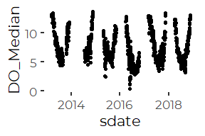

We remove the Chloride value from the data.

``` r
full_data <- full_data %>%
  mutate(Chl_Median = if_else(Site == 'S06B' & Year > 2014,
                              NA_real_, Chl_Median))
```

### Anomolous Dissolved Oxygen and Chloride Values

#### Site S03, end of 2016

We noted some extreme dissolved oxygen data at the end of 2016. Values
were both extreme and highly variable.

``` r
full_data %>% 
  filter (Year == 2016, Site == 'S03', Month %in% c("Oct", "Nov", "Dec")) %>%
ggplot(aes(x = sdate)) + 
  geom_point(aes(y = DO_Median)) +
  geom_line(aes(y = DO_Median)) +
  geom_line(aes(y = D_Median * 20), color = 'blue', lty = 2) +
  geom_line(aes(y = Chl_Median / 20), color = 'green', lty = 2) +
  geom_line(aes(y = MaxT), color = 'red', lty = 2) +
  theme_cbep(base_size = 10) +
  theme(legend.position="bottom", legend.box = "vertical") +
  
  annotate(geom ='text', x = as.Date('2016-10-10'), y = 4, 
           label = 'Max Air Temp', color = 'red') +
  annotate(geom ='text', x = as.Date('2016-10-10'), y = 2, 
           label = 'Depth x 20', color = 'blue') +
  annotate(geom ='text', x = as.Date('2016-10-10'), y = 0, 
           label = 'Chlorides / 20', color = 'green')
```

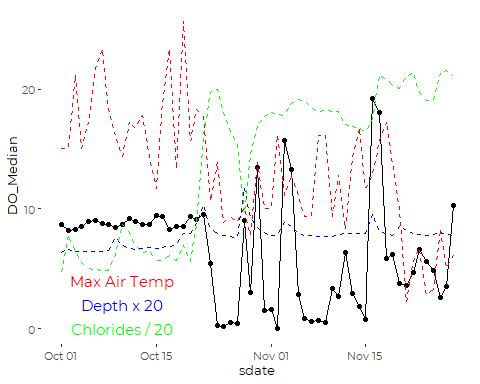

The unstable behavior after October 23rd is questionable. DO does not
normally fluctuate so widely. Percent saturation associated with these
observations extend as high as 200%. There is clearly a problem.

We looked at the raw data, and examined the time course of all
sonde-related data.

-   There was a sudden decline in observed DO at about 1:00 am on
    October 23rd,
    1.  That corresponds to a simultaneous rise in conductivity /
        chlorides, and follows a brief rise and rapid fall in water
        temperature.  
-   Recovery in DO several days later (1/28/2016) corresponds to a drop
    in chlorides, and a BREIF increase on water depth, but there is no
    related change in temperature.  
-   Ongoing brief spikes in DO appear to correspond to drops in
    chlorides or conductivity, and very brief small blips in water
    depth.  
-   The data record includes stable data at lower water depths, so it is
    unlikely that the sensors were exposed. On the other hand, they
    could have been buried by sediment. Air temperatures were not low
    enough to suggest that the sensors may have frozen, or battery power
    may have been failing.

The raw data makes it clear that whatever was going on affected both
conductivity and dissolved oxygen measurements, but did not obviously
affect temperature or pressure (water depth). There are two possible
interpretations. Either the data are real, and those exceptionally high
DO and percent saturation values are real, or there was some sort of
malfunction that affected both chloride and dissolved oxygen.

We decide we should remove chloride and oxygen observations after
October 15th. Site S03 shows some low dissolved oxygen, high chloride
observations from November of 2015 as well, but the raw data is
smoother, without the extreme high values, and without zero DO
observations. We leave those data in place as likely correct.

``` r
full_data <- full_data %>% 
  mutate(Chl_Median = if_else(Year == 2016 & Site == 'S03' & DOY > 288,
                              NA_real_, Chl_Median),
         DO_Median = if_else(Year == 2016 & Site == 'S03' & DOY > 288,
                              NA_real_, DO_Median),
         PctSat_Median = if_else(Year == 2016 & Site == 'S03' & DOY > 288,
                              NA_real_, PctSat_Median))
```

## Remove Partial Data from Winter Months

We have very limited data from several months. We have January data from
only one year, and February data from only three, and December data from
four, all older. Both March and November sample sizes vary.

The limited winter data generates severely unbalanced samples, which may
lead to estimation problems, especially in models with crossed or
potentially crossed factors and predictors. More fundamentally, the
potential bias introduced by showing data from those months from just a
handful of years could give a misleading impression of seasonal
patterns. We trim December, January and February data, but leave the
other months.

It is important to remember, even after trimming the data, that:  
1. 2010 is a partial year,  
2. The period of sampling in March may be biased due to spring melt
timing.

``` r
xtabs(~ Year_f + Month, data = full_data)
#>       Month
#> Year_f Jan Feb Mar Apr May Jun Jul Aug Sep Oct Nov Dec
#>   2010   0   0   0   0   0  78 103 106 120 124 120  35
#>   2011   0  24 104 120 124 120 124 124 120 124 120 112
#>   2012   0  45  93  90  93 116 124 114 120  39 108 124
#>   2013   9   0  58 131 155 140 124 127 120 141 150  15
#>   2014   0   0  62 108 155 150 155 155 150 155 120   0
#>   2015   0   0  23 147 186 180 186 186 180 160  30   0
#>   2016   0   0  25 173 186 180 186 186 180 186 168   0
#>   2017   0  18 186 180 186 180 186 186 180 186 102   0
#>   2018   0   0  34 180 186 180 186 186 180 186 126   0
```

``` r
full_data <- full_data %>%
  filter(Month %in% month.abb[3:11]  )
```

## Add Stream Flow Index

We worked through many models on a site by site basis in which we
included data on water depth, but since the depth coordinate is
site-specific, a 10 cm depth at one site may be exceptional, while at
another it is commonplace. We generally want not a local measure of
stream depth, but a watershed-wide metric of high, medium, or low stream
flow.

Middle and Lower Maine Stem sites would be suitable for a general flow
indicator across the watershed. The monitoring sites in that stretch of
Long Creek include include S05 and S17, however only site S05 has been
in continuous operation throughout the period of record, so we use depth
data from S05 to construct our general stream flow indicator.

Stream flow at S05 is correlated with flow at other sites, although not
all that closely correlated to flow in the downstream tributaries.

``` r
full_data %>%
  select(sdate, Site, lD_Median) %>%
  pivot_wider(names_from = Site, values_from = lD_Median) %>%
  select(-sdate) %>%
  cor(use = 'pairwise', method = 'pearson')
#>            S07      S06B       S05       S17       S03       S01
#> S07  1.0000000 0.5882527 0.7042711 0.7327432 0.4578906 0.5594067
#> S06B 0.5882527 1.0000000 0.8043943 0.8778188 0.7152403 0.6310361
#> S05  0.7042711 0.8043943 1.0000000 0.7906571 0.4526392 0.6506630
#> S17  0.7327432 0.8778188 0.7906571 1.0000000 0.6666414 0.7290077
#> S03  0.4578906 0.7152403 0.4526392 0.6666414 1.0000000 0.4499047
#> S01  0.5594067 0.6310361 0.6506630 0.7290077 0.4499047 1.0000000
```

We use the log of the daily median flow at S05 as a general
watershed-wide stream flow indicator, which we call `FlowIndex`. We use
the log of the raw median, to lessen the effect of the highly skewed
distribution of stream depths on the metric.

``` r
depth_data <- full_data %>%
  filter (Site == 'S05') %>%
  select(sdate, lD_Median)

full_data <- full_data %>%
  mutate(FlowIndex = depth_data$lD_Median[match(sdate, depth_data$sdate)])
  rm(depth_data)
```

Note that because the flow record at S05 has some gaps, any model using
this predictor is likely to have a smaller sample size.

## Select Final Data Set

``` r
full_data <- full_data %>%
  mutate(Year_f = factor(Year)) %>%
  select (Site, sdate, Year, Year_f, Month, DOY, 
          Precip, lPrecip, PPrecip, wlPrecip, MaxT,
          D_Median, lD_Median,
          DO_Median, PctSat_Median, T_Median, Chl_Median,
          IC, FlowIndex) %>%
  filter(! is.na(DO_Median))
```

# Crosstabs

``` r
xtabs(~ Site + Year, data = full_data)
#>       Year
#> Site   2010 2011 2012 2013 2014 2015 2016 2017 2018
#>   S07   161  141  194  220  259  186  215  261  209
#>   S06B    0    0    0  214  119  190  198  261  237
#>   S05    66   72    0  122  214    0    0    0    0
#>   S17     0    0    0    0    0  220  204  239  188
#>   S03   180  271  200  248  259  220  174  237  225
#>   S01   180  247  200  263  207  194  227  261  158
```

Note that Site S05 and S17 have partially complementary data histories
on dissolved oxygen.

``` r
xtabs(~ Month + Year + Site, data = full_data)
#> , , Site = S07
#> 
#>      Year
#> Month 2010 2011 2012 2013 2014 2015 2016 2017 2018
#>   Jan    0    0    0    0    0    0    0    0    0
#>   Feb    0    0    0    0    0    0    0    0    0
#>   Mar    0   31   23    0   21    0    1   31    2
#>   Apr    0   30   30    6   30   30   30   30   25
#>   May    0   31   29   31   31   31   31   31   22
#>   Jun   15   30   23   30   30   30    7   30   30
#>   Jul   24   19   30   31   31   31   26   31   31
#>   Aug   31    0   21   31   31   31   31   30   17
#>   Sep   30    0   25   30   30   30   30   30   30
#>   Oct   31    0   11   31   31    3   31   31   31
#>   Nov   30    0    2   30   24    0   28   17   21
#>   Dec    0    0    0    0    0    0    0    0    0
#> 
#> , , Site = S06B
#> 
#>      Year
#> Month 2010 2011 2012 2013 2014 2015 2016 2017 2018
#>   Jan    0    0    0    0    0    0    0    0    0
#>   Feb    0    0    0    0    0    0    0    0    0
#>   Mar    0    0    0   19    0    0    2   31    2
#>   Apr    0    0    0   30    0    0   30   30   30
#>   May    0    0    0   31    0   31   31   31   31
#>   Jun    0    0    0   30    0   30   30   30   30
#>   Jul    0    0    0   31   11   31   26   31   31
#>   Aug    0    0    0   29   31   31   31   30   31
#>   Sep    0    0    0    0   23   30   30   30   30
#>   Oct    0    0    0   14   30   31   18   31   31
#>   Nov    0    0    0   30   24    6    0   17   21
#>   Dec    0    0    0    0    0    0    0    0    0
#> 
#> , , Site = S05
#> 
#>      Year
#> Month 2010 2011 2012 2013 2014 2015 2016 2017 2018
#>   Jan    0    0    0    0    0    0    0    0    0
#>   Feb    0    0    0    0    0    0    0    0    0
#>   Mar    0    0    0    4    0    0    0    0    0
#>   Apr    0   22    0   25    6    0    0    0    0
#>   May    0   16    0    0   31    0    0    0    0
#>   Jun    0    9    0    0   30    0    0    0    0
#>   Jul   11   13    0    0   31    0    0    0    0
#>   Aug   10   12    0    2   31    0    0    0    0
#>   Sep   24    0    0   30   30    0    0    0    0
#>   Oct    0    0    0   31   31    0    0    0    0
#>   Nov   21    0    0   30   24    0    0    0    0
#>   Dec    0    0    0    0    0    0    0    0    0
#> 
#> , , Site = S17
#> 
#>      Year
#> Month 2010 2011 2012 2013 2014 2015 2016 2017 2018
#>   Jan    0    0    0    0    0    0    0    0    0
#>   Feb    0    0    0    0    0    0    0    0    0
#>   Mar    0    0    0    0    0    0    0   31    3
#>   Apr    0    0    0    0    0   30   20   30   25
#>   May    0    0    0    0    0   31   31   31   22
#>   Jun    0    0    0    0    0   30    7   30   30
#>   Jul    0    0    0    0    0   31   26   31   31
#>   Aug    0    0    0    0    0   31   31   30   31
#>   Sep    0    0    0    0    0   30   30   30   26
#>   Oct    0    0    0    0    0   31   31   26    0
#>   Nov    0    0    0    0    0    6   28    0   20
#>   Dec    0    0    0    0    0    0    0    0    0
#> 
#> , , Site = S03
#> 
#>      Year
#> Month 2010 2011 2012 2013 2014 2015 2016 2017 2018
#>   Jan    0    0    0    0    0    0    0    0    0
#>   Feb    0    0    0    0    0    0    0    0    0
#>   Mar    0   31   31    4   21    0    1   31    3
#>   Apr    0   30   30   30   30   30   30   30   30
#>   May    0   31   27   31   31   31   31   26   31
#>   Jun   27   30   23   30   30   30   11   29   30
#>   Jul   31   31   30   31   31   31   26   31   31
#>   Aug   31   27   21   31   31   31   31   30   18
#>   Sep   30   30   25   30   30   30   30   30   30
#>   Oct   31   31   11   31   31   31   14   30   31
#>   Nov   30   30    2   30   24    6    0    0   21
#>   Dec    0    0    0    0    0    0    0    0    0
#> 
#> , , Site = S01
#> 
#>      Year
#> Month 2010 2011 2012 2013 2014 2015 2016 2017 2018
#>   Jan    0    0    0    0    0    0    0    0    0
#>   Feb    0    0    0    0    0    0    0    0    0
#>   Mar    0   31   31   19   11    0    0   31    3
#>   Apr    0   30   30   30   30   21   20   30   30
#>   May    0   31   29   31   31   14   31   31   31
#>   Jun   27   30   23   30    9   30   30   30   18
#>   Jul   31   31   28   31   10   31   26   31   23
#>   Aug   31   16   21   31   31   31   31   30   26
#>   Sep   30   30   25   30   30   30   30   30   24
#>   Oct   31   18   11   31   31   31   31   31    0
#>   Nov   30   30    2   30   24    6   28   17    3
#>   Dec    0    0    0    0    0    0    0    0    0
```

# Exploratory Graphics

``` r
ggplot(full_data, aes(x = DO_Median)) + geom_histogram(aes(fill = Site))
#> `stat_bin()` using `bins = 30`. Pick better value with `binwidth`.
```

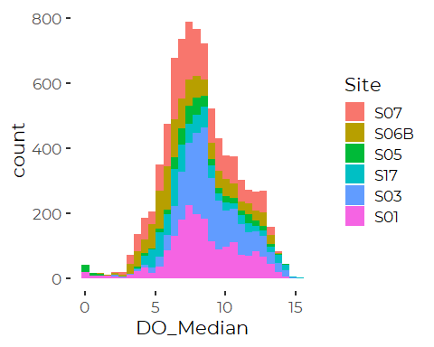
So, while not exactly normally distributed, it’s not wildly skewed
either.

``` r
ggplot(full_data, aes(y = DO_Median, x = T_Median)) + 
  geom_point(aes(shape = Site, color = Month)) +
  geom_smooth() +
  theme_cbep(base_size = 10) +
  theme(legend.position="bottom", legend.box = "vertical")
#> `geom_smooth()` using method = 'gam' and formula 'y ~ s(x, bs = "cs")'
#> Warning: Removed 78 rows containing non-finite values (stat_smooth).
#> Warning: Removed 78 rows containing missing values (geom_point).
```

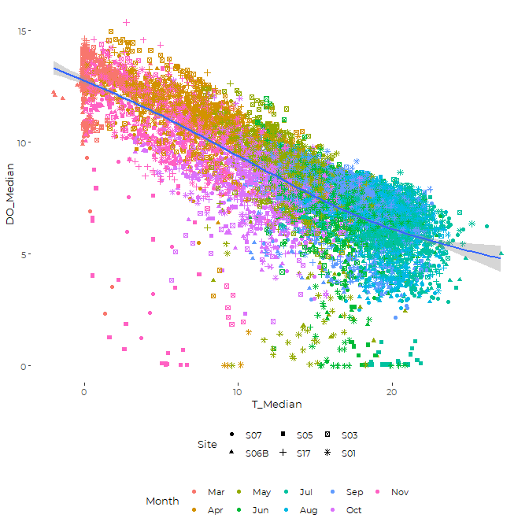
S01 and S05 have high temperature low or no DO events. S03 has some mid
temperature low DO events, and SO7 and S05 have low temperature low DO
events. Those low DO events tend to occur in temporal clusters, all part
of one year and one month.

Low DO conditions occur infrequently, but when the do occur, they tend
to occur in clusters.

``` r
ggplot(full_data, aes(y = DO_Median, x = sdate, color = Site)) + 
  geom_point() +
  geom_smooth(method = 'gam', formula = y ~ s(x, bs = "cs", k = 9*3)) + 
  theme_cbep(base_size = 10) 
```

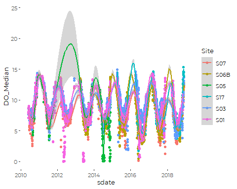

\#Linear Model With Autocorrelated Errors Recall that GLS does not
handle incomplete designs. Since we don’t have data from all
combinations of sites and years, we can not include a sites by years
interaction in the model. From other experience, we expect such a term
would be “significant”, but possibly not important.

This takes a long time to complete – about 20 minutes. It’s big messy
cross correlation model, even without including any covariates.

``` r
if (! file.exists("models/do_gls.rds")) {
  print(
    system.time(
      do_gls <- gls(DO_Median ~ Site + 
                      #lPrecip + 
                      #wlPrecip +
                      #FlowIndex +
                      MaxT +
                      Month +
                      Year_f, #+
                    #Site : Year_f,
                    correlation = corAR1(form = ~ as.numeric(sdate) | Site),
                    na.action = na.omit, 
                    #method = 'REML',
                    data = full_data)
    )
  )
  saveRDS(do_gls, file="models/do_gls_.rds")
} else {
  do_gls <- readRDS("models/do_gls.rds")
}
#>    user  system elapsed 
#> 1008.89    3.33 1012.75
anova(do_gls)
#> Denom. DF: 8318 
#>             numDF  F-value p-value
#> (Intercept)     1 3257.223  <.0001
#> Site            5    1.525  0.1782
#> MaxT            1  407.937  <.0001
#> Month           8    3.972  0.0001
#> Year_f          8    1.515  0.1461
```

``` r
summary(do_gls)
#> Generalized least squares fit by REML
#>   Model: DO_Median ~ Site + MaxT + Month + Year_f 
#>   Data: full_data 
#>        AIC      BIC    logLik
#>   17238.57 17414.22 -8594.284
#> 
#> Correlation Structure: ARMA(1,0)
#>  Formula: ~as.numeric(sdate) | Site 
#>  Parameter estimate(s):
#>      Phi1 
#> 0.9575564 
#> 
#> Coefficients:
#>                 Value Std.Error    t-value p-value
#> (Intercept) 10.360708 0.6578226  15.750003  0.0000
#> SiteS06B    -0.194813 0.5299333  -0.367617  0.7132
#> SiteS05     -0.318545 0.6758644  -0.471315  0.6374
#> SiteS17      0.526815 0.6042296   0.871879  0.3833
#> SiteS03      0.775535 0.4518892   1.716205  0.0862
#> SiteS01      0.460786 0.4509628   1.021784  0.3069
#> MaxT        -0.033913 0.0016859 -20.116036  0.0000
#> MonthApr    -0.419544 0.1304339  -3.216524  0.0013
#> MonthMay    -0.342303 0.1728604  -1.980229  0.0477
#> MonthJun    -0.571610 0.2011497  -2.841713  0.0045
#> MonthJul    -0.946772 0.2207789  -4.288329  0.0000
#> MonthAug    -1.042005 0.2351381  -4.431461  0.0000
#> MonthSep    -1.036205 0.2494635  -4.153735  0.0000
#> MonthOct    -0.875918 0.2638122  -3.320234  0.0009
#> MonthNov    -0.904298 0.2830003  -3.195397  0.0014
#> Year_f2011  -0.187612 0.7455771  -0.251633  0.8013
#> Year_f2012  -0.402658 0.7670552  -0.524940  0.5996
#> Year_f2013  -0.206702 0.7016717  -0.294584  0.7683
#> Year_f2014  -0.851183 0.7013648  -1.213609  0.2249
#> Year_f2015  -0.810683 0.7322038  -1.107183  0.2682
#> Year_f2016  -1.881536 0.7248055  -2.595918  0.0095
#> Year_f2017  -0.466295 0.7114916  -0.655377  0.5122
#> Year_f2018  -1.121278 0.7205204  -1.556206  0.1197
#> 
#>  Correlation: 
#>            (Intr) StS06B SitS05 SitS17 SitS03 SitS01 MaxT   MnthAp MnthMy
#> SiteS06B   -0.209                                                        
#> SiteS05    -0.329  0.272                                                 
#> SiteS17    -0.175  0.378  0.190                                          
#> SiteS03    -0.350  0.432  0.352  0.376                                   
#> SiteS01    -0.348  0.434  0.351  0.379  0.517                            
#> MaxT       -0.049 -0.001 -0.002  0.000 -0.001  0.000                     
#> MonthApr   -0.175  0.001 -0.013 -0.003  0.001 -0.001 -0.014              
#> MonthMay   -0.233 -0.006 -0.007 -0.003  0.001 -0.002 -0.015  0.725       
#> MonthJun   -0.278 -0.010 -0.006 -0.004 -0.001 -0.003 -0.012  0.605  0.818
#> MonthJul   -0.300 -0.015 -0.010 -0.006 -0.002 -0.005 -0.009  0.539  0.719
#> MonthAug   -0.309 -0.017 -0.014 -0.008 -0.005 -0.008 -0.013  0.499  0.659
#> MonthSep   -0.314 -0.018 -0.015 -0.009 -0.006 -0.010  0.004  0.465  0.609
#> MonthOct   -0.311 -0.019 -0.014 -0.009 -0.007 -0.011  0.004  0.436  0.568
#> MonthNov   -0.303 -0.018 -0.014 -0.010 -0.005 -0.013  0.005  0.404  0.525
#> Year_f2011 -0.626 -0.023  0.004 -0.020 -0.040 -0.040  0.006  0.021  0.041
#> Year_f2012 -0.650  0.013  0.146  0.004  0.004  0.003  0.009  0.022  0.039
#> Year_f2013 -0.671 -0.124  0.020 -0.029 -0.005 -0.009  0.009  0.013  0.031
#> Year_f2014 -0.667 -0.073 -0.004 -0.015  0.002  0.005  0.004  0.013  0.027
#> Year_f2015 -0.665 -0.121  0.138 -0.163 -0.004 -0.005 -0.001 -0.006  0.010
#> Year_f2016 -0.680 -0.113  0.146 -0.155  0.014  0.005  0.001  0.003  0.019
#> Year_f2017 -0.701 -0.127  0.145 -0.151  0.008  0.003  0.006  0.025  0.045
#> Year_f2018 -0.684 -0.125  0.144 -0.155  0.004  0.008  0.005  0.010  0.026
#>            MnthJn MnthJl MnthAg MnthSp MnthOc MnthNv Y_2011 Y_2012 Y_2013
#> SiteS06B                                                                 
#> SiteS05                                                                  
#> SiteS17                                                                  
#> SiteS03                                                                  
#> SiteS01                                                                  
#> MaxT                                                                     
#> MonthApr                                                                 
#> MonthMay                                                                 
#> MonthJun                                                                 
#> MonthJul    0.865                                                        
#> MonthAug    0.785  0.897                                                 
#> MonthSep    0.720  0.814  0.899                                          
#> MonthOct    0.668  0.750  0.822  0.906                                   
#> MonthNov    0.614  0.687  0.749  0.821  0.899                            
#> Year_f2011  0.066  0.079  0.089  0.098  0.101  0.102                     
#> Year_f2012  0.061  0.070  0.075  0.078  0.079  0.080  0.534              
#> Year_f2013  0.052  0.061  0.064  0.067  0.065  0.064  0.577  0.565       
#> Year_f2014  0.045  0.052  0.056  0.058  0.057  0.059  0.575  0.559  0.623
#> Year_f2015  0.032  0.043  0.050  0.056  0.061  0.067  0.557  0.561  0.610
#> Year_f2016  0.040  0.050  0.055  0.060  0.062  0.067  0.561  0.567  0.616
#> Year_f2017  0.068  0.079  0.085  0.090  0.092  0.097  0.575  0.580  0.631
#> Year_f2018  0.047  0.057  0.062  0.066  0.069  0.069  0.565  0.571  0.622
#>            Y_2014 Y_2015 Y_2016 Y_2017
#> SiteS06B                              
#> SiteS05                               
#> SiteS17                               
#> SiteS03                               
#> SiteS01                               
#> MaxT                                  
#> MonthApr                              
#> MonthMay                              
#> MonthJun                              
#> MonthJul                              
#> MonthAug                              
#> MonthSep                              
#> MonthOct                              
#> MonthNov                              
#> Year_f2011                            
#> Year_f2012                            
#> Year_f2013                            
#> Year_f2014                            
#> Year_f2015  0.597                     
#> Year_f2016  0.603  0.637              
#> Year_f2017  0.617  0.650  0.657       
#> Year_f2018  0.608  0.641  0.647  0.661
#> 
#> Standardized residuals:
#>        Min         Q1        Med         Q3        Max 
#> -4.1810868 -0.7357096 -0.2660105  0.4099127  2.9213155 
#> 
#> Residual standard error: 2.324134 
#> Degrees of freedom: 8341 total; 8318 residual
```

Results are interesting. As suspected, dissolved oxygen on successive
days are highly autocorrelated – over 95%. Once you take into account
air temperature and time of year, neither site nor year ends up as
statistically significant. Note that this conflicts with results of the
analysis of exceedences, where both site and year mattered.

## We Explore a Larger Model

``` r
if (! file.exists("models/do_gls_with.rds")) {
  print(
    system.time(
      do_gls_with <- gls(DO_Median ~ Site +
                      FlowIndex +
                      T_Median +
                      MaxT +
                      Month +
                      Year_f, #+
                    #Site : Year_f,
                    correlation = corAR1(form = ~ as.numeric(sdate) | Site),
                    na.action = na.omit, 
                    #method = 'REML',
                    data = full_data)
    )
  )
  saveRDS(do_gls_with, file="models/do_gls_with.rds")
} else {
  do_gls_with <- readRDS("models/do_gls_with.rds")
}
anova(do_gls_with)
#> Denom. DF: 6088 
#>             numDF   F-value p-value
#> (Intercept)     1 11762.704  <.0001
#> Site            5     7.777  <.0001
#> FlowIndex       1    13.669  0.0002
#> T_Median        1  2144.039  <.0001
#> MaxT            1     5.585  0.0181
#> Month           8     4.814  <.0001
#> Year_f          8     8.430  <.0001
```

Note that in the context of a flow and stream water temperature
predictors, we see a difference between sites. Air temperature is a lot
less important after we fit a stream temperature term. Stream
temperature ends up as by far the most important predictor. One
challenge we have seen in too many other analyses is that with the large
data sets we have, lots of small signals are statistically significant.

# GAMM Analysis

Here we use “General Additive Models” that allow non-linear (smoother)
fits for some parameters. Our emphasis is on using smoothers to account
for non-linearities in relationships between weather or flow-related
predictors and dissolved oxygen.

We use the function `gamm()` because it has a relatively simple
interface for incorporating autocorrelated errors.

We abuse the autocorrelation model slightly, since we don’t fit separate
autocorrelations for each site and season. That should have little
impact on results, as missing values at beginning and end of most time
series prevent estimation anyway.

## Initial GAM Model

Our first GAM simply fits smoothers for each of the major
weather-related covariates. Arguably, we should fit separate smoothers
by `FlowIndex` for each site.

This model takes a long time to run minutes to run (more than 5, less
than 15)

, form = \~ as.numeric(sdate) \| Site

``` r
system.time(
  do_gam <- gam(DO_Median ~ Site + 
                  s(FlowIndex) +
                  s(MaxT) +
                  s(T_Median) +
                  Month +
                  Year_f +
                  Site : Year_f,
                correlation = corAR1(form = ~ as.numeric(sdate) | Site),
                na.action = na.omit, 
                #method = 'REML',
                data = full_data)
)
#>    user  system elapsed 
#>    0.46    0.02    0.48

anova(do_gam)
#> 
#> Family: gaussian 
#> Link function: identity 
#> 
#> Formula:
#> DO_Median ~ Site + s(FlowIndex) + s(MaxT) + s(T_Median) + Month + 
#>     Year_f + Site:Year_f
#> 
#> Parametric Terms:
#>             df     F p-value
#> Site         5 40.65  <2e-16
#> Month        8 94.87  <2e-16
#> Year_f       8 55.54  <2e-16
#> Site:Year_f 29 40.96  <2e-16
#> 
#> Approximate significance of smooth terms:
#>                edf Ref.df       F p-value
#> s(FlowIndex) 8.209  8.827  38.098  <2e-16
#> s(MaxT)      1.000  1.000   6.286  0.0122
#> s(T_Median)  7.850  8.667 126.479  <2e-16
```

``` r
summary(do_gam)
#> 
#> Family: gaussian 
#> Link function: identity 
#> 
#> Formula:
#> DO_Median ~ Site + s(FlowIndex) + s(MaxT) + s(T_Median) + Month + 
#>     Year_f + Site:Year_f
#> 
#> Parametric coefficients:
#>                      Estimate Std. Error t value Pr(>|t|)    
#> (Intercept)          9.953823   0.198180  50.226  < 2e-16 ***
#> SiteS06B            -0.218971   0.051644  -4.240 2.27e-05 ***
#> SiteS05             -0.106136   0.224936  -0.472 0.637051    
#> SiteS17              0.528194   0.051333  10.290  < 2e-16 ***
#> SiteS03              0.670802   0.176932   3.791 0.000151 ***
#> SiteS01              0.695656   0.176927   3.932 8.52e-05 ***
#> MonthApr             0.469193   0.136108   3.447 0.000570 ***
#> MonthMay            -0.079926   0.155858  -0.513 0.608102    
#> MonthJun            -0.841687   0.163577  -5.146 2.75e-07 ***
#> MonthJul            -0.725149   0.172388  -4.206 2.63e-05 ***
#> MonthAug            -0.355963   0.170407  -2.089 0.036758 *  
#> MonthSep            -0.557283   0.165661  -3.364 0.000773 ***
#> MonthOct            -1.247961   0.154321  -8.087 7.34e-16 ***
#> MonthNov            -0.804766   0.135343  -5.946 2.90e-09 ***
#> Year_f2011          -0.900455   0.171737  -5.243 1.63e-07 ***
#> Year_f2012          -0.962485   0.177202  -5.432 5.80e-08 ***
#> Year_f2013          -1.036500   0.205507  -5.044 4.70e-07 ***
#> Year_f2014          -1.301770   0.155081  -8.394  < 2e-16 ***
#> Year_f2015          -2.026244   0.182088 -11.128  < 2e-16 ***
#> Year_f2016          -2.500572   0.154054 -16.232  < 2e-16 ***
#> Year_f2017          -2.012066   0.149005 -13.503  < 2e-16 ***
#> Year_f2018          -1.941754   0.151770 -12.794  < 2e-16 ***
#> SiteS06B:Year_f2011  0.000000   0.000000      NA       NA    
#> SiteS05:Year_f2011  -0.012416   0.283883  -0.044 0.965117    
#> SiteS17:Year_f2011   0.000000   0.000000      NA       NA    
#> SiteS03:Year_f2011  -0.049026   0.219843  -0.223 0.823538    
#> SiteS01:Year_f2011  -0.289654   0.220928  -1.311 0.189881    
#> SiteS06B:Year_f2012  0.000000   0.000000      NA       NA    
#> SiteS05:Year_f2012   0.000000   0.000000      NA       NA    
#> SiteS17:Year_f2012   0.000000   0.000000      NA       NA    
#> SiteS03:Year_f2012   0.165284   0.237730   0.695 0.486919    
#> SiteS01:Year_f2012  -0.243333   0.237802  -1.023 0.306226    
#> SiteS06B:Year_f2013 -0.051691   0.188231  -0.275 0.783621    
#> SiteS05:Year_f2013   0.008432   0.722156   0.012 0.990684    
#> SiteS17:Year_f2013   0.000000   0.000000      NA       NA    
#> SiteS03:Year_f2013   0.045593   0.277933   0.164 0.869702    
#> SiteS01:Year_f2013  -3.315286   0.277795 -11.934  < 2e-16 ***
#> SiteS06B:Year_f2014  0.074789   0.124126   0.603 0.546848    
#> SiteS05:Year_f2014  -1.899962   0.251167  -7.565 4.47e-14 ***
#> SiteS17:Year_f2014   0.000000   0.000000      NA       NA    
#> SiteS03:Year_f2014  -0.956570   0.209875  -4.558 5.27e-06 ***
#> SiteS01:Year_f2014  -0.361224   0.213039  -1.696 0.090017 .  
#> SiteS06B:Year_f2015  0.256490   0.152720   1.679 0.093112 .  
#> SiteS05:Year_f2015   0.000000   0.000000      NA       NA    
#> SiteS17:Year_f2015   0.426128   0.141355   3.015 0.002584 ** 
#> SiteS03:Year_f2015   0.911032   0.247326   3.684 0.000232 ***
#> SiteS01:Year_f2015   0.270850   0.247835   1.093 0.274496    
#> SiteS06B:Year_f2016 -1.041034   0.109504  -9.507  < 2e-16 ***
#> SiteS05:Year_f2016   0.000000   0.000000      NA       NA    
#> SiteS17:Year_f2016  -0.539077   0.101428  -5.315 1.11e-07 ***
#> SiteS03:Year_f2016   0.679921   0.214512   3.170 0.001534 ** 
#> SiteS01:Year_f2016  -0.593137   0.208352  -2.847 0.004431 ** 
#> SiteS06B:Year_f2017  0.471999   0.099747   4.732 2.27e-06 ***
#> SiteS05:Year_f2017   0.000000   0.000000      NA       NA    
#> SiteS17:Year_f2017   0.632383   0.095066   6.652 3.14e-11 ***
#> SiteS03:Year_f2017   0.547327   0.206462   2.651 0.008047 ** 
#> SiteS01:Year_f2017   0.667593   0.203808   3.276 0.001060 ** 
#> SiteS06B:Year_f2018  0.070477   0.114898   0.613 0.539645    
#> SiteS05:Year_f2018   0.000000   0.000000      NA       NA    
#> SiteS17:Year_f2018   0.008760   0.103802   0.084 0.932750    
#> SiteS03:Year_f2018  -0.677929   0.208732  -3.248 0.001169 ** 
#> SiteS01:Year_f2018   0.486272   0.215056   2.261 0.023786 *  
#> ---
#> Signif. codes:  0 '***' 0.001 '**' 0.01 '*' 0.05 '.' 0.1 ' ' 1
#> 
#> Approximate significance of smooth terms:
#>                edf Ref.df       F p-value    
#> s(FlowIndex) 8.209  8.827  38.098  <2e-16 ***
#> s(MaxT)      1.000  1.000   6.286  0.0122 *  
#> s(T_Median)  7.850  8.667 126.479  <2e-16 ***
#> ---
#> Signif. codes:  0 '***' 0.001 '**' 0.01 '*' 0.05 '.' 0.1 ' ' 1
#> 
#> Rank: 76/89
#> R-sq.(adj) =  0.799   Deviance explained = 80.1%
#> GCV = 1.3438  Scale est. = 1.3293    n = 6113
```

The site by year interaction is hard to understand. We will need to look
at marginal means, but that will be more useful once we handle temporal
autocorrelation.

``` r
plot(do_gam)
```

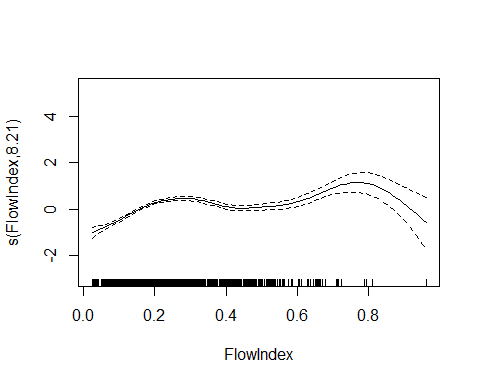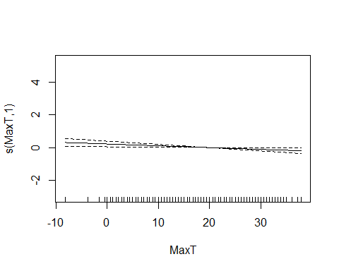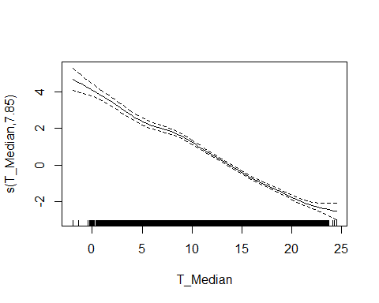

The interesting feature here is that effects of both air temperature and
water temperature are nearly linear, with water temperature much larger.

Lets try shifting the water temp to a linear term, and dropping the air
temp term. We have to be back again in the world where confounded
factors will stop the analysis. We have to drop the Site by Year term.

## Initial GAMM model

This model is also likely to take approximately 15 minutes to run.

``` r
if (! file.exists("models/do_gamm.rds")) {
  print(
    system.time(
      do_gamm <- gamm(DO_Median ~ Site + 
                        T_Median +
                        s(FlowIndex) +
                        Month +
                        Year_f,
                       correlation = corAR1(form = ~ as.numeric(sdate) | Site),
                       na.action = na.omit, 
                       method = 'REML',
                       data = full_data)
    )
  )
  saveRDS(do_gamm, file="models/do_gamm.rds")
} else {
  do_gamm <- readRDS("models/do_gamm.rds")
}
#>    user  system elapsed 
#>  600.11    2.64  603.00
```

### ANOVA

``` r
anova(do_gamm$gam)
#> 
#> Family: gaussian 
#> Link function: identity 
#> 
#> Formula:
#> DO_Median ~ Site + T_Median + s(FlowIndex) + Month + Year_f
#> 
#> Parametric Terms:
#>          df        F  p-value
#> Site      5    6.463 5.33e-06
#> T_Median  1 2008.680  < 2e-16
#> Month     8    3.791 0.000189
#> Year_f    8   10.076 4.63e-14
#> 
#> Approximate significance of smooth terms:
#>                edf Ref.df    F p-value
#> s(FlowIndex) 7.382  7.382 31.2  <2e-16
```

### Summary

``` r
summary(do_gamm$gam)
#> 
#> Family: gaussian 
#> Link function: identity 
#> 
#> Formula:
#> DO_Median ~ Site + T_Median + s(FlowIndex) + Month + Year_f
#> 
#> Parametric coefficients:
#>              Estimate Std. Error t value Pr(>|t|)    
#> (Intercept) 13.986479   0.413475  33.827  < 2e-16 ***
#> SiteS06B    -0.232340   0.253874  -0.915 0.360134    
#> SiteS05     -0.867173   0.356062  -2.435 0.014902 *  
#> SiteS17      0.465846   0.274199   1.699 0.089383 .  
#> SiteS03      0.659430   0.219540   3.004 0.002678 ** 
#> SiteS01      0.514912   0.219762   2.343 0.019159 *  
#> T_Median    -0.245297   0.005473 -44.818  < 2e-16 ***
#> MonthApr    -0.329092   0.144412  -2.279 0.022711 *  
#> MonthMay    -0.603721   0.174526  -3.459 0.000546 ***
#> MonthJun    -0.810080   0.190232  -4.258 2.09e-05 ***
#> MonthJul    -0.938094   0.204951  -4.577 4.81e-06 ***
#> MonthAug    -0.986544   0.211049  -4.674 3.01e-06 ***
#> MonthSep    -0.978619   0.215614  -4.539 5.77e-06 ***
#> MonthOct    -1.125149   0.221380  -5.082 3.84e-07 ***
#> MonthNov    -0.945366   0.237896  -3.974 7.15e-05 ***
#> Year_f2011  -1.219370   0.403846  -3.019 0.002543 ** 
#> Year_f2012  -1.418316   0.443870  -3.195 0.001404 ** 
#> Year_f2013  -1.758293   0.498622  -3.526 0.000425 ***
#> Year_f2014  -2.066583   0.383023  -5.395 7.09e-08 ***
#> Year_f2015  -1.884273   0.421273  -4.473 7.86e-06 ***
#> Year_f2016  -3.040848   0.391904  -7.759 9.96e-15 ***
#> Year_f2017  -1.766924   0.387973  -4.554 5.36e-06 ***
#> Year_f2018  -2.188208   0.391924  -5.583 2.46e-08 ***
#> ---
#> Signif. codes:  0 '***' 0.001 '**' 0.01 '*' 0.05 '.' 0.1 ' ' 1
#> 
#> Approximate significance of smooth terms:
#>                edf Ref.df    F p-value    
#> s(FlowIndex) 7.382  7.382 31.2  <2e-16 ***
#> ---
#> Signif. codes:  0 '***' 0.001 '**' 0.01 '*' 0.05 '.' 0.1 ' ' 1
#> 
#> R-sq.(adj) =  0.727   
#>   Scale est. = 1.9144    n = 6113
```

### Estimated Daily Autocorrelation

``` r
summary(do_gamm$lme)$modelStruct$corStruct
#> Correlation structure of class corARMA representing
#>      Phi1 
#> 0.9093786
```

### Structure of the Smoother

``` r
plot(do_gamm$gam)
```


### Diagnostic Plots

The help files for `gam.check()` suggest using care when interpreting
results for GAMM models, since the function does not correctly
incorporate the error correlations structure. However, for our purposes,
this is probably sufficient, since our focus is not on statistical
significance, but on estimation.

``` r
gam.check(do_gamm$gam)
```


    #> 
    #> 'gamm' based fit - care required with interpretation.
    #> Checks based on working residuals may be misleading.
    #> Basis dimension (k) checking results. Low p-value (k-index<1) may
    #> indicate that k is too low, especially if edf is close to k'.
    #> 
    #>                k'  edf k-index p-value    
    #> s(FlowIndex) 9.00 7.38    0.87  <2e-16 ***
    #> ---
    #> Signif. codes:  0 '***' 0.001 '**' 0.01 '*' 0.05 '.' 0.1 ' ' 1

What that shows is, unfortunately, that the extreme low DO events –
which are our highest priority in many ways – are rather poorly modeled.
And it is clear the assumptions of normality are not met, especially for
those low values.

For careful work, we should probably use bootstrapped confidence
intervals or something similar, but given how long these models take to
fit, that is not practical. Besides, it is probably overkill.

### Estimated Marginal Means

Reliably calling `emmeans()` for `gamm()` models requires creating a
call object and associating it with the model (e.g., as
`do_gamm$gam$call`). (See the `emmeans` “models” vignette for more info,
although not all strategies recommended there worked for us).

We first create the call object, then associate it with the model, and
finally manually construct a reference grid before calling `emmeans()`
to extract marginal means. This workflow has the advantage that it
requires us to think carefully about the structure of the reference
grid.

The default `emmeans()` behavior creates a reference grid where marginal
means are keyed to mean values of all quantitative predictors, but
averaged across all factors. Since we fit YEar only asa factor, we do
not specify year here.

#### By Month

``` r
the_call <-  quote(gamm(DO_Median ~ Site + 
                        T_Median +
                        s(FlowIndex) +
                        Month +
                        Year_f,
                       correlation = corAR1(form = ~ as.numeric(sdate) | Site),
                       na.action = na.omit, 
                       method = 'REML',
                       data = full_data))
do_gamm$gam$call <- the_call

my_ref_grid <- ref_grid(do_gamm, cov.reduce = median) 
(by_month <- summary(emmeans(my_ref_grid, ~ Month)))
#>  Month emmean    SE   df lower.CL upper.CL
#>  Mar     8.87 0.195 6083     8.49     9.26
#>  Apr     8.55 0.150 6083     8.25     8.84
#>  May     8.27 0.130 6083     8.01     8.53
#>  Jun     8.06 0.124 6083     7.82     8.31
#>  Jul     7.94 0.125 6083     7.69     8.18
#>  Aug     7.89 0.125 6083     7.64     8.13
#>  Sep     7.90 0.127 6083     7.65     8.14
#>  Oct     7.75 0.136 6083     7.48     8.02
#>  Nov     7.93 0.161 6083     7.61     8.24
#> 
#> Results are averaged over the levels of: Site, Year_f 
#> Confidence level used: 0.95
```

``` r
labl <- 'Values  Flow and\nMedian Daily Water Temperature\nAll Sites Combined'

plot(by_month) + 
  xlab('DO (mg/l)\n(Flow and Temperature Adjusted)') +
  ylab ('') +
  annotate('text', 11, 6, label = labl, size = 3) +
  xlim(0,12) +
  geom_vline(xintercept =  7, color = 'orange') +
  geom_vline(xintercept =  5, color = 'red') +
  coord_flip() +
  theme_cbep(base_size = 12)
```

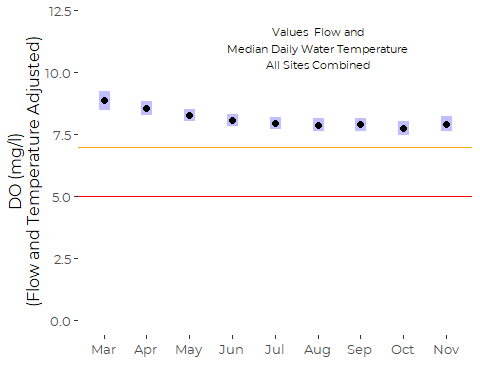

#### By Site

``` r
(by_site <- summary(emmeans(my_ref_grid, ~ Site)))
#>  Site emmean    SE   df lower.CL upper.CL
#>  S07    8.04 0.162 6083     7.72     8.35
#>  S06B   7.81 0.207 6083     7.40     8.21
#>  S05    7.17 0.318 6083     6.55     7.79
#>  S17    8.50 0.235 6083     8.04     8.96
#>  S03    8.70 0.158 6083     8.39     9.01
#>  S01    8.55 0.159 6083     8.24     8.86
#> 
#> Results are averaged over the levels of: Month, Year_f 
#> Confidence level used: 0.95
```

``` r
plot(by_site) + 
  xlab('DO (mg/l)\n(Flow and Temperature Adjusted)') +
  ylab("Upstream         Main Stem          Lower Tribs") +
  annotate('text', 11, 2.5, label = labl, size = 3) +
  xlim(0,12) +
  geom_vline(xintercept =  7, color = 'orange') +
  geom_vline(xintercept =  5, color = 'red') +
  coord_flip() +
  theme_cbep(base_size = 12)
```

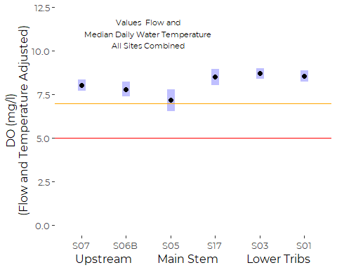

#### By Year

``` r
my_ref_grid <- ref_grid(do_gamm, cov.reduce = median) 
by_year <- summary(emmeans(my_ref_grid, 'Year_f'))
by_year
#>  Year_f emmean    SE   df lower.CL upper.CL
#>  2010     9.83 0.339 6083     9.17    10.50
#>  2011     8.61 0.234 6083     8.15     9.07
#>  2012     8.41 0.304 6083     7.82     9.01
#>  2013     8.07 0.357 6083     7.38     8.77
#>  2014     7.77 0.204 6083     7.37     8.17
#>  2015     7.95 0.245 6083     7.47     8.43
#>  2016     6.79 0.194 6083     6.41     7.17
#>  2017     8.07 0.183 6083     7.71     8.43
#>  2018     7.64 0.197 6083     7.26     8.03
#> 
#> Results are averaged over the levels of: Site, Month 
#> Confidence level used: 0.95
```

``` r
plot(by_year) + 
  annotate('text', 11, 6, label = labl, size = 3) +
  xlim(0,12) +
  xlab('DO (mg/l)\n(Flow and Temperature Adjusted)') +
  ylab('') +
  geom_vline(xintercept =  7, color = 'orange') +
  geom_vline(xintercept =  5, color = 'red') +
  coord_flip() +
  theme_cbep(base_size = 12)
```

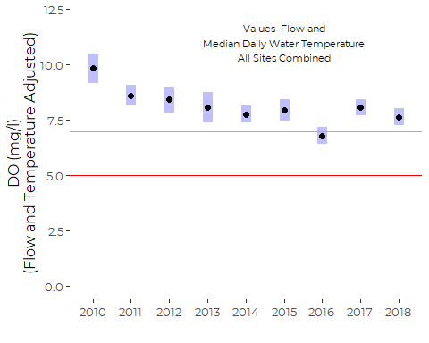
2010 was a partial year, so despite (or perhaps because of) adjusting
for months, the 2010 estimate may be misleading. Since then, basically,
2016 is way worse than the other years.

## Simplified Model

We drop the MONTH term and the FLOW term. We refit the water temperature
term as a low dimensional smooth, because we need to include at least
one smoother in the GAMM model.

``` r
if (! file.exists("models/do_gamm_2.rds")) {
  print(
    system.time(
      do_gamm_2<- gamm(DO_Median ~ Site + 
                        s(T_Median, k = 1) +
                        Year_f,
                       correlation = corAR1(form = ~ as.numeric(sdate) | Site),
                       na.action = na.omit, 
                       method = 'REML',
                       data = full_data)
    )
  )
  saveRDS(do_gamm_2, file="models/do_gamm_2.rds")
} else {
  do_gamm_2 <- readRDS("models/do_gamm_2.rds")
}
#> Warning in smooth.construct.tp.smooth.spec(object, dk$data, dk$knots): basis dimension, k, increased to minimum possible
#>    user  system elapsed 
#> 2336.19    5.27 2342.84
```

### ANOVA

``` r
anova(do_gamm_2$gam)
#> 
#> Family: gaussian 
#> Link function: identity 
#> 
#> Formula:
#> DO_Median ~ Site + s(T_Median, k = 1) + Year_f
#> 
#> Parametric Terms:
#>        df     F  p-value
#> Site    5 4.433 0.000492
#> Year_f  8 5.505 5.84e-07
#> 
#> Approximate significance of smooth terms:
#>               edf Ref.df    F p-value
#> s(T_Median) 1.988  1.988 1387  <2e-16
```

### Summary

``` r
summary(do_gamm_2$gam)
#> 
#> Family: gaussian 
#> Link function: identity 
#> 
#> Formula:
#> DO_Median ~ Site + s(T_Median, k = 1) + Year_f
#> 
#> Parametric coefficients:
#>             Estimate Std. Error t value Pr(>|t|)    
#> (Intercept)   8.8219     0.3146  28.046  < 2e-16 ***
#> SiteS06B     -0.2129     0.2688  -0.792 0.428214    
#> SiteS05      -0.4118     0.3500  -1.176 0.239483    
#> SiteS17       0.4803     0.3028   1.586 0.112719    
#> SiteS03       0.6811     0.2263   3.010 0.002620 ** 
#> SiteS01       0.4747     0.2262   2.098 0.035895 *  
#> Year_f2011   -0.1376     0.3773  -0.365 0.715255    
#> Year_f2012   -0.5977     0.3892  -1.536 0.124673    
#> Year_f2013   -0.4944     0.3562  -1.388 0.165158    
#> Year_f2014   -1.0697     0.3553  -3.010 0.002618 ** 
#> Year_f2015   -0.6599     0.3693  -1.787 0.074024 .  
#> Year_f2016   -1.8716     0.3660  -5.114 3.22e-07 ***
#> Year_f2017   -0.7504     0.3574  -2.100 0.035799 *  
#> Year_f2018   -1.2232     0.3663  -3.340 0.000842 ***
#> ---
#> Signif. codes:  0 '***' 0.001 '**' 0.01 '*' 0.05 '.' 0.1 ' ' 1
#> 
#> Approximate significance of smooth terms:
#>               edf Ref.df    F p-value    
#> s(T_Median) 1.988  1.988 1387  <2e-16 ***
#> ---
#> Signif. codes:  0 '***' 0.001 '**' 0.01 '*' 0.05 '.' 0.1 ' ' 1
#> 
#> R-sq.(adj) =  0.662   
#>   Scale est. = 2.3788    n = 8263
```

### Estimated Daily Autocorrelation

``` r
summary(do_gamm_2$lme)$modelStruct$corStruct
#> Correlation structure of class corARMA representing
#>      Phi1 
#> 0.9196764
```

### Structure of the Smoother

``` r
plot(do_gamm_2$gam)
```


### Diagnostic Plots

``` r
gam.check(do_gamm_2$gam)
```

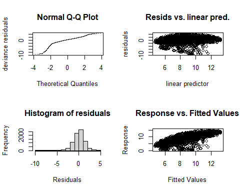

    #> 
    #> 'gamm' based fit - care required with interpretation.
    #> Checks based on working residuals may be misleading.
    #> Basis dimension (k) checking results. Low p-value (k-index<1) may
    #> indicate that k is too low, especially if edf is close to k'.
    #> 
    #>               k'  edf k-index p-value    
    #> s(T_Median) 2.00 1.99    0.87  <2e-16 ***
    #> ---
    #> Signif. codes:  0 '***' 0.001 '**' 0.01 '*' 0.05 '.' 0.1 ' ' 1

The model has essentially the same inadequacies as the prior model.

### Estimated Marginal Means

We again create the call object, and associate it with the model, and
finally manually construct a reference grid before calling `emmeans()`
to extract marginal means. This workflow has the advantage that it
requires us to think carefully about the structure of the reference
grid. We explicitly specify that we want the marginal means estimated at
Year = 2014.

``` r
the_call <-  quote(gamm(DO_Median ~ Site + 
                        s(T_Median, k = 1) +
                        Year_f,
                       correlation = corAR1(form = ~ as.numeric(sdate) | Site),
                       na.action = na.omit, 
                       method = 'REML',
                       data = full_data))
do_gamm_2$gam$call <- the_call
```

#### By Site

``` r
(by_site_2 <- summary(emmeans(my_ref_grid, ~ Site)))
#>  Site emmean    SE   df lower.CL upper.CL
#>  S07    8.04 0.162 6083     7.72     8.35
#>  S06B   7.81 0.207 6083     7.40     8.21
#>  S05    7.17 0.318 6083     6.55     7.79
#>  S17    8.50 0.235 6083     8.04     8.96
#>  S03    8.70 0.158 6083     8.39     9.01
#>  S01    8.55 0.159 6083     8.24     8.86
#> 
#> Results are averaged over the levels of: Month, Year_f 
#> Confidence level used: 0.95
```

``` r
plot(by_site_2) + 
  xlab('DO (mg/l)\n(Flow and Temperature Adjusted)') +
  ylab("Upstream         Main Stem          Lower Tribs") +
  annotate('text', 11, 2.5, label = labl, size = 3) +
  xlim(0,12) +
  geom_vline(xintercept =  7, color = 'orange') +
  geom_vline(xintercept =  5, color = 'red') +
  coord_flip() +
  theme_cbep(base_size = 12)
```


#### By Year

``` r
my_ref_grid <- ref_grid(do_gamm_2, cov.reduce = median) 
(by_year_2 <- summary(emmeans(my_ref_grid, 'Year_f')))
#>  Year_f emmean    SE   df lower.CL upper.CL
#>  2010     8.58 0.288 8247     8.01     9.14
#>  2011     8.44 0.263 8247     7.92     8.95
#>  2012     7.98 0.280 8247     7.43     8.53
#>  2013     8.08 0.221 8247     7.65     8.52
#>  2014     7.51 0.224 8247     7.07     7.94
#>  2015     7.92 0.230 8247     7.47     8.37
#>  2016     6.70 0.224 8247     6.26     7.14
#>  2017     7.82 0.211 8247     7.41     8.24
#>  2018     7.35 0.226 8247     6.91     7.80
#> 
#> Results are averaged over the levels of: Site 
#> Confidence level used: 0.95
```

``` r
plot(by_year_2) + 
  annotate('text', 11, 6, label = labl, size = 3) +
  xlim(0,12) +
  xlab('DO (mg/l)\n(Flow and Temperature Adjusted)') +
  ylab('') +
  geom_vline(xintercept =  7, color = 'orange') +
  geom_vline(xintercept =  5, color = 'red') +
  coord_flip() +
  theme_cbep(base_size = 12)
```

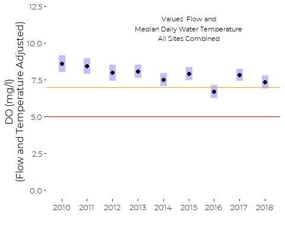

# Compare Marginal Means From Two Models

## Calculate Observed Averages

``` r
avg_by_site <- full_data %>%
  select(Site, DO_Median) %>%
  group_by(Site) %>%
  summarize(observed = mean(DO_Median, na.rm = TRUE),
            .groups = 'drop')  %>%
  pull(observed)

avg_by_year <- full_data %>%
  select(Year_f, DO_Median) %>%
  group_by(Year_f) %>%
  summarize(observed = mean(DO_Median, na.rm = TRUE),
            .groups = 'drop')  %>%
  pull(observed)
```

## By Site

``` r
tibble(Site = by_site$Site,
       observed = avg_by_site,
       large = by_site$emmean,
       small = by_site_2$emmean ) %>%

ggplot(aes(x = observed)) +
  geom_point(aes(y = small), color = 'red') +
  geom_point(aes(y = large), color = 'blue') +
  geom_text(aes(y = small, label = Site),
            hjust = 0, nudge_x = 0.05, nudge_y = -0.05) +
  geom_abline(slope = 1, intercept = 0) +
  xlab('Observed') +
  ylab('Marginal Means')  +
  xlim(6.5, 9.5) +
  ylim(6.5,9.5)
```

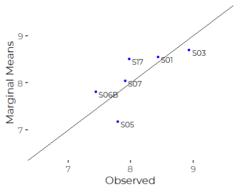

Correspondence with observed means is only so-so, as is expected with
uneven sampling histories. The main difference is in shifting position
of S05 and S17. These sites have inconsistent sampling histories, so
marginal means are adjusted by year. S17 was observed principally during
“bad” years, so the marginal mean (which is averaged across for ALL
years) as adjusted upwards, since the model concludes the observed
values would probably have been better. Meanwhile, site S05 is shifted
down, for similar reasons.

The smaller model consistently predicts a smaller marginal mean. The
relationship appears to be nearly perfectly linear, which is not too
surprising, since the smaller model differs by dropping two linear model
terms that were averaged across by `emmeans()`.

## By Year

``` r
tibble(Year = by_year$Year,
       observed = avg_by_year,
       large = by_year$emmean,
       small = by_year_2$emmean ) %>%

ggplot(aes(x = observed)) +
  geom_point(aes(y = small), color = 'red') +
  geom_point(aes(y = large), color = 'blue') +
  geom_text(aes(y = small, label = Year),
            hjust = 0, nudge_x = 0.05, nudge_y = -0.05) +
  geom_abline(slope = 1, intercept = 0) +
  xlab('Observed') +
  ylab('Marginal Means') # +
```

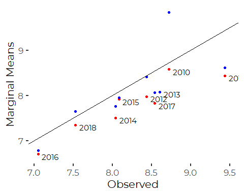

``` r
 # xlim(6.5, 9.5) +
 # ylim(6.5,9.5)
```

Here, correlations between observed averages and estimated marginal
means are a bit more consistent, with the exception of the truly wild
value forecast for Year 2010 from the “full” model.

Year 2010 is an outlier regarding seasonal availability of data. Data
collection began in June, so there is no data from the cooler months of
March, April, and May. Apparently, the larger model makes a very large
correction for the lack of data from those cool months.

Again, the smaller model consistently predicts the smaller marginal
means. This probably reflects the impact of estimating marginal means by
month, which is not a term in the smaller model.

# Hierarchical Analysis of Trends

We hierarchical GAMs that includes both autocorrelated errors and a
random term by year. The concept is that year to year variation can be
thought of as random based on annual weather, or perhaps watershed flow
conditions. We test for a long term trend against that random term, to
minimize the risk that we overinterpret year to year variability as a
trend. But note that this model also includes terms for stream water
temperature and flow.

## Model 1 : Site by Year interaction

We should be careful, as data is only available for selected years for
three of our sites, including SO5, S06B and S17. This means we may be
overfitting the trends fror some of those sites based on a limited
number of years.

We thought this would be a slow model to fit, so we save a version, but
the model converges relatively rapidly.

``` r
if (! file.exists("models/do_gamm_trend_1.rds")) {
  print(
    system.time(
      do_gamm_trend_1 <- gamm(DO_Median ~ Site * Year +
                        T_Median +
                        s(FlowIndex, k = 5) +
                        Month, 
                       random = list(Year_f = ~ 1),
                       correlation = corAR1(form = ~ as.numeric(sdate) | Site),
                       na.action = na.omit, 
                       method = 'REML',
                       data = full_data)
    )
  )
  saveRDS(do_gamm_trend_1, file="models/do_gamm_trend_1.rds")
} else {
  do_gamm_trend_1 <- readRDS("models/do_gamm_trend_1.rds")
}
```

### ANOVA

``` r
anova(do_gamm_trend_1$gam)
#> 
#> Family: gaussian 
#> Link function: identity 
#> 
#> Formula:
#> DO_Median ~ Site * Year + T_Median + s(FlowIndex, k = 5) + Month
#> 
#> Parametric Terms:
#>           df        F  p-value
#> Site       5    1.937 0.084800
#> Year       1    7.994 0.004707
#> T_Median   1 2028.141  < 2e-16
#> Month      8    3.756 0.000212
#> Site:Year  5    1.942 0.084010
#> 
#> Approximate significance of smooth terms:
#>                edf Ref.df     F p-value
#> s(FlowIndex) 3.943  3.943 59.28  <2e-16
```

Here the Site by Year term is marginally statistically significant, with
both the marginally significant Site and Site:Year interaction tied to
S05.

### Summary

``` r
summary(do_gamm_trend_1$gam)
#> 
#> Family: gaussian 
#> Link function: identity 
#> 
#> Formula:
#> DO_Median ~ Site * Year + T_Median + s(FlowIndex, k = 5) + Month
#> 
#> Parametric coefficients:
#>                 Estimate Std. Error t value Pr(>|t|)    
#> (Intercept)    5.021e+02  1.733e+02   2.898 0.003771 ** 
#> SiteS06B       9.916e-01  2.949e+02   0.003 0.997317    
#> SiteS05        8.748e+02  3.980e+02   2.198 0.028002 *  
#> SiteS17       -3.945e+02  4.587e+02  -0.860 0.389770    
#> SiteS03       -3.440e+01  1.695e+02  -0.203 0.839182    
#> SiteS01       -2.415e+02  1.706e+02  -1.415 0.157058    
#> Year          -2.432e-01  8.601e-02  -2.827 0.004707 ** 
#> T_Median      -2.461e-01  5.464e-03 -45.035  < 2e-16 ***
#> MonthApr      -3.428e-01  1.442e-01  -2.378 0.017457 *  
#> MonthMay      -6.156e-01  1.740e-01  -3.538 0.000406 ***
#> MonthJun      -8.250e-01  1.894e-01  -4.356 1.35e-05 ***
#> MonthJul      -9.452e-01  2.036e-01  -4.642 3.52e-06 ***
#> MonthAug      -9.825e-01  2.092e-01  -4.696 2.71e-06 ***
#> MonthSep      -9.690e-01  2.131e-01  -4.547 5.54e-06 ***
#> MonthOct      -1.098e+00  2.186e-01  -5.022 5.25e-07 ***
#> MonthNov      -9.139e-01  2.347e-01  -3.893 0.000100 ***
#> SiteS06B:Year -5.960e-04  1.463e-01  -0.004 0.996749    
#> SiteS05:Year  -4.352e-01  1.978e-01  -2.200 0.027817 *  
#> SiteS17:Year   1.959e-01  2.275e-01   0.861 0.389140    
#> SiteS03:Year   1.740e-02  8.413e-02   0.207 0.836167    
#> SiteS01:Year   1.201e-01  8.470e-02   1.418 0.156152    
#> ---
#> Signif. codes:  0 '***' 0.001 '**' 0.01 '*' 0.05 '.' 0.1 ' ' 1
#> 
#> Approximate significance of smooth terms:
#>                edf Ref.df     F p-value    
#> s(FlowIndex) 3.943  3.943 59.28  <2e-16 ***
#> ---
#> Signif. codes:  0 '***' 0.001 '**' 0.01 '*' 0.05 '.' 0.1 ' ' 1
#> 
#> R-sq.(adj) =  0.703   
#>   Scale est. = 1.8831    n = 6113
```

### Estimated Daily Autocorrelation

``` r
summary(do_gamm_trend_1$lme)$modelStruct$corStruct
#> Correlation structure of class corARMA representing
#>      Phi1 
#> 0.9077314
```

### Structure of the Smoother

``` r
plot(do_gamm_trend_1$gam)
```

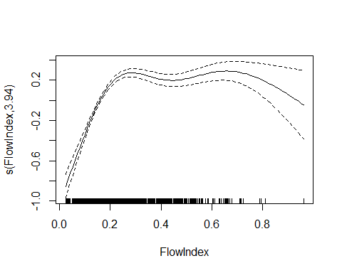

### Examine Marginal Means

We need to look at the marginally significant interaction, but we should
be careful here, as data is only available for selected years for three
of our sites, including SO5, S06B and S17.

``` r
the_call <-  quote(gamm(DO_Median ~ Site * Year +
                        T_Median +
                        s(FlowIndex, k = 5) +
                        Month, 
                       random = list(Year_f = ~ 1),
                       correlation = corAR1(form = ~ as.numeric(sdate) | Site),
                       na.action = na.omit, 
                       method = 'REML',
                       data = full_data))
do_gamm_trend_1$gam$call <- the_call

#my_ref_grid <- ref_grid(do_gamm_trend_1, cov.keep = 'Year', cov.reduce = median) 
#(by_year <- summary(emmeans(my_ref_grid, ~ Site + Year )))
```

``` r
emmip(do_gamm_trend_1, Site ~ Year,
      cov.keep = 'Year', cov.reduce = median,
      type = 'response') +
  ylab('Predicted DO Concentration')
```

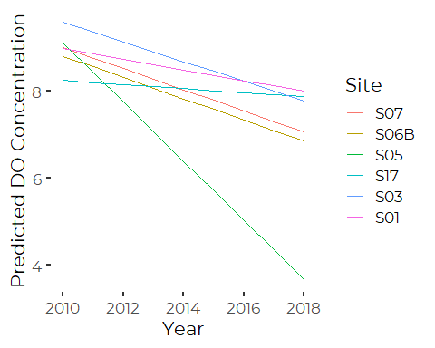

That suggests that Site S05 has a low average dissolved oxygen, and a
steep decline in DO over time. In fact, that is mostly an artifact of
overfitting linear terms to a short record. S05 data is only available
from early in the period of record, and had a moderate DO record.

``` r
full_data %>%
  filter(Site == 'S05', ! is.na(DO_Median)) %>%
  group_by(Year) %>%
  summarize(n = n(),
            do_mean = mean(DO_Median),
            do_median = median(DO_Median))
#> # A tibble: 4 x 4
#>    Year     n do_mean do_median
#> * <int> <int>   <dbl>     <dbl>
#> 1  2010    66    8.95      7.82
#> 2  2011    72    8.42      8.14
#> 3  2013   122    9.64      9.28
#> 4  2014   214    6.16      6.95
```

So we fit a slope to a four year record, where a linear model makes
effectively no sense.

We conclude that the full interaction model is problematic.

## Model 2: No Interaction

This model does slight violence to the prior analysis, but is arguably a
better description of what we know from the available data. It avoids
overfitting the short site by site records.

``` r
if (! file.exists("models/do_gamm_trend_2.rds")) {
  print(
    system.time(
      do_gamm_trend_2 <- gamm(DO_Median ~ Site + Year +
                        T_Median +
                        s(FlowIndex, k = 5) +
                        Month, 
                       random = list(Year_f = ~ 1),
                       correlation = corAR1(form = ~ as.numeric(sdate) | Site),
                       na.action = na.omit, 
                       method = 'REML',
                       data = full_data)
    )
  )
  saveRDS(do_gamm_trend_2, file="models/do_gamm_trend_2.rds")
} else {
  do_gamm_trend_2 <- readRDS("models/do_gamm_trend_2.rds")
}
```

### ANOVA

``` r
anova(do_gamm_trend_2$gam)
#> 
#> Family: gaussian 
#> Link function: identity 
#> 
#> Formula:
#> DO_Median ~ Site + Year + T_Median + s(FlowIndex, k = 5) + Month
#> 
#> Parametric Terms:
#>          df        F  p-value
#> Site      5    6.580 4.09e-06
#> Year      1    8.663 0.003259
#> T_Median  1 2018.918  < 2e-16
#> Month     8    3.712 0.000244
#> 
#> Approximate significance of smooth terms:
#>                edf Ref.df     F p-value
#> s(FlowIndex) 3.943  3.943 58.84  <2e-16
```

Here the Year term AND the Site terms are statistically significant.

## Summary

``` r
summary(do_gamm_trend_2$gam)
#> 
#> Family: gaussian 
#> Link function: identity 
#> 
#> Formula:
#> DO_Median ~ Site + Year + T_Median + s(FlowIndex, k = 5) + Month
#> 
#> Parametric coefficients:
#>               Estimate Std. Error t value Pr(>|t|)    
#> (Intercept) 452.238075 149.494358   3.025 0.002496 ** 
#> SiteS06B     -0.240666   0.252630  -0.953 0.340811    
#> SiteS05      -0.865079   0.352752  -2.452 0.014220 *  
#> SiteS17       0.468813   0.272847   1.718 0.085807 .  
#> SiteS03       0.658916   0.218745   3.012 0.002604 ** 
#> SiteS01       0.512154   0.218970   2.339 0.019372 *  
#> Year         -0.218453   0.074218  -2.943 0.003259 ** 
#> T_Median     -0.245685   0.005468 -44.932  < 2e-16 ***
#> MonthApr     -0.339425   0.144353  -2.351 0.018737 *  
#> MonthMay     -0.608842   0.174337  -3.492 0.000482 ***
#> MonthJun     -0.814891   0.189891  -4.291 1.80e-05 ***
#> MonthJul     -0.935305   0.204250  -4.579 4.76e-06 ***
#> MonthAug     -0.975410   0.209988  -4.645 3.47e-06 ***
#> MonthSep     -0.966209   0.214081  -4.513 6.50e-06 ***
#> MonthOct     -1.101842   0.219694  -5.015 5.44e-07 ***
#> MonthNov     -0.915815   0.235955  -3.881 0.000105 ***
#> ---
#> Signif. codes:  0 '***' 0.001 '**' 0.01 '*' 0.05 '.' 0.1 ' ' 1
#> 
#> Approximate significance of smooth terms:
#>                edf Ref.df     F p-value    
#> s(FlowIndex) 3.943  3.943 58.84  <2e-16 ***
#> ---
#> Signif. codes:  0 '***' 0.001 '**' 0.01 '*' 0.05 '.' 0.1 ' ' 1
#> 
#> R-sq.(adj) =   0.69   
#>   Scale est. = 1.9092    n = 6113
```

## Estimated Daily Autocorrelation

``` r
summary(do_gamm_trend_2$lme)$modelStruct$corStruct
#> Correlation structure of class corARMA representing
#>      Phi1 
#> 0.9090106
```

### Structure of the Smoother

``` r
plot(do_gamm_trend_2$gam)
```


### Examine Marginal Means

We need to look at the marginally significant interaction, but we should
be careful here, as data is only available for selected years for three
of our sites, including SO5, S06B and S17.

``` r
the_call <-  quote(gamm(DO_Median ~ Site + Year +
                        T_Median +
                        s(FlowIndex, k = 5) +
                        Month, 
                       random = list(Year_f = ~ 1),
                       correlation = corAR1(form = ~ as.numeric(sdate) | Site),
                       na.action = na.omit, 
                       method = 'REML',
                       data = full_data))
do_gamm_trend_2$gam$call <- the_call

my_ref_grid <- ref_grid(do_gamm_trend_2, cov.reduce = median, 
                        at = list(Year = 2014)) 
(by_site <- summary(emmeans(my_ref_grid, ~ Site  )))
#>  Site emmean    SE   df lower.CL upper.CL
#>  S07    8.02 0.234 6093     7.56     8.48
#>  S06B   7.78 0.267 6093     7.25     8.30
#>  S05    7.15 0.357 6093     6.45     7.85
#>  S17    8.49 0.289 6093     7.92     9.05
#>  S03    8.68 0.232 6093     8.22     9.13
#>  S01    8.53 0.232 6093     8.08     8.98
#> 
#> Results are averaged over the levels of: Month 
#> Confidence level used: 0.95
```

``` r
plot(by_site) +
  xlab('Predicted DO (mg/l)') +
  coord_flip() 
```

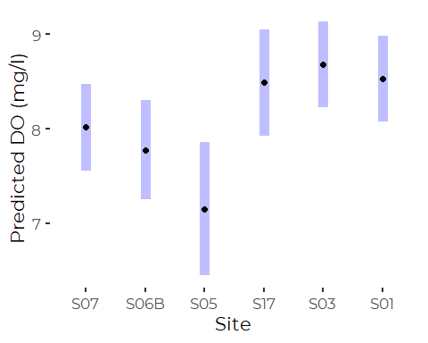

Note that we STILL predict low DO for S05 in 2014, but the prediction is
actually not far of the observed averages.
