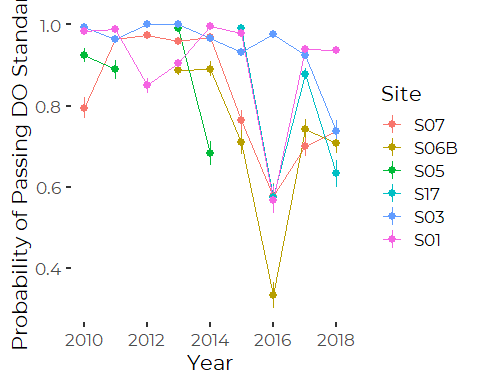
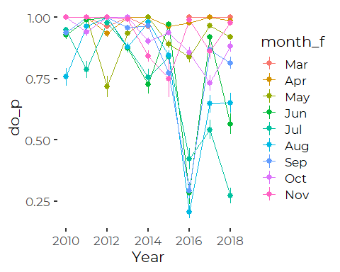
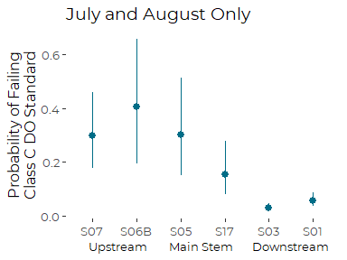
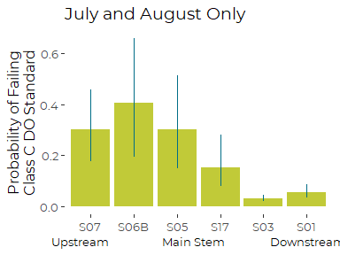
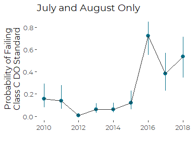
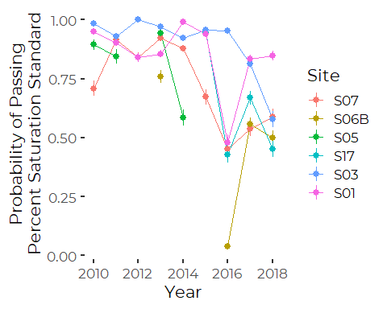
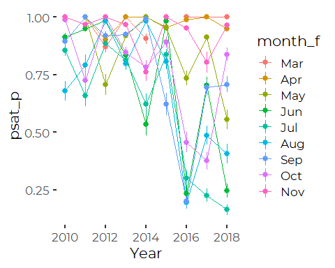
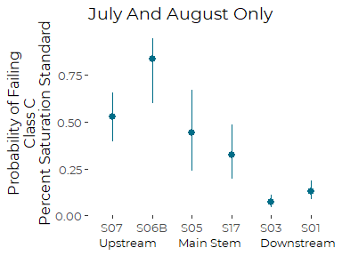
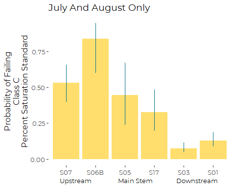

Analysis of LCWMD ‘Diurnal Exceedences’ of Class C DO Standards
================
Curtis C. Bohlen, Casco Bay Estuary Partnership.
01/12/2021

-   [Introduction](#introduction)
    -   [Are Water Quality Criteria
        Met?](#are-water-quality-criteria-met)
    -   [Note](#note)
    -   [Sources of Threshold Values](#sources-of-threshold-values)
        -   [Dissolved oxygen](#dissolved-oxygen)
-   [Import Libraries](#import-libraries)
-   [Data Preparation](#data-preparation)
    -   [Folder References](#folder-references)
    -   [Data on Sites and Impervious
        Cover](#data-on-sites-and-impervious-cover)
    -   [Main Data](#main-data)
    -   [Data Corrections](#data-corrections)
        -   [Anomolous Depth Values](#anomolous-depth-values)
        -   [Single S06B Chloride Observation from
            2017](#single-s06b-chloride-observation-from-2017)
        -   [Anomolous Dissolved Oxygen and Chloride
            Values](#anomolous-dissolved-oxygen-and-chloride-values)
    -   [Remove Partial Data from Winter
        Months](#remove-partial-data-from-winter-months)
    -   [Add Stream Flow Index](#add-stream-flow-index)
    -   [Create July and August Data
        Only](#create-july-and-august-data-only)
-   [Initial Cross Tabs](#initial-cross-tabs)
    -   [Utility Function](#utility-function)
    -   [Dissolved Oxygen](#dissolved-oxygen-1)
    -   [Percent Saturation](#percent-saturation)
-   [Dissolved Oxygen](#dissolved-oxygen-2)
    -   [Exploratory Graphics](#exploratory-graphics)
    -   [GAMM with Autocorrelated
        Error](#gamm-with-autocorrelated-error)
        -   [Extract and Plot Marginal
            Means](#extract-and-plot-marginal-means)
-   [Percent Saturation](#percent-saturation-1)
    -   [Exploratory Graphics](#exploratory-graphics-1)
    -   [GAMM with Autocorrelated
        Error](#gamm-with-autocorrelated-error-1)
        -   [Extract and Plot Marginal
            Means](#extract-and-plot-marginal-means-1)


# Introduction

The Long Creek Watershed, almost three and a half square miles in area,
is dominated by commercial land use. The Maine Mall is one of the
largest land owners in the watershed, and it is surrounded by a range of
commercial businesses, from medical offices, to car washes. About a
third of the watershed in impervious surfaces like roads, parking lots,
and rooftops.

Landowners with an acre or more of impervious area are required to get a
Clean Water Act permit for stormwater discharges from their property.
The LCWMD provides an alternative for landowners to working to receive
an individual permit. Landowners who elect to participate in the The
Long Creek Watershed Management District receive a General Permit, in
return for providing funding to the District, and facilitating the work
of the district by permitting access to their property for certain
activities.

For more information on LCWMD, see [their web
site](restorelongcreek.org).

Over the past decade, LCWMD has contracted with several consulting firms
to provide water quality monitoring services along Long Creek. This has
produced one of the most extensive and best documented data set from the
Northeastern US looking at water quality conditions in an urban stream.

GZA Geoenvironmental Incorporated (GZA) has been the primary monitoring
contractor for LCWMD for several years, and in 2019, they conducted a
thorough review of LCWMD data. These analyses are based on their summary
data sets, and recapitulate and extend their analyses.

## Are Water Quality Criteria Met?

The primary question we ask in this Notebook, is whether water quality
criteria pertaining to levels of dissolved oxygen are met. In
particular, we explore various ways of modeling those probabilities, and
settle on modeling only summertime probabilities as the most informative
for State of Casco Bay readers.

We ask whether the probability of failing to meet criteria each day is
changing. Secondarily, we examine differences among sites in the
probability of failing criteria.

We explored numerous alternate model forms before settling on the ones
presented here. (See the ‘DO\_Alternate\_Models.Rmd’ notebook for
details).

The primary challenge was that failure to meet dissolved oxygen
standards is relatively rare, so many models create cells in the design
matrix in which the probability of meeting water quality standards is
one.

This poses significant problems for estimating model parameters. The
models presented here are relatively sparse, to avoid those problems.

Critically, we focus ONLY on the July and August, when probability of
violating water quality conditions for dissolved oxygen were highest.
This allowed us to fit models looking across all years and sites.

## Note

In this data set a “TRUE” value consistently implies that water quality
criteria were met or exceeded, whether that is achieved by a value
higher than or lower than some numeric criteria. “TRUE” implies good
conditions. “FALSE” implies bad conditions.

## Sources of Threshold Values

### Dissolved oxygen

Maine’s Class B water quality standards call for dissolved oxygen above
7 mg/l, with percent saturation above 75%. The Class C Standards, which
apply to almost all of Long Creek, call for dissolved oxygen above 5
mg/l, with percent saturation above 60%. In addition, for class C
conditions, the thirty day average dissolved oxygen must stay above 6.5
mg/l.

# Import Libraries

``` r
library(nlme)      # Supports glmmPQL()
#library(MASS)      # for glmmPQL() function, which allows correlation in GLM

#library(glmmTMB)   # An alternate -- possibly more robust -- fitting algorithm

library(mgcv)     # For mixed effects GAMM models -- probably not needed here yet.
#> This is mgcv 1.8-33. For overview type 'help("mgcv-package")'.

library(tidyverse)  # Has to load after MASS, so `select()` is not masked
#> -- Attaching packages --------------------------------------- tidyverse 1.3.0 --
#> v ggplot2 3.3.3     v purrr   0.3.4
#> v tibble  3.0.5     v dplyr   1.0.3
#> v tidyr   1.1.2     v stringr 1.4.0
#> v readr   1.4.0     v forcats 0.5.0
#> -- Conflicts ------------------------------------------ tidyverse_conflicts() --
#> x dplyr::collapse() masks nlme::collapse()
#> x dplyr::filter()   masks stats::filter()
#> x dplyr::lag()      masks stats::lag()
library(readr)

library(emmeans)  # Provides tools for calculating marginal means

library(CBEPgraphics)
load_cbep_fonts()
theme_set(theme_cbep())

library(LCensMeans)
```

# Data Preparation

## Folder References

``` r
sibfldnm    <- 'Derived_Data'
parent      <- dirname(getwd())
sibling     <- file.path(parent,sibfldnm)

dir.create(file.path(getwd(), 'figures'), showWarnings = FALSE)
dir.create(file.path(getwd(), 'models'), showWarnings = FALSE)
```

## Data on Sites and Impervious Cover

These data were derived from Table 2 from a GZA report to the Long Creek
Watershed Management District, titled “Re: Long Creek Watershed Data
Analysis; Task 2: Preparation of Explanatory and Other Variables.” The
Memo is dated November 13, 2019 File No. 09.0025977.02.

Cumulative Area and IC calculations are our own, based on the GZA data
and the geometry of the stream channel.

``` r
# Read in data and drop the East Branch, where we have no data
fn <- "Site_IC_Data.csv"
fpath <- file.path(sibling, fn)

Site_IC_Data <- read_csv(fpath) %>%
  filter(Site != "--") 
#> 
#> -- Column specification --------------------------------------------------------
#> cols(
#>   Site = col_character(),
#>   Subwatershed = col_character(),
#>   Area_ac = col_double(),
#>   IC_ac = col_double(),
#>   CumArea_ac = col_double(),
#>   CumIC_ac = col_double(),
#>   PctIC = col_character(),
#>   CumPctIC = col_character()
#> )

# Now, create a factor that preserves the order of rows (roughly upstream to downstream). 
Site_IC_Data <- Site_IC_Data %>%
  mutate(Site = factor(Site, levels = Site_IC_Data$Site))

# Finally, convert percent covers to numeric values
Site_IC_Data <- Site_IC_Data %>%
  mutate(CumPctIC = as.numeric(substr(CumPctIC, 1, nchar(CumPctIC)-1))) %>%
  mutate(PctIC = as.numeric(substr(PctIC, 1, nchar(PctIC)-1)))
Site_IC_Data
#> # A tibble: 6 x 8
#>   Site  Subwatershed      Area_ac IC_ac CumArea_ac CumIC_ac PctIC CumPctIC
#>   <fct> <chr>               <dbl> <dbl>      <dbl>    <dbl> <dbl>    <dbl>
#> 1 S07   Blanchette Brook     434.  87.7       434.     87.7  20.2     20.2
#> 2 S06B  Upper Main Stem      623.  80.2       623.     80.2  12.9     12.9
#> 3 S05   Middle Main Stem     279.  53.6      1336     222.   19.2     16.6
#> 4 S17   Lower Main Stem      105   65.1      1441     287.   62       19.9
#> 5 S03   North Branch Trib    298. 123         298.    123    41.2     41.2
#> 6 S01   South Branch Trib    427. 240.        427.    240.   56.1     56.1
```

## Main Data

We remove 2019 data, as we don’t have a complete year’s worth of data,
which may bias annual summaries.

Note that this data does NOT include all of the predictors used in some
models looking at chlorides. In particular, it does not include stream
flow estimates

``` r
fn <- "Exceeds_Data.csv"
exceeds = read_csv(file.path(sibling, fn), progress=FALSE) %>%
  mutate(IC=Site_IC_Data$CumPctIC[match(Site, Site_IC_Data$Site)]) %>%
  select(-X1) %>%
  filter(Year < 2019) %>%
  mutate(Site = factor(Site, levels=levels(Site_IC_Data$Site)),
         year_f = factor(Year),
         month_f = factor(Month, levels = 1:12, labels = month.abb),
         DOY = as.numeric(format(sdate, format = '%j')),
         season = cut(Month, breaks = c(0,2,5,8,11,13),
                      labels = c('Winter', 'Spring',
                                 'Summer', 'Fall', 'Winter')),
         season = factor(season, levels = c('Winter', 'Spring', 
                                           'Summer', 'Fall'))) %>%
  mutate(lPrecip = log1p(Precip))
#> Warning: Missing column names filled in: 'X1' [1]
#> 
#> -- Column specification --------------------------------------------------------
#> cols(
#>   X1 = col_double(),
#>   sdate = col_date(format = ""),
#>   Site = col_character(),
#>   Year = col_double(),
#>   Month = col_double(),
#>   Precip = col_double(),
#>   PPrecip = col_double(),
#>   MaxT = col_double(),
#>   D_Median = col_double(),
#>   ClassCDO = col_logical(),
#>   ClassBDO = col_logical(),
#>   ClassC_PctSat = col_logical(),
#>   ClassB_PctSat = col_logical(),
#>   ClassCBoth = col_logical(),
#>   ClassBBoth = col_logical(),
#>   ChlCCC = col_logical(),
#>   ChlCMC = col_logical(),
#>   MaxT_ex = col_logical(),
#>   AvgT_ex = col_logical()
#> )
```

## Data Corrections

### Anomolous Depth Values

Several depth observations in the record appear highly unlikely. In
particular, several observations show daily median water depths over 15
meters. A few other observations show daily median depths over 4 meters,
which also looks unlikely in a stream of this size. All these events
also occurred in May or June of 2015 at site S05. Some sort of
malfunction of the pressure transducer appears likely.

We can trace these observations back to the raw QA/QC’d pressure and
sonde data submitted to LCWMD by GZA, so they are not an artifact of our
data preparation.

We remove these extreme values. The other daily medians in May and June
of 2015 appear reasonable, and we leave them in place, although given
possible instability of the pressure sensors, it might make sense to
remove them all.

Note that removing depth observations from Site S05 will remove those
DATES from any model that uses the `FlowIndex` variable (see below) as a
predictor.

``` r
exceeds <- exceeds %>%
  mutate(D_Median = if_else(D_Median > 4, NA_real_, D_Median),
         lD_Median = log1p(D_Median))
```

### Single S06B Chloride Observation from 2017

The data includes just a single chloride observation from site S06B from
any year other than 2013. While we do not know if the data point is
legitimate or not, it has high leverage in several models, and we
suspect a transcription error of some sort.

We remove the Chloride value from the data.

``` r
exceeds <- exceeds %>%
  mutate(ChlCCC = if_else(Site == 'S06B' & Year > 2014,
                              NA, ChlCCC),
         ChlCMC = if_else(Site == 'S06B' & Year > 2014,
                              NA, ChlCMC))
```

### Anomolous Dissolved Oxygen and Chloride Values

#### Site S03, end of 2016

We noted extreme dissolved oxygen data at the end of 2016. Values were
both extreme and highly variable. (See discussion in the DO Analysis
workbooks).

We decide we should remove chloride and oxygen observations after
October 15th.

``` r
exceeds <- exceeds %>% 
  mutate(ChlCCC = if_else(Year == 2016 & Site == 'S03' & DOY > 288,
                              NA, ChlCCC),
         ChlCMC = if_else(Year == 2016 & Site == 'S03' & DOY > 288,
                              NA, ChlCMC),
         ClassCDO = if_else(Year == 2016 & Site == 'S03' & DOY > 288,
                              NA, ClassCDO),
         ClassBDO = if_else(Year == 2016 & Site == 'S03' & DOY > 288,
                              NA, ClassBDO),
         ClassC_PctSat = if_else(Year == 2016 & Site == 'S03' & DOY > 288,
                              NA, ClassC_PctSat),
         ClassB_PctSat = if_else(Year == 2016 & Site == 'S03' & DOY > 288,
                              NA, ClassB_PctSat),
         ClassCBoth = if_else(Year == 2016 & Site == 'S03' & DOY > 288,
                              NA, ClassCBoth),
         ClassBBoth = if_else(Year == 2016 & Site == 'S03' & DOY > 288,
                              NA, ClassBBoth))
```

## Remove Partial Data from Winter Months

We have very limited data from several months. We have January data from
only one year, and February data from only two, and December data from
only four years, all older. Both March and November sample sizes vary.

The limited winter data generates severely unbalanced samples, which may
lead to estimation problems, especially in models with crossed or
potentially crossed factors and predictors. More fundamentally, the
potential bias introduced by showing data from those months from just a
handful of years could give a misleading impression of seasonal
patterns. We trim December, January and February data, but leave the
other months.

It is important to remember, even after trimming the data, that:  
1. 2010 is a partial year,  
2. The period of sampling in March may be biased due to spring melt
timing.

``` r
xtabs(~ year_f + month_f, data = exceeds)
#>       month_f
#> year_f Jan Feb Mar Apr May Jun Jul Aug Sep Oct Nov Dec
#>   2010   0   0   0   0   0  69  97 103 120 124 120  35
#>   2011   0  15 101 120 124 120 124 124 120 124 120 112
#>   2012   0  39  93  90  93 113 124 124 120  39  96 124
#>   2013   9   0  46 128 155 140 124 124 120 138 150  15
#>   2014   0   0  53 102 155 150 155 155 150 155 120   0
#>   2015   0   0   8 141 186 180 186 186 180 160  30   0
#>   2016   0   0  10 170 186 180 186 186 180 186 168   0
#>   2017   0   0 186 180 186 180 186 186 180 186 102   0
#>   2018   0   0  16 180 186 180 186 186 180 186 126   0
```

``` r
exceeds <- exceeds %>%
  filter(Month >= 3 & Month <= 11)
```

## Add Stream Flow Index

We worked through many models on a site by site basis in which we
included data on water depth, but since the depth coordinate is
site-specific, a 10 cm depth at one site may be exceptional, while at
another it is commonplace. We generally want not a local measure of
stream depth, but a watershed-wide metric of high, medium, or low stream
flow.

Middle and Lower Main Stem sites would be suitable for a general flow
indicator across the watershed. The monitoring sites in that stretch of
Long Creek include include S05 and S17, however only site S05 has been
in continuous operation throughout the period of record, so we use depth
data from S05 to construct our general stream flow indicator.

Stream flow at S05 is correlated with flow at other sites, although not
all that closely correlated to flow in the downstream tributaries (S01
and S03).

``` r
exceeds %>%
  select(sdate, Site, lD_Median) %>%
  pivot_wider(names_from = Site, values_from = lD_Median) %>%
  select( -sdate) %>%
  cor(use = 'pairwise', method = 'pearson')
#>            S01       S03       S05      S06B       S07       S17
#> S01  1.0000000 0.4499047 0.6506630 0.6310361 0.5594067 0.7290077
#> S03  0.4499047 1.0000000 0.4526392 0.7152403 0.4578906 0.6666414
#> S05  0.6506630 0.4526392 1.0000000 0.8043943 0.7042711 0.7906571
#> S06B 0.6310361 0.7152403 0.8043943 1.0000000 0.5882527 0.8778188
#> S07  0.5594067 0.4578906 0.7042711 0.5882527 1.0000000 0.7327432
#> S17  0.7290077 0.6666414 0.7906571 0.8778188 0.7327432 1.0000000
```

We use the log of the daily median flow at S05 as a general
watershed-wide stream flow indicator, which we call `FlowIndex`. We use
the log of the raw median, to lessen the effect of the highly skewed
distribution of stream depths on the metric. The resulting index is
still highly skewed.

``` r
depth_data <- exceeds %>%
  filter (Site == 'S05') %>%
  select(sdate, lD_Median)

exceeds <- exceeds %>%
  mutate(FlowIndex = depth_data$lD_Median[match(sdate, depth_data$sdate)])

rm(depth_data)
```

## Create July and August Data Only

``` r
exceeds_two <- exceeds %>%
  filter(Month  > 6 & Month < 9)
```

# Initial Cross Tabs

## Utility Function

This function just adds a percent summary column to a cross-tab.

``` r
xt_pct <- function(.form, .dat) {
  xt <- xtabs(.form, data = .dat)
  xt <- cbind(xt, round(apply(xt, 1, function(X) X[1]/sum(X)), 3)*100)
  names(xt[3]) <- 'Percent Fail'
  return(xt)
}
```

## Dissolved Oxygen

``` r
xt_pct(~Year + ClassCDO, exceeds)
#>      FALSE TRUE     
#> 2010    42  545  7.2
#> 2011    26  705  3.6
#> 2012    35  559  5.9
#> 2013    59 1008  5.5
#> 2014    99  959  9.4
#> 2015   120  890 11.9
#> 2016   412  606 40.5
#> 2017   208 1051 16.5
#> 2018   262  755 25.8
```

## Percent Saturation

``` r
xt_pct(~Year + ClassC_PctSat, exceeds)
#>      FALSE TRUE     
#> 2010    66  521 11.2
#> 2011    68  678  9.1
#> 2012    64  538 10.6
#> 2013   110  913 10.8
#> 2014   143  796 15.2
#> 2015    90  625 12.6
#> 2016   513  465 52.5
#> 2017   403  856 32.0
#> 2018   427  590 42.0
```

The two oxygen-related exceedences are correlated. IN particular, no
samples met the Percent Saturation standard, but failed the dissolved
oxygen standard.

``` r
xtabs(~ ClassCDO + ClassC_PctSat, data = exceeds)
#>         ClassC_PctSat
#> ClassCDO FALSE TRUE
#>    FALSE  1178    0
#>    TRUE    682 5982
```

# Dissolved Oxygen

## Exploratory Graphics

These are estimated as empirical relative frequencies, with error
estimated as two times the standard error of the estimate.

``` r
exceeds %>%
  group_by(Site, Year) %>%
  summarize(do_true = sum(ClassCDO, na.rm = TRUE),
            do_count = sum(! is.na(ClassCDO)),
            do_p = do_true/do_count,
            do_err = do_p*(1-do_p)/sqrt(do_count),
            .groups = 'drop') %>%
  ggplot(aes(Year, do_p, color = Site)) +
  geom_line() +
  geom_pointrange(aes(ymin = do_p-2 * do_err, ymax = do_p + 2 * do_err)) +
  ylab('Probability of Passing DO Standard')
#> Warning: Removed 4 row(s) containing missing values (geom_path).
#> Warning: Removed 5 rows containing missing values (geom_pointrange).
```


2016 was a rough year at most sites.

Note that for some year/ site combination, we never had a failure to
meet DO standards. This limits models we can fit.

``` r
exceeds  %>%
  group_by(month_f, Year) %>%
  summarize(do_true = sum(ClassCDO, na.rm = TRUE),
            do_count = sum(! is.na(ClassCDO)),
            do_p = do_true/do_count,
            do_err = do_p*(1-do_p)/sqrt(do_count)) %>%
  ggplot(aes(Year, do_p, color = month_f)) +
  geom_line() +
  geom_pointrange(aes(ymin = do_p-2 * do_err, ymax = do_p + 2 * do_err))
#> `summarise()` has grouped output by 'month_f'. You can override using the `.groups` argument.
#> Warning: Removed 1 rows containing missing values (geom_pointrange).
```


That shows that 2016 was a tough year in June, July, August, and
September, while June and July were tough in 2018. This highlights the
role of drought in shaping conditions in Long Creek regarding dissolved
oxygen.

## GAMM with Autocorrelated Error

Multiple attempts at a GAMM models had convergence problems, but
provided insight into model formulation. These models sometimes took
over an hour to run, without reaching convergence. Other models ran into
other kinds of estimability problems for some key predictors, so we
ended up with a relatively simple model:

A model that omits the flow index term converges rapidly (\~ 5 min, 7
iterations).

``` r
if (! file.exists("models/do_gamm_two_2.rds")) {
  system.time(
    do_gamm_two_2<- gamm(ClassCDO ~ Site + year_f + MaxT + 
                         s(lPrecip),
                       correlation = corCAR1(form = ~ sdate | Site),
                       family = 'binomial',
                       niterPQL = 50, verbosePQL = TRUE,
                       data = exceeds_two)
)
  saveRDS(do_gamm_two_2, file="models/do_gamm_two_2.rds")
} else {
  do_gamm_two_2 <- readRDS("models/do_gamm_two_2.rds")
}
#> 
#>  Maximum number of PQL iterations:  50
#> iteration 1
#> iteration 2
#> iteration 3
#> iteration 4
#> iteration 5
#> iteration 6
#> iteration 7
```

``` r
summary(do_gamm_two_2$gam)
#> 
#> Family: binomial 
#> Link function: logit 
#> 
#> Formula:
#> ClassCDO ~ Site + year_f + MaxT + s(lPrecip)
#> 
#> Parametric coefficients:
#>              Estimate Std. Error t value Pr(>|t|)    
#> (Intercept)  2.736509   0.680505   4.021 5.99e-05 ***
#> SiteS06B    -0.461853   0.626246  -0.737  0.46090    
#> SiteS05     -0.001907   0.563522  -0.003  0.99730    
#> SiteS17      0.863282   0.542636   1.591  0.11178    
#> SiteS03      2.660625   0.410358   6.484 1.10e-10 ***
#> SiteS01      1.984968   0.425456   4.666 3.27e-06 ***
#> year_f2011   0.128716   0.566560   0.227  0.82030    
#> year_f2012   3.273380   0.579070   5.653 1.79e-08 ***
#> year_f2013   1.053101   0.551426   1.910  0.05629 .  
#> year_f2014   1.008055   0.512201   1.968  0.04919 *  
#> year_f2015   0.286600   0.539456   0.531  0.59528    
#> year_f2016  -2.645678   0.549333  -4.816 1.56e-06 ***
#> year_f2017  -1.207041   0.539296  -2.238  0.02531 *  
#> year_f2018  -1.822345   0.554083  -3.289  0.00102 ** 
#> MaxT        -0.007636   0.001599  -4.775 1.92e-06 ***
#> ---
#> Signif. codes:  0 '***' 0.001 '**' 0.01 '*' 0.05 '.' 0.1 ' ' 1
#> 
#> Approximate significance of smooth terms:
#>              edf Ref.df     F p-value    
#> s(lPrecip) 2.193  2.193 23.51  <2e-16 ***
#> ---
#> Signif. codes:  0 '***' 0.001 '**' 0.01 '*' 0.05 '.' 0.1 ' ' 1
#> 
#> R-sq.(adj) =  0.398   
#>   Scale est. = 1         n = 2187
```

`gam.check()` is only marginally useful for a binomial GAM, but we look
anyway.

``` r
gam.check(do_gamm_two_2$gam)
```


    #> 
    #> 'gamm' based fit - care required with interpretation.
    #> Checks based on working residuals may be misleading.
    #> Basis dimension (k) checking results. Low p-value (k-index<1) may
    #> indicate that k is too low, especially if edf is close to k'.
    #> 
    #>              k'  edf k-index p-value    
    #> s(lPrecip) 9.00 2.19    0.53  <2e-16 ***
    #> ---
    #> Signif. codes:  0 '***' 0.001 '**' 0.01 '*' 0.05 '.' 0.1 ' ' 1

### Extract and Plot Marginal Means

``` r
the_call <-  quote(gamm(ClassCDO ~ Site + year_f + MaxT + 
                         s(lPrecip),
                       correlation = corCAR1(form = ~ sdate | Site),
                       family = 'binomial',
                       niterPQL = 50, verbosePQL = TRUE,
                       data = exceeds_two))
do_gamm_two_2$gam$call <- the_call
```

#### By Site

``` r
my_ref_grid <- ref_grid(do_gamm_two_2,  cov.reduce = median) 
(b <- emmeans(my_ref_grid, ~ Site, type = 'response'))
#>  Site  prob      SE   df lower.CL upper.CL
#>  S07  0.700 0.07290 2170    0.542    0.822
#>  S06B 0.595 0.12842 2170    0.341    0.807
#>  S05  0.700 0.09615 2170    0.487    0.851
#>  S17  0.847 0.05039 2170    0.721    0.922
#>  S03  0.971 0.00629 2170    0.956    0.981
#>  S01  0.944 0.01242 2170    0.914    0.964
#> 
#> Results are averaged over the levels of: year_f 
#> Confidence level used: 0.95 
#> Intervals are back-transformed from the logit scale
```

##### Graphics

``` r
s <- summary(b) %>% 
  mutate(fprob = 1-prob,
         fUCL = 1 - lower.CL,
         fLCL = 1 - upper.CL)

ggplot(s, aes(Site, fprob)) +
 
  geom_pointrange(aes(ymin = fLCL, ymax = fUCL),
                color = cbep_colors()[1]) +
  
  ylab('Probability of Failing\nClass C DO Standard') +
  xlab('     Upstream        Main Stem       Downstream') +
  ggtitle('July and August Only') +
  theme_cbep(base_size = 12) +
  theme(axis.title.x = element_text(size = 10))
```



``` r
ggplot(s, aes(Site, fprob)) +
  geom_col(fill = cbep_colors()[4]) + 
  geom_linerange(aes(ymin = fLCL, ymax = fUCL),
                color = cbep_colors()[1]) +
  
  ylab('Probability of Failing\nClass C DO Standard') +
  xlab('Upstream                    Main Stem                 Downstream') +
  ggtitle('July and August Only') +
  theme_cbep(base_size = 12) +
  theme(axis.title.x = element_text(size = 10))
```



#### By Year

``` r
my_ref_grid <- ref_grid(do_gamm_two_2,  cov.reduce = median) 
(b <- emmeans(my_ref_grid, ~ year_f, type = 'response'))
#>  year_f  prob      SE   df lower.CL upper.CL
#>  2010   0.843 0.05345 2170    0.709    0.922
#>  2011   0.859 0.05265 2170    0.722    0.935
#>  2012   0.993 0.00307 2170    0.983    0.997
#>  2013   0.939 0.02109 2170    0.882    0.969
#>  2014   0.936 0.02070 2170    0.882    0.967
#>  2015   0.877 0.04168 2170    0.770    0.939
#>  2016   0.276 0.07837 2170    0.150    0.451
#>  2017   0.616 0.09065 2170    0.431    0.773
#>  2018   0.464 0.09880 2170    0.285    0.654
#> 
#> Results are averaged over the levels of: Site 
#> Confidence level used: 0.95 
#> Intervals are back-transformed from the logit scale
```

##### Graphics

``` r
s <- summary(b)

s %>% 
  mutate(fprob = 1-prob,
         fUCL = 1 - lower.CL,
         fLCL = 1 - upper.CL) %>%
ggplot(aes(as.numeric(year_f) + 2009, fprob)) +
 
  geom_pointrange(aes(ymin = fLCL, ymax = fUCL),
                color = cbep_colors()[1]) +
  geom_line(color = cbep_colors()[3]) +
  
  ylab('Probability of Failing\nClass C DO Standard') +
  xlab('') +
  ggtitle('July and August Only') +
  theme_cbep(base_size = 12)
```



# Percent Saturation

## Exploratory Graphics

These are estimated as empirical relative frequencies, with error
estimated as two times the standard error of the estimate.

``` r
exceeds %>%
  group_by(Site, Year) %>%
  summarize(psat_true = sum(ClassC_PctSat, na.rm = TRUE),
            psat_count = sum(! is.na(ClassC_PctSat)),
            psat_p = psat_true/psat_count,
            psat_err = psat_p*(1-psat_p)/sqrt(psat_count),
            .groups = 'drop') %>%
  ggplot(aes(Year, psat_p, color = Site)) +
  geom_line() +
  geom_pointrange(aes(ymin = psat_p-2 *psat_err, ymax = psat_p + 2 * psat_err)) +
  ylab('Probability of Passing\nPercent Saturation Standard')
#> Warning: Removed 4 row(s) containing missing values (geom_path).
#> Warning: Removed 7 rows containing missing values (geom_pointrange).
```



Note that for some year/ site combination, we never had a failure to
meet standards. This limits models we can fit, as it did for DO.

``` r
exceeds  %>%
  group_by(month_f, Year) %>%
  summarize(psat_true = sum(ClassC_PctSat, na.rm = TRUE),
            psat_count = sum(! is.na(ClassC_PctSat)),
            psat_p = psat_true/psat_count,
            psat_err = psat_p*(1-psat_p)/sqrt(psat_count)) %>%
  ggplot(aes(Year, psat_p, color = month_f)) +
  geom_line() +
  geom_pointrange(aes(ymin = psat_p-2 * psat_err, ymax = psat_p + 2 * psat_err))
#> `summarise()` has grouped output by 'month_f'. You can override using the `.groups` argument.
#> Warning: Removed 1 rows containing missing values (geom_pointrange).
```



## GAMM with Autocorrelated Error

We follow the format of the DO model just developed. This model takes \~
15 minutes to fit and converges in 6 iterations.

``` r
if (! file.exists("models/psat_gamm_two_2.rds")) {
  system.time(
    psat_gamm_two_2<- gamm(ClassC_PctSat ~ Site + year_f + MaxT + 
                         s(lPrecip),
                       correlation = corCAR1(form = ~ sdate | Site),
                       family = 'binomial',
                       niterPQL = 50, verbosePQL = TRUE,
                       data = exceeds_two)
)
  saveRDS(psat_gamm_two_2, file="models/psat_gamm_two_2.rds")
} else {
  psat_gamm_two_2 <- readRDS("models/psat_gamm_two_2.rds")
}
#> 
#>  Maximum number of PQL iterations:  50
#> iteration 1
#> iteration 2
#> iteration 3
#> iteration 4
#> iteration 5
#> iteration 6
```

### Extract and Plot Marginal Means

``` r
the_call <-  quote(gamm(ClassC_PctSat ~ Site + year_f + MaxT + 
                         s(lPrecip),
                       correlation = corCAR1(form = ~ sdate | Site),
                       family = 'binomial',
                       niterPQL = 50, verbosePQL = TRUE,
                       data = exceeds_two))
psat_gamm_two_2$gam$call <- the_call
```

#### By Site

``` r
my_ref_grid <- ref_grid(psat_gamm_two_2,  cov.reduce = median) 
(b <- emmeans(my_ref_grid, ~ Site, type = 'response'))
#>  Site  prob     SE   df lower.CL upper.CL
#>  S07  0.471 0.0675 2032   0.3440    0.603
#>  S06B 0.164 0.0856 2032   0.0548    0.400
#>  S05  0.556 0.1178 2032   0.3298    0.762
#>  S17  0.676 0.0750 2032   0.5159    0.803
#>  S03  0.928 0.0169 2032   0.8873    0.955
#>  S01  0.871 0.0244 2032   0.8148    0.912
#> 
#> Results are averaged over the levels of: year_f 
#> Confidence level used: 0.95 
#> Intervals are back-transformed from the logit scale
```

##### Graphics

``` r
s <- summary(b) %>% 
  mutate(fprob = 1-prob,
         fUCL = 1 - lower.CL,
         fLCL = 1 - upper.CL)

ggplot(s, aes(Site, fprob)) +
 
  geom_pointrange(aes(ymin = fLCL, ymax = fUCL),
                color = cbep_colors()[1]) +
  
  ylab('Probability of Failing\nClass C\nPercent Saturation Standard') +
  xlab('     Upstream        Main Stem       Downstream') +
  ggtitle('July And August Only') +
  theme_cbep(base_size = 12) +
  theme(axis.title.x = element_text(size = 10))
```



#### By Year

``` r
my_ref_grid <- ref_grid(psat_gamm_two_2,  cov.reduce = median) 
(b <- emmeans(my_ref_grid, ~ year_f, type = 'response'))
#>  year_f  prob     SE   df lower.CL upper.CL
#>  2010   0.696 0.0781 2032    0.526    0.826
#>  2011   0.623 0.1107 2032    0.396    0.806
#>  2012   0.939 0.0263 2032    0.862    0.974
#>  2013   0.899 0.0326 2032    0.814    0.947
#>  2014   0.824 0.0478 2032    0.710    0.900
#>  2015   0.807 0.0622 2032    0.656    0.901
#>  2016   0.180 0.0513 2032    0.100    0.303
#>  2017   0.288 0.0756 2032    0.164    0.455
#>  2018   0.221 0.0614 2032    0.123    0.363
#> 
#> Results are averaged over the levels of: Site 
#> Confidence level used: 0.95 
#> Intervals are back-transformed from the logit scale
```

##### Graphics

``` r
ggplot(s, aes(Site, fprob)) +
  geom_col(fill = cbep_colors()[2]) + 
  geom_linerange(aes(ymin = fLCL, ymax = fUCL),
                color = cbep_colors()[1]) +
  
 ylab('Probability of Failing\nClass C\nPercent Saturation Standard') +
  xlab('Upstream                  Main Stem                Downstream ') +
  ggtitle('July And August Only') +
  theme_cbep(base_size = 12) +
  theme(axis.title.x = element_text(size = 10))
```


