Classificatin Tree Models of ‘Diurnal Exceedences’ on Long Creek
================
Curtis C. Bohlen, Casco Bay Estuary Partnership.
Updated 11/01/2021

-   [Introduction](#introduction)
    -   [Are Water Quality Criteria
        Met?](#are-water-quality-criteria-met)
    -   [Sources of Threshold Values](#sources-of-threshold-values)
        -   [Dissolved oxygen](#dissolved-oxygen)
        -   [Chloride](#chloride)
        -   [Temperature](#temperature)
-   [Import Libraries](#import-libraries)
-   [Data Preparation](#data-preparation)
    -   [Folder References](#folder-references)
    -   [Data on Sites and Impervious
        Cover](#data-on-sites-and-impervious-cover)
    -   [Main Data](#main-data)
    -   [Data Corrections](#data-corrections)
        -   [Anomolous Depth Values](#anomolous-depth-values)
        -   [Single S06B Chloride Observation from
            2017](#single-s06b-chloride-observation-from-2017)
    -   [Add Stream Flow Index](#add-stream-flow-index)
    -   [A Caution](#a-caution)
-   [Days that Pass DO Standards](#days-that-pass-do-standards)
    -   [Conclusions](#conclusions)
    -   [Frequency of Watershed Low
        Flow](#frequency-of-watershed-low-flow)
    -   [Low Flow in the Upper
        Watershed](#low-flow-in-the-upper-watershed)
-   [Complementary DO Model looking at local water
    depth](#complementary-do-model-looking-at-local-water-depth)
-   [Days that Pass PctSat Standards](#days-that-pass-pctsat-standards)
-   [Days that Pass Chloride
    Standards](#days-that-pass-chloride-standards)
    -   [CCC (Chronic Exposure)
        Standard](#ccc-chronic-exposure-standard)
    -   [CMC (Acute Exposure) Standard](#cmc-acute-exposure-standard)
-   [Days that Meet Temperature
    Thresholds](#days-that-meet-temperature-thresholds)
    -   [Acute Temperature Thresholds](#acute-temperature-thresholds)


# Introduction

## Are Water Quality Criteria Met?

The primary question we ask in this Notebook, is whether water quality
criteria are met. In particular, we explore classification tree models
to gain insight into the mechanisms likely to drive water quality
problems.

In this data set a “TRUE” value consistently implies that water quality
criteria were met or exceeded, whether that is achieved by a value
higher than or lower than some numeric criteria. “TRUE” implies good
conditions. “FALSE” implies bad conditions.

## Sources of Threshold Values

### Dissolved oxygen

Maine’s Class B water quality standards call for dissolved oxygen above
7 mg/l, with percent saturation above 75%. The Class C Standards, which
apply to almost all of Long Creek, call for dissolved oxygen above 5
mg/l, with percent saturation above 60%. In addition, for class C
conditions, the thirty day average dissolved oxygen must stay above 6.5
mg/l.

### Chloride

Maine uses established thresholds for both chronic and acute exposure to
chloride. These are the “CCC and CMC” standards for chloride in
freshwater. (06-096 CMR 584). These terms are defined in a footnote as
follows:

> The Criteria Maximum Concentration (CMC) is an estimate of the highest
> concentration of a material in surface water to which an aquatic
> community can be exposed briefly without resulting in an unacceptable
> effect. The Criterion Continuous Concentration (CCC) is an estimate of
> the highest concentration of a material in surface water to which an
> aquatic community can be exposed indefinitely without resulting in an
> unacceptable effect.

The relevant thresholds are:

-   Chloride CCC = 230 mg/l
-   Chloride CMC = 860 mg/l

In practice, chloride in Long Creek are indirectly estimated based on
measurement of conductivity. The chloride-conductivity correlations is
fairly close and robust, but estimation is an additional source of
error, although generally on the level of 10% or less.

### Temperature

There are no legally binding Maine criteria for maximum stream
temperature, but we can back into thresholds based on research on
thermal tolerance of brook trout in streams. A study from Michigan and
Wisconsin, showed that trout are found in streams with daily mean water
temperatures as high as 25.3°C, but only if the period of exceedence of
that daily average temperature is short – only one day. Similarly, the
one day daily maximum temperature above which trout were never found was
27.6°C. That generates two temperature criteria, one for daily averages,
and one for daily maximums.

These criteria should be taken as rough values only, as the original
study was observational, and thus the key driver of suitability for
trout could be another stressor correlated with these temperature
metrics.

> Wehrly, Kevin E.; Wang, Lizhu; Mitro, Matthew (2007). “Field‐Based
> Estimates of Thermal Tolerance Limits for Trout: Incorporating
> Exposure Time and Temperature Fluctuation.” Transactions of the
> American Fisheries Society 136(2):365-374.

# Import Libraries

``` r
library(rpart)
library(rpart.plot)
#> Warning: package 'rpart.plot' was built under R version 4.0.5
library(tidyverse)
#> Warning: package 'tidyverse' was built under R version 4.0.5
#> -- Attaching packages --------------------------------------- tidyverse 1.3.1 --
#> v ggplot2 3.3.5     v purrr   0.3.4
#> v tibble  3.1.4     v dplyr   1.0.7
#> v tidyr   1.1.3     v stringr 1.4.0
#> v readr   2.0.1     v forcats 0.5.1
#> Warning: package 'ggplot2' was built under R version 4.0.5
#> Warning: package 'tibble' was built under R version 4.0.5
#> Warning: package 'tidyr' was built under R version 4.0.5
#> Warning: package 'readr' was built under R version 4.0.5
#> Warning: package 'dplyr' was built under R version 4.0.5
#> Warning: package 'forcats' was built under R version 4.0.5
#> -- Conflicts ------------------------------------------ tidyverse_conflicts() --
#> x dplyr::filter() masks stats::filter()
#> x dplyr::lag()    masks stats::lag()
library(readr)

library(CBEPgraphics)
load_cbep_fonts()
theme_set(theme_cbep())
```

# Data Preparation

## Folder References

``` r
sibfldnm    <- 'Data'
parent      <- dirname(getwd())
sibling     <- file.path(parent,sibfldnm)

dir.create(file.path(getwd(), 'figures'), showWarnings = FALSE)
dir.create(file.path(getwd(), 'models'), showWarnings = FALSE)
```

## Data on Sites and Impervious Cover

These data were derived from Table 2 from a GZA report to the Long Creek
Watershed Management District, titled “Re: Long Creek Watershed Data
Analysis; Task 2: Preparation of Explanatory and Other Variables.” The
Memo is dated November 13, 2019 File No. 09.0025977.02.

Cumulative Area and IC calculations are our own, based on the GZA data
and the geometry of the stream channel.

``` r
# Read in data and drop the East Branch, where we have no data
fn <- "Site_IC_Data.csv"
fpath <- file.path(sibling, fn)

Site_IC_Data <- read_csv(fpath) %>%
  filter(Site != "--") 
#> Rows: 7 Columns: 8
#> -- Column specification --------------------------------------------------------
#> Delimiter: ","
#> chr (4): Site, Subwatershed, PctIC, CumPctIC
#> dbl (4): Area_ac, IC_ac, CumArea_ac, CumIC_ac
#> 
#> i Use `spec()` to retrieve the full column specification for this data.
#> i Specify the column types or set `show_col_types = FALSE` to quiet this message.
# Now, create a factor that preserves the order of rows (roughly upstream to downstream). 
Site_IC_Data <- Site_IC_Data %>%
  mutate(Site = factor(Site, levels = Site_IC_Data$Site))

# Finally, convert percent covers to numeric values
Site_IC_Data <- Site_IC_Data %>%
  mutate(CumPctIC = as.numeric(substr(CumPctIC, 1, nchar(CumPctIC)-1))) %>%
  mutate(PctIC = as.numeric(substr(PctIC, 1, nchar(PctIC)-1)))
Site_IC_Data
#> # A tibble: 6 x 8
#>   Site  Subwatershed      Area_ac IC_ac CumArea_ac CumIC_ac PctIC CumPctIC
#>   <fct> <chr>               <dbl> <dbl>      <dbl>    <dbl> <dbl>    <dbl>
#> 1 S07   Blanchette Brook     434.  87.7       434.     87.7  20.2     20.2
#> 2 S06B  Upper Main Stem      623.  80.2       623.     80.2  12.9     12.9
#> 3 S05   Middle Main Stem     279.  53.6      1336     222.   19.2     16.6
#> 4 S17   Lower Main Stem      105   65.1      1441     287.   62       19.9
#> 5 S03   North Branch Trib    298. 123         298.    123    41.2     41.2
#> 6 S01   South Branch Trib    427. 240.        427.    240.   56.1     56.1
```

## Main Data

We remove 2019 data, as we don’t have a complete year’s worth of data,
which may bias annual summaries.

Note that this data does NOT include all of the predictors used in some
models looking at chlorides. In particular, it does not include stream
flow estimates.

``` r
fn <- "Exceeds_Data.csv"
exceeds = read_csv(file.path(sibling, fn), progress=FALSE) %>%
  mutate(IC=Site_IC_Data$CumPctIC[match(Site, Site_IC_Data$Site)]) %>%
  select(-...1) %>%
  filter(Year < 2019) %>%
  mutate(Site = factor(Site, levels=levels(Site_IC_Data$Site))) %>%
  mutate(year_f = factor(Year),
         month_f = factor(Month, levels = 1:12, labels = month.abb),
         season = cut(Month, breaks = c(0,2,5,8,11,13),
                      labels = c('Winter', 'Spring',
                                 'Summer', 'Fall', 'Winter')),
         season = factor(season, levels = c('Winter', 'Spring', 
                                           'Summer', 'Fall'))) %>%
  mutate(lPrecip = log1p(Precip))
#> New names:
#> * `` -> ...1
#> Rows: 11422 Columns: 19
#> -- Column specification --------------------------------------------------------
#> Delimiter: ","
#> chr   (1): Site
#> dbl   (7): ...1, Year, Month, Precip, PPrecip, MaxT, D_Median
#> lgl  (10): ClassCDO, ClassBDO, ClassC_PctSat, ClassB_PctSat, ClassCBoth, Cla...
#> date  (1): sdate
#> 
#> i Use `spec()` to retrieve the full column specification for this data.
#> i Specify the column types or set `show_col_types = FALSE` to quiet this message.
```

## Data Corrections

### Anomolous Depth Values

Several depth observations in the record appear highly unlikely. In
particular, several observations show daily median water depths over 15
meters. A few other observations show daily median depths over 4 meters,
which also looks unlikely in a stream of this size. All these events
also occurred in May or June of 2015 at site S05. Some sort of
malfunction of the pressure transducer appears likely.

We can trace these observations back to the raw QA/QC’d pressure and
sonde data submitted to LCWMD by GZA, so they are not an artifact of our
data preparation.

We remove these extreme values. The other daily medians in May and June
of 2015 appear reasonable, and we leave them in place, although given
possible instability of the pressure sensors, it might make sense to
remove them all.

Note that removing depth observations from Site S05 will remove those
DATES from any model that uses the `FlowIndex` variable (see below) as a
predictor.

``` r
exceeds <- exceeds %>%
  mutate(D_Median = if_else(D_Median > 4, NA_real_, D_Median),
         lD_Median = log1p(D_Median))
```

### Single S06B Chloride Observation from 2017

The data includes just a single chloride observation from site S06B from
any year other than 2013. While we do not know if the data point is
legitimate or not, it has high leverage in several models, and we
suspect a transcription error of some sort.

We remove the Chloride value from the data.

``` r
exceeds <- exceeds %>%
  mutate(ChlCCC = if_else(Site == 'S06B' & Year > 2014,
                              NA, ChlCCC),
         ChlCMC = if_else(Site == 'S06B' & Year > 2014,
                              NA, ChlCMC))
```

## Add Stream Flow Index

We worked through many models on a site by site basis in which we
included data on water depth, but since the depth coordinate is
site-specific, a 10 cm depth at one site may be exceptional, while at
another it is commonplace. We generally want not a local measure of
stream depth, but a watershed-wide metric of high, medium, or low stream
flow.

Middle and Lower Maine Stem sites would be suitable for a general flow
indicator across the watershed. The monitoring sites in that stretch of
Long Creek include include S05 and S17, however only site S05 has been
in continuous operation throughout the period of record, so we use depth
data from S05 to construct our general stream flow indicator.

Stream flow at S05 is correlated with flow at other sites, although not
all that closely correlated to flow in the downstream tributaries (S01
and S03).

``` r
exceeds %>%
  select(sdate, Site, lD_Median) %>%
  pivot_wider(names_from = Site, values_from = lD_Median) %>%
  select( -sdate) %>%
  cor(use = 'pairwise', method = 'pearson')
#>            S01       S03       S05      S06B       S07       S17
#> S01  1.0000000 0.4441852 0.6668570 0.6310361 0.5859663 0.7290077
#> S03  0.4441852 1.0000000 0.4250331 0.7152403 0.4434108 0.6666414
#> S05  0.6668570 0.4250331 1.0000000 0.8043943 0.7177120 0.7906571
#> S06B 0.6310361 0.7152403 0.8043943 1.0000000 0.5882527 0.8778188
#> S07  0.5859663 0.4434108 0.7177120 0.5882527 1.0000000 0.7327432
#> S17  0.7290077 0.6666414 0.7906571 0.8778188 0.7327432 1.0000000
```

We use the log of the daily median flow at S05 as a general
watershed-wide stream flow indicator, which we call `FlowIndex`. We use
the log of the raw median, to lessen the effect of the highly skewed
distribution of stream depths on the metric.

``` r
depth_data <- exceeds %>%
  filter (Site == 'S05') %>%
  select(sdate, lD_Median)

exceeds <- exceeds %>%
  mutate(FlowIndex = depth_data$lD_Median[match(sdate, depth_data$sdate)])

rm(depth_data)
```

## A Caution

Site S06B only has chloride data from a single year, so including it in
temporal models causes problems. Consider removing the Site if problems
arise.

# Days that Pass DO Standards

``` r
do_tree <- rpart(ClassCDO ~ Site + year_f + MaxT + FlowIndex,
                 data = exceeds)
```

``` r
printcp(do_tree)
#> 
#> Regression tree:
#> rpart(formula = ClassCDO ~ Site + year_f + MaxT + FlowIndex, 
#>     data = exceeds)
#> 
#> Variables actually used in tree construction:
#> [1] FlowIndex MaxT      Site      year_f   
#> 
#> Root node error: 1101.2/8624 = 0.12769
#> 
#> n=8624 (2354 observations deleted due to missingness)
#> 
#>          CP nsplit rel error  xerror     xstd
#> 1  0.089504      0   1.00000 1.00032 0.021084
#> 2  0.084329      1   0.91050 0.92004 0.019396
#> 3  0.024114      2   0.82617 0.82736 0.019295
#> 4  0.022351      3   0.80205 0.80561 0.019300
#> 5  0.014269      5   0.75735 0.76236 0.018756
#> 6  0.013428      7   0.72881 0.74414 0.018783
#> 7  0.012959      9   0.70196 0.72345 0.018571
#> 8  0.010738     11   0.67604 0.69308 0.018273
#> 9  0.010369     12   0.66530 0.68272 0.018355
#> 10 0.010000     13   0.65493 0.67744 0.018373
```

These trees perform OK, with approximately 8.4 percent classification
error. The cross validation error, however, does not flatten out, so
there is little evidence of significant overfitting here, but from an
interpretation perspective, the model is hard to summarize.

`{ do_cp_2} plotcp(do_tree)` The relative error drops fairly linearly,
so there is no great point to break this tree as we prune.

If we prune the tree just slightly, it becomes more readily interpreted.

``` r
do_tree_prune <- prune(do_tree, 0.0125)
rpart.plot(do_tree_prune)
```

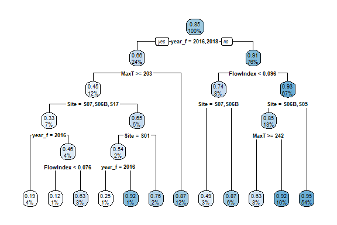

Or, pruned more aggressively

``` r
do_tree_prune_2 <- prune(do_tree, 0.0165)
rpart.plot(do_tree_prune_2)
```

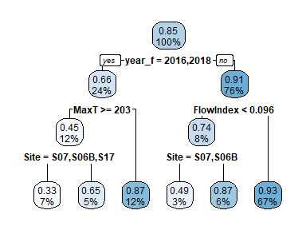
(We explored several related models, but the tree structure remained
dominated by the same factors, with similar interpretation, so we do not
show those alternate models).

## Conclusions

We can summarize the trees as follows:

In most years, probability of low dissolved oxygen is fairly low, around
.09. In those years, probability is highest (about 0.26) during low flow
conditions, especially at our upper watershed sites, where under low
flow, it was over 0.50.

In especially bad years, like 2016 and 2018, we saw about triple the
rate of failure to meet dissolved oxygen criteria (0.34). In those bad
years (which had low flow almost all summer), we nevertheless saw few
problems during days with cool weather. Upper watershed sites were
especially vulnerable during warm weather.

## Frequency of Watershed Low Flow

Overall, about one sixth of summer days qualify as “low flow” in the mid
watershed, going by the cutoff derived from the model.

``` r
sum(exceeds$FlowIndex[exceeds$Site == 'S05'] < 0.096, na.rm = TRUE) /
  sum(! is.na(exceeds$FlowIndex[exceeds$Site == 'S05']))
#> [1] 0.154633
```

``` r
exceeds %>%
  filter(Site =='S05') %>%
  select(FlowIndex) %>%
  ggplot(aes(FlowIndex)) +
  geom_histogram() +
  geom_vline(xintercept = 0.096, lty = 3)
#> `stat_bin()` using `bins = 30`. Pick better value with `binwidth`.
#> Warning: Removed 285 rows containing non-finite values (stat_bin).
```

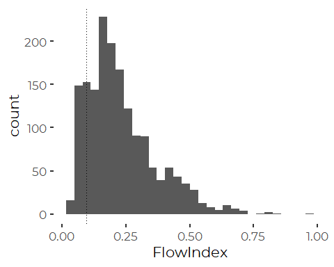

## Low Flow in the Upper Watershed

So the cut point is at about 15% lowest flow conditions.

``` r
exceeds %>%
  filter(Site =='S07', Month >5, Month < 10) %>%
  select(D_Median, FlowIndex, year_f) %>%
  ggplot(aes(FlowIndex, D_Median, color = year_f) ) +
  geom_point(alpha = 0.5) +
  geom_smooth(method = 'lm', se = FALSE) +
  #scale_y_log10() +
  xlab('Downstream Flow Index') +
  ylab('Blanchette Brook Flow')
#> `geom_smooth()` using formula 'y ~ x'
#> Warning: Removed 370 rows containing non-finite values (stat_smooth).
#> Warning: Removed 370 rows containing missing values (geom_point).
```

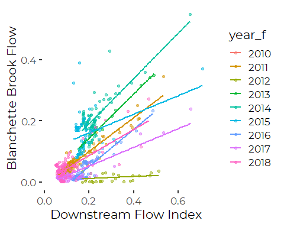

-   Days of exceptionally low upper watershed flow are frequent in some
    years, especially.  
-   Almost all days with exceptionally low watershed flow are also
    exceptionally low flow days in the upper watershed.  
-   The converse is not true. 2012, in particular, recorded low water
    depths in the upper watershed coincided with days with high flow
    further downstream.  
-   Relationship between upper and lower watershed flow differs year to
    year.

Low flow conditions in Blanchette Brook were very common in some years.

``` r
exceeds %>%
  filter(Site =='S07', Month >5, Month < 10) %>%
  select(D_Median, Year, year_f) %>%
  group_by(year_f) %>%
  summarize(Year = first(Year),
            n = sum(! is.na(D_Median)),
            low = sum(D_Median < 0.1, na.rm = TRUE),
            pct = low/n,
            .groups = 'drop') %>% 
  ggplot(aes(Year, pct) ) +
  geom_line() +
  ylab('Percent Days\nDepth < 10cm')
#> Warning: Removed 1 row(s) containing missing values (geom_path).
```

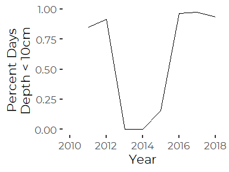

# Complementary DO Model looking at local water depth

``` r
do_depth <- rpart(ClassCDO ~ Site + year_f + MaxT + D_Median,
                 data = exceeds)
```

``` r
printcp(do_depth)
#> 
#> Regression tree:
#> rpart(formula = ClassCDO ~ Site + year_f + MaxT + D_Median, data = exceeds)
#> 
#> Variables actually used in tree construction:
#> [1] D_Median MaxT     year_f  
#> 
#> Root node error: 1101.2/8624 = 0.12769
#> 
#> n=8624 (2354 observations deleted due to missingness)
#> 
#>         CP nsplit rel error  xerror     xstd
#> 1 0.089504      0   1.00000 1.00011 0.021079
#> 2 0.084329      1   0.91050 0.93614 0.019648
#> 3 0.042665      2   0.82617 0.85414 0.019515
#> 4 0.029920      3   0.78350 0.81339 0.020083
#> 5 0.025702      4   0.75358 0.77149 0.018926
#> 6 0.011533      5   0.72788 0.74238 0.018691
#> 7 0.011377      6   0.71635 0.73535 0.018796
#> 8 0.010000      7   0.70497 0.73089 0.018811
```

Performance is similar to the prior model, with if anything a slightly
higher cross validation error, although with fewer steps evaluated.

``` rdo_cp_4
plotcp(do_depth)
```

Remember “True” means the site PASSES water quality criteria.

If we prune the tree just slightly, it becomes more readily interpreted.

``` r
do_depth_prune <- prune(do_depth, 0.018)
rpart.plot(do_depth_prune)
```

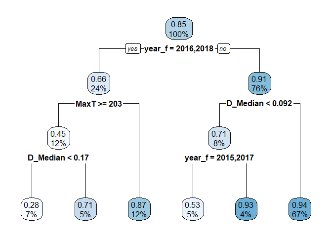

This is remarkably similar to our previous DO model, except that water
depth replaces Site as a predictor.

So, in “good” years, water depth (or flow) is critical, while the worst
conditions in bad years are ameliorated by cool weather. Our worst
conditions occur during low flow, hot days.

# Days that Pass PctSat Standards

``` r
psat_tree <- rpart(ClassC_PctSat ~ Site + year_f + MaxT + FlowIndex,
                 data = exceeds)
```

``` r
printcp(psat_tree)
#> 
#> Regression tree:
#> rpart(formula = ClassC_PctSat ~ Site + year_f + MaxT + FlowIndex, 
#>     data = exceeds)
#> 
#> Variables actually used in tree construction:
#> [1] FlowIndex MaxT      Site      year_f   
#> 
#> Root node error: 1466.8/8143 = 0.18013
#> 
#> n=8143 (2835 observations deleted due to missingness)
#> 
#>         CP nsplit rel error  xerror     xstd
#> 1 0.117287      0   1.00000 1.00007 0.013805
#> 2 0.108776      1   0.88271 0.88138 0.013185
#> 3 0.045622      2   0.77394 0.77779 0.014317
#> 4 0.029404      3   0.72831 0.73263 0.014854
#> 5 0.016645      4   0.69891 0.70722 0.014262
#> 6 0.016496      5   0.68227 0.69334 0.014190
#> 7 0.011298      6   0.66577 0.67518 0.014032
#> 8 0.010000      7   0.65447 0.67208 0.014059
```

These trees perform not quite as well as the DO trees. Classification
error is on the order of 12.2 percent classification error. The cross
validation error, however, flattens out fast, so a slightly simpler tree
will perform nearly as well.

``` r
plotcp(psat_tree)
```

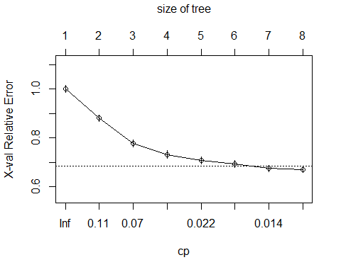

Remember “True” means the site PASSES water quality criteria.

``` r
rpart.plot(psat_tree)
```

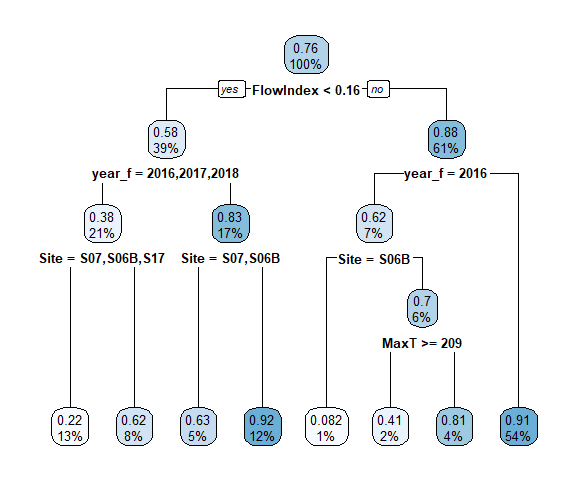

Here the first cut is low flow conditions, corresponding roughly to flow
below about one third of summer flow. The next cuts split out especially
bad years, and then our most at-risk sites.

``` r
sum(exceeds$FlowIndex[exceeds$Site == 'S05'] < 0.16, na.rm = TRUE) /
  sum(! is.na(exceeds$FlowIndex[exceeds$Site == 'S05']))
#> [1] 0.3351384
```

# Days that Pass Chloride Standards

## CCC (Chronic Exposure) Standard

``` r
chl_tree <- rpart(ChlCCC ~ Site + year_f + MaxT + FlowIndex,
                 data = exceeds)
```

``` r
printcp(chl_tree)
#> 
#> Regression tree:
#> rpart(formula = ChlCCC ~ Site + year_f + MaxT + FlowIndex, data = exceeds)
#> 
#> Variables actually used in tree construction:
#> [1] Site   year_f
#> 
#> Root node error: 1990.2/8648 = 0.23013
#> 
#> n=8648 (2330 observations deleted due to missingness)
#> 
#>         CP nsplit rel error  xerror      xstd
#> 1 0.191702      0   1.00000 1.00023 0.0063212
#> 2 0.077182      1   0.80830 0.80854 0.0095978
#> 3 0.021631      2   0.73112 0.73695 0.0108044
#> 4 0.021613      4   0.68785 0.70124 0.0104663
#> 5 0.019226      5   0.66624 0.68120 0.0103552
#> 6 0.014972      6   0.64701 0.65686 0.0101197
#> 7 0.010589      7   0.63204 0.64612 0.0101599
#> 8 0.010000      8   0.62145 0.62846 0.0102525
```

These trees perform still less well….

Classification error is on the order of 14.5 percent. Trimming may help,
but not as much as for PctSat.

``` r
plotcp(chl_tree)
```

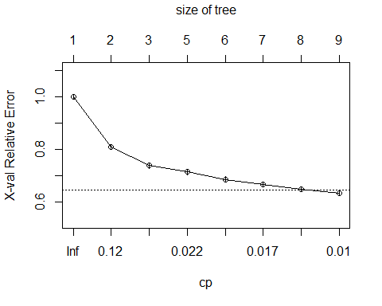

Remember “True” means the site PASSES water quality criteria.

``` r
rpart.plot(chl_tree)
```

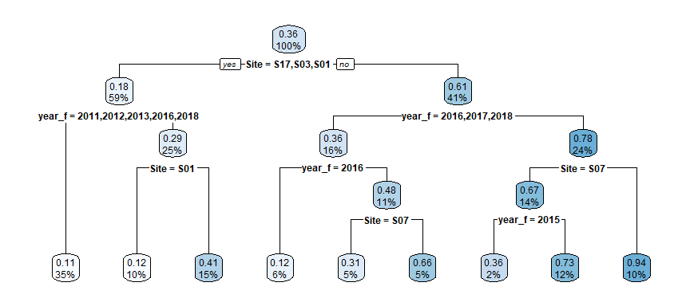
Here, location controls risk to a high degree, with our highest risk
sites located on our downstream tributaries. 2016, 2017, and 2018 were
bad years, especially at our less vulnerable sites. At those sites, a
third of days failed to meet the lower chloride standards all day.

## CMC (Acute Exposure) Standard

``` r
chl_tree_2 <- rpart(ChlCMC ~ Site + year_f + MaxT + FlowIndex,
                 data = exceeds)
```

``` r
printcp(chl_tree_2)
#> 
#> Regression tree:
#> rpart(formula = ChlCMC ~ Site + year_f + MaxT + FlowIndex, data = exceeds)
#> 
#> Variables actually used in tree construction:
#> [1] FlowIndex MaxT      Site      year_f   
#> 
#> Root node error: 258.76/8648 = 0.029921
#> 
#> n=8648 (2330 observations deleted due to missingness)
#> 
#>         CP nsplit rel error  xerror     xstd
#> 1 0.055124      0   1.00000 1.00024 0.058341
#> 2 0.025619      2   0.88975 0.89248 0.049007
#> 3 0.019038      5   0.81289 0.82835 0.048966
#> 4 0.016235      6   0.79386 0.81546 0.047516
#> 5 0.014514      7   0.77762 0.80751 0.046999
#> 6 0.014287      8   0.76311 0.80880 0.046591
#> 7 0.011952      9   0.74882 0.80052 0.046365
#> 8 0.010856     11   0.72492 0.79810 0.045834
#> 9 0.010000     12   0.71406 0.79037 0.045629
```

These trees perform very well. Classification error is on the order of
2.4 percent. There is little improvement in fit after the first three
splits, so we prune the tree.

``` r
plotcp(chl_tree_2)
```


``` r
chl_tree_2 <- prune(chl_tree_2, 0.02)
```

Remember “True” means the site PASSES water quality criteria.

``` r
rpart.plot(chl_tree_2)
```

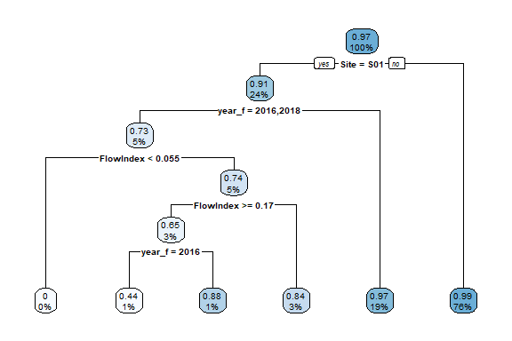
This tree suggests violations of the more stringent chloride standards
almost never happened, except at site S01, and they were relatively rare
there except in our two worst years, under low flow conditions.

# Days that Meet Temperature Thresholds

## Acute Temperature Thresholds

``` r
temp_tree <- rpart(MaxT_ex ~ Site + year_f + MaxT + FlowIndex,
                 data = exceeds)
```

``` r
printcp(temp_tree)
#> 
#> Regression tree:
#> rpart(formula = MaxT_ex ~ Site + year_f + MaxT + FlowIndex, data = exceeds)
#> 
#> Variables actually used in tree construction:
#> [1] MaxT   year_f
#> 
#> Root node error: 16.973/10900 = 0.0015572
#> 
#> n=10900 (78 observations deleted due to missingness)
#> 
#>         CP nsplit rel error xerror    xstd
#> 1 0.026263      0   1.00000 1.0002 0.24202
#> 2 0.010000      2   0.94747 1.0529 0.24292
```

Remember “True” means the site PASSES water quality criteria.

``` r
rpart.plot(temp_tree)
```

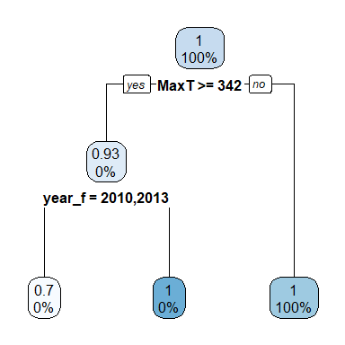

That’s just too simple. What the tree tells us is that:  
\* Violations of the Acute threshold are exceptionally rare.  
\* Stream temperature extremes only happen on really hot days (with air
temperature above 34.2 degrees C, or about 90 degrees F).  
\* But even then, some years are worse than others.

It’s not worth exploring trees for the chronic exposure limits, as that
threshold was almost never exceeded.
