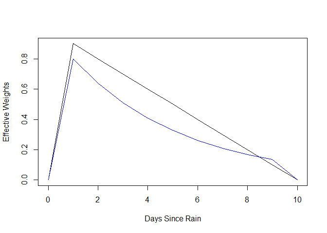
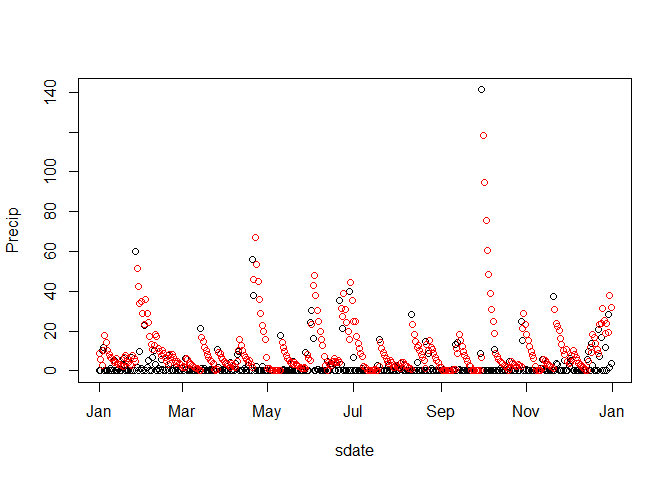

Generate Complete Timeseries, with Weighted Sums of Precipitation
================
Curtis C. Bohlen, Casco Bay Estuary Partnership
Revised 7/21/2020

  - [Introduction](#introduction)
  - [Import Libraries](#import-libraries)
  - [Weighting Functions](#weighting-functions)
      - [Testing Weighting Functions](#testing-weighting-functions)
  - [Import Data](#import-data)
      - [Data on Sites and Impervious
        Cover](#data-on-sites-and-impervious-cover)
      - [Main Data](#main-data)
      - [Weather Data](#weather-data)
          - [Add Logged and Weighted Precipitation
            Values](#add-logged-and-weighted-precipitation-values)
          - [Export Weather data with weighted
            sums](#export-weather-data-with-weighted-sums)
      - [Combine Weather and observational
        data](#combine-weather-and-observational-data)
          - [Removing missing values](#removing-missing-values)
  - [Output the Final Combined Data
    Set](#output-the-final-combined-data-set)


# Introduction

Simple linear models of the LCWMD data assume that observations are
independent, however, we know both on principal and from working with
the data, that the different timeseries are auto- and cross-correlated
in complex ways.

One challenge to analyzing these data in R is that the time series we
are working with are INCOMPLETE, in the sense that we are missing data
from certain days or times. The time series methods in base R assume
complete data in terms of how the data is laid out – even if many values
are NA. The time series is assumed to be a sequence of observations
equally spaced.

One solution is to use the zoo package (or related xts) which extends
time series methods in base R to indexed series, where the index can be
any value that supports ordering. That has its own drawbacks in terms of
generation of complex linear models. Our interest here is not
principally in time series analysis, but in understanding long-term
trends against the backdrop of data with strong seasonal and even
diurnal patterns and autocorrelated errors.

Here we calculate data that contains variables that capture some of the
autocorrelation and crosscorrelation structure of these data through lag
terms and weighted sums of recent observations. These allow us to use
generalized least squares (GLS) and generalized additive models (GAMMS)
to probe long-term trends.

# Import Libraries

``` r
library(tidyverse)
```

    ## -- Attaching packages --------------------------------------- tidyverse 1.3.0 --

    ## v ggplot2 3.3.2     v purrr   0.3.4
    ## v tibble  3.0.4     v dplyr   1.0.2
    ## v tidyr   1.1.2     v stringr 1.4.0
    ## v readr   1.4.0     v forcats 0.5.0

    ## -- Conflicts ------------------------------------------ tidyverse_conflicts() --
    ## x dplyr::filter() masks stats::filter()
    ## x dplyr::lag()    masks stats::lag()

``` r
library(readr)
library(lubridate) # simplifies management of date and time objects
```

    ## 
    ## Attaching package: 'lubridate'

    ## The following objects are masked from 'package:base':
    ## 
    ##     date, intersect, setdiff, union

``` r
library(zoo)       # provides utilities for working with indexed time series
```

    ## 
    ## Attaching package: 'zoo'

    ## The following objects are masked from 'package:base':
    ## 
    ##     as.Date, as.Date.numeric

# Weighting Functions

Here we create two functions to calculate weighted sums of recent
precipitation. These two functions are used with package zoo’s rollapply
function to calculate a recent precipitation index. Each index looks at
rainfall from a ten day period. The exponential weighting function
emphasizes rainfall of the last day or two more strongly than a linear
weighting does. The default rate parameters here were derived from
analysis of cross correlation structure. They could be tuned as part of
a model, but at the cost of substantially greater model complexity.

``` r
linweights <- function(x, rate=.1) {
  stopifnot(length(x)==10)
  out = 0
  for (i in seq_len(length(x)-1)) {out<-out+x[i]*(rate)*(i)}
  return(out)
}

expweights <- function(x, rate=(4/5)) {
  stopifnot(length(x)==10)
  out = 0
  for (i in seq_len(length(x)-1)) {out<-out+x[i]*(rate)^(10-i)}
  return(out)
}
```

## Testing Weighting Functions

The checks confirm that the weighting functions are working as intended.

  - The single sequence of ten values should produce a single value
    under rollapply.

  - The FIRST value of 1 represents one inch of rainfall nine days ago.
    The linear function should assign a weight of
    \(1.9 \times 0.1 = 0.1\) to that value. The exponential decay
    function should weight it at \((\frac{4}{5})^9 = 0.1342\).

  - The LAST value of 1 represents rainfall today. Since this is a
    weighted sum of previous rainfall, it should receive a weight of
    zero under both weighting functions.

  - The sequence of 20 values with a 1 in the middle calculates eleven
    weighted sums.

  - The first set of ten sums includes rainfall only in the last day –
    which represents “today”, and thus receives a weight of zero.

  - Each value after that shows how the weighting drops as rainfall
    falls further into the past.

<!-- end list -->

``` r
check <- c(1,0,0,0,0,0,0,0,0,1)
rollapply(check, 10, linweights)
```

    ## [1] 0.1

``` r
rollapply(check, 10, expweights)
```

    ## [1] 0.1342177

``` r
check=c(0,0,0,0,0,0,0,0,0, 1,0,0,0,0,0,0,0,0,0,0)
(w1 <- rollapply(check, 10, linweights))
```

    ##  [1] 0.0 0.9 0.8 0.7 0.6 0.5 0.4 0.3 0.2 0.1 0.0

``` r
(w2 <- rollapply(check, 10, expweights))
```

    ##  [1] 0.0000000 0.8000000 0.6400000 0.5120000 0.4096000 0.3276800 0.2621440
    ##  [8] 0.2097152 0.1677722 0.1342177 0.0000000

``` r
plot(0:10, w1, type = 'l', xlab="Days Since Rain", ylab = "Effective Weights")
lines(0:10, w2, col = 'blue')
```

<!-- -->

``` r
rm(w1, w2, check)
```

# Import Data

## Data on Sites and Impervious Cover

These data were derived from Table 2 from a GZA report to the Long Creek
Watershed Management District, titled “Re: Long Creek Watershed Data
Analysis; Task 2: Preparation of Explanatory and Other Variables.” The
Memo is dated November 13, 2019 File No. 09.0025977.02. We calculated
cumulative upstream acres, impervious acres, and imperviousness based on
data in that table.

``` r
# Read in data and drop the East Branch, where we have no data
Site_IC_Data <- read_csv("Site_IC_Data.csv", col_types=cols(
  Site = col_character(),
  Subwatershed = col_character(),
  Area_ac = col_double(),
  IC_ac = col_double(),
  CumArea_ac = col_double(),
  CumIC_ac = col_double(),
  PctIC = col_character(),
  CumPctIC = col_character()
)
                         ) %>%
  filter(Site != "--") 

# Now, create a factor that preserves the order of rows (roughly upstream to downstream). 
Site_IC_Data <- Site_IC_Data %>%
  mutate(Site = factor(Site, levels = Site_IC_Data$Site))

# Finally, convert percent covers to numeric values
# By default, the percents are read in incorrectly.
Site_IC_Data <- Site_IC_Data %>%
  mutate(CumPctIC = as.numeric(substr(CumPctIC, 1, nchar(CumPctIC)-1))) %>%  
  mutate(PctIC = as.numeric(substr(PctIC, 1, nchar(PctIC)-1)))
knitr::kable(Site_IC_Data, col.names = c('Site',                         'Subwatershed',
                                         'Area (acres)',                 'Impervious Area (acres)',
                                         'Cummulative Area (Acres)',     'Cummulative Impervious Area (Acres)',
                                         'Local Percent Imperviousness', 'Cummulative Percent Imperviousness'))
```

| Site | Subwatershed      | Area (acres) | Impervious Area (acres) | Cummulative Area (Acres) | Cummulative Impervious Area (Acres) | Local Percent Imperviousness | Cummulative Percent Imperviousness |
| :--- | :---------------- | -----------: | ----------------------: | -----------------------: | ----------------------------------: | ---------------------------: | ---------------------------------: |
| S07  | Blanchette Brook  |        434.1 |                    87.7 |                    434.1 |                                87.7 |                        20.20 |                              20.20 |
| S06B | Upper Main Stem   |        623.3 |                    80.2 |                    623.3 |                                80.2 |                        12.87 |                              12.87 |
| S05  | Middle Main Stem  |        278.6 |                    53.6 |                    901.9 |                               133.8 |                        19.24 |                              14.84 |
| S17  | Lower Main Stem   |        105.0 |                    65.1 |                   1006.9 |                               198.9 |                        62.00 |                              19.75 |
| S03  | North Branch Trib |        298.5 |                   123.0 |                    298.5 |                               123.0 |                        41.21 |                              41.21 |
| S01  | South Branch Trib |        427.4 |                   239.7 |                    427.4 |                               239.7 |                        56.08 |                              56.08 |

## Main Data

Read in the data from the Derived Data folder. Arrange by date within
each site. We filter out data from 2019 because we only have data from a
portion of that year. Including that data in subsequent analyses may
bias estimation of annual averages and seasonal trends.

``` r
fpath <- "Daily_Data.csv"

daily_medians <- read_csv(fpath, progress=FALSE, 
                          col_types = cols(
                            pH_Mean = col_number(),
                            pH_Median = col_number(),
                            pH_SD = col_number(),
                            pH_Iqr = col_number() )) %>%
  select(-ends_with('Min'), -ends_with('Max'), -ends_with('Mean'),
         -ends_with('Iqr'), -ends_with('SD'), -ends_with('_n')) %>%
  mutate(Site = factor(Site)) %>%
  arrange(Site, sdate) %>%
  filter(Year<2019)    
```

    ## Warning: 11485 parsing failures.
    ## row     col expected actual             file
    ##   1 pH_Mean a number    NaN 'Daily_Data.csv'
    ##   2 pH_Mean a number    NaN 'Daily_Data.csv'
    ##   3 pH_Mean a number    NaN 'Daily_Data.csv'
    ##   4 pH_Mean a number    NaN 'Daily_Data.csv'
    ##   5 pH_Mean a number    NaN 'Daily_Data.csv'
    ## ... ....... ........ ...... ................
    ## See problems(...) for more details.

``` r
ggplot(daily_medians, aes(sdate, Chl_Median, color=Site)) + 
  geom_point(alpha=.25) + 
  theme_minimal() +
  facet_wrap(~Site)
```

    ## Warning: Removed 2329 rows containing missing values (geom_point).

<!-- -->

Is there really only one year’s worth of data from S06B? And it looks
like there is exactly one point in 2017 – which is almost certainly a
coding error.

## Weather Data

Here we access and simplify that data somewhat. We simplify it more in
the next step.

``` r
sibfldnm    <- 'Original_Data'
parent      <- dirname(getwd())
sibling     <- file.path(parent,sibfldnm)

fn <- "Portland_Jetport_2009-2019.csv"
fpath <- file.path(sibling, fn)

weather_data <- read_csv(fpath, 
 col_types = cols(AWNDattr = col_skip(), 
        FMTM = col_skip(), FMTMattr = col_skip(), 
        PGTM = col_skip(), PGTMattr = col_skip(),
        PRCPattr = col_character(), SNOWattr = col_character(), 
        SNWD = col_number(), SNWDattr = col_character(),
        TAVG = col_number(), TAVGattr = col_character(), 
        TMIN = col_number(), TMINattr = col_character(), 
        TMAX = col_number(), TMAXattr = col_character(), 
        station = col_skip())) %>%
  select( ! starts_with('W')) %>%
  select(! ends_with('attr')) %>%
  rename(sdate = date,
         Precip=PRCP,
         MaxT = TMAX,
         MinT= TMIN,
         AvgT = TAVG,
         Snow = SNOW,
         Snow_Depth = SNWD) #%>%
  #   select(sdate, Precip, AvgT, MaxT)
summary(weather_data)
```

    ##      sdate                 AWND            Precip             Snow      
    ##  Min.   :2010-06-01   Min.   :  4.00   Min.   :   0.00   Min.   :  0.0  
    ##  1st Qu.:2012-10-23   1st Qu.: 23.00   1st Qu.:   0.00   1st Qu.:  0.0  
    ##  Median :2015-03-17   Median : 31.00   Median :   0.00   Median :  0.0  
    ##  Mean   :2015-03-17   Mean   : 33.38   Mean   :  34.12   Mean   :  5.3  
    ##  3rd Qu.:2017-08-08   3rd Qu.: 41.00   3rd Qu.:  15.00   3rd Qu.:  0.0  
    ##  Max.   :2019-12-31   Max.   :116.00   Max.   :1633.00   Max.   :564.0  
    ##                                                                         
    ##    Snow_Depth          MaxT             MinT              AvgT        
    ##  Min.   :  0.00   Min.   :-155.0   Min.   :-271.00   Min.   :-193.00  
    ##  1st Qu.:  0.00   1st Qu.:  56.0   1st Qu.: -32.00   1st Qu.:  16.00  
    ##  Median :  0.00   Median : 144.0   Median :  44.00   Median :  98.00  
    ##  Mean   : 39.49   Mean   : 140.2   Mean   :  39.31   Mean   :  90.67  
    ##  3rd Qu.:  0.00   3rd Qu.: 228.0   3rd Qu.: 122.00   3rd Qu.: 179.00  
    ##  Max.   :640.00   Max.   : 378.0   Max.   : 244.00   Max.   : 290.00  
    ##                                                      NA's   :1034

### Add Logged and Weighted Precipitation Values

Recall that the NOAA data provides precipitation in tenths of a
millimeter, and temperature data in tenths of a degree C. As we use
these data as predictors, this is of no real significance to our models,
but it can be confusing when interpreting model results. We correct that
here for precipitation and maximum temperature data.

``` r
weather_data_Complete <- weather_data %>%
  arrange(sdate) %>%
  mutate(Year = year(sdate)) %>%
  mutate(Month = month(sdate)) %>%
  mutate(Month = factor(Month, labels = month.abb)) %>%
  mutate(DOY = as.numeric(format(sdate, '%j'))) %>%

  select(sdate, Year, Month, DOY, Precip, MaxT) %>%
  mutate(Precip = Precip / 10,
         MaxT = MaxT / 10) %>%
  
  mutate(lPrecip = log1p(Precip)) %>%
  mutate(wPrecip = rollapply(Precip, 10,
                             expweights,
                             align="right", fill=NA)) %>%
  mutate(wlPrecip = rollapply(lPrecip, 10,
                             expweights,
                             align="right", fill=NA)) %>%
  mutate_at(vars(Precip, lPrecip, wPrecip, wlPrecip), ~coredata(.)) #%>%
  # mutate(lag1 = lag(lPrecip,n=1),  # Note that this implicitly uses dplyr::lag()
  #        lag2 = lag(lPrecip,n=2),  # And also that this is not yet fully correct,
  #        lag3 = lag(lPrecip,n=3),  # Since it does not create missing values
  #        lag4 = lag(lPrecip,n=4),  # When there was a period of missing data in
  #        lag5 = lag(lPrecip,n=5),  # The zoo object.
  #        lag6 = lag(lPrecip,n=6),
  #        lag7 = lag(lPrecip,n=7),
  #        lag8 = lag(lPrecip,n=8),
  #        lag9 = lag(lPrecip,n=9),
  #        lag10 = lag(lPrecip,n=10))
```

``` r
tmp <- weather_data_Complete[weather_data_Complete$Year==2015,]
plot(Precip~sdate, data = tmp)
points(wPrecip~sdate, data = tmp, col='Red')
```

<!-- -->

``` r
rm(tmp)
```

Note that after each major rain event, the weighted sum drops, which is
what we needed.

### Export Weather data with weighted sums

``` r
write.csv(weather_data_Complete, 'Weather_Data.csv')
```

## Combine Weather and observational data

The challenge we have combining data is that we need to add observations
site by site and correctly identify missing data. Since missing data can
occur independently at each site, we need to ensure we generate

Nevertheless, we may want to assemble a combined data set for modeling
purposes.

The sites we are interested in include:

    ## S07 S06B S05 S17 S03 S01

Our goal is a “complete” regular time series for each site, with missing
values where appropriate. We need to be able to do two things with this
data: (1) Pull complete time series for each site or a subset of
variables by subsetting or pivot\_wider  
(2) Analyze the full dataset in GAMs or via GLS, with an AR1 error
structure.

With a little code, we can traverse each site and assemble a
megadataset. We need to use match to make sure we line things up
correctly within each site, honoring all missing values, etc. We only
need the first nine data columns of daily\_medians because the weather
data already contains date and weather data.

By joining the “daily\_data” site by site onto data derived from the
weather data ( which includes all dates in the target period), we
implicitly create a “complete” data record for each site. (It would
probably be possible to run each step more compactly using left\_join()
instead of match()).

``` r
l <- list()

for (site in Site_IC_Data$Site)
{
  d_part <- daily_medians %>%
  filter(Site==site) %>%
  select(1:9)
  
  d_data <- weather_data_Complete %>%
    mutate(Chl_Median = d_part$Chl_Median[match(sdate,d_part$sdate)],
           D_Median   = d_part$D_Median[match(sdate,d_part$sdate)],
           lD_Median = log1p(D_Median),
           DO_Median  = d_part$DO_Median[match(sdate,d_part$sdate)],
           PctSat_Median = d_part$PctSat_Median[match(sdate,d_part$sdate)],
           pH_Median = d_part$pH_Median[match(sdate,d_part$sdate)],
           spCond_Median = d_part$SpCond_Median[match(sdate,d_part$sdate)],
           T_Median = d_part$T_Median[match(sdate,d_part$sdate)])
  l[[site]]<-d_data
}

all_data <- bind_rows(l, .id="Site")
rm(l, d_data, d_part)
```

### Removing missing values

That produces the “full” regular time series. But it wastes a LOT of
memory because it contains so many NAs. Since each site was assembled
separately, based on the full 10 year weather record, I have missing
values any time a particular SITE lacks data. Since several sites have
only a few years of data, for those sites, we’ve got a lot of pointless
data rows.

The obvious thing to do would be to just filter out rows with NAs in the
measured variables, but that won’t work. We want to retain one NA BEFORE
the first row of data in each contiguous block of data, so we can
correctly use an AR1 error structure in our modeling. If we are using an
AR1 model, the “first” observation in a block of data will implicitly
look to the prior row (not prior time index) to grab the “preceding”
value. So we need to make sure that value is NA when it needs to be, and
not the LAST observation from the prior block of real data in sequence
in the data.

(Note: This assumes we don’t deed a more complicated error structure,
like an AR2 or AR3.)

The basic idea is to create a variable that is lagged appropriately, so
we know whether the NEXT row contains data, Then I can retain rows that
EITHER contain data, or for which the NEXT row contains data.

The dplyr::lead() function can “look forward” one row to see if we have
a missing data or not. So we can combine several to figure out how soon
we will have data. What we want here is a test to see if we have ANY
valid data in the next few samples.

``` r
final_data <- all_data %>%
  mutate(hasdata = ! (is.na(Chl_Median) & is.na(DO_Median) & is.na(D_Median))) %>% 
  mutate(nexthasdata = ! (is.na(lead(Chl_Median)) & 
                            is.na(lead(DO_Median)) & 
                            is.na(lead(D_Median)))) %>%
  mutate(secondhasdata = ! (is.na(lead(Chl_Median,2)) & 
                              is.na(lead(DO_Median,2)) & 
                              is.na(lead(D_Median,2)))) %>%
  mutate(thirdhasdata = ! (is.na(lead(Chl_Median,3)) & 
                             is.na(lead(DO_Median,3)) & 
                             is.na(lead(D_Median,3)))) %>%
  mutate(test0 = hasdata | nexthasdata | secondhasdata | thirdhasdata) %>%
  filter(test0) %>%
  select(-hasdata, -nexthasdata, -secondhasdata, -thirdhasdata, -test0)
```

# Output the Final Combined Data Set

``` r
write.csv(final_data, 'Full_Data.csv')
```
