Graphics for LCWMD ‘Chloride’ Data Based on Conductivity Measurement
================
Curtis C. Bohlen, Casco Bay Estuary Partnership.
01/06/2021

-   [Introduction](#introduction)
    -   [Weather-Corrected Marginal
        Means](#weather-corrected-marginal-means)
-   [Import Libraries](#import-libraries)
-   [Data Preparation](#data-preparation)
    -   [Initial Folder References](#initial-folder-references)
    -   [Load Weather Data](#load-weather-data)
    -   [Update Folder References](#update-folder-references)
    -   [Load Data on Sites and Impervious
        Cover](#load-data-on-sites-and-impervious-cover)
    -   [Load Main Data](#load-main-data)
        -   [Cleanup](#cleanup)
    -   [Data Correction](#data-correction)
        -   [Anomolous Depth Values](#anomolous-depth-values)
        -   [Single S06B Chloride Observation from
            2017](#single-s06b-chloride-observation-from-2017)
        -   [Site S03, end of 2016](#site-s03-end-of-2016)
    -   [Remove Partial Data from Winter
        Months](#remove-partial-data-from-winter-months)
    -   [Add Stream Flow Index](#add-stream-flow-index)
    -   [Create Working Data](#create-working-data)
        -   [Cleanup](#cleanup-1)
-   [GAMM Model](#gamm-model)
    -   [Visualizing Estimated Marginal
        Means](#visualizing-estimated-marginal-means)
    -   [By Month](#by-month)
    -   [By Site](#by-site)
    -   [Trends](#trends)
-   [Graphic Alternatives](#graphic-alternatives)
    -   [By Site](#by-site-1)
        -   [Marginal Means and 95% CI](#marginal-means-and-95-ci)
        -   [Added Boxplots – Observed
            Medians](#added-boxplots-observed-medians)
        -   [By Imperviousness](#by-imperviousness)
    -   [By Month](#by-month-1)
        -   [Marginal Means and 95% CI](#marginal-means-and-95-ci-1)
    -   [Trends](#trends-1)
        -   [Violin Plot](#violin-plot)
        -   [Jitter Plot](#jitter-plot)


# Introduction

This R Notebook explores various models for analyzing chloride levels in
Long Creek. Our principal goal is NOT to predict future values, but to
assess the contribution of certain (time varying) predictors to
explaining the pattern in the time series.

This notebook looks principally at chlorides, which are frequently
elevated in Maine urban streams because of use of salt for deicing of
roads, parking areas, sidewalks, and paths in winter. While water
quality standards are often written in terms of chlorides, it may be
better to think about chlorides as a measure of the salinity of the
water in the stream. Physiologically, it is probably salinity or
osmolarity that principally affects organisms in the stream, not
chlorides *per se*. The data we examine here is based on measurement of
conductivity, which is converted to an estimate of in-stream chlorides
based on a robust regression relationship developed over several years.

We develop a graphic to contrast raw data, simple means, and
weather-corrected marginal means for understanding chloride in Long
Creek.

## Weather-Corrected Marginal Means

We use a (relatively) simple GAM model, developed in the “Chloride
Analysis.rmd” notebook to provide the weather corrected marginal means.
While we examinied significantly more complex models, marginal means
differed little, and we prefer model simplicity for the sake of
communication to State of Casco Bay audiences.

We use a model of the form:

*C**h**l**o**r**i**d**e**s* = *f*(*C**o**v**a**r**i**a**t**e**s*) + *g*(*P**r**e**d**i**c**t**o**r**s*) + *E**r**r**o**r*

Where: \* Site-independent precipitation, weighted recent precipitation,
and flow covariates enter into the model via linear functions or thin
plate spline smoothers in a Generalized Addative Model. Predictors
include: – natural Log of total daily precipitation (in mm) – natural
log of a weighted sum of the prior nine days precipitation (mm) –
natural log of the depth of water (in meters) at Site S05, in
mid-watershed.

-   The predictors enter the model via linear functions of:  
    – site,  
    – year,  
    – a site by year interaction, and  
    – time of year (Month in the model we consider year)

-   The error includes both *i.i.d* normal error and an AR(1)
    autocorrelated error.

But, because predictions are rather different from observed values
(geometric means versus means, for example), these predictions are
somewhat difficult to present in a graphic form for SoCB readers, so we
omit much of the detail from our graphics.

# Import Libraries

``` r
library(tidyverse)
#> -- Attaching packages --------------------------------------- tidyverse 1.3.0 --
#> v ggplot2 3.3.3     v purrr   0.3.4
#> v tibble  3.0.5     v dplyr   1.0.3
#> v tidyr   1.1.2     v stringr 1.4.0
#> v readr   1.4.0     v forcats 0.5.0
#> -- Conflicts ------------------------------------------ tidyverse_conflicts() --
#> x dplyr::filter() masks stats::filter()
#> x dplyr::lag()    masks stats::lag()
library(readr)
library(emmeans) # Provides tools for calculating marginal means

#library(nlme)    # Provides GLS model functions -- not used here

library(mgcv)    # generalized additive models. Function gamm() allows
#> Loading required package: nlme
#> 
#> Attaching package: 'nlme'
#> The following object is masked from 'package:dplyr':
#> 
#>     collapse
#> This is mgcv 1.8-33. For overview type 'help("mgcv-package")'.
                 # autocorrelated errors.

library(CBEPgraphics)
load_cbep_fonts()
theme_set(theme_cbep())
```

# Data Preparation

## Initial Folder References

``` r
sibfldnm    <- 'Original_Data'
parent      <- dirname(getwd())
sibling     <- file.path(parent,sibfldnm)

dir.create(file.path(getwd(), 'figures'), showWarnings = FALSE)
dir.create(file.path(getwd(), 'models'), showWarnings = FALSE)
```

## Load Weather Data

``` r
fn <- "Portland_Jetport_2009-2019.csv"
fpath <- file.path(sibling, fn)

weather_data <- read_csv(fpath, 
 col_types = cols(.default = col_skip(),
        date = col_date(),
        PRCP = col_number(), PRCPattr = col_character() #,
        #SNOW = col_number(), SNOWattr = col_character(), 
        #TMIN = col_number(), TMINattr = col_character(), 
        #TAVG = col_number(), TAVGattr = col_character(), 
        #TMAX = col_number(), TMAXattr = col_character(), 
        )) %>%
  rename(sdate = date) %>%
  mutate(pPRCP = dplyr::lag(PRCP))
```

## Update Folder References

``` r
sibfldnm    <- 'Derived_Data'
parent      <- dirname(getwd())
sibling     <- file.path(parent,sibfldnm)
```

## Load Data on Sites and Impervious Cover

These data were derived from Table 2 from a GZA report to the Long Creek
Watershed Management District, titled “Re: Long Creek Watershed Data
Analysis; Task 2: Preparation of Explanatory and Other Variables.” The
Memo is dated November 13, 2019 File No. 09.0025977.02.

Cumulative Area and IC calculations are our own, based on the GZA data
and the geometry of the stream channel.

``` r
# Read in data and drop the East Branch, where we have no data
fn <- "Site_IC_Data.csv"
fpath <- file.path(sibling, fn)

Site_IC_Data <- read_csv(fpath) %>%
  filter(Site != "--") 
#> 
#> -- Column specification --------------------------------------------------------
#> cols(
#>   Site = col_character(),
#>   Subwatershed = col_character(),
#>   Area_ac = col_double(),
#>   IC_ac = col_double(),
#>   CumArea_ac = col_double(),
#>   CumIC_ac = col_double(),
#>   PctIC = col_character(),
#>   CumPctIC = col_character()
#> )

# Now, create a factor that preserves the order of rows (roughly upstream to downstream). 
Site_IC_Data <- Site_IC_Data %>%
  mutate(Site = factor(Site, levels = Site_IC_Data$Site))

# Finally, convert percent covers to numeric values
Site_IC_Data <- Site_IC_Data %>%
  mutate(CumPctIC = as.numeric(substr(CumPctIC, 1, nchar(CumPctIC)-1))) %>%
  mutate(PctIC = as.numeric(substr(PctIC, 1, nchar(PctIC)-1)))
Site_IC_Data
#> # A tibble: 6 x 8
#>   Site  Subwatershed      Area_ac IC_ac CumArea_ac CumIC_ac PctIC CumPctIC
#>   <fct> <chr>               <dbl> <dbl>      <dbl>    <dbl> <dbl>    <dbl>
#> 1 S07   Blanchette Brook     434.  87.7       434.     87.7  20.2     20.2
#> 2 S06B  Upper Main Stem      623.  80.2       623.     80.2  12.9     12.9
#> 3 S05   Middle Main Stem     279.  53.6      1336     222.   19.2     16.6
#> 4 S17   Lower Main Stem      105   65.1      1441     287.   62       19.9
#> 5 S03   North Branch Trib    298. 123         298.    123    41.2     41.2
#> 6 S01   South Branch Trib    427. 240.        427.    240.   56.1     56.1
```

## Load Main Data

Read in the data from the Derived Data folder.

Note that I filter out data from 2019 because that is only a partial
year, which might affect estimation of things like seasonal trends. We
could add it back in, but with care….

*Full\_Data.csv* does not include a field for precipitation from the
previous day. In earlier work, we learned that a weighted sum of recent
precipitation provided better explanatory power. But we also want to
check a simpler model, so we construct a “PPrecip” data field. This is
based on a modification of code in the “Make\_Daily\_Summaries.Rmd”
notebook.

``` r
fn <- "Full_Data.csv"
fpath <- file.path(sibling, fn)

full_data <- read_csv(fpath, 
    col_types = cols(DOY = col_integer(), 
        D_Median = col_double(), Precip = col_number(), 
        X1 = col_skip(), Year = col_integer(), 
        FlowIndex = col_double())) %>%

  mutate(Site = factor(Site, levels=levels(Site_IC_Data$Site))) %>%
  mutate(Month = factor(Month, levels = month.abb)) %>%
  mutate(IC=as.numeric(Site_IC_Data$CumPctIC[match(Site, Site_IC_Data$Site)])) %>%
  mutate(Year_f = factor(Year)) %>%

# We combine data using "match" because we have data for multiple sites and 
# therefore dates are not unique.  `match()` correctly assigns weather
# data by date.
mutate(PPrecip = weather_data$pPRCP[match(sdate, weather_data$sdate)])
#> Warning: Missing column names filled in: 'X1' [1]
#> Warning: The following named parsers don't match the column names: FlowIndex
```

### Cleanup

``` r
rm(Site_IC_Data, weather_data)
rm(fn, fpath, parent, sibling, sibfldnm)
```

## Data Correction

### Anomolous Depth Values

Several depth observations in the record appear highly unlikely. In
particular, several observations show daily median water depths over 15
meters. And those observations were recorded in May or June, at site
S05, with no associated record of significant precipitation, and no
elevated depths at other sites on the stream.

We can trace these observations back to the raw QA/QC’d pressure and
sonde data submitted to LCWMD by GZA, so they are not an artifact of our
data preparation.

A few more observations show daily median depths over 4 meters, which
also looks unlikely in a stream of this size. All these events also
occurred in May or June of 2015 at site S05. Some sort of malfunction of
the pressure transducer appears likely.

We remove these extreme values. The other daily medians in May and June
of 2015 appear reasonable, and we leave them in place, although given
possible instability of the pressure sensors, it might make sense to
remove them all.

``` r
full_data <- full_data %>%
  mutate(D_Median = if_else(D_Median > 4, NA_real_, D_Median),
         lD_Median = if_else(D_Median > 4, NA_real_, lD_Median))
```

### Single S06B Chloride Observation from 2017

The data includes just a single chloride observation from site S06B from
any year other than 2013. While we do not know if the data point is
legitimate or not, it has very high leverage in several models, and we
suspect a transcription error of some sort.

``` r
full_data %>%
  filter(Site == 'S06B') %>%
  select(sdate, Chl_Median) %>%
  ggplot(aes(x = sdate, y = Chl_Median)) + geom_point()
#> Warning: Removed 1214 rows containing missing values (geom_point).
```

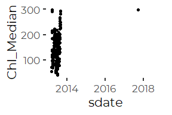

We remove the Chloride value from the data.

``` r
full_data <- full_data %>%
  mutate(Chl_Median = if_else(Site == 'S06B' & Year > 2014,
                              NA_real_, Chl_Median))
```

### Site S03, end of 2016

We noted some extreme dissolved oxygen data at the end of 2016. Values
were both extreme and highly variable.

We decided we should remove chloride and oxygen observations after
October 15th.

``` r
full_data <- full_data %>% 
  mutate(Chl_Median = if_else(Year == 2016 & Site == 'S03' & DOY > 288,
                              NA_real_, Chl_Median),
         DO_Median = if_else(Year == 2016 & Site == 'S03' & DOY > 288,
                              NA_real_, DO_Median),
         PctSat_Median = if_else(Year == 2016 & Site == 'S03' & DOY > 288,
                              NA_real_, PctSat_Median))
```

## Remove Partial Data from Winter Months

We have very limited data from several months. We have January data from
only one year, and February data from only three, and December data from
four, all older. Both March and November sample sizes vary.

The limited winter data generates severely unbalanced samples, which may
lead to estimation problems, especially in models with crossed or
potentially crossed factors and predictors. More fundamentally, the
potential bias introduced by showing data from those months from just a
handful of years could give a misleading impression of seasonal
patterns. We trim December, January and February data, but leave the
other months.

It is important to remember, even after trimming the data, that:  
1. 2010 is a partial year,  
2. The period of sampling in March may be biased due to spring melt
timing.

``` r
xtabs(~ Year_f + Month, data = full_data)
#>       Month
#> Year_f Jan Feb Mar Apr May Jun Jul Aug Sep Oct Nov Dec
#>   2010   0   0   0   0   0  78 103 106 120 124 120  35
#>   2011   0  24 104 120 124 120 124 124 120 124 120 112
#>   2012   0  45  93  90  93 116 124 114 120  39 108 124
#>   2013   9   0  58 131 155 140 124 127 120 141 150  15
#>   2014   0   0  62 108 155 150 155 155 150 155 120   0
#>   2015   0   0  23 147 186 180 186 186 180 160  30   0
#>   2016   0   0  25 173 186 180 186 186 180 186 168   0
#>   2017   0  18 186 180 186 180 186 186 180 186 102   0
#>   2018   0   0  34 180 186 180 186 186 180 186 126   0
```

``` r
full_data <- full_data %>%
  filter(Month %in% month.abb[3:11]  )
```

## Add Stream Flow Index

We worked through many models on a site by site basis in which we
included data on water depth, but since the depth coordinate is
site-specific, a 10 cm depth at one site may be exceptional, while at
another it is commonplace. We generally want not a local measure of
stream depth, but a watershed-wide metric of high, medium, or low stream
flow.

Middle and Lower Maine Stem sites would be suitable for a general flow
indicator across the watershed. The monitoring sites in that stretch of
Long Creek include include S05 and S17, however only site S05 has been
in continuous operation throughout the period of record, so we use depth
data from S05 to construct our general stream flow indicator.

Stream flow at S05 is correlated with flow at other sites, although not
all that closely correlated to flow in the downstream tributaries.

``` r
full_data %>%
  select(sdate, Site, lD_Median) %>%
  pivot_wider(names_from = Site, values_from = lD_Median) %>%
  select( -sdate) %>%
  cor(use = 'pairwise', method = 'pearson')
#>            S07      S06B       S05       S17       S03       S01
#> S07  1.0000000 0.5882527 0.7042711 0.7327432 0.4578906 0.5594067
#> S06B 0.5882527 1.0000000 0.8043943 0.8778188 0.7152403 0.6310361
#> S05  0.7042711 0.8043943 1.0000000 0.7906571 0.4526392 0.6506630
#> S17  0.7327432 0.8778188 0.7906571 1.0000000 0.6666414 0.7290077
#> S03  0.4578906 0.7152403 0.4526392 0.6666414 1.0000000 0.4499047
#> S01  0.5594067 0.6310361 0.6506630 0.7290077 0.4499047 1.0000000
```

We use the log of the daily median flow at S05 as a general
watershed-wide stream flow indicator, which we call `FlowIndex`. We use
the log of the raw median, to lessen the effect of the highly skewed
distribution of stream depths on the metric.

``` r
depth_data <- full_data %>%
  filter (Site == 'S05') %>%
  select(sdate, lD_Median)

full_data <- full_data %>%
  mutate(FlowIndex = depth_data$lD_Median[match(sdate, depth_data$sdate)])
  rm(depth_data)
```

Note that because the flow record at S05 has some gaps, any model using
this predictor is likely to have a smaller sample size.

## Create Working Data

Including Site = S06B in the GLS models causes an error, because models
that includes a Site:Year interaction are rank deficient. We only have
one year’s worth of data from that site. (`lm()` handles that case
gracefully, `gls()` does not.)

``` r
xtabs(~ Site + Year, data = full_data)
#>       Year
#> Site   2010 2011 2012 2013 2014 2015 2016 2017 2018
#>   S07   167  275  242  225  262  191  246  262  240
#>   S06B    0    0    0  220  217  193  247  262  240
#>   S05   118  255  151  184  217  231  248  262  241
#>   S17     0    0    0    0    0  223  235  262  241
#>   S03   183  275  252  251  262  223  246  262  241
#>   S01   183  275  252  266  252  217  248  262  241
```

We proceed with analyses that omits Site S06B.

``` r
reduced_data <- full_data %>%
  select (Site, Year, Month, DOY,
          Precip, lPrecip, PPrecip, wlPrecip,
          D_Median, lD_Median,
          Chl_Median, 
          IC, FlowIndex) %>%
  filter (Site != 'S06B' ) %>%
    mutate(Site = droplevels(Site)) %>%
  mutate(Year_f = factor(Year))
```

### Cleanup

``` r
rm(full_data)
```

# GAMM Model

Our GAMM fits separate smoothers for each of the three weather-related
covariates. Joint smoothers significantly reduce residual sums of
squares, but add model complexity, without changing predictions of
marginal means substantially. Arguably, we should also fit separate
smoothers by `FlowIndex` for each site, but this model performs well
compared to the more complex GAMMs. As we do not interpret the
covariates, but use them only to generate we are less concerned with
model details.

This model takes several minutes to run (more than 5, less than 15) We
check for a saved version before recalculating. If you alter underlying
data or model, you need to delete the saved version of the model to
trigger recalculation.

``` r
if (! file.exists("models/revised_gamm.rds")) {
  revised_gamm <- gamm(log(Chl_Median) ~ Site + 
                     s(lPrecip) + 
                     s(wlPrecip) +
                     s(FlowIndex) +
                     Month +
                     Year,
                   correlation = corAR1(0.8),
                   na.action = na.omit, 
                   method = 'REML',
                   data = reduced_data)
  saveRDS(revised_gamm, file="models/revised_gamm.rds")
} else {
  revised_gamm <- readRDS("models/revised_gamm.rds")
}
```

### Visualizing Estimated Marginal Means

Reliably calling `emmeans()` for `gamm()` models requires creating a
call object and associating it with the model as
`revised_gamm$gam$call`. (See the `emmeans` “models” vignette for more
info.

We (re)create the call object, associate it with the model, manually
construct a reference grid before finally calling `emmeans()` to extract
marginal means and back transform them to the original response scale.

This workflow has the advantage that it requires us to think carefully
about the structure of the reference grid.

We use `cov.reduce = median` to override the default behavior of
`emmeans()` and `ref_grid()`, which set quantitative covariates at their
mean values. Because of the highly skewed nature of many of our
predictors, the median provides a more realistic set of “typical” values
for the covariates, making the estimates marginal means more relevant.

We also explicitly specify that we want the marginal means estimated at
Year = 2014. This is mostly to avoid possible confusion. The default
creates a reference grid where marginal means are keyed to mean values
of all predictors, here including the year. The average of all of our
“year” predictors which would be some value close to and probably just
slightly larger than 2014. However, we specified `cov.reduce = median`,
so we would get the median Year, which is precisely 2014. So., although
this additional parameter is probably unnecessary, we chose to be
explicit.

``` r
the_call <-  quote(gamm(log(Chl_Median) ~ Site + 
                          s(lPrecip) + 
                          s(wlPrecip) +
                          s(FlowIndex) +
                          Month +
                          Year +
                          Site : Year,
                        correlation = corAR1(0.8),
                        na.action = na.omit, 
                        method = 'REML',
                        data = reduced_data))
revised_gamm$gam$call <- the_call


my_ref_grid <- ref_grid(revised_gamm, 
                        at = list(Year = 2014), 
                        cov.reduce = median,
                        cov.keep = 'Month')
```

### By Month

``` r
by_month <- summary(emmeans(my_ref_grid, ~ Month, 
             type = 'response'))

labl <- 'Values Adjusted to Median Flow and\nMedian 10 Day Precipitation\nAll Sites Combined'

# `plot.emmGrid()` defaults to using ggplot, so we can use ggplot
# skills to alter the look and feel of these plots.
plot(by_month) + 
  xlab('Chloride (mg/l)\n(Flow and Precipitation Adjusted)') +
  ylab ('') +
  annotate('text', 400, 6, label = labl, size = 3.5) +
  annotate('text', 220, 9.95, label = 'CCC = 230 mg/l', size = 3) + 
  xlim(0,500) +
  geom_vline(xintercept =  230, lty = 2) +
  #geom_vline(xintercept =  860, lty = 3) +
  coord_flip() +
  theme_cbep(base_size = 12)
```

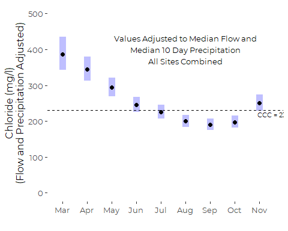

Note that all estimated monthly means are somewhat lower than from the
GLS model.

### By Site

``` r
by_site <- summary(emmeans(my_ref_grid, ~ Site, type = 'response'))

labl <- 'Values Adjusted to Median Flow and\nMedian 10 Day Precipitation\nAll Dates Combined'

plot(by_site) + 
  xlab('Chloride (mg/l)\n(Weather Adjusted)') +
  ylab("Upstream      Main Stem                Lower Tribs        ") +
  annotate('text', 425, 2.5, label = labl, size = 3.5) +
  xlim(0,500) +
  geom_vline(xintercept =  230, lty = 2) +
  annotate('text', 220, 5, label = 'CCC = 230 mg/l', size = 3) + 
  #geom_vline(xintercept =  860, lty = 3) +
  coord_flip() +
  theme_cbep(base_size = 12)
```

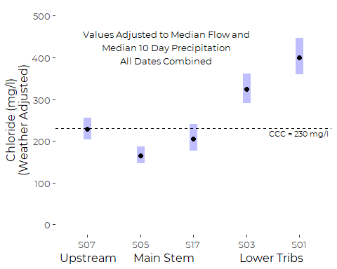

### Trends

We extract results on the log scale, so we can calculate the linear
predictor by hand, then back transform.

Note that our “best” model does not include different slopes among the
different sites. We have two choices: fit a single graphical line that
represents the average trends across all sites, or fit parallel lines
for each site.

#### Annual Means

``` r
my_means <- reduced_data %>%
  select(Year, Site, Chl_Median) %>%
  group_by(Year, Site) %>%
  summarize(MN= mean(Chl_Median, na.rm = TRUE),
            SD = sd(Chl_Median, na.rm = TRUE),
            N = sum(! is.na(Chl_Median)),
            SE = SD / sqrt(N),
            .groups = 'drop') 
```

#### Single Trendline

To draw a single trend regression line, we have several options. We
could use `predict()` to generate model predictions and standard errors,
or we can calculate an intercept and slope. For SoCB we are not
interested in displaying regression errors. We simply state that
regression results are significant.  
So either approach is appropriate.

We can use `emmeans()` to find an appropriate intercept, and the single
slope is present as a model coefficient.

``` r
my_ref_grid <- ref_grid(revised_gamm,
                        cov.reduce = median, 
                        at = c(Year = 2014))
(intcpt <- summary(emmeans(my_ref_grid, 'Year'))$emmean)
#> [1] 5.529192
(slp <- unname(coef(revised_gamm$gam)['Year']))
#> [1] 0.1044746
```

``` r
one_slope <- tibble(Year = 2010:2018,
                    pred = exp((Year - 2014) * slp + intcpt))

ggplot(one_slope, aes(x = Year, y = pred)) +
  geom_step(direction = 'mid') +     # puts slope breaks mid year
  ylab('Daily Median Chloride (mg/l)') +
  xlab('') +
  ylim(0,600) +
  geom_hline(yintercept =  230, lty = 2) +
  annotate('text', 2012.5, 245, label = 'CCC = 230 mg/l', size = 3) + 

  scale_color_manual(values = cbep_colors()) +
  scale_x_continuous(breaks= c(2010, 2012, 2014, 2016, 2018)) +
  theme_cbep(base_size = 12)
```

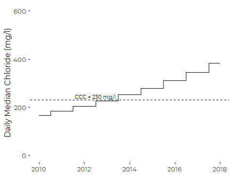

#### Multiple Trendlines

Here, we follow the same logic, but have separate intercepts, one for
each Site.

``` r
my_ref_grid <- ref_grid(revised_gamm,
                        cov.reduce = median, cov.keep = c('Year'))

(a <- summary(emmeans(my_ref_grid, 'Site')))
#>  Site emmean     SE   df lower.CL upper.CL
#>  S07    5.43 0.0579 6127     5.32     5.54
#>  S05    5.11 0.0625 6127     4.99     5.23
#>  S17    5.33 0.0782 6127     5.18     5.48
#>  S03    5.78 0.0544 6127     5.68     5.89
#>  S01    5.99 0.0556 6127     5.88     6.10
#> 
#> Results are averaged over the levels of: Month, Year 
#> Results are given on the log (not the response) scale. 
#> Confidence level used: 0.95
(slp <- unname(coef(revised_gamm$gam)['Year']))
#> [1] 0.1044746
```

``` r
pred_df <- tibble(Site =  rep(levels(reduced_data$Site), each = 9), 
              Year = rep(2010:2018, 5)) %>%
  mutate(Site = factor(Site, levels = levels(reduced_data$Site))) %>%
  mutate(pred = exp((Year - 2014) * slp + a[['emmean']][match(Site, a$Site)])) %>%
  left_join(my_means, by = c('Site', 'Year')) %>%
  mutate(pred = if_else(Site == 'S17' & Year < 2015, NA_real_, pred))
         
```

``` r
ggplot(pred_df, aes(x = Year, y = pred, color = Site)) +
         geom_step(direction = 'mid') +
  ylab('Chloride (mg/l)\n(Weather Adjusted)') +
  xlab('') +
  ylim(0,600) +
  geom_hline(yintercept =  230, lty = 2) +
  annotate('text', 2013, 245, label = 'CCC = 230 mg/l', size = 3) + 
  scale_color_manual(values = cbep_colors()) +
  scale_x_continuous(breaks= c(2010, 2012, 2014, 2016, 2018)) +
  theme_cbep(base_size = 12)
#> Warning: Removed 6 row(s) containing missing values (geom_path).
```

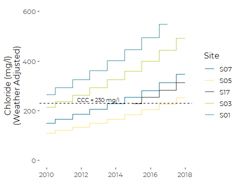

# Graphic Alternatives

## By Site

``` r
labl <- 'Means and Standard Errors\nWeather Adjusted'

plt1 <- reduced_data %>%
  ggplot(aes(x = Site, y = Chl_Median)) +
  #scale_color_manual(values = cbep_colors()) +
  geom_violin(scale = 'count', fill = cbep_colors()[6]) +

  ylab('Daily Median Chloride (mg/l)') +
  xlab("Upstream      Main Stem                Lower Tribs        ") +
  #annotate('text', 2.25, 1400, label = labl, size = 3.5) +
  #xlim(0,500) +
  
  geom_hline(yintercept =  230, lty = 2) +
  annotate('text', 5.4, 200, label = 'CCC', size = 3) + 
  
  geom_hline(yintercept =  860, lty = 2) +
  annotate('text', 5.4, 830, label = 'CMC', size = 3) + 
  
  theme_cbep(base_size = 12)
```

### Marginal Means and 95% CI

``` r
plt1 + 
  #stat_summary(fun.data = "mean_se",
  #               geom ='point', color = 'cbep_colors()[1]'red', alpha = 0.5) +
  geom_segment(aes(x = Site, xend = Site, y = lower.CL, yend = upper.CL),
               data = by_site, size  = 1.5, color = 'gray40') + 
geom_point(aes(x = Site, y = response),  data = by_site,
             size  = 2) 
#> Warning: Removed 1168 rows containing non-finite values (stat_ydensity).
```

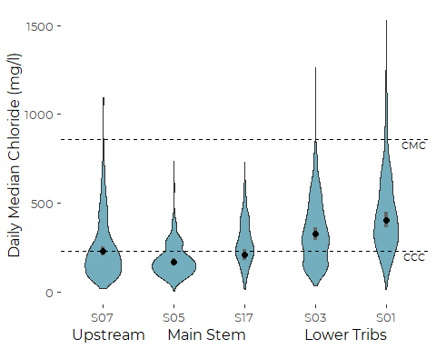

``` r
  #scale_y_log10()
```

### Added Boxplots – Observed Medians

``` r
plt1 +
  geom_boxplot(width=0.1, coef = 0, outlier.shape = NA,
               color= 'gray30', fill = 'white') +
  #stat_summary(fun = "median",
  #            geom ='point', shape = 18, size = 2)
ggsave('figures/chl_Site_violin_w_box.pdf', device = cairo_pdf, width = 5, height = 4)
#> Warning: Removed 1168 rows containing non-finite values (stat_ydensity).
#> Warning: Removed 1168 rows containing non-finite values (stat_boxplot).
#> Warning: Removed 1168 rows containing non-finite values (stat_ydensity).
#> Warning: Removed 1168 rows containing non-finite values (stat_boxplot).
```

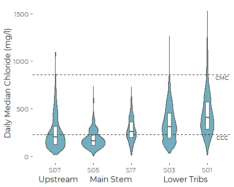

``` r
xanchor = 0.75

plt1 +
  geom_boxplot(width=0.1, coef = 0, outlier.shape = NA,
               color= 'gray30', fill = 'white') +
  
  annotate('rect', xmin = xanchor, ymin = 1200, xmax =xanchor + 0.1, ymax = 1400,
           fill = 'white', color = 'gray30', size = .5) + 
  annotate('segment', x= xanchor, y = 1300, xend = xanchor + 0.1, yend = 1300, 
           color = 'gray30') +
  
  annotate('text', x= xanchor + 0.2, y = 1200,
           hjust = 0, size = 3, label = '25th percentile') +
  annotate('text', x= xanchor + 0.2, y = 1300,
           hjust = 0, size = 3, label = 'median') +
  annotate('text', x= xanchor + 0.2, y = 1400,
           hjust = 0, size = 3, label = '75th percentile')
#> Warning: Removed 1168 rows containing non-finite values (stat_ydensity).
#> Warning: Removed 1168 rows containing non-finite values (stat_boxplot).
```

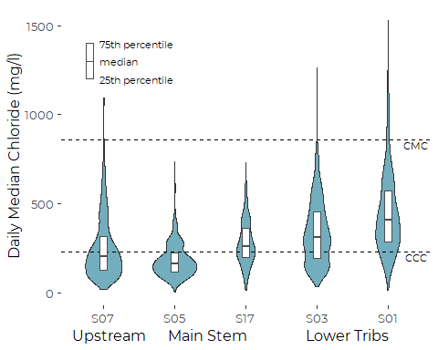

``` r
ggsave('figures/chl_Site_violin_w_bo_annot.pdf', device = cairo_pdf, width = 5, height = 4)
#> Warning: Removed 1168 rows containing non-finite values (stat_ydensity).

#> Warning: Removed 1168 rows containing non-finite values (stat_boxplot).
```

### By Imperviousness

#### A Table

``` r
reduced_data %>%
  select(Site, Chl_Median, IC) %>%
  group_by(Site) %>%
  summarize(`Watershed Imperviousness (%)` = round(median(IC),1),
            `Median Chloride (mg/l)` = round(median(Chl_Median, na.rm = TRUE),1),
            .groups = 'drop') %>%
  #arrange(`Watershed Imperviousness (%)`) %>%
knitr::kable(align = "lcc")
```

| Site | Watershed Imperviousness (%) | Median Chloride (mg/l) |
|:-----|:----------------------------:|:----------------------:|
| S07  |             20.2             |         201.3          |
| S05  |             16.6             |         162.2          |
| S17  |             19.9             |         257.8          |
| S03  |             41.2             |         311.2          |
| S01  |             56.1             |         405.4          |

#### Points Only

We tried repeatedly to alter the y axis limits, but `ggplot2` kept
placing the `stat_summary()` points incorrectly. For example, S01 is
about 400 mg.l, but after altering the y axis limits with `ylim()`, the
points appear closer to 350 mg/l. We have tried to reproduce this
behavior in a minimal reprex, but with no luck.

We prefer a version with slightly misplaced labels to one with a
misleading Y axis.

``` r
locs <- reduced_data %>%
  select(Site, Chl_Median, IC) %>%
  group_by(Site) %>%
  summarize(yloc = median(Chl_Median, na.rm = TRUE) - 5,
            xloc = median(IC) + 2,
            .groups = 'drop')

plt <- reduced_data %>%
  ggplot(aes(x = IC, y = Chl_Median, group = Site)) +
  xlim(c(0,60)) +
  ylim(c(0, 500)) +
  
  geom_hline(yintercept =  230, lty = 2) +
  annotate('text', 0, 220, label = 'CCC', size = 3, hjust = 0) + 
  
  # A point for the Median
  stat_summary(fun = "median", na.rm = TRUE,
                  geom ='point',
               fill = cbep_colors()[1], 
               size = 2, shape = 23) +
  
  geom_text(aes(x = xloc, y = yloc, label = Site), 
            hjust = 0, size = 4, data = locs) +
  
  ylab('Median Chloride (mg/l)') +
  xlab('Watershed Imperviousness (%)') +

  theme_cbep(base_size = 12)
plt
```

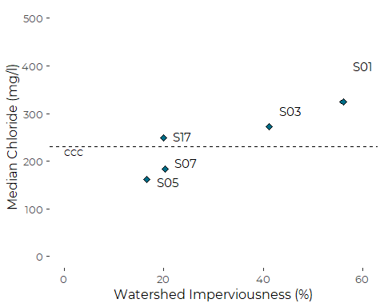

``` r
ggsave('figures/chl_b-_IC_points.pdf', device = cairo_pdf, width = 5, height = 4)
```

#### Points and Ranges

Here the default Y axis limits work, but if we alter the y axis labels,
we see the same problem.

``` r
locs <- reduced_data %>%
  select(Site, Chl_Median, IC) %>%
  group_by(Site) %>%
  summarize(yloc = median(Chl_Median, na.rm = TRUE) - 20,
            xloc = median(IC) + 2,
            .groups = 'drop') %>%
  mutate(xloc = if_else(Site == 'S05', xloc - 8, xloc),
         yloc = if_else(Site == 'S17', yloc + 40, yloc))

plt <- reduced_data %>%
  ggplot(aes(x = IC, y = Chl_Median, group = Site)) +
  

  # A "skinny" line for the full range 
  stat_summary(fun.data = function(x) median_hilow(x, conf.int = 1),
                  geom ='linerange', color = cbep_colors()[5], lwd = .5) +
  
  
  # A "fat"line for interquartile range
  stat_summary(fun.data = "median_hilow",
                  geom ='linerange',
               color = cbep_colors()[1], 
               size = 2) +

  # A point for the Median
  stat_summary(fun.data = "median_hilow",
                  geom ='point',
               fill = cbep_colors()[1], 
               size = 4, shape = 23) +
  
  geom_text(aes(x = xloc, y = yloc, label = Site), 
            hjust = 0, size = 4, data = locs) +
  
  ylab('Daily Median Chloride (mg/l)') +
  xlab('Watershed Imperviousness (%)') +
  xlim(c(0,60)) +

  geom_hline(yintercept =  230, lty = 2) +
  annotate('text', 0, 200, label = 'CCC', size = 3, hjust = 0) + 
  
  geom_hline(yintercept =  860, lty = 2) +
  annotate('text', 0, 830, label = 'CMC', size = 3, hjust = 0) +
    
  
  theme_cbep(base_size = 12)
```

``` r
plt +
  annotate('segment', x= 0, y = 1000, xend = 0, yend = 1400,
           color = cbep_colors()[1], size = .5) + 
  annotate('segment', x= 0, y = 1100, xend = 0, yend = 1300, 
           color = cbep_colors()[1], size = 3) +
  annotate('point', x= 0, y = 1200,
           fill = cbep_colors()[1], size = 4, shape = 23) +

annotate('text', x= 2, y = 1000, hjust = 0, size = 3, label = 'minimum') +
annotate('text', x= 2, y = 1100, hjust = 0, size = 3, label = '25th percentile') +
annotate('text', x= 2, y = 1200, hjust = 0, size = 3, label = 'median') +
annotate('text', x= 2, y = 1300, hjust = 0, size = 3, label = '75th percentile') +
annotate('text', x= 2, y = 1400, hjust = 0, size = 3, label = 'maximum')
#> Warning: Removed 1168 rows containing non-finite values (stat_summary).

#> Warning: Removed 1168 rows containing non-finite values (stat_summary).

#> Warning: Removed 1168 rows containing non-finite values (stat_summary).
```

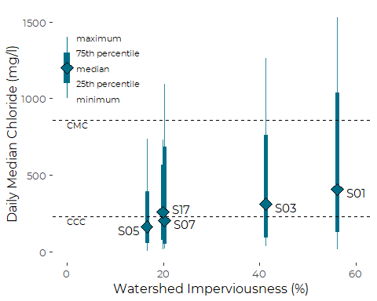

``` r
ggsave('figures/chl_b-_IC_ranges.pdf', device = cairo_pdf, width = 5, height = 4)
#> Warning: Removed 1168 rows containing non-finite values (stat_summary).

#> Warning: Removed 1168 rows containing non-finite values (stat_summary).

#> Warning: Removed 1168 rows containing non-finite values (stat_summary).
```

## By Month

``` r
plt2 <- reduced_data %>%
  filter(! Month %in% c('Jan', 'Feb')) %>%
  ggplot(aes(x = Month, y = Chl_Median)) +
  geom_violin(fill = cbep_colors()[2], scale = 'count') +

  ylab('Daily Median Chloride (mg/l)') +
  xlab("") +

  geom_hline(yintercept =  230, lty = 2) +
  annotate('text', 0, 200,  hjust = 0, label = 'CCC', size = 3) + 
  
  geom_hline(yintercept =  860, lty = 2) +
  annotate('text', 0, 830, hjust = 0, label = 'CMC', size = 3) + 
  
  theme_cbep(base_size = 12)
```

### Marginal Means and 95% CI

The emms here are reasonable, but there is little advantage to
interposing a model between data and the readers here, and medians tell
a similar story.

``` r
plt2 + 
  # stat_summary(fun.data = "mean_se",
  #                geom ='pointrange', color = 'red', alpha = 0.5) +
  geom_segment(aes(x = Month, xend = Month, y = lower.CL, yend = upper.CL),
               data = by_month, size  = 1, color = 'gray10') +
    geom_point(aes(x = Month, y = response), data = by_month,
               size = 2, color = 'gray30')
#> Warning: Removed 1168 rows containing non-finite values (stat_ydensity).
```

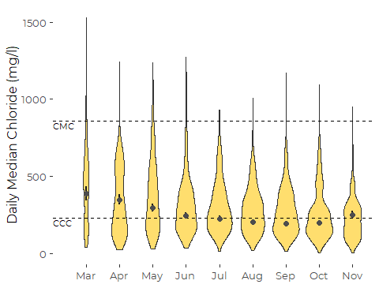
\#\#\# Added Boxplots

``` r
plt2 +
  geom_boxplot(width=0.15, coef = 0, outlier.shape = NA,
               color= 'gray30', fill = 'white') +
  #stat_summary(fun = "median",
  #             geom ='point', shape = 18, size = 2.5)
ggsave('figures/chl_month_violin_w_box.pdf', device = cairo_pdf,
       width = 5, height = 4)
#> Warning: Removed 1168 rows containing non-finite values (stat_ydensity).
#> Warning: Removed 1168 rows containing non-finite values (stat_boxplot).
#> Warning: Removed 1168 rows containing non-finite values (stat_ydensity).
#> Warning: Removed 1168 rows containing non-finite values (stat_boxplot).
```

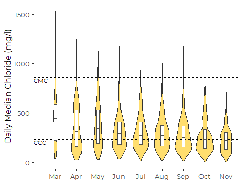

``` r
xanchor = 7

plt2 +
  geom_boxplot(width=0.15, coef = 0, outlier.shape = NA,
               color= 'gray30', fill = 'white') +
  
  annotate('rect', xmin = xanchor, ymin = 1200, xmax =xanchor + 0.1, ymax = 1400,
           fill = 'white', color = 'gray30', size = .5) + 
  annotate('segment', x= xanchor, y = 1300, xend = xanchor + 0.1, yend = 1300, 
           color = 'gray30') +
  
  annotate('text', x= xanchor + 0.2, y = 1200,
           hjust = 0, size = 3, label = '25th percentile') +
  annotate('text', x= xanchor + 0.2, y = 1300,
           hjust = 0, size = 3, label = 'median') +
  annotate('text', x= xanchor + 0.2, y = 1400,
           hjust = 0, size = 3, label = '75th percentile')
#> Warning: Removed 1168 rows containing non-finite values (stat_ydensity).
#> Warning: Removed 1168 rows containing non-finite values (stat_boxplot).
```

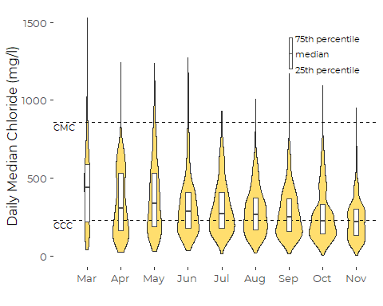

``` r
ggsave('figures/chl_month_violin_w_box_annot.pdf', device = cairo_pdf,
       width = 5, height = 4)
#> Warning: Removed 1168 rows containing non-finite values (stat_ydensity).

#> Warning: Removed 1168 rows containing non-finite values (stat_boxplot).
```

## Trends

### Violin Plot

``` r
labl <- 'Estimated Annual Mean Chlorides\nWeather Adjusted'

plt3 <- reduced_data %>%
  ggplot(aes(x = Year, y = Chl_Median)) +
  geom_violin(aes(group = Year), scale = 'count', fill = cbep_colors()[4]) +
  xlab('') +
  ylab('Daily Median Chloride (mg/l)') +
  #annotate('text', 2015, 1400, label = labl, size = 3.5) +
  #xlim(0,500) +
  
  scale_color_manual(values = cbep_colors()) +
  scale_fill_manual(values = cbep_colors()) +
  scale_x_continuous(breaks= c(2010, 2012, 2014, 2016, 2018)) +
  
  geom_hline(yintercept =  230, lty = 2) +
  annotate('text', 2009.25, 200, label = 'CCC', size = 3) + 
  
  geom_hline(yintercept =  860, lty = 2) +
  annotate('text', 2009.25, 830, label = 'CMC', size = 3) + 
  
  theme_cbep(base_size = 12)
```

#### Marginal Means

The marginal means here gloss over significant year to year variability,
and thus are an inappropriate graphic on their own.

``` r
plt3 +
geom_point(aes(x = Year, y = pred),  data = one_slope,
             size  = 2) 
#> Warning: Removed 1168 rows containing non-finite values (stat_ydensity).
```

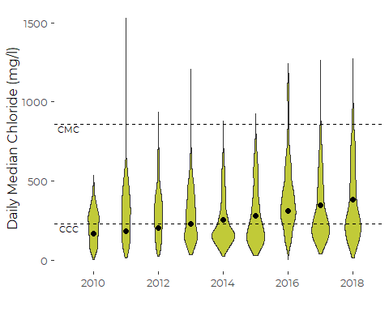
\#\#\#\# Added Boxplots

``` r
plt3 +
  geom_boxplot(aes(group = Year), width=0.15, coef = 0, outlier.shape = NA,
               color= 'gray30', fill = 'white')  +
  # stat_summary(fun = "median",
  #            geom ='point', shape = 18, size = 2.5)

ggsave('figures/chl_year_violin_w_box.pdf', device = cairo_pdf, width = 5, height = 4)
#> Warning: Removed 1168 rows containing non-finite values (stat_ydensity).
#> Warning: Removed 1168 rows containing non-finite values (stat_boxplot).
#> Warning: Removed 1168 rows containing non-finite values (stat_ydensity).
#> Warning: Removed 1168 rows containing non-finite values (stat_boxplot).
```

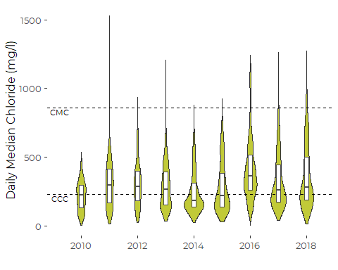

``` r
xanchor = 2016

plt3 +
  geom_boxplot(aes(group = Year), width=0.15, coef = 0, outlier.shape = NA,
               color= 'gray30', fill = 'white') +
  
  annotate('rect', xmin = xanchor, ymin = 1400, xmax =xanchor + 0.15, ymax = 1600,
           fill = 'white', color = 'gray30', size = .5) + 
  annotate('segment', x= xanchor, y = 1500, xend = xanchor + 0.15, yend = 1500, 
           color = 'gray30') +
  
  annotate('text', x= xanchor + 0.35, y = 1400,
            hjust = 0, size = 3, label = '25th percentile') +
  annotate('text', x= xanchor + 0.3, y = 1500,
            hjust = 0, size = 3, label = 'median') +
  annotate('text', x= xanchor + 0.3, y = 1600,
            hjust = 0, size = 3, label = '75th percentile')
#> Warning: Removed 1168 rows containing non-finite values (stat_ydensity).
#> Warning: Removed 1168 rows containing non-finite values (stat_boxplot).
```

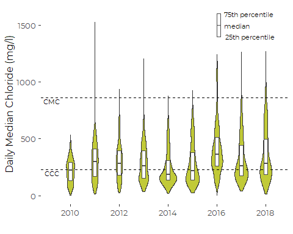

``` r
ggsave('figures/chl_year_violin_w_box_annot.pdf', device = cairo_pdf, width = 5, height = 4)
#> Warning: Removed 1168 rows containing non-finite values (stat_ydensity).

#> Warning: Removed 1168 rows containing non-finite values (stat_boxplot).
```

#### Add Regression Line Behind Violins

The regression line is confusing, since it is weather-adjusted.

``` r
plt3.1 <- plt3 +
  geom_boxplot(aes(group = Year), width=0.15, coef = 0, outlier.shape = NA,
               color= 'gray30', fill = 'white')  +
    #stat_summary(fun = "median",
    #           geom ='point', shape = 18, size = 2.5)
  
  annotate('rect', xmin = xanchor, ymin = 1400, xmax =xanchor + 0.15, ymax = 1600,
           fill = 'white', color = 'gray30', size = .5) + 
  annotate('segment', x= xanchor, y = 1500, xend = xanchor + 0.15, yend = 1500, 
           color = 'gray30') +
  
  annotate('text', x= xanchor + 0.35, y = 1400,
            hjust = 0, size = 3, label = '25th percentile') +
  annotate('text', x= xanchor + 0.3, y = 1500,
            hjust = 0, size = 3, label = 'median') +
  annotate('text', x= xanchor + 0.3, y = 1600,
            hjust = 0, size = 3, label = '75th percentile')
  
  
plt3.1$layers <- c(geom_line(aes(x = Year, y = pred), 
                             data = one_slope, size = .75),
                   plt3.1$layers)
plt3.1
#> Warning: Removed 1168 rows containing non-finite values (stat_ydensity).
#> Warning: Removed 1168 rows containing non-finite values (stat_boxplot).
```

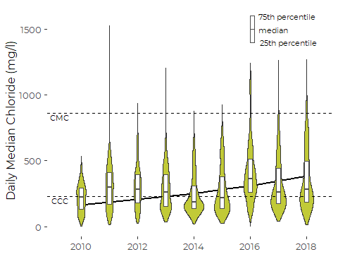

``` r
#ggsave('figures/chl_year_violin_w_box_predict.pdf', device = cairo_pdf,
          #width = 5, height = 4)
```

### Jitter Plot

``` r
plt4 <- reduced_data %>%
  ggplot(aes(x = Year, y = Chl_Median)) +
  geom_jitter(aes(group = Year, color = Site),
              size = 0.75,
              alpha = 0.4,
              width = .25) +

  ylab('Daily Median Chloride (mg/l)') +
  
  scale_color_manual(values = cbep_colors()) +
  scale_fill_manual(values = cbep_colors()) +
  
  guides(color = guide_legend(override.aes = list(size=3, alpha = 0.75))) +
  
  geom_hline(yintercept =  230, lty = 2) +
  annotate('text', 2009, 200, label = 'CCC', size = 3) + 
  
  geom_hline(yintercept =  860, lty = 2) +
  annotate('text', 2009, 830, label = 'CMC', size = 3) + 
  
  theme_cbep(base_size = 12)

plt4
#> Warning: Removed 1168 rows containing missing values (geom_point).
```

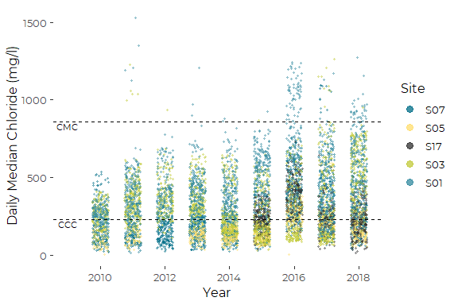

#### Add Single Regression Line

Single regression line here is misleading.

``` r
plt4 +
  geom_line(aes(x = Year, y = pred), 
              size = .75, data = one_slope)
#> Warning: Removed 1168 rows containing missing values (geom_point).
```

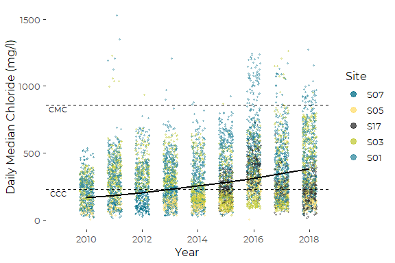

#### Add Site Means

``` r
plt4.1 <- plt4 +
  stat_summary(aes(fill =Site), geom = 'point',
               fun = mean,
               pch = 23, size = 3)

plt4.1
#> Warning: Removed 1168 rows containing non-finite values (stat_summary).
#> Warning: Removed 1168 rows containing missing values (geom_point).
```

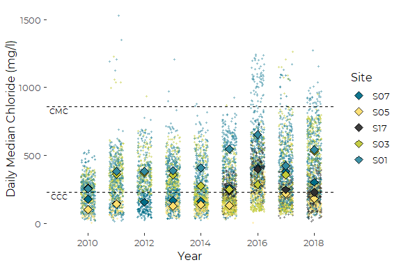

#### Add Site Means Single Regression Line

``` r
plt4.2 <- plt4.1 +

geom_line(aes(x = Year, y = pred), 
              size = .75, data = one_slope)
plt4.2
#> Warning: Removed 1168 rows containing non-finite values (stat_summary).
#> Warning: Removed 1168 rows containing missing values (geom_point).
```

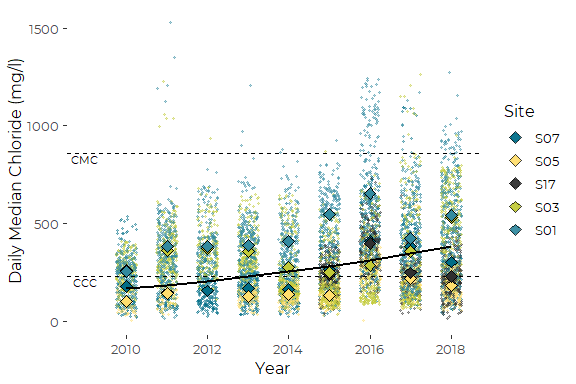

#### Add Site Means and Multiple Regression Lines

Solution to separately control width of points and lines in a single
legend came from
[here](https://stackoverflow.com/questions/61096323/how-can-i-change-the-colour-line-size-and-shape-size-in-the-legend-independently).

The key is writing a function to pass as the (undocumented?)
“key\_glyph” parameter to the relevant geom, here \`geom\_lines().

The other trick here is manually inserting a layer at the back of the
list of layers, rather than adding it to the front of the graphic.

This graphic is not terrible, but the `emtrend( )` lines are still hard
to understand, as they don’t clearly fit with the site means, largely
because we are showing “parallel” lines as the interaction terms were
not significant.

``` r
narrow_line <- function(data, params, size) {
  # Multiply by some number
  data$size <- data$size / 4
  draw_key_path(data = data, params = params, size = size)
}

plt4.3 <- plt4.1

plt4.3$layers <- c(geom_line(aes(x = Year, y = pred, color = Site), 
                               size = 1.25, 
                               key_glyph = narrow_line, data = pred_df), 
                     plt4.1$layers)

plt4.3 +
  # guides(color = guide_legend(override.aes = list(size = 2))) +
  theme(legend.key.width=unit(.4,"inches"))
#> Warning: Removed 1168 rows containing non-finite values (stat_summary).
#> Warning: Removed 5 row(s) containing missing values (geom_path).
#> Warning: Removed 1168 rows containing missing values (geom_point).
```

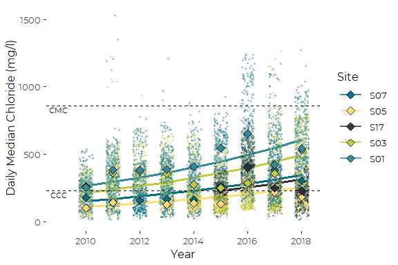

#### Add Site Mean Lines and Regression Lines

``` r
narrow_line <- function(data, params, size) {
  # Multiply by some number
  data$size <- data$size / 4
  draw_key_path(data = data, params = params, size = size)
}

plt4 +
  geom_line(aes(x = Year, y = pred, 
                             color = Site), 
                             size = 1,
                             data = pred_df,
                             key_glyph = narrow_line) +
  geom_line(aes(Year, MN, group = Site),
             data = my_means, lty = '22') +
  geom_point(aes(Year, MN, fill = Site),
             colour="black", pch=23, size = 2,
             data = my_means) +

  #guides(color = guide_legend(override.aes = list(size = 2))) +
  theme(legend.key.width=unit(.4,"inches"))
#> Warning: Removed 1168 rows containing missing values (geom_point).
#> Warning: Removed 5 row(s) containing missing values (geom_path).
#> Warning: Removed 1 rows containing missing values (geom_point).
```

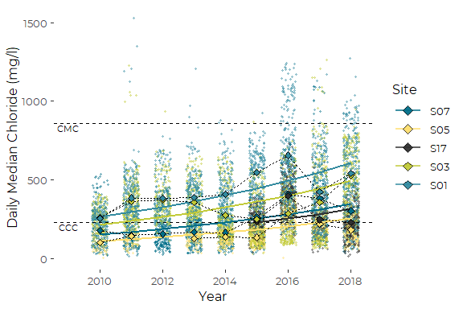
