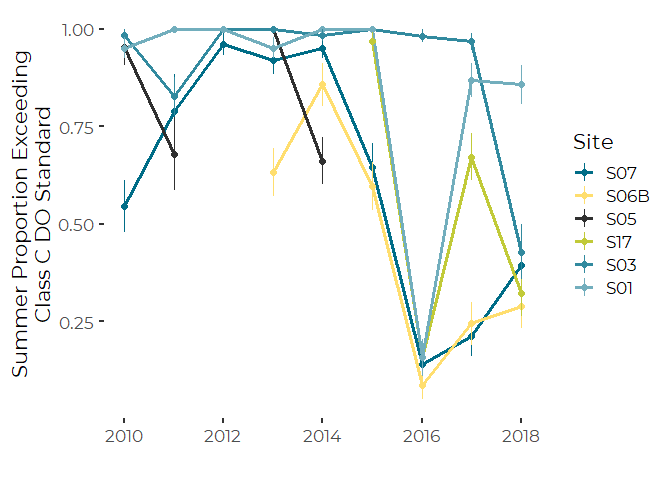
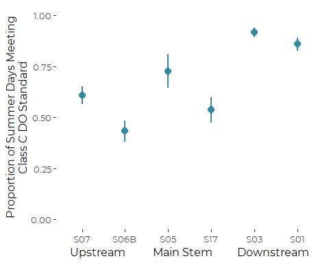
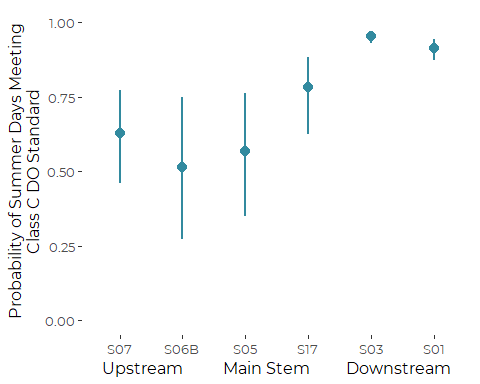

Graphics for Site by Site Differences in LCWMD ‘Diurnal Exceedences’ of
Class C DO Standards
================
Curtis C. Bohlen, Casco Bay Estuary Partnership.
01/28/2021

-   [Introduction](#introduction)
-   [This Notebook](#this-notebook)
    -   [Note](#note)
    -   [Sources of Threshold Values](#sources-of-threshold-values)
        -   [Dissolved oxygen](#dissolved-oxygen)
-   [Import Libraries](#import-libraries)
-   [Data Preparation](#data-preparation)
    -   [Folder References](#folder-references)
    -   [Data on Sites and Impervious
        Cover](#data-on-sites-and-impervious-cover)
    -   [Main Data](#main-data)
    -   [Data Corrections](#data-corrections)
        -   [Anomolous Depth Values](#anomolous-depth-values)
        -   [Single S06B Chloride Observation from
            2017](#single-s06b-chloride-observation-from-2017)
        -   [Anomolous Dissolved Oxygen and Chloride
            Values](#anomolous-dissolved-oxygen-and-chloride-values)
    -   [Remove Partial Data from Winter
        Months](#remove-partial-data-from-winter-months)
    -   [Add Stream Flow Index](#add-stream-flow-index)
    -   [Create July and August Data
        Only](#create-july-and-august-data-only)
-   [Graphics of Observed Relative
    Frequencies](#graphics-of-observed-relative-frequencies)
    -   [Site by Year](#site-by-year)
    -   [Site Only](#site-only)
        -   [Observed Graphic](#observed-graphic)
        -   [Model based Graphics](#model-based-graphics)


# Introduction

The Long Creek Watershed, almost three and a half square miles in area,
is dominated by commercial land use. The Maine Mall is one of the
largest land owners in the watershed, and it is surrounded by a range of
commercial businesses, from medical offices, to car washes. About a
third of the watershed in impervious surfaces like roads, parking lots,
and rooftops.

Landowners with an acre or more of impervious area are required to get a
Clean Water Act permit for stormwater discharges from their property.
The LCWMD provides an alternative for landowners to working to receive
an individual permit. Landowners who elect to participate in the The
Long Creek Watershed Management District receive a General Permit, in
return for providing funding to the District, and facilitating the work
of the district by permitting access to their property for certain
activities.

For more information on LCWMD, see [their web
site](restorelongcreek.org).

# This Notebook

This notebook produces graphics depicting the PROBABILITY of meeting or
failing to meet Class C DO standards at each Long Creek Monitoring
location.

The core challenge is that we have a limited number of years of data,
and data from some sites is only available for a limited period of
years.

We focus on the summer months of July and August, because seasonal
variation in probability of meeting DO standards is very large, and low
probability of failing DO standards at other times of yer interfere with
efficient estimation.

## Note

In this data set a “TRUE” value consistently implies that water quality
criteria were met or exceeded, whether that is achieved by a value
higher than or lower than some numeric criteria. “TRUE” implies good
conditions. “FALSE” implies bad conditions.

## Sources of Threshold Values

### Dissolved oxygen

Maine’s Class B water quality standards call for dissolved oxygen above
7 mg/l, with percent saturation above 75%. The Class C Standards, which
apply to almost all of Long Creek, call for dissolved oxygen above 5
mg/l, with percent saturation above 60%. In addition, for class C
conditions, the thirty day average dissolved oxygen must stay above 6.5
mg/l.

# Import Libraries

``` r
library(nlme)      # Supports glmmPQL()
#library(MASS)      # for glmmPQL() function, which allows correlation in GLM

#library(glmmTMB)   # An alternate -- possibly more robust -- fitting algorithm

library(lme4)     # Contains glmer()
#> Loading required package: Matrix
#> 
#> Attaching package: 'lme4'
#> The following object is masked from 'package:nlme':
#> 
#>     lmList
library(mgcv)     # For mixed effects GAMM models -- probably not needed here yet.
#> This is mgcv 1.8-33. For overview type 'help("mgcv-package")'.

library(tidyverse)  # Has to load after MASS, so `select()` is not masked
#> -- Attaching packages --------------------------------------- tidyverse 1.3.0 --
#> v ggplot2 3.3.3     v purrr   0.3.4
#> v tibble  3.0.5     v dplyr   1.0.3
#> v tidyr   1.1.2     v stringr 1.4.0
#> v readr   1.4.0     v forcats 0.5.0
#> -- Conflicts ------------------------------------------ tidyverse_conflicts() --
#> x dplyr::collapse() masks nlme::collapse()
#> x tidyr::expand()   masks Matrix::expand()
#> x dplyr::filter()   masks stats::filter()
#> x dplyr::lag()      masks stats::lag()
#> x tidyr::pack()     masks Matrix::pack()
#> x tidyr::unpack()   masks Matrix::unpack()
library(readr)

library(emmeans)  # Provides tools for calculating marginal means

library(CBEPgraphics)
load_cbep_fonts()
theme_set(theme_cbep())

library(LCensMeans)
```

# Data Preparation

## Folder References

``` r
sibfldnm    <- 'Derived_Data'
parent      <- dirname(getwd())
sibling     <- file.path(parent,sibfldnm)

dir.create(file.path(getwd(), 'figures'), showWarnings = FALSE)
dir.create(file.path(getwd(), 'models'), showWarnings = FALSE)
```

## Data on Sites and Impervious Cover

These data were derived from Table 2 from a GZA report to the Long Creek
Watershed Management District, titled “Re: Long Creek Watershed Data
Analysis; Task 2: Preparation of Explanatory and Other Variables.” The
Memo is dated November 13, 2019 File No. 09.0025977.02.

Cumulative Area and IC calculations are our own, based on the GZA data
and the geometry of the stream channel.

``` r
# Read in data and drop the East Branch, where we have no data
fn <- "Site_IC_Data.csv"
fpath <- file.path(sibling, fn)

Site_IC_Data <- read_csv(fpath) %>%
  filter(Site != "--") 
#> 
#> -- Column specification --------------------------------------------------------
#> cols(
#>   Site = col_character(),
#>   Subwatershed = col_character(),
#>   Area_ac = col_double(),
#>   IC_ac = col_double(),
#>   CumArea_ac = col_double(),
#>   CumIC_ac = col_double(),
#>   PctIC = col_character(),
#>   CumPctIC = col_character()
#> )

# Now, create a factor that preserves the order of rows (roughly upstream to downstream). 
Site_IC_Data <- Site_IC_Data %>%
  mutate(Site = factor(Site, levels = Site_IC_Data$Site))

# Finally, convert percent covers to numeric values
Site_IC_Data <- Site_IC_Data %>%
  mutate(CumPctIC = as.numeric(substr(CumPctIC, 1, nchar(CumPctIC)-1))) %>%
  mutate(PctIC = as.numeric(substr(PctIC, 1, nchar(PctIC)-1)))
Site_IC_Data
#> # A tibble: 6 x 8
#>   Site  Subwatershed      Area_ac IC_ac CumArea_ac CumIC_ac PctIC CumPctIC
#>   <fct> <chr>               <dbl> <dbl>      <dbl>    <dbl> <dbl>    <dbl>
#> 1 S07   Blanchette Brook     434.  87.7       434.     87.7  20.2     20.2
#> 2 S06B  Upper Main Stem      623.  80.2       623.     80.2  12.9     12.9
#> 3 S05   Middle Main Stem     279.  53.6      1336     222.   19.2     16.6
#> 4 S17   Lower Main Stem      105   65.1      1441     287.   62       19.9
#> 5 S03   North Branch Trib    298. 123         298.    123    41.2     41.2
#> 6 S01   South Branch Trib    427. 240.        427.    240.   56.1     56.1
```

## Main Data

We remove 2019 data, as we don’t have a complete year’s worth of data,
which may bias annual summaries.

Note that this data does NOT include all of the predictors used in some
models looking at chlorides. In particular, it does not include stream
flow estimates

``` r
fn <- "Exceeds_Data.csv"
exceeds = read_csv(file.path(sibling, fn), progress=FALSE) %>%
  mutate(IC=Site_IC_Data$CumPctIC[match(Site, Site_IC_Data$Site)]) %>%
  select(-X1) %>%
  filter(Year < 2019) %>%
  mutate(Site = factor(Site, levels=levels(Site_IC_Data$Site)),
         year_f = factor(Year),
         month_f = factor(Month, levels = 1:12, labels = month.abb),
         DOY = as.numeric(format(sdate, format = '%j')),
         season = cut(Month, breaks = c(0,2,5,8,11,13),
                      labels = c('Winter', 'Spring',
                                 'Summer', 'Fall', 'Winter')),
         season = factor(season, levels = c('Winter', 'Spring', 
                                           'Summer', 'Fall'))) %>%
  mutate(lPrecip = log1p(Precip))
#> Warning: Missing column names filled in: 'X1' [1]
#> 
#> -- Column specification --------------------------------------------------------
#> cols(
#>   X1 = col_double(),
#>   sdate = col_date(format = ""),
#>   Site = col_character(),
#>   Year = col_double(),
#>   Month = col_double(),
#>   Precip = col_double(),
#>   PPrecip = col_double(),
#>   MaxT = col_double(),
#>   D_Median = col_double(),
#>   ClassCDO = col_logical(),
#>   ClassBDO = col_logical(),
#>   ClassC_PctSat = col_logical(),
#>   ClassB_PctSat = col_logical(),
#>   ClassCBoth = col_logical(),
#>   ClassBBoth = col_logical(),
#>   ChlCCC = col_logical(),
#>   ChlCMC = col_logical(),
#>   MaxT_ex = col_logical(),
#>   AvgT_ex = col_logical()
#> )
```

## Data Corrections

### Anomolous Depth Values

Several depth observations in the record appear highly unlikely. In
particular, several observations show daily median water depths over 15
meters. A few other observations show daily median depths over 4 meters,
which also looks unlikely in a stream of this size. All these events
also occurred in May or June of 2015 at site S05. Some sort of
malfunction of the pressure transducer appears likely.

We can trace these observations back to the raw QA/QC’d pressure and
sonde data submitted to LCWMD by GZA, so they are not an artifact of our
data preparation.

We remove these extreme values. The other daily medians in May and June
of 2015 appear reasonable, and we leave them in place, although given
possible instability of the pressure sensors, it might make sense to
remove them all.

Note that removing depth observations from Site S05 will remove those
DATES from any model that uses the `FlowIndex` variable (see below) as a
predictor.

``` r
exceeds <- exceeds %>%
  mutate(D_Median = if_else(D_Median > 4, NA_real_, D_Median),
         lD_Median = log1p(D_Median))
```

### Single S06B Chloride Observation from 2017

The data includes just a single chloride observation from site S06B from
any year other than 2013. While we do not know if the data point is
legitimate or not, it has high leverage in several models, and we
suspect a transcription error of some sort.

We remove the Chloride value from the data.

``` r
exceeds <- exceeds %>%
  mutate(ChlCCC = if_else(Site == 'S06B' & Year > 2014,
                              NA, ChlCCC),
         ChlCMC = if_else(Site == 'S06B' & Year > 2014,
                              NA, ChlCMC))
```

### Anomolous Dissolved Oxygen and Chloride Values

#### Site S03, end of 2016

We noted extreme dissolved oxygen data at the end of 2016. Values were
both extreme and highly variable. (See discussion in the DO Analysis
workbooks).

We decide we should remove chloride and oxygen observations after
October 15th.

``` r
exceeds <- exceeds %>% 
  mutate(ChlCCC = if_else(Year == 2016 & Site == 'S03' & DOY > 288,
                              NA, ChlCCC),
         ChlCMC = if_else(Year == 2016 & Site == 'S03' & DOY > 288,
                              NA, ChlCMC),
         ClassCDO = if_else(Year == 2016 & Site == 'S03' & DOY > 288,
                              NA, ClassCDO),
         ClassBDO = if_else(Year == 2016 & Site == 'S03' & DOY > 288,
                              NA, ClassBDO),
         ClassC_PctSat = if_else(Year == 2016 & Site == 'S03' & DOY > 288,
                              NA, ClassC_PctSat),
         ClassB_PctSat = if_else(Year == 2016 & Site == 'S03' & DOY > 288,
                              NA, ClassB_PctSat),
         ClassCBoth = if_else(Year == 2016 & Site == 'S03' & DOY > 288,
                              NA, ClassCBoth),
         ClassBBoth = if_else(Year == 2016 & Site == 'S03' & DOY > 288,
                              NA, ClassBBoth))
```

## Remove Partial Data from Winter Months

We have very limited data from several months. We have January data from
only one year, and February data from only two, and December data from
only four years, all older. Both March and November sample sizes vary.

The limited winter data generates severely unbalanced samples, which may
lead to estimation problems, especially in models with crossed or
potentially crossed factors and predictors. More fundamentally, the
potential bias introduced by showing data from those months from just a
handful of years could give a misleading impression of seasonal
patterns. We trim December, January and February data, but leave the
other months.

It is important to remember, even after trimming the data, that:  
1. 2010 is a partial year,  
2. The period of sampling in March may be biased due to spring melt
timing.

``` r
xtabs(~ year_f + month_f, data = exceeds)
#>       month_f
#> year_f Jan Feb Mar Apr May Jun Jul Aug Sep Oct Nov Dec
#>   2010   0   0   0   0   0  69  97 103 120 124 120  35
#>   2011   0  15 101 120 124 120 124 124 120 124 120 112
#>   2012   0  39  93  90  93 113 124 124 120  39  96 124
#>   2013   9   0  46 128 155 140 124 124 120 138 150  15
#>   2014   0   0  53 102 155 150 155 155 150 155 120   0
#>   2015   0   0   8 141 186 180 186 186 180 160  30   0
#>   2016   0   0  10 170 186 180 186 186 180 186 168   0
#>   2017   0   0 186 180 186 180 186 186 180 186 102   0
#>   2018   0   0  16 180 186 180 186 186 180 186 126   0
```

``` r
exceeds <- exceeds %>%
  filter(Month >= 3 & Month <= 11)
```

## Add Stream Flow Index

We worked through many models on a site by site basis in which we
included data on water depth, but since the depth coordinate is
site-specific, a 10 cm depth at one site may be exceptional, while at
another it is commonplace. We generally want not a local measure of
stream depth, but a watershed-wide metric of high, medium, or low stream
flow.

Middle and Lower Main Stem sites would be suitable for a general flow
indicator across the watershed. The monitoring sites in that stretch of
Long Creek include include S05 and S17, however only site S05 has been
in continuous operation throughout the period of record, so we use depth
data from S05 to construct our general stream flow indicator.

Stream flow at S05 is correlated with flow at other sites, although not
all that closely correlated to flow in the downstream tributaries (S01
and S03).

``` r
exceeds %>%
  select(sdate, Site, lD_Median) %>%
  pivot_wider(names_from = Site, values_from = lD_Median) %>%
  select( -sdate) %>%
  cor(use = 'pairwise', method = 'pearson')
#>            S01       S03       S05      S06B       S07       S17
#> S01  1.0000000 0.4499047 0.6506630 0.6310361 0.5594067 0.7290077
#> S03  0.4499047 1.0000000 0.4526392 0.7152403 0.4578906 0.6666414
#> S05  0.6506630 0.4526392 1.0000000 0.8043943 0.7042711 0.7906571
#> S06B 0.6310361 0.7152403 0.8043943 1.0000000 0.5882527 0.8778188
#> S07  0.5594067 0.4578906 0.7042711 0.5882527 1.0000000 0.7327432
#> S17  0.7290077 0.6666414 0.7906571 0.8778188 0.7327432 1.0000000
```

We use the log of the daily median flow at S05 as a general
watershed-wide stream flow indicator, which we call `FlowIndex`. We use
the log of the raw median, to lessen the effect of the highly skewed
distribution of stream depths on the metric. The resulting index is
still highly skewed.

``` r
depth_data <- exceeds %>%
  filter (Site == 'S05') %>%
  select(sdate, lD_Median)

exceeds <- exceeds %>%
  mutate(FlowIndex = depth_data$lD_Median[match(sdate, depth_data$sdate)])

rm(depth_data)
```

## Create July and August Data Only

``` r
exceeds_two <- exceeds %>%
  filter(Month  > 6 & Month < 9)
rm(exceeds)
```

# Graphics of Observed Relative Frequencies

## Site by Year

``` r
rel_freq <- exceeds_two %>%
  group_by(Year, Site) %>%
  summarize(n = sum(! is.na(ClassCDO)),
            n_pass = sum(ClassCDO, na.rm = TRUE),
            n_fail = n - n_pass,
            p = n_pass / n,
            q = n_fail / n,
            v_p =p*q/n,
            sd_p = sqrt(v_p),
            .groups = 'drop')
```

``` r
ggplot(rel_freq, aes(Year, p, color = Site)) +
  geom_line(size = 1.25) +
  geom_point(size = 2) +
  geom_linerange(aes(ymin = p-sd_p, ymax = p + sd_p)) +
  scale_color_manual(values = cbep_colors()) +
  ylab('Summer Proportion Exceeding\nClass C DO Standard') +
  xlab('')
#> Warning: Removed 4 row(s) containing missing values (geom_path).
#> Warning: Removed 5 rows containing missing values (geom_point).
#> Warning: Removed 5 rows containing missing values (geom_segment).
```



``` r
ggsave('figures/do_observed_exceed_summer.pdf', device = cairo_pdf, width = 7, height = 5)
#> Warning: Removed 4 row(s) containing missing values (geom_path).
#> Warning: Removed 5 rows containing missing values (geom_point).
#> Warning: Removed 5 rows containing missing values (geom_segment).
```

## Site Only

``` r
rel_freq <- exceeds_two %>%
  group_by(Site) %>%
  summarize(n = sum(! is.na(ClassCDO)),
            n_pass = sum(ClassCDO, na.rm = TRUE),
            n_fail = n - n_pass,
            p = n_pass / n,
            q = n_fail / n,
            v_p =p*q/n,
            sd_p = sqrt(v_p),
            .groups = 'drop')
rel_freq
#> # A tibble: 6 x 8
#>   Site      n n_pass n_fail     p      q      v_p   sd_p
#> * <fct> <int>  <int>  <int> <dbl>  <dbl>    <dbl>  <dbl>
#> 1 S07     477    290    187 0.608 0.392  0.000500 0.0224
#> 2 S06B    344    149    195 0.433 0.567  0.000714 0.0267
#> 3 S05     110     80     30 0.727 0.273  0.00180  0.0425
#> 4 S17     242    130    112 0.537 0.463  0.00103  0.0321
#> 5 S03     524    481     43 0.918 0.0821 0.000144 0.0120
#> 6 S01     490    421     69 0.859 0.141  0.000247 0.0157
```

### Observed Graphic

We start with a graphic based only on teh observed relative frequencies.
But the problem is that the years is which we have actual data vary site
by site, so the comparison is not really fair. Also, teh standard errors
offered here are much too narrow, since observations are correlated.

``` r
ggplot(rel_freq, aes(Site, p)) +
  #geom_point(size = 2, color = cbep_colors()[4]) +
  geom_pointrange(aes(ymin = p-1.96*sd_p, ymax = p + 1.96*sd_p), 
                  color = cbep_colors()[5],
                  size = .75) +
  scale_color_manual(values = cbep_colors()) +
  ylab('Proportion of Summer Days Meeting\nClass C DO Standard') +
  xlab('Upstream          Main Stem         Downstream') +
  ylim(0,1) +
  theme_cbep(base_size = 12)
```



``` r
ggsave('figures/do_observed_exceed_summer_site_only.pdf', device = cairo_pdf, width = 7, height = 5)
```

### Model based Graphics

This generates a graphic with more honest error bars, because it
properly incorporates autocorrelation and year to year variation.

#### Model Development

``` r
do_gamm_two_site<- gamm(ClassCDO ~ 0 + Site + s(year_f, bs = 're'),
                      correlation = corCAR1(form = ~ sdate | Site),
                      family = 'binomial',
                      niterPQL = 20, verbosePQL = TRUE,
                      data = exceeds_two)
#> 
#>  Maximum number of PQL iterations:  20
#> iteration 1
#> iteration 2
#> iteration 3
#> iteration 4
#> iteration 5
#> iteration 6
```

``` r
summary(do_gamm_two_site$gam)
#> 
#> Family: binomial 
#> Link function: logit 
#> 
#> Formula:
#> ClassCDO ~ 0 + Site + s(year_f, bs = "re")
#> 
#> Parametric coefficients:
#>          Estimate Std. Error t value Pr(>|t|)    
#> SiteS07   0.53457    0.55990   0.955   0.3398    
#> SiteS06B  0.06107    0.68877   0.089   0.9294    
#> SiteS05   0.28217    0.63129   0.447   0.6549    
#> SiteS17   1.27798    0.58449   2.186   0.0289 *  
#> SiteS03   3.00791    0.48988   6.140 9.77e-10 ***
#> SiteS01   2.38261    0.49443   4.819 1.54e-06 ***
#> ---
#> Signif. codes:  0 '***' 0.001 '**' 0.01 '*' 0.05 '.' 0.1 ' ' 1
#> 
#> Approximate significance of smooth terms:
#>             edf Ref.df     F p-value    
#> s(year_f) 7.358      8 10.78  <2e-16 ***
#> ---
#> Signif. codes:  0 '***' 0.001 '**' 0.01 '*' 0.05 '.' 0.1 ' ' 1
#> 
#> R-sq.(adj) =  0.379   
#>   Scale est. = 1         n = 2187
```

#### Extract Marginal Means

``` r
the_call <-  quote(gamm(ClassCDO ~ 0 + Site + s(year_f, bs = 're'),
                      correlation = corCAR1(form = ~ sdate | Site),
                      family = 'binomial',
                      niterPQL = 20, verbosePQL = TRUE,
                      data = exceeds_two))
do_gamm_two_site$gam$call <- the_call

(my_ref_grid <- ref_grid(do_gamm_two_site, cov.reduce = median)) 
#> 'emmGrid' object with variables:
#>     Site = S07, S06B, S05, S17, S03, S01
#>     year_f = 2010, 2011, 2012, 2013, 2014, 2015, 2016, 2017, 2018
#> Transformation: "logit"
(a <- summary(emmeans(my_ref_grid, ~ Site, type = 'response')))
#>  Site  prob      SE   df lower.CL upper.CL
#>  S07  0.631 0.08152 2174    0.462    0.772
#>  S06B 0.515 0.13296 2174    0.272    0.751
#>  S05  0.570 0.11164 2174    0.352    0.764
#>  S17  0.782 0.06613 2174    0.626    0.885
#>  S03  0.953 0.00992 2174    0.929    0.969
#>  S01  0.915 0.01788 2174    0.873    0.945
#> 
#> Results are averaged over the levels of: year_f 
#> Confidence level used: 0.95 
#> Intervals are back-transformed from the logit scale
```

``` r
ggplot(a, aes(Site, prob)) +
  #geom_point(size = 2, color = cbep_colors()[4]) +
  geom_pointrange(aes(ymin = lower.CL, ymax = upper.CL), 
                  color = cbep_colors()[5],
                  size = .75) +
  scale_color_manual(values = cbep_colors()) +
  ylab('Probability of Summer Days Meeting\nClass C DO Standard') +
  xlab('Upstream          Main Stem         Downstream') +
  ylim(0,1) +
  theme_cbep(base_size = 12)
```



``` r
ggsave('figures/do_exceed_summer_site_model.pdf', device = cairo_pdf, width = 7, height = 5)
```
