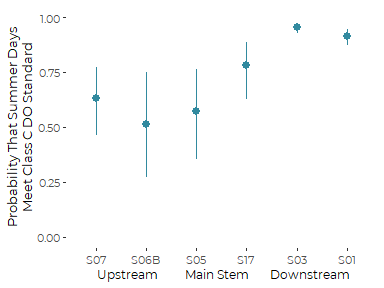
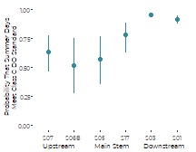

REVISED Graphic for Site by Site Differences in probability of failing
Class C DO Standards
================
Curtis C. Bohlen, Casco Bay Estuary Partnership.
01/28/2021

-   [Introduction](#introduction)
    -   [Note](#note)
    -   [Sources of Threshold Values](#sources-of-threshold-values)
        -   [Dissolved oxygen](#dissolved-oxygen)
-   [Import Libraries](#import-libraries)
-   [Data Preparation](#data-preparation)
    -   [Folder References](#folder-references)
    -   [Data on Sites and Impervious
        Cover](#data-on-sites-and-impervious-cover)
    -   [Main Data](#main-data)
    -   [Data Corrections](#data-corrections)
        -   [Anomolous Depth Values](#anomolous-depth-values)
        -   [Single S06B Chloride Observation from
            2017](#single-s06b-chloride-observation-from-2017)
        -   [Anomolous Dissolved Oxygen and Chloride
            Values](#anomolous-dissolved-oxygen-and-chloride-values)
    -   [Create July and August Data
        Only](#create-july-and-august-data-only)
-   [Model based Graphics](#model-based-graphics)
    -   [Produce the Graphics](#produce-the-graphics)


# Introduction

This notebook produces a final version of a graphic depicting the
PROBABILITY of meeting or failing to meet Class C DO standards at each
Long Creek Monitoring location.

We focus on the summer months of July and August, because seasonal
variation in probability of meeting DO standards is very large, and low
probability of failing DO standards at other times of year interfere
with efficient estimation.

## Note

In this data set a “TRUE” value consistently implies that water quality
criteria were met or exceeded, whether that is achieved by a value
higher than or lower than some numeric criteria. “TRUE” implies good
conditions. “FALSE” implies bad conditions.

## Sources of Threshold Values

### Dissolved oxygen

Maine’s Class B water quality standards call for dissolved oxygen above
7 mg/l, with percent saturation above 75%. The Class C Standards, which
apply to almost all of Long Creek, call for dissolved oxygen above 5
mg/l, with percent saturation above 60%. In addition, for class C
conditions, the thirty day average dissolved oxygen must stay above 6.5
mg/l.

# Import Libraries

``` r
library(tidyverse) 
#> Warning: package 'tidyverse' was built under R version 4.0.5
#> -- Attaching packages --------------------------------------- tidyverse 1.3.1 --
#> v ggplot2 3.3.5     v purrr   0.3.4
#> v tibble  3.1.4     v dplyr   1.0.7
#> v tidyr   1.1.3     v stringr 1.4.0
#> v readr   2.0.1     v forcats 0.5.1
#> Warning: package 'ggplot2' was built under R version 4.0.5
#> Warning: package 'tibble' was built under R version 4.0.5
#> Warning: package 'tidyr' was built under R version 4.0.5
#> Warning: package 'readr' was built under R version 4.0.5
#> Warning: package 'dplyr' was built under R version 4.0.5
#> Warning: package 'forcats' was built under R version 4.0.5
#> -- Conflicts ------------------------------------------ tidyverse_conflicts() --
#> x dplyr::filter() masks stats::filter()
#> x dplyr::lag()    masks stats::lag()
library(mgcv)     # For mixed effects GAMM models with autocorrelation.
#> Loading required package: nlme
#> 
#> Attaching package: 'nlme'
#> The following object is masked from 'package:dplyr':
#> 
#>     collapse
#> This is mgcv 1.8-36. For overview type 'help("mgcv-package")'.
library(emmeans)  # Provides tools for calculating marginal means
#> Warning: package 'emmeans' was built under R version 4.0.5
library(CBEPgraphics)
load_cbep_fonts()
theme_set(theme_cbep())
```

# Data Preparation

## Folder References

``` r
sibfldnm    <- 'Derived_Data'
parent      <- dirname(getwd())
sibling     <- file.path(parent,sibfldnm)

dir.create(file.path(getwd(), 'figures'), showWarnings = FALSE)
dir.create(file.path(getwd(), 'models'), showWarnings = FALSE)
```

## Data on Sites and Impervious Cover

These data were derived from Table 2 from a GZA report to the Long Creek
Watershed Management District, titled “Re: Long Creek Watershed Data
Analysis; Task 2: Preparation of Explanatory and Other Variables.” The
Memo is dated November 13, 2019 File No. 09.0025977.02.

Cumulative Area and IC calculations are our own, based on the GZA data
and the geometry of the stream channel.

``` r
# Read in data and drop the East Branch, where we have no data
fn <- "Site_IC_Data.csv"
fpath <- file.path(sibling, fn)

Site_IC_Data <- read_csv(fpath) %>%
  filter(Site != "--") 
#> Rows: 7 Columns: 8
#> -- Column specification --------------------------------------------------------
#> Delimiter: ","
#> chr (4): Site, Subwatershed, PctIC, CumPctIC
#> dbl (4): Area_ac, IC_ac, CumArea_ac, CumIC_ac
#> 
#> i Use `spec()` to retrieve the full column specification for this data.
#> i Specify the column types or set `show_col_types = FALSE` to quiet this message.
# Now, create a factor that preserves the order of rows (roughly upstream to downstream). 
Site_IC_Data <- Site_IC_Data %>%
  mutate(Site = factor(Site, levels = Site_IC_Data$Site))

# Finally, convert percent covers to numeric values
Site_IC_Data <- Site_IC_Data %>%
  mutate(CumPctIC = as.numeric(substr(CumPctIC, 1, nchar(CumPctIC)-1))) %>%
  mutate(PctIC = as.numeric(substr(PctIC, 1, nchar(PctIC)-1)))
Site_IC_Data
#> # A tibble: 6 x 8
#>   Site  Subwatershed      Area_ac IC_ac CumArea_ac CumIC_ac PctIC CumPctIC
#>   <fct> <chr>               <dbl> <dbl>      <dbl>    <dbl> <dbl>    <dbl>
#> 1 S07   Blanchette Brook     434.  87.7       434.     87.7  20.2     20.2
#> 2 S06B  Upper Main Stem      623.  80.2       623.     80.2  12.9     12.9
#> 3 S05   Middle Main Stem     279.  53.6      1336     222.   19.2     16.6
#> 4 S17   Lower Main Stem      105   65.1      1441     287.   62       19.9
#> 5 S03   North Branch Trib    298. 123         298.    123    41.2     41.2
#> 6 S01   South Branch Trib    427. 240.        427.    240.   56.1     56.1
```

## Main Data

We remove 2019 data, as we don’t have a complete year’s worth of data,
which may bias annual summaries.

Note that this data does NOT include all of the predictors used in some
models looking at chlorides. In particular, it does not include stream
flow estimates

``` r
fn <- "Exceeds_Data.csv"
exceeds = read_csv(file.path(sibling, fn), progress=FALSE) %>%
  mutate(IC=Site_IC_Data$CumPctIC[match(Site, Site_IC_Data$Site)]) %>%
  select(-...1) %>%
  filter(Year < 2019) %>%
  mutate(Site = factor(Site, levels=levels(Site_IC_Data$Site)),
         year_f = factor(Year),
         month_f = factor(Month, levels = 1:12, labels = month.abb),
         DOY = as.numeric(format(sdate, format = '%j')),
         season = cut(Month, breaks = c(0,2,5,8,11,13),
                      labels = c('Winter', 'Spring',
                                 'Summer', 'Fall', 'Winter')),
         season = factor(season, levels = c('Winter', 'Spring', 
                                           'Summer', 'Fall'))) %>%
  mutate(lPrecip = log1p(Precip))
#> New names:
#> * `` -> ...1
#> Rows: 11422 Columns: 19
#> -- Column specification --------------------------------------------------------
#> Delimiter: ","
#> chr   (1): Site
#> dbl   (7): ...1, Year, Month, Precip, PPrecip, MaxT, D_Median
#> lgl  (10): ClassCDO, ClassBDO, ClassC_PctSat, ClassB_PctSat, ClassCBoth, Cla...
#> date  (1): sdate
#> 
#> i Use `spec()` to retrieve the full column specification for this data.
#> i Specify the column types or set `show_col_types = FALSE` to quiet this message.
```

## Data Corrections

### Anomolous Depth Values

Several depth observations in the record appear highly unlikely. In
particular, several observations show daily median water depths over 15
meters. A few other observations show daily median depths over 4 meters,
which also looks unlikely in a stream of this size. All these events
also occurred in May or June of 2015 at site S05. Some sort of
malfunction of the pressure transducer appears likely.

We can trace these observations back to the raw QA/QC’d pressure and
sonde data submitted to LCWMD by GZA, so they are not an artifact of our
data preparation.

We remove these extreme values. The other daily medians in May and June
of 2015 appear reasonable, and we leave them in place, although given
possible instability of the pressure sensors, it might make sense to
remove them all.

Note that removing depth observations from Site S05 will remove those
DATES from any model that uses the `FlowIndex` variable (see below) as a
predictor.

``` r
exceeds <- exceeds %>%
  mutate(D_Median = if_else(D_Median > 4, NA_real_, D_Median),
         lD_Median = log1p(D_Median))
```

### Single S06B Chloride Observation from 2017

The data includes just a single chloride observation from site S06B from
any year other than 2013. While we do not know if the data point is
legitimate or not, it has high leverage in several models, and we
suspect a transcription error of some sort.

We remove the Chloride value from the data.

``` r
exceeds <- exceeds %>%
  mutate(ChlCCC = if_else(Site == 'S06B' & Year > 2014,
                              NA, ChlCCC),
         ChlCMC = if_else(Site == 'S06B' & Year > 2014,
                              NA, ChlCMC))
```

### Anomolous Dissolved Oxygen and Chloride Values

#### Site S03, end of 2016

We noted extreme dissolved oxygen data at the end of 2016. Values were
both extreme and highly variable. (See discussion in the DO Analysis
workbooks).

We decide we should remove chloride and oxygen observations after
October 15th.

``` r
exceeds <- exceeds %>% 
  mutate(ChlCCC = if_else(Year == 2016 & Site == 'S03' & DOY > 288,
                              NA, ChlCCC),
         ChlCMC = if_else(Year == 2016 & Site == 'S03' & DOY > 288,
                              NA, ChlCMC),
         ClassCDO = if_else(Year == 2016 & Site == 'S03' & DOY > 288,
                              NA, ClassCDO),
         ClassBDO = if_else(Year == 2016 & Site == 'S03' & DOY > 288,
                              NA, ClassBDO),
         ClassC_PctSat = if_else(Year == 2016 & Site == 'S03' & DOY > 288,
                              NA, ClassC_PctSat),
         ClassB_PctSat = if_else(Year == 2016 & Site == 'S03' & DOY > 288,
                              NA, ClassB_PctSat),
         ClassCBoth = if_else(Year == 2016 & Site == 'S03' & DOY > 288,
                              NA, ClassCBoth),
         ClassBBoth = if_else(Year == 2016 & Site == 'S03' & DOY > 288,
                              NA, ClassBBoth))
```

## Create July and August Data Only

``` r
exceeds_two <- exceeds %>%
  filter(Month  > 6 & Month < 9)
rm(exceeds)
```

# Model based Graphics

This generates a graphic with more honest error bars, because it
properly incorporates autocorrelation and year to year variation.

#### Model Development

The following takes a moderate amount of time to run ( &lt;5 minutes).

``` r
do_gamm_two_site<- gamm(ClassCDO ~ 0 + Site + s(year_f, bs = 're'),
                      correlation = corCAR1(form = ~ sdate | Site),
                      family = 'binomial',
                      niterPQL = 20, verbosePQL = TRUE,
                      data = exceeds_two)
#> 
#>  Maximum number of PQL iterations:  20
#> iteration 1
#> iteration 2
#> iteration 3
#> iteration 4
#> iteration 5
#> iteration 6
```

``` r
summary(do_gamm_two_site$gam)
#> 
#> Family: binomial 
#> Link function: logit 
#> 
#> Formula:
#> ClassCDO ~ 0 + Site + s(year_f, bs = "re")
#> 
#> Parametric coefficients:
#>          Estimate Std. Error t value Pr(>|t|)    
#> SiteS07   0.53457    0.55990   0.955   0.3398    
#> SiteS06B  0.06107    0.68877   0.089   0.9294    
#> SiteS05   0.28217    0.63129   0.447   0.6549    
#> SiteS17   1.27798    0.58449   2.186   0.0289 *  
#> SiteS03   3.00791    0.48988   6.140 9.77e-10 ***
#> SiteS01   2.38261    0.49443   4.819 1.54e-06 ***
#> ---
#> Signif. codes:  0 '***' 0.001 '**' 0.01 '*' 0.05 '.' 0.1 ' ' 1
#> 
#> Approximate significance of smooth terms:
#>             edf Ref.df     F p-value    
#> s(year_f) 7.358      8 10.78  <2e-16 ***
#> ---
#> Signif. codes:  0 '***' 0.001 '**' 0.01 '*' 0.05 '.' 0.1 ' ' 1
#> 
#> R-sq.(adj) =  0.379   
#>   Scale est. = 1         n = 2187
```

#### Extract Marginal Means

``` r
the_call <-  quote(gamm(ClassCDO ~ 0 + Site + s(year_f, bs = 're'),
                      correlation = corCAR1(form = ~ sdate | Site),
                      family = 'binomial',
                      niterPQL = 20, verbosePQL = TRUE,
                      data = exceeds_two))
do_gamm_two_site$gam$call <- the_call

(my_ref_grid <- ref_grid(do_gamm_two_site, cov.reduce = median)) 
#> 'emmGrid' object with variables:
#>     Site = S07, S06B, S05, S17, S03, S01
#>     year_f = 2010, 2011, 2012, 2013, 2014, 2015, 2016, 2017, 2018
#> Transformation: "logit"
(a <- summary(emmeans(my_ref_grid, ~ Site, type = 'response')))
#>  Site  prob      SE   df lower.CL upper.CL
#>  S07  0.631 0.08152 2174    0.462    0.772
#>  S06B 0.515 0.13296 2174    0.272    0.751
#>  S05  0.570 0.11164 2174    0.352    0.764
#>  S17  0.782 0.06613 2174    0.626    0.885
#>  S03  0.953 0.00992 2174    0.929    0.969
#>  S01  0.915 0.01788 2174    0.873    0.945
#> 
#> Results are averaged over the levels of: year_f 
#> Confidence level used: 0.95 
#> Intervals are back-transformed from the logit scale
```

## Produce the Graphics

``` r
ggplot(a, aes(Site, prob)) +
  geom_pointrange(aes(ymin = lower.CL, ymax = upper.CL), 
                  color = cbep_colors()[5],
                  size = .5) +
  ylab('Probability That Summer Days\nMeet Class C DO Standard') +
  xlab('  Upstream         Main Stem       Downstream') +
  ylim(0,1) +
  theme_cbep(base_size = 10) +
  theme(axis.title.x = element_text(size = 9))
```



``` r
ggsave('figures/do_exceed_summer_site_model_revised.pdf', device = cairo_pdf, 
       width = 4, height = 3)
```

``` r
ggplot(a, aes(Site, prob)) +
  geom_pointrange(aes(ymin = lower.CL, ymax = upper.CL), 
                  color = cbep_colors()[5],
                  size = .5,
                  fatten = 2) +
  ylab('Probability That Summer Days\nMeet Class C DO Standard') +
  xlab(' Upstream           Main Stem        Downstream') +
  ylim(0,1) +
  theme_cbep(base_size = 6) +
  theme(axis.title = element_text(size = 5))
```



``` r
ggsave('figures/do_exceed_summer_site_model_revised_smaller.pdf', device = cairo_pdf, 
       width = 2.25, height = 1.75)
```
