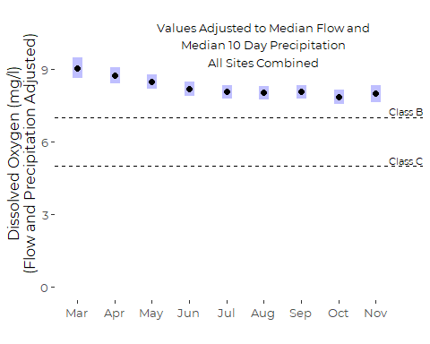
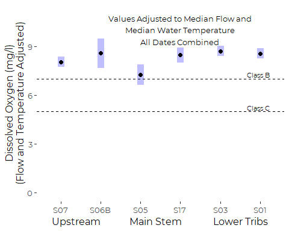
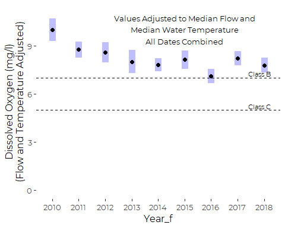
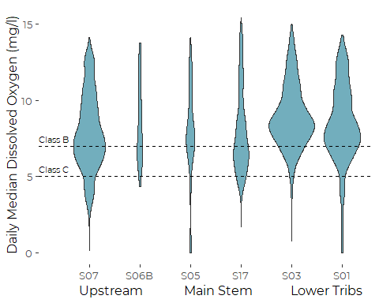
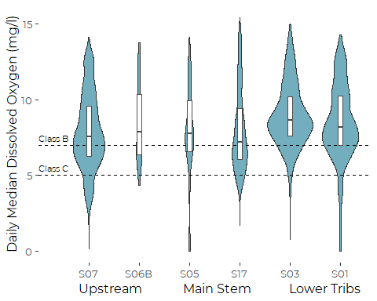
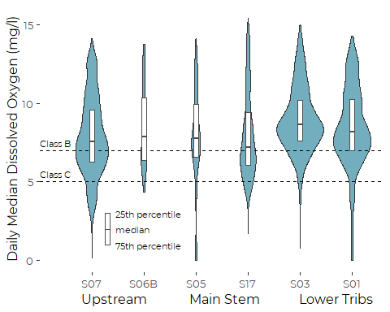
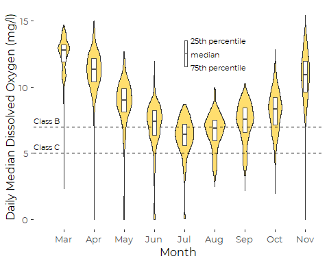
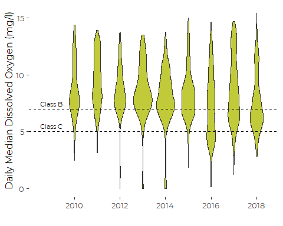
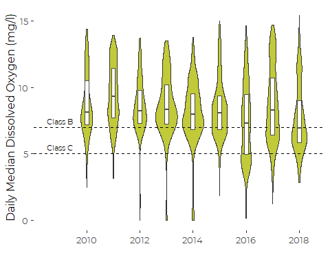
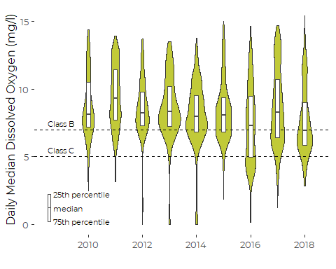

Graphics for LCWMD Dissolved Oxygen Data
================
Curtis C. Bohlen, Casco Bay Estuary Partnership.
01/21/2021

-   [Introduction](#introduction)
    -   [Weather-Corrected Marginal
        Means](#weather-corrected-marginal-means)
-   [Import Libraries](#import-libraries)
-   [Data Preparation](#data-preparation)
    -   [Initial Folder References](#initial-folder-references)
    -   [Load Weather Data](#load-weather-data)
    -   [Update Folder References](#update-folder-references)
    -   [Load Data on Sites and Impervious
        Cover](#load-data-on-sites-and-impervious-cover)
    -   [Load Main Data](#load-main-data)
        -   [Cleanup](#cleanup)
    -   [Data Correction](#data-correction)
        -   [Anomolous Depth Values](#anomolous-depth-values)
        -   [Single S06B Chloride Observation from
            2017](#single-s06b-chloride-observation-from-2017)
        -   [Site S03, end of 2016](#site-s03-end-of-2016)
    -   [Remove Partial Data from Winter
        Months](#remove-partial-data-from-winter-months)
    -   [Add Stream Flow Index](#add-stream-flow-index)
-   [Initial GAMM Model](#initial-gamm-model)
-   [Simplified GAMM Model](#simplified-gamm-model)
    -   [Visualizing Estimated Marginal
        Means](#visualizing-estimated-marginal-means)
        -   [By Month](#by-month)
        -   [By Site](#by-site)
        -   [By Year](#by-year)
-   [Graphic Alternatives](#graphic-alternatives)
    -   [Calculate Observed
        Frequencies](#calculate-observed-frequencies)
    -   [By Site](#by-site-1)
        -   [Added Boxplots – Observed
            Medians](#added-boxplots-observed-medians)
        -   [By Imperviousness](#by-imperviousness)
    -   [By Month](#by-month-1)
        -   [Added Boxplots](#added-boxplots)
    -   [Trends](#trends)
        -   [Violin Plot](#violin-plot)


# Introduction

This R Notebook explores various models for analyzing dissolved oxygen
levels in Long Creek.

We develop a graphic to contrast raw data, simple means, and
weather-corrected marginal means for understanding dissolved oxygen in
Long Creek.

## Weather-Corrected Marginal Means

We use a (relatively) simple GAM model, developed in the “DO
Analysis.rmd” notebook to provide the temperature corrected marginal
means. While we examined significantly more complex models, marginal
means differed little, and we prefer model simplicity for the sake of
communication to State of Casco Bay audiences.

We use a model of the form:

*O**x**y**g**e**n* = *f*(*C**o**v**a**r**i**a**t**e**s*) + *g*(*P**r**e**d**i**c**t**o**r**s*) + *E**r**r**o**r*

Where: \* Site-independent stream flow,a nd site-specific water
temperature covariates enter into the model either via linear functions
or spline smoothers. Predictors include: – natural log of the depth of
water (in meters) at Site S05, in mid-watershed, and – the local daily
median water temperature at each monitoring Site.

-   The predictors enter the model via linear functions of:  
    – site,  
    – year,  
    – time of year (Month in the models we consider here)

-   The error includes both *i.i.d* normal error and an AR(1)
    autocorrelated error.

# Import Libraries

``` r
library(tidyverse)
#> -- Attaching packages --------------------------------------- tidyverse 1.3.0 --
#> v ggplot2 3.3.3     v purrr   0.3.4
#> v tibble  3.0.5     v dplyr   1.0.3
#> v tidyr   1.1.2     v stringr 1.4.0
#> v readr   1.4.0     v forcats 0.5.0
#> -- Conflicts ------------------------------------------ tidyverse_conflicts() --
#> x dplyr::filter() masks stats::filter()
#> x dplyr::lag()    masks stats::lag()
library(readr)
library(emmeans) # Provides tools for calculating marginal means

#library(nlme)    # Provides GLS model functions -- not used here

library(mgcv)    # generalized additive models. Function gamm() allows
#> Loading required package: nlme
#> 
#> Attaching package: 'nlme'
#> The following object is masked from 'package:dplyr':
#> 
#>     collapse
#> This is mgcv 1.8-33. For overview type 'help("mgcv-package")'.
                 # autocorrelated errors.

library(CBEPgraphics)
load_cbep_fonts()
theme_set(theme_cbep())
```

# Data Preparation

## Initial Folder References

``` r
sibfldnm    <- 'Original_Data'
parent      <- dirname(getwd())
sibling     <- file.path(parent,sibfldnm)

dir.create(file.path(getwd(), 'figures'), showWarnings = FALSE)
dir.create(file.path(getwd(), 'models'), showWarnings = FALSE)
```

## Load Weather Data

``` r
fn <- "Portland_Jetport_2009-2019.csv"
fpath <- file.path(sibling, fn)

weather_data <- read_csv(fpath, 
 col_types = cols(.default = col_skip(),
        date = col_date(),
        PRCP = col_number(), PRCPattr = col_character() #,
        #SNOW = col_number(), SNOWattr = col_character(), 
        #TMIN = col_number(), TMINattr = col_character(), 
        #TAVG = col_number(), TAVGattr = col_character(), 
        #TMAX = col_number(), TMAXattr = col_character(), 
        )) %>%
  rename(sdate = date) %>%
  mutate(pPRCP = dplyr::lag(PRCP))
```

## Update Folder References

``` r
sibfldnm    <- 'Derived_Data'
parent      <- dirname(getwd())
sibling     <- file.path(parent,sibfldnm)
```

## Load Data on Sites and Impervious Cover

These data were derived from Table 2 from a GZA report to the Long Creek
Watershed Management District, titled “Re: Long Creek Watershed Data
Analysis; Task 2: Preparation of Explanatory and Other Variables.” The
Memo is dated November 13, 2019 File No. 09.0025977.02.

Cumulative Area and IC calculations are our own, based on the GZA data
and the geometry of the stream channel.

``` r
# Read in data and drop the East Branch, where we have no data
fn <- "Site_IC_Data.csv"
fpath <- file.path(sibling, fn)

Site_IC_Data <- read_csv(fpath) %>%
  filter(Site != "--") 
#> 
#> -- Column specification --------------------------------------------------------
#> cols(
#>   Site = col_character(),
#>   Subwatershed = col_character(),
#>   Area_ac = col_double(),
#>   IC_ac = col_double(),
#>   CumArea_ac = col_double(),
#>   CumIC_ac = col_double(),
#>   PctIC = col_character(),
#>   CumPctIC = col_character()
#> )

# Now, create a factor that preserves the order of rows (roughly upstream to downstream). 
Site_IC_Data <- Site_IC_Data %>%
  mutate(Site = factor(Site, levels = Site_IC_Data$Site))

# Finally, convert percent covers to numeric values
Site_IC_Data <- Site_IC_Data %>%
  mutate(CumPctIC = as.numeric(substr(CumPctIC, 1, nchar(CumPctIC)-1))) %>%
  mutate(PctIC = as.numeric(substr(PctIC, 1, nchar(PctIC)-1)))
Site_IC_Data
#> # A tibble: 6 x 8
#>   Site  Subwatershed      Area_ac IC_ac CumArea_ac CumIC_ac PctIC CumPctIC
#>   <fct> <chr>               <dbl> <dbl>      <dbl>    <dbl> <dbl>    <dbl>
#> 1 S07   Blanchette Brook     434.  87.7       434.     87.7  20.2     20.2
#> 2 S06B  Upper Main Stem      623.  80.2       623.     80.2  12.9     12.9
#> 3 S05   Middle Main Stem     279.  53.6      1336     222.   19.2     16.6
#> 4 S17   Lower Main Stem      105   65.1      1441     287.   62       19.9
#> 5 S03   North Branch Trib    298. 123         298.    123    41.2     41.2
#> 6 S01   South Branch Trib    427. 240.        427.    240.   56.1     56.1
```

## Load Main Data

Read in the data from the Derived Data folder.

Note that I filter out data from 2019 because that is only a partial
year, which might affect estimation of things like seasonal trends. We
could add it back in, but with care….

*Full\_Data.csv* does not include a field for precipitation from the
previous day. In earlier work, we learned that a weighted sum of recent
precipitation provided better explanatory power. But we also want to
check a simpler model, so we construct a “PPrecip” data field. This is
based on a modification of code in the “Make\_Daily\_Summaries.Rmd”
notebook.

``` r
fn <- "Full_Data.csv"
fpath <- file.path(sibling, fn)

full_data <- read_csv(fpath, 
    col_types = cols(DOY = col_integer(), 
        D_Median = col_double(), Precip = col_number(), 
        X1 = col_skip(), Year = col_integer(), 
        FlowIndex = col_double())) %>%

  mutate(Site = factor(Site, levels=levels(Site_IC_Data$Site))) %>%
  mutate(Month = factor(Month, levels = month.abb)) %>%
  mutate(IC=as.numeric(Site_IC_Data$CumPctIC[match(Site, Site_IC_Data$Site)])) %>%
  mutate(Year_f = factor(Year)) %>%

# We combine data using "match" because we have data for multiple sites and 
# therefore dates are not unique.  `match()` correctly assigns weather
# data by date.
mutate(PPrecip = weather_data$pPRCP[match(sdate, weather_data$sdate)])
#> Warning: Missing column names filled in: 'X1' [1]
#> Warning: The following named parsers don't match the column names: FlowIndex
```

### Cleanup

``` r
rm(Site_IC_Data, weather_data)
rm(fn, fpath, parent, sibling, sibfldnm)
```

## Data Correction

### Anomolous Depth Values

Several depth observations in the record appear highly unlikely. In
particular, several observations show daily median water depths over 15
meters. And those observations were recorded in May or June, at site
S05, with no associated record of significant precipitation, and no
elevated depths at other sites on the stream.

We can trace these observations back to the raw QA/QC’d pressure and
sonde data submitted to LCWMD by GZA, so they are not an artifact of our
data preparation.

A few more observations show daily median depths over 4 meters, which
also looks unlikely in a stream of this size. All these events also
occurred in May or June of 2015 at site S05. Some sort of malfunction of
the pressure transducer appears likely.

We remove these extreme values. The other daily medians in May and June
of 2015 appear reasonable, and we leave them in place, although given
possible instability of the pressure sensors, it might make sense to
remove them all.

``` r
full_data <- full_data %>%
  mutate(D_Median = if_else(D_Median > 4, NA_real_, D_Median),
         lD_Median = if_else(D_Median > 4, NA_real_, lD_Median))
```

### Single S06B Chloride Observation from 2017

The data includes just a single chloride observation from site S06B from
any year other than 2013. While we do not know if the data point is
legitimate or not, it has very high leverage in several models, and we
suspect a transcription error of some sort.

``` r
full_data %>%
  filter(Site == 'S06B') %>%
  select(sdate, DO_Median) %>%
  ggplot(aes(x = sdate, y = DO_Median)) + geom_point()
#> Warning: Removed 163 rows containing missing values (geom_point).
```


We remove the Chloride value from the data.

``` r
full_data <- full_data %>%
  mutate(DO_Median = if_else(Site == 'S06B' & Year > 2014,
                              NA_real_, DO_Median))
```

### Site S03, end of 2016

We noted some extreme dissolved oxygen data at the end of 2016. Values
were both extreme and highly variable.

We decided we should remove chloride and oxygen observations after
October 15th.

``` r
full_data <- full_data %>% 
  mutate(DO_Median = if_else(Year == 2016 & Site == 'S03' & DOY > 288,
                              NA_real_, DO_Median),
         DO_Median = if_else(Year == 2016 & Site == 'S03' & DOY > 288,
                              NA_real_, DO_Median),
         PctSat_Median = if_else(Year == 2016 & Site == 'S03' & DOY > 288,
                              NA_real_, PctSat_Median))
```

## Remove Partial Data from Winter Months

We have very limited data from several months. We have January data from
only one year, and February data from only three, and December data from
four, all older. Both March and November sample sizes vary.

The limited winter data generates severely unbalanced samples, which may
lead to estimation problems, especially in models with crossed or
potentially crossed factors and predictors. More fundamentally, the
potential bias introduced by showing data from those months from just a
handful of years could give a misleading impression of seasonal
patterns. We trim December, January and February data, but leave the
other months.

It is important to remember, even after trimming the data, that:  
1. 2010 is a partial year,  
2. The period of sampling in March may be biased due to spring melt
timing.

``` r
xtabs(~ Year_f + Month, data = full_data)
#>       Month
#> Year_f Jan Feb Mar Apr May Jun Jul Aug Sep Oct Nov Dec
#>   2010   0   0   0   0   0  78 103 106 120 124 120  35
#>   2011   0  24 104 120 124 120 124 124 120 124 120 112
#>   2012   0  45  93  90  93 116 124 114 120  39 108 124
#>   2013   9   0  58 131 155 140 124 127 120 141 150  15
#>   2014   0   0  62 108 155 150 155 155 150 155 120   0
#>   2015   0   0  23 147 186 180 186 186 180 160  30   0
#>   2016   0   0  25 173 186 180 186 186 180 186 168   0
#>   2017   0  18 186 180 186 180 186 186 180 186 102   0
#>   2018   0   0  34 180 186 180 186 186 180 186 126   0
```

``` r
full_data <- full_data %>%
  filter(Month %in% month.abb[3:11]  )
```

## Add Stream Flow Index

We worked through many models on a site by site basis in which we
included data on water depth, but since the depth coordinate is
site-specific, a 10 cm depth at one site may be exceptional, while at
another it is commonplace. We generally want not a local measure of
stream depth, but a watershed-wide metric of high, medium, or low stream
flow.

Middle and Lower Maine Stem sites would be suitable for a general flow
indicator across the watershed. The monitoring sites in that stretch of
Long Creek include include S05 and S17, however only site S05 has been
in continuous operation throughout the period of record, so we use depth
data from S05 to construct our general stream flow indicator.

Stream flow at S05 is correlated with flow at other sites, although not
all that closely correlated to flow in the downstream tributaries.

``` r
full_data %>%
  select(sdate, Site, lD_Median) %>%
  pivot_wider(names_from = Site, values_from = lD_Median) %>%
  select( -sdate) %>%
  cor(use = 'pairwise', method = 'pearson')
#>            S07      S06B       S05       S17       S03       S01
#> S07  1.0000000 0.5882527 0.7042711 0.7327432 0.4578906 0.5594067
#> S06B 0.5882527 1.0000000 0.8043943 0.8778188 0.7152403 0.6310361
#> S05  0.7042711 0.8043943 1.0000000 0.7906571 0.4526392 0.6506630
#> S17  0.7327432 0.8778188 0.7906571 1.0000000 0.6666414 0.7290077
#> S03  0.4578906 0.7152403 0.4526392 0.6666414 1.0000000 0.4499047
#> S01  0.5594067 0.6310361 0.6506630 0.7290077 0.4499047 1.0000000
```

We use the log of the daily median flow at S05 as a general
watershed-wide stream flow indicator, which we call `FlowIndex`. We use
the log of the raw median, to lessen the effect of the highly skewed
distribution of stream depths on the metric.

``` r
depth_data <- full_data %>%
  filter (Site == 'S05') %>%
  select(sdate, lD_Median)

full_data <- full_data %>%
  mutate(FlowIndex = depth_data$lD_Median[match(sdate, depth_data$sdate)])
  rm(depth_data)
```

Note that because the flow record at S05 has some gaps, any model using
this predictor is likely to have a smaller sample size.

# Initial GAMM Model

This model is likely to take approximately 15 minutes to run.

``` r
if (! file.exists("models/do_gamm.rds")) {
  print(
    system.time(
      do_gamm <- gamm(DO_Median ~ Site + 
                        T_Median +
                        s(FlowIndex) +
                        Month +
                        Year_f,
                       correlation = corAR1(form = ~ as.numeric(sdate) | Site),
                       na.action = na.omit, 
                       method = 'REML',
                       data = full_data)
    )
  )
  saveRDS(do_gamm, file="models/do_gamm.rds")
} else {
  do_gamm <- readRDS("models/do_gamm.rds")
}
#>    user  system elapsed 
#>  776.33    3.30  780.56
```

# Simplified GAMM Model

Our simplified GAMM only fits a soothing term for water temperature.
This is a simplification, as other models demonstrate that more complex
models perform better by several standard model metrics. However, this
one is simple to explain. And (with one exception) choice of model has
little effect on our qualitative conclusions. See the
“DO\_Analysis\_Summary.Rmd” file for details.

This model takes several minutes to run (more than 5, less than 15) We
check for a saved version before recalculating. If you alter underlying
data or model, you need to delete the saved version of the model to
trigger recalculation.

``` r
if (! file.exists("models/do_gamm_2.rds")) {
  print(
    system.time(
      do_gamm_2<- gamm(DO_Median ~ Site + 
                        s(T_Median, k = 1) +
                        Year_f,
                       correlation = corAR1(form = ~ as.numeric(sdate) | Site),
                       na.action = na.omit, 
                       method = 'REML',
                       data = full_data)
    )
  )
  saveRDS(do_gamm_2, file="models/do_gamm_2.rds")
} else {
  do_gamm_2 <- readRDS("models/do_gamm_2.rds")
}
#> Warning in smooth.construct.tp.smooth.spec(object, dk$data, dk$knots): basis dimension, k, increased to minimum possible
#>    user  system elapsed 
#> 2224.71    6.88 2233.38
```

## Visualizing Estimated Marginal Means

Reliably calling `emmeans()` for `gamm()` models requires creating a
call object and associating it with the model as `do_gamm_2$gam$call`.
(See the `emmeans` “models” vignette for more info. We (re)create the
call object, associate it with the model, manually construct a reference
grid before finally calling `emmeans()` to extract marginal means.

We use `cov.reduce = median` to override the default behavior of
`emmeans()` and `ref_grid()`, which set quantitative covariates at their
mean values. Because of the highly skewed nature of  
of our predictors, the median provides a more realistic set of “typical”
values for the covariates, making the estimates marginal means more
relevant.

It is worth pointing out that marginal means may not be the most useful
way to summarize these models, as our interest lies in extremes, which
occur during high temperature or low flow events, at our shallowwater
sites. Teh marginal means blend across those categories.

``` r
the_call <-  quote(gamm(DO_Median ~ Site + 
                        T_Median +
                        s(FlowIndex) +
                        Month +
                        Year_f,
                       correlation = corAR1(form = ~ as.numeric(sdate) | Site),
                       na.action = na.omit, 
                       method = 'REML',
                       data = full_data))
do_gamm$gam$call <- the_call


the_call <-  quote(gamm(DO_Median ~ Site + 
                        s(T_Median, k = 1) +
                        Year_f,
                       correlation = corAR1(form = ~ as.numeric(sdate) | Site),
                       na.action = na.omit, 
                       method = 'REML',
                       data = full_data))
do_gamm_2$gam$call <- the_call
```

### By Month

This is only estimable via our larger GAMM model.

``` r
my_ref_grid <- ref_grid(do_gamm, cov.reduce = median, cov.keep = 'Month')
by_month <- summary(emmeans(my_ref_grid, ~ Month, 
             type = 'response'))

labl <- 'Values Adjusted to Median Flow and\nMedian 10 Day Precipitation\nAll Sites Combined'

# `plot.emmGrid()` defaults to using ggplot, so we can use ggplot
# skills to alter the look and feel of these plots.
plot(by_month) + 
  xlab('Dissolved Oxygen (mg/l)\n(Flow and Precipitation Adjusted)') +
  ylab ('') +
  annotate('text', 10, 6, label = labl, size = 3.5) +
  annotate('text', 5.25, 10.25, label = 'Class C' , size = 3, hjust = 1) + 
  annotate('text', 7.25, 10.25, label = 'Class B' , size = 3, hjust = 1) + 
  xlim(0,11) +
  geom_vline(xintercept =  7, lty = 2) +
  geom_vline(xintercept =  5, lty = 2) +
  coord_flip() +
  theme_cbep(base_size = 12)
```



### By Site

``` r
by_site <- summary(emmeans(my_ref_grid, ~ Site, type = 'response'))

labl <- 'Values Adjusted to Median Flow and\nMedian Water Temperature\nAll Dates Combined'

plot(by_site) + 
  xlab('Dissolved Oxygen (mg/l)\n(Flow and Temperature Adjusted)') +
  ylab("Upstream            Main Stem             Lower Tribs") +
  annotate('text', 10, 4, label = labl, size = 3.5) +
  annotate('text', 5.25, 6.25, label = 'Class C' , size = 3, hjust = 1) + 
  annotate('text', 7.25, 6.25, label = 'Class B' , size = 3, hjust = 1) + 
  xlim(0,11) +
  geom_vline(xintercept =  7, lty = 2) +
  geom_vline(xintercept =  5, lty = 2) +
  coord_flip() +
  theme_cbep(base_size = 12)
```



### By Year

``` r
by_year <- summary(emmeans(my_ref_grid, ~ Year_f, type = 'response'))

labl <- 'Values Adjusted to Median Flow and\nMedian Water Temperature\nAll Dates Combined'

plot(by_year) + 
  xlab('Dissolved Oxygen (mg/l)\n(Flow and Temperature Adjusted)') +
  annotate('text', 10, 6, label = labl, size = 3.5) +
  annotate('text', 5.25, 9.25, label = 'Class C' , size = 3, hjust = 1) + 
  annotate('text', 7.25, 9.25, label = 'Class B' , size = 3, hjust = 1) + 
  xlim(0,11) +
  geom_vline(xintercept =  7, lty = 2) +
  geom_vline(xintercept =  5, lty = 2) +
  coord_flip() +
  theme_cbep(base_size = 12)
```



# Graphic Alternatives

## Calculate Observed Frequencies

``` r
my_means <- full_data %>%
  select(Year, Site, DO_Median) %>%
  group_by(Year, Site) %>%
  summarize(MN= mean(DO_Median, na.rm = TRUE),
            SD = sd(DO_Median, na.rm = TRUE),
            N = sum(! is.na(DO_Median)),
            SE = SD / sqrt(N),
            .groups = 'drop') 
```

## By Site

``` r
labl <- 'Means and Standard Errors\nTemperature Adjusted'

plt1 <- full_data %>%
  ggplot(aes(x = Site, y = DO_Median)) +
  #scale_color_manual(values = cbep_colors()) +
  geom_violin(scale = 'count', fill = cbep_colors()[6]) +

  ylab('Daily Median Dissolved Oxygen (mg/l)') +
  xlab("          Upstream             Main Stem            Lower Tribs") +

  geom_hline(yintercept =  7, lty = 2) +
  annotate('text', 0, 7.5, label = 'Class B', size = 3, hjust = 0) + 
  
  geom_hline(yintercept =  5, lty = 2) +
  annotate('text', 0, 5.5, label = 'Class C', size = 3, hjust = 0) + 
  
  theme_cbep(base_size = 12)
plt1
#> Warning: Removed 3293 rows containing non-finite values (stat_ydensity).
```



### Added Boxplots – Observed Medians

``` r
plt1 +
  geom_boxplot(width=0.1, coef = 0, outlier.shape = NA,
               color= 'gray30', fill = 'white') +
  #stat_summary(fun = "median",
  #            geom ='point', shape = 18, size = 2)
ggsave('figures/do_Site_violin_w_box.pdf', device = cairo_pdf, width = 5, height = 4)
#> Warning: Removed 3293 rows containing non-finite values (stat_ydensity).
#> Warning: Removed 3293 rows containing non-finite values (stat_boxplot).
#> Warning: Removed 3293 rows containing non-finite values (stat_ydensity).
#> Warning: Removed 3293 rows containing non-finite values (stat_boxplot).
```



``` r
xanchor = 1.25
yanchor = 2
spacing = 1

plt1 +
  geom_boxplot(width=0.1, coef = 0, outlier.shape = NA,
               color= 'gray30', fill = 'white') +
  
  annotate('rect', xmin = xanchor, ymin = yanchor - spacing,
                   xmax =xanchor + 0.1, ymax = yanchor + spacing,
           fill = 'white', color = 'gray30', size = .5) + 
  annotate('segment', x= xanchor, y = yanchor,
                      xend = xanchor + 0.1, yend = yanchor, 
           color = 'gray30') +
  
  annotate('text', x= xanchor + 0.2, y = yanchor + spacing,
           hjust = 0, size = 3, label = '25th percentile') +
  annotate('text', x= xanchor + 0.2, y = yanchor,
           hjust = 0, size = 3, label = 'median') +
  annotate('text', x= xanchor + 0.2, y = yanchor - spacing,
           hjust = 0, size = 3, label = '75th percentile')
#> Warning: Removed 3293 rows containing non-finite values (stat_ydensity).
#> Warning: Removed 3293 rows containing non-finite values (stat_boxplot).
```



``` r
ggsave('figures/do_Site_violin_w_bo_annot.pdf', device = cairo_pdf, width = 5, height = 4)
#> Warning: Removed 3293 rows containing non-finite values (stat_ydensity).

#> Warning: Removed 3293 rows containing non-finite values (stat_boxplot).
```

### By Imperviousness

#### A Table

We make a table, but there is no strong relationship with IC.

``` r
full_data %>%
  select(Site, DO_Median, IC) %>%
  group_by(Site) %>%
  summarize(`Watershed Imperviousness (%)` = round(median(IC),1),
            `Median Dissolved Oxygen (mg/l)` = round(median(DO_Median, na.rm = TRUE),1),
            .groups = 'drop') %>%
  #arrange(`Watershed Imperviousness (%)`) %>%
knitr::kable(align = "lcc")
```

| Site | Watershed Imperviousness (%) | Median Dissolved Oxygen (mg/l) |
|:-----|:----------------------------:|:------------------------------:|
| S07  |             20.2             |              7.6               |
| S06B |             12.9             |              7.9               |
| S05  |             16.6             |              7.8               |
| S17  |             19.9             |              7.2               |
| S03  |             41.2             |              8.6               |
| S01  |             56.1             |              8.2               |

## By Month

We pull out the winter months with limited real data.

``` r
plt2 <- full_data %>%
  filter(! Month %in% c('Jan', 'Feb', 'Dec')) %>%
  
  ggplot(aes(x = Month, y = DO_Median)) +
  geom_violin(fill = cbep_colors()[2], scale = 'count') +

  ylab('Daily Median Dissolved Oxygen (mg/l)') +

  geom_hline(yintercept =  7, lty = 2) +
  annotate('text', 0, 7.5, label = 'Class B', size = 3, hjust = 0) + 
  
  geom_hline(yintercept =  5, lty = 2) +
  annotate('text', 0, 5.5, label = 'Class C', size = 3, hjust = 0) + 
  
  theme_cbep(base_size = 12)
```

### Added Boxplots

``` r
plt2 +
  geom_boxplot(width=0.15, coef = 0, outlier.shape = NA,
               color= 'gray30', fill = 'white') +
  #stat_summary(fun = "median",
  #             geom ='point', shape = 18, size = 2.5)
ggsave('figures/do_month_violin_w_box.pdf', device = cairo_pdf,
       width = 5, height = 4)
#> Warning: Removed 3293 rows containing non-finite values (stat_ydensity).
#> Warning: Removed 3293 rows containing non-finite values (stat_boxplot).
#> Warning: Removed 3293 rows containing non-finite values (stat_ydensity).
#> Warning: Removed 3293 rows containing non-finite values (stat_boxplot).
```


``` r
xanchor = 5
yanchor = 12.5
spacing = 1

plt2 +
  geom_boxplot(width=0.15, coef = 0, outlier.shape = NA,
               color= 'gray30', fill = 'white') +
  
  annotate('rect', xmin = xanchor, ymin = yanchor - spacing,
                   xmax =xanchor + 0.1, ymax = yanchor + spacing,
           fill = 'white', color = 'gray30', size = .5) + 
  annotate('segment', x= xanchor, y = yanchor,
                      xend = xanchor + 0.1, yend = yanchor, 
           color = 'gray30') +
  
  annotate('text', x= xanchor + 0.2, y = yanchor + spacing,
           hjust = 0, size = 3, label = '25th percentile') +
  annotate('text', x= xanchor + 0.2, y = yanchor,
           hjust = 0, size = 3, label = 'median') +
  annotate('text', x= xanchor + 0.2, y = yanchor - spacing,
           hjust = 0, size = 3, label = '75th percentile')
#> Warning: Removed 3293 rows containing non-finite values (stat_ydensity).
#> Warning: Removed 3293 rows containing non-finite values (stat_boxplot).
```



``` r
ggsave('figures/do_month_violin_w_box_annot.pdf', device = cairo_pdf,
       width = 5, height = 4)
#> Warning: Removed 3293 rows containing non-finite values (stat_ydensity).

#> Warning: Removed 3293 rows containing non-finite values (stat_boxplot).
```

## Trends

### Violin Plot

``` r
plt3 <- full_data %>%
  ggplot(aes(x = Year, y = DO_Median)) +
  geom_violin(aes(group = Year), scale = 'count', fill = cbep_colors()[4]) +
  xlab('') +
  ylab('Daily Median Dissolved Oxygen (mg/l)') +

  
  scale_color_manual(values = cbep_colors()) +
  scale_fill_manual(values = cbep_colors()) +
  scale_x_continuous(breaks= c(2010, 2012, 2014, 2016, 2018)) +
  

  geom_hline(yintercept =  7, lty = 2) +
  annotate('text', 2008.5, 7.5, label = 'Class B', size = 3, hjust = 0) + 
  
  geom_hline(yintercept =  5, lty = 2) +
  annotate('text', 2008.5, 5.5, label = 'Class C', size = 3, hjust = 0) + 
  
  theme_cbep(base_size = 12)
plt3
#> Warning: Removed 3293 rows containing non-finite values (stat_ydensity).
```


\#\#\#\# Added Boxplots

``` r
plt3 +
  geom_boxplot(aes(group = Year), width=0.15, coef = 0, outlier.shape = NA,
               color= 'gray30', fill = 'white')  +
  # stat_summary(fun = "median",
  #            geom ='point', shape = 18, size = 2.5)

ggsave('figures/do_year_violin_w_box.pdf', device = cairo_pdf, width = 5, height = 4)
#> Warning: Removed 3293 rows containing non-finite values (stat_ydensity).
#> Warning: Removed 3293 rows containing non-finite values (stat_boxplot).
#> Warning: Removed 3293 rows containing non-finite values (stat_ydensity).
#> Warning: Removed 3293 rows containing non-finite values (stat_boxplot).
```



``` r
xanchor = 2008.5
yanchor = 1.25
spacing = 1

plt3 +

  geom_boxplot(aes(group = Year), width=0.15, coef = 0, outlier.shape = NA,
               color= 'gray30', fill = 'white') +
  
  annotate('rect', xmin = xanchor, ymin = yanchor - spacing,
                   xmax =xanchor + 0.1, ymax = yanchor + spacing,
           fill = 'white', color = 'gray30', size = .5) + 
  annotate('segment', x= xanchor, y = yanchor,
                      xend = xanchor + 0.1, yend = yanchor, 
           color = 'gray30') +
  
  annotate('text', x= xanchor + 0.2, y = yanchor + spacing,
           hjust = 0, size = 3, label = '25th percentile') +
  annotate('text', x= xanchor + 0.2, y = yanchor,
           hjust = 0, size = 3, label = 'median') +
  annotate('text', x= xanchor + 0.2, y = yanchor - spacing,
           hjust = 0, size = 3, label = '75th percentile')
#> Warning: Removed 3293 rows containing non-finite values (stat_ydensity).
#> Warning: Removed 3293 rows containing non-finite values (stat_boxplot).
```



``` r
ggsave('figures/do_year_violin_w_box_annot.pdf', device = cairo_pdf, width = 5, height = 4)
#> Warning: Removed 3293 rows containing non-finite values (stat_ydensity).

#> Warning: Removed 3293 rows containing non-finite values (stat_boxplot).
```
